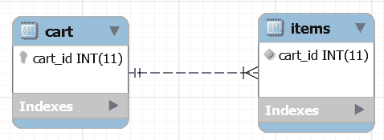

# Hibernate 一对多注释教程

> 原文：<https://web.archive.org/web/20220930061024/https://www.baeldung.com/hibernate-one-to-many>

## 1。简介

这篇快速 Hibernate 教程将带我们看一个使用 JPA 注释的`one-to-many`映射的例子，JPA 注释是 XML 的替代物。

我们还将学习什么是双向关系，它们如何造成不一致，以及所有权的概念如何有所帮助。

## 延伸阅读:

## [Spring Boot 与冬眠](/web/20221129005933/https://www.baeldung.com/spring-boot-hibernate)

A quick, practical intro to integrating Spring Boot and Hibernate/JPA.[Read more](/web/20221129005933/https://www.baeldung.com/spring-boot-hibernate) →

## [Hibernate/JPA 中标识符的概述](/web/20221129005933/https://www.baeldung.com/hibernate-identifiers)

Learn how to map entity identifiers with Hibernate.[Read more](/web/20221129005933/https://www.baeldung.com/hibernate-identifiers) →

## 2。描述

**`one-to-many`简单来说，映射就是将一个表中的一行映射到另一个表中的多行。**

让我们看看下面的实体关系图，看看一个 `one-to-many`关联:

[](/web/20221129005933/https://www.baeldung.com/wp-content/uploads/2017/02/C-1.png)

对于这个例子，我们将实现一个购物车系统，其中每个购物车有一个表，每个商品有另一个表。**一个购物车可以有许多商品，所以这里我们有一个`one-to-many`映射。**

这在数据库级的工作方式是，我们在`cart`表中有一个`cart_id`作为主键，在`items`中有一个`cart_id `作为外键。

我们用代码的方式是用`@OneToMany`。

让我们以反映数据库中关系的方式将`Cart`类映射到`Item`对象的集合:

```java
public class Cart {

    //...     

    @OneToMany(mappedBy="cart")
    private Set<Item> items;

    //...
}
```

我们还可以使用`@ManyToOne`在每个`Item`中添加对`Cart`的引用，使这成为一个[双向](https://web.archive.org/web/20221129005933/https://docs.jboss.org/hibernate/orm/4.1/manual/en-US/html/ch07.html#collections-bidirectional)关系。双向意味着**我们可以从`carts`访问`items`，也可以从`items`** 访问`carts`。

`mappedBy`属性是我们用来告诉 Hibernate 我们用哪个变量来表示子类中的父类。

为了开发实现`one-to-many`关联的示例 Hibernate 应用程序，使用了以下技术和库:

*   `JDK` 1.8 或更高版本
*   `Hibernate` 5
*   `Maven` 3 或更晚
*   H2 数据库

## 3。设置

### 3.1。数据库设置

我们将使用 Hibernate 从域模型中管理我们的模式。换句话说，我们不需要提供 SQL 语句来创建各种表和实体之间的关系。所以让我们继续创建 Hibernate 示例项目。

### 3.2。Maven 依赖关系

让我们从添加 Hibernate 和 H2 驱动依赖到我们的`pom.xml`文件开始。Hibernate 依赖项使用 JBoss 日志记录，它会自动被添加为可传递的依赖项:

*   休眠版本`5.6.7.Final`
*   H2 驱动版本`2.1.212`

请访问 Maven 中央存储库获取最新版本的 [Hibernate](https://web.archive.org/web/20221129005933/https://search.maven.org/classic/#search%7Cga%7C1%7Ca%3A%22hibernate-core%22) 和 [H2](https://web.archive.org/web/20221129005933/https://search.maven.org/classic/#search%7Cga%7C1%7Cg%3A%22com.h2database%22) 依赖项。

### 3.3。冬眠`SessionFactory`

接下来，让我们为数据库交互创建 Hibernate `SessionFactory`:

```java
public static SessionFactory getSessionFactory() {

    ServiceRegistry serviceRegistry = new StandardServiceRegistryBuilder()
      .applySettings(dbSettings())
      .build();

    Metadata metadata = new MetadataSources(serviceRegistry)
      .addAnnotatedClass(Cart.class)
      // other domain classes
      .buildMetadata();

    return metadata.buildSessionFactory();
}

private static Map<String, String> dbSettings() {
    // return Hibernate settings
}
```

## 4。车型

与映射相关的配置将使用模型类中的 JPA 注释来完成:

```java
@Entity
@Table(name="CART")
public class Cart {

    //...

    @OneToMany(mappedBy="cart")
    private Set<Item> items;

    // getters and setters
}
```

请注意，`@OneToMany`注释用于定义`Item`类中的属性，该属性将用于映射`mappedBy`变量。这就是为什么我们在`Item`类中有一个名为`cart`的属性:

```java
@Entity
@Table(name="ITEMS")
public class Item {

    //...
    @ManyToOne
    @JoinColumn(name="cart_id", nullable=false)
    private Cart cart;

    public Item() {}

    // getters and setters
} 
```

还需要注意的是，`@ManyToOne`注释与`Cart`类变量相关联。`@JoinColumn`注释引用了映射的列。

## 5。行动中

在测试程序中，我们使用`main`()方法创建一个类来获取 Hibernate 会话，并将模型对象保存到数据库中，实现`one-to-many`关联:

```java
sessionFactory = HibernateAnnotationUtil.getSessionFactory();
session = sessionFactory.getCurrentSession();
System.out.println("Session created");

tx = session.beginTransaction();

session.save(cart);
session.save(item1);
session.save(item2);

tx.commit();
System.out.println("Cart ID=" + cart.getId());
System.out.println("item1 ID=" + item1.getId()
  + ", Foreign Key Cart ID=" + item.getCart().getId());
System.out.println("item2 ID=" + item2.getId()
+ ", Foreign Key Cart ID=" + item.getCart().getId());
```

这是我们测试程序的输出:

```java
Session created
Hibernate: insert into CART values ()
Hibernate: insert into ITEMS (cart_id)
  values (?)
Hibernate: insert into ITEMS (cart_id)
  values (?)
Cart ID=7
item1 ID=11, Foreign Key Cart ID=7
item2 ID=12, Foreign Key Cart ID=7
Closing SessionFactory
```

## 6。`@ManyToOne`注解

正如我们在第 2 节中看到的，我们可以通过使用`@ManyToOne`注释来指定一个`many-to-one`关系。一个`many-to-one`映射意味着这个实体的许多实例被映射到另一个实体的一个实例—**一个购物车中的许多商品**。

**`@ManyToOne`注释也让我们创建双向关系。**我们将在接下来的几个小节中详细介绍这一点。

### 6.1。不一致和所有权

现在，如果`Cart`引用了`Item`，但是`Item`没有反过来引用`Cart` , **我们的关系将是单向的**。这些物体也会有自然的一致性。

然而，在我们的例子中，这种关系是双向的，带来了不一致的可能性。

让我们想象这样一种情况，一个开发者想给`cart1`实例添加一个`item1`，给`cart2 instance`实例添加一个`item2`，但是犯了一个错误，使得`cart2`和`item2`之间的引用变得不一致:

```java
Cart cart1 = new Cart();
Cart cart2 = new Cart();

Item item1 = new Item(cart1);
Item item2 = new Item(cart2); 
Set<Item> itemsSet = new HashSet<Item>();
itemsSet.add(item1);
itemsSet.add(item2); 
cart1.setItems(itemsSet); // wrong!
```

如上图，`item2`引用了`cart2,` ，而 *cart2* 没有引用`item2,` ，这就不好了`.`

【Hibernate 应该如何将`item2`保存到数据库？会不会`item2`外键引用`cart1`或者`cart2`？

我们使用关系中拥有方的概念来解决这种模糊性；属于拥有方的引用优先，并保存到数据库中。

### 6.2。`Item`作为拥有方

如第 2.9 节下的 [JPA 规范](https://web.archive.org/web/20221129005933/https://download.oracle.com/otndocs/jcp/persistence-2.0-fr-eval-oth-JSpec/)中所述，**将`many-to-one` 侧标记为所有侧是一个好的做法。**

换句话说，`I` `tem `是拥有方，`Cart` 是相反方，这正是我们之前所做的。

那么，我们是如何做到这一点的呢？

**通过在`Cart`类中包含`mappedBy`属性，我们将其标记为逆边。**

**同时，我们也用`@ManyToOne`标注`Item.` `cart`字段，使`Item`成为拥有方。**

回到我们“不一致”的例子，现在 Hibernate 知道 **`item2`的引用更重要，会把`item2`的引用保存到数据库。**

让我们来看看结果:

```java
item1 ID=1, Foreign Key Cart ID=1
item2 ID=2, Foreign Key Cart ID=2
```

虽然在我们的代码片段中`cart`引用了`item2` ，但是`item2`对`cart2`的引用保存在数据库中。

### 6.3。`Cart`作为拥有方

也可以将`one-to-many`侧标记为拥有侧，将`many-to-one`侧标记为相反侧。

虽然这不是推荐的做法，但是让我们试一试。

下面的代码片段显示了作为拥有方的`one-to-many`方的实现:

```java
public class ItemOIO {

    //  ...
    @ManyToOne
    @JoinColumn(name = "cart_id", insertable = false, updatable = false)
    private CartOIO cart;
    //..
}

public class CartOIO {

    //..  
    @OneToMany
    @JoinColumn(name = "cart_id") // we need to duplicate the physical information
    private Set<ItemOIO> items;
    //..
} 
```

注意我们是如何移除`mappedBy`元素并将`many-to-one @JoinColumn`设置为`insertable`并将`updatable`设置为`false`的。

如果我们运行相同的代码，结果将是相反的:

```java
item1 ID=1, Foreign Key Cart ID=1
item2 ID=2, Foreign Key Cart ID=1
```

如上图，现在`item2`属于`cart.`

## 7。结论

我们已经看到使用 JPA 注释实现与 Hibernate ORM 和 H2 数据库的`one-to-many`关系是多么容易。

此外，我们学习了双向关系以及如何实现拥有方的概念。

本文中的源代码可以在 GitHub 上找到[。](https://web.archive.org/web/20221129005933/https://github.com/eugenp/tutorials/tree/master/persistence-modules/hibernate-annotations)