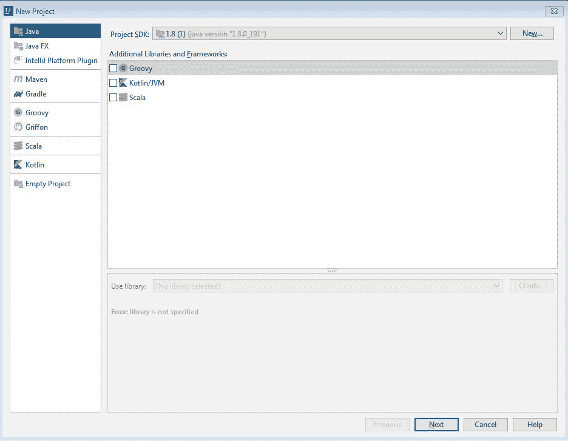
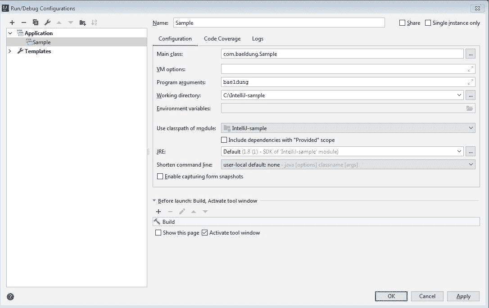
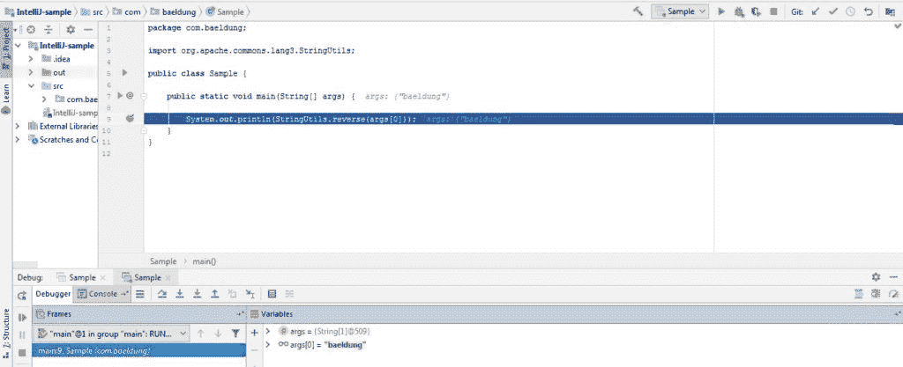
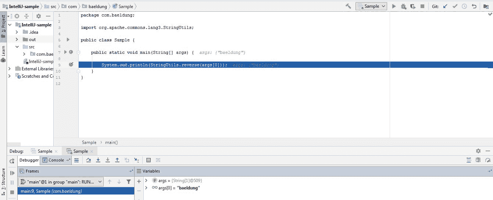

# 基本 IntelliJ 配置

> 原文：<https://web.archive.org/web/20220930061024/https://www.baeldung.com/intellij-basics>

## 1.概观

一个好的 IDE 对于开发人员的工作效率非常重要。IntelliJ 是目前领先的 ide 之一，支持许多编程语言。

在本教程中，我们将从 IntelliJ 的一些基本配置开始，重点放在 Java 编程语言上。我们还将列出 IntelliJ 中提高开发人员生产力的最常见的快捷方式。

## 2.安装 IntelliJ

首先，我们需要[为我们的平台](https://web.archive.org/web/20220830203827/https://www.jetbrains.com/idea/?_ga=2.150305078.1496765831.1596041364-1457663760.1596041364)下载并安装 IntelliJ。对于我们将要讨论的功能，无论是终极版还是社区版都很好。

## 3.IntelliJ 中的基本项目配置

### 3.1.配置 JDK

**[IntelliJ 是用 Java](https://web.archive.org/web/20220830203827/https://www.jetbrains.org/intellij/sdk/docs/intro/intellij_platform.html) 编写的，附带一个打包的 JRE，用于运行 IDE。**

然而，**我们需要用 JDK 配置 IntelliJ 来进行任何 Java 开发。**可以全局配置，也可以按项目配置。

首先，让我们看看如何使用`Switch IDE Boot JDK `选项配置全局 JDK:

[](/web/20220830203827/https://www.baeldung.com/wp-content/uploads/2018/11/Intellij_JDK-1.jpg)

找到交换机 IDE 引导 JDK 选项的最简单的方法是从“查找操作”向导。

我们可以从帮助菜单或者通过输入`Ctrl+Shift+A`或`Cmd+Shift+A.` 通常，**它会列出每个已安装的 JDK，并允许我们选择所需的一个。**

接下来，我们将创建一个新的 Java 项目。

### 3.2.创建 Java 项目

为了创建一个新的 Java 项目，**让我们从`File->New->Project`中调出** **新项目向导**:

[](/web/20220830203827/https://www.baeldung.com/wp-content/uploads/2018/11/Intellij_new-project-1.jpg)

接下来，我们将选择`Java`来创建一个简单的 Java 项目。

此外，**此窗口允许我们根据需要配置特定于项目的 JDK。**

在下一个屏幕上，IntelliJ 提供了类似于`Hello World`的模板项目作为起点，但是让我们只选择 Finish 并开始吧。

现在我们有了一个基本的项目结构，我们可以通过选择`src`文件夹，然后右键单击或者输入`Alt+Insert`来添加一个 Java 类。我们将从这个菜单中选择`Java Class `,然后出现一个对话框，我们可以在这里给它命名:

[](/web/20220830203827/https://www.baeldung.com/wp-content/uploads/2018/11/2018-11-19-3-300x115-1.png)

### 3.3.配置库

一个 Java 项目通常依赖于许多外部或第三方库。虽然 [Maven](/web/20220830203827/https://www.baeldung.com/maven) 和 [Gradle](/web/20220830203827/https://www.baeldung.com/gradle) 是管理这方面的典型专家，**让我们看看如何在 IntelliJ 中实现这一点。**

假设我们想要[使用来自`commons-lang3`库](/web/20220830203827/https://www.baeldung.com/string-processing-commons-lang)的`StringUtils ` API。

像 JDK 设置一样，**我们也可以在全局和项目级别配置库。**全局库由所有项目共享。通过访问项目结构对话框(`File->Project Structure` ) **，可以添加全局库和项目特定库。**

为了添加库，我们必须先下载它。通常，任何外部库的公共源代码都是 Maven 资源库。因此，IntelliJ 允许我们直接从任何预先配置的 Maven 存储库中下载它。当然，**如果没有配置存储库，** **会搜索 [Maven Central](https://web.archive.org/web/20220830203827/https://search.maven.org/artifact/org.apache.commons/commons-lang3/) 。**

[](/web/20220830203827/https://www.baeldung.com/wp-content/uploads/2018/11/maven-1.jpg)

IntelliJ 现在会将`commons-lang3.jar `下载到指定的文件夹中。除此之外，它还将其添加到项目类路径中。

当然，记住以这种方式添加库是 IntelliJ 特有的，不像更健壮的选项那样可移植。不过，对于简单的项目来说，这很方便。

在下一节中，我们将使用这个库并执行一个简单的 Java 程序。

## 4.运行或调试应用程序

### 4.1.运行/调试配置

在运行我们的 Java 程序之前，让我们在前面添加的类中添加一些代码。我们将简单地使用添加的库并调用`StringUtils.reverse() `来反转作为程序参数给出的任何文本:

```java
System.out.println(StringUtils.reverse(args[0]));
```

现在，有两种方法可以在 IntelliJ 中运行这个 main 方法。首先，我们可以简单地从主类中运行`Ctrl + Shift +F10 `或`Control + Shift + R/D`。 **IntelliJ 将创建一个临时运行配置。**

然而，由于我们必须将一个`String `作为程序参数(`args[0] `部分)传递给我们的`StringReversal `应用程序，所以临时运行配置不起作用。

所以，我们可以创建一个永久的`Run/Debug Configuration`。

我们将使用运行导航栏中的“`Edit Configurations`”窗口(`Run->Edit Configurations`)来完成:

[](/web/20220830203827/https://www.baeldung.com/wp-content/uploads/2018/11/Run_intelliJ.jpg)

这里，我们指定在`Main Class.` **中运行的类的名称，它需要有一个 main 方法来实现。**

在本例中，我们还将传递一个`String – `"`baeldung`"`,`——作为应用程序的`Program Argument`。

虽然我们不会在这里演示，但是我们也可以为我们的应用程序配置 JVM 选项和环境变量。

与临时运行配置**相反，IntelliJ 保存该配置，并允许我们在任何时候点击一个按钮来执行它。**

### 4.2。调试 Java 应用程序

IntelliJ 为调试许多语言提供了强大的支持。让我们以调试我们的`String Reversal `实用程序为例。

与大多数 ide 一样，我们可以通过单击侧面板在编辑器中的类的任何一行添加断点:

[](/web/20220830203827/https://www.baeldung.com/wp-content/uploads/2018/11/debug_intelliJ-1024x417.jpg)[](/web/20220830203827/https://www.baeldung.com/wp-content/uploads/2018/11/debug_intelliJ.jpg)

现在，我们可以通过单击运行/调试配置中的调试图标来调试该类。

在这种情况下，程序在第 9 行暂停，如上所示，**允许我们检查线程堆栈，检查变量，甚至评估表达式** ( `Alt+F8` 或`Option/Alt + F8` ) **。**

此时，我们可以选择`Step Into`(`F7`)`StringUtils.reverse()` 方法`, Step Over` ( `F8`)或者`Resume Program` ( `F9`)，意思是运行到下一个断点或者直到应用程序结束。

通常，大多数 ide 允许用户将 Java 类中的一行标记为断点，就像我们刚刚使用的一样。此外， **IntelliJ 允许我们配置不仅仅是行断点。**我们还可以做:

*   `Temporary Breakpoint –`只执行一次的行断点
*   Java 中任何异常类上的断点。当即将引发该异常时，调试器将暂停
*   进入或退出一个方法时执行的程序
*   一个在字段被修改时执行

断点也可以有条件逻辑。

我们可以在`Breakpoints`对话框`Run->View Breakpoints ` ( `Ctrl+Shift+F8` 或`Cmd+Shift+F8`)中查看和配置一个项目中的所有断点。

### 4.3.建筑艺术品

既然我们已经测试、调试并修复了所有问题，我们就可以发布我们的应用程序了。因此，我们需要为我们的应用程序创建可部署的二进制文件。

我们可以创建可部署的。IntelliJ 中的 jar 二进制文件。

首先，在`Project Structure` ( `Ctrl+Alt+Shift+S or Cmd+;`)中，我们需要声明一个新的工件。

我们选择`“Artifacts”`，然后点击加号按钮。

接下来，我们选择一个 JAR 工件，并在 JAR 中添加依赖项:

[](/web/20220830203827/https://www.baeldung.com/wp-content/uploads/2018/11/Intellij_artifacts.jpg)[](/web/20220830203827/https://www.baeldung.com/wp-content/uploads/2018/11/Intellij_artifacts-1.jpg) [](/web/20220830203827/https://www.baeldung.com/wp-content/uploads/2018/11/Intellij_artifacts.jpg)

接下来，我们将回到我们的`Run/Debug Configuration`对话框。

在这里，我们需要在启动前窗口中添加一个构建工件任务。**因此，每次我们执行运行/调试配置时，都会为我们的应用程序创建一个新的可执行文件`jar`。**

再次强调，构建工件并不是 IDE 不可知的。这个机制是 IntelliJ 特有的。构建管理工具可能是更好的方法，类似于我们讨论的依赖管理。

## 5.IntelliJ 中的常见快捷方式

快捷方式对于提高开发人员的工作效率非常有用。以下是最常见的快速备忘单。

### 5.1.航行

*   **搜索类别—**Ctrl+N/Cmd+O
*   **搜索所有文件—**双班
*   **最近的文件—**Ctrl+E/Cmd+E
*   **在文件间切换-**Ctrl+Tab/Cmd+Tab
*   **类型层次结构—**Ctrl+H/Control+H
*   **调用层次结构—**Ctrl+Alt+H/Control+Alt+H
*   **文件结构弹出菜单-**Ctrl+F12/Cmd+F12(列出所有方法和字段)
*   **转到声明-**Ctrl+B/Cmd+B
*   **转到实现—**Ctrl+Alt+B/Cmd+Alt+B
*   **显示项目结构—**Ctrl+Alt+Shift+S/Cmd+；

### 5.2.编者ˌ编辑

*   **代码完成-**Ctrl+空格/ Control +空格
*   **方法参数信息—**Ctrl+P/Cmd+P
*   **方法/类文档信息—**Ctrl+Q/Control+J
*   **重新格式化代码—**Ctrl+Alt+L/Cmd+Alt+L
*   **优化导入-**Ctrl+Alt+O/Control+Alt+O
*   **重复行—**Ctrl+D/Cmd+D
*   **删除行-**Ctrl+Y/Cmd+Delete
*   **代码选择-**Ctrl+W/Alt+Up
*   **显示快速动作-**Alt+Enter/Alt+Return
*   **`System.out.println `–**`sout`+Ctrl+Enter/`sout`+Control+Space
*   **`public static void main `–**`psvm`+Ctrl+Enter/`psvm`+Control+Space
*   **`System.out.println`为方法的返回值**– `methodName().sout [Enter]`
*   **将方法的返回值赋给局部变量**–`methodName().var [Enter]`

### 5.3.重构

*   **重命名类/方法-**Shift+F6
*   **提取方法—**Ctrl+Alt+M/Cmd+Alt+M
*   **提取变量—**Ctrl+Alt+V/Cmd+Alt+V
*   **提取字段—**Ctrl+Alt+F/Cmd+Alt+F
*   **提取常量—**Ctrl+Alt+C/Cmd+Alt+C
*   **提取参数—**Ctrl+Alt+P/Cmd+Alt+P

## 6.结论

在本文中，我们研究了 IntelliJ 中的一些基本配置。

例如，我们创建了一个 Java 项目，添加了库，调试了它，并创建了一个工件，所有这些都在 IntelliJ 中完成。

最后，我们看了一些常见操作的快捷方式。