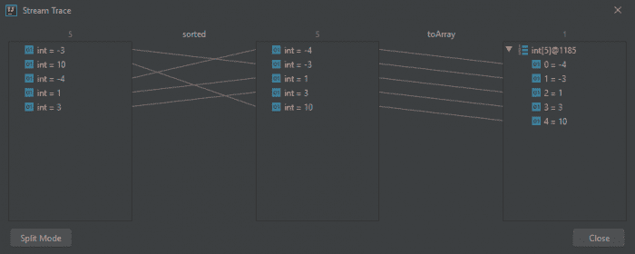
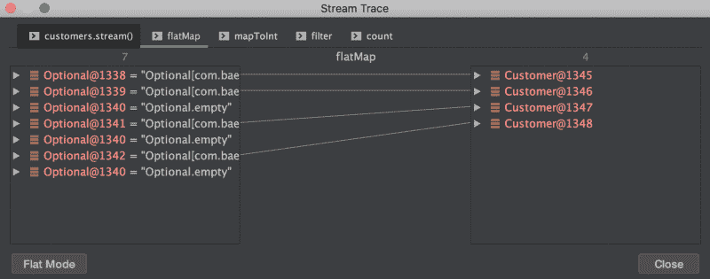
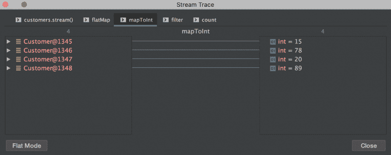
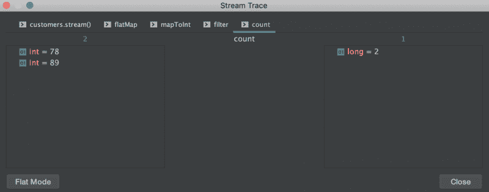

# 用 IntelliJ 调试 Java 8 流

> 原文：<https://web.archive.org/web/20220930061024/https://www.baeldung.com/intellij-debugging-java-streams>

## 1。简介

自从 Java 8 的引入，很多人开始使用(新的)流功能。当然，有时我们的流操作并不像预期的那样工作。

[IntelliJ](/web/20220630142518/https://www.baeldung.com/intellij-basics) 除了其[正常调试选项](/web/20220630142518/https://www.baeldung.com/intellij-debugging-tricks)外，还有一个专用的流调试功能。在这个简短的教程中，我们将探索这个伟大的功能。

## 2。流跟踪对话框

让我们从展示如何打开流跟踪对话框开始。在调试窗口的工具栏中，有一个 **Trace Current Stream Chain 图标，只有当我们的应用程序暂停在流 API 调用**中的一个断点上时，它才会被启用:

[](/web/20220630142518/https://www.baeldung.com/wp-content/uploads/2019/11/debug-stream-icon.png)

单击图标将打开流跟踪对话框。

该对话框有两种模式。我们将在第一个例子中看看平面模式。在第二个示例中，我们将展示默认模式，即拆分模式。

## 3。示例

既然我们已经在 IntelliJ 中引入了流调试功能，那么是时候使用一些代码示例了。

### 3.1.排序流的基本示例

让我们从一个简单的代码片段开始，以适应流跟踪对话框:

```java
int[] listOutputSorted = IntStream.of(-3, 10, -4, 1, 3)
  .sorted()
  .toArray();
```

最初。我们有一个无序的`int`流。接下来，我们对该流进行排序，并将其转换为数组。

当我们**以平面模式**查看流跟踪时，它向我们展示了所发生的步骤的概述:

[](/web/20220630142518/https://www.baeldung.com/wp-content/uploads/2019/11/stream-trace-dialog-flat-1-e1572447263959.png)

在最左边，我们看到了最初的溪流。它按照我们书写的顺序包含了这些。

第一组箭头显示了排序后所有元素的新位置。在最右边，我们看到我们的输出。所有项目都按排序顺序显示在那里。

既然我们已经看到了基础，现在是时候看一个更复杂的例子了。

### 3.2。使用`flatMap`和`filter`和的示例

下一个例子使用了 [`flatMap`](/web/20220630142518/https://www.baeldung.com/java-difference-map-and-flatmap) 。例如，`Stream.flatMap`帮助我们将一个由 [`Optional`](/web/20220630142518/https://www.baeldung.com/java-optional) 组成的列表转换成一个普通列表。在下一个示例中，我们从一组`Optional` `Customer`开始，然后将其映射到一组`Customer`并应用一些过滤:

```java
List<Optional<Customer>> customers = Arrays.asList(
    Optional.of(new Customer("John P.", 15)),
    Optional.of(new Customer("Sarah M.", 78)),
    Optional.empty(),
    Optional.of(new Customer("Mary T.", 20)),
    Optional.empty(),
    Optional.of(new Customer("Florian G.", 89)),
    Optional.empty()
);

long numberOf65PlusCustomers = customers
  .stream()
  .flatMap(c -> c
    .map(Stream::of)
    .orElseGet(Stream::empty))
  .mapToInt(Customer::getAge)
  .filter(c -> c > 65)
  .count();
```

接下来，让我们以拆分模式查看流跟踪，这让我们可以更好地了解这个流。

在左边，我们看到输入流。接下来，我们看到了`Optional`客户流到当前实际客户流的平面映射:

[](/web/20220630142518/https://www.baeldung.com/wp-content/uploads/2019/11/stream-trace-dialog-flatmap-e1572447285933.png)

之后，我们将顾客流与他们的年龄对应起来:

[](/web/20220630142518/https://www.baeldung.com/wp-content/uploads/2019/11/stream-trace-dialog-map-to-int-e1572447305625.png)

下一步将年龄流过滤为大于 65 岁的年龄流:

[](/web/20220630142518/https://www.baeldung.com/wp-content/uploads/2019/11/stream-trace-dialog-filter-e1572447334818.png)

最后，我们计算年龄流中的项目数量:

[](/web/20220630142518/https://www.baeldung.com/wp-content/uploads/2019/11/stream-trace-dialog-count-e1572447345565.png)

## 4.警告

在上面的例子中，我们已经看到了流追踪对话框提供的一些可能性。但是，有一些重要的细节需要注意。其中大多数是流工作方式的直接结果。

首先，**流总是需要终端操作来执行**。当使用流追踪对话框时，这没有什么不同。此外，我们必须**注意不消耗整个流**的操作，例如`anyMatch`。在这种情况下，它不会显示所有的元素，只显示已处理的元素。

其次，**要知道流会被消耗**。如果我们将`Stream`与其操作分开声明，我们可能会遇到错误[“流已经被操作或关闭”](/web/20220630142518/https://www.baeldung.com/java-stream-operated-upon-or-closed-exception)。我们可以通过将流的声明与其用法结合起来来防止这种错误。

## 5.结论

在这个快速教程中，我们看到了如何使用 IntelliJ 的流跟踪对话框。

首先，我们看了一个显示排序和收集的简单案例。然后，我们看了一个更复杂的场景，包括平面映射、映射、过滤和计数。

最后，我们研究了在使用流调试功能时可能会遇到的一些警告。

和往常一样，GitHub 上的[提供了这篇文章的完整源代码。](https://web.archive.org/web/20220630142518/https://github.com/eugenp/tutorials/tree/master/core-java-modules/core-java-streams-3)