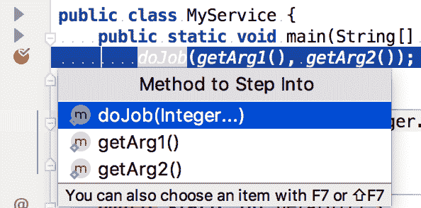
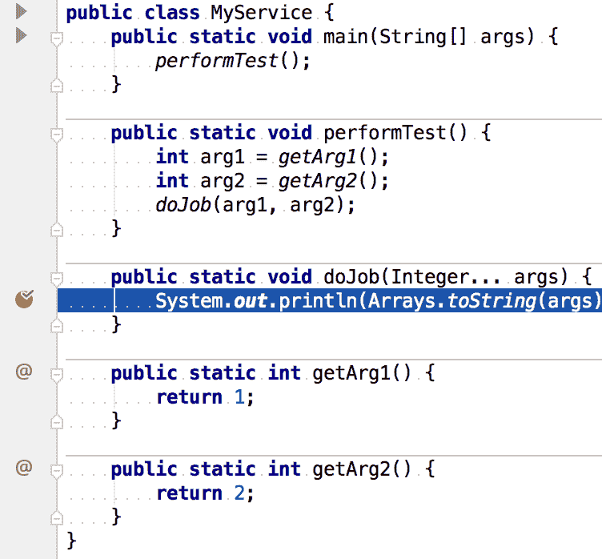
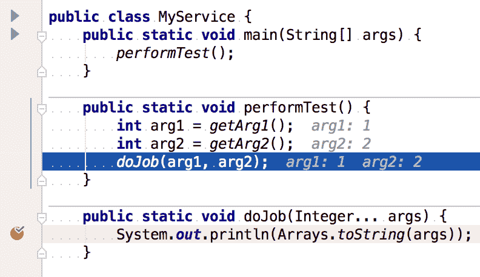
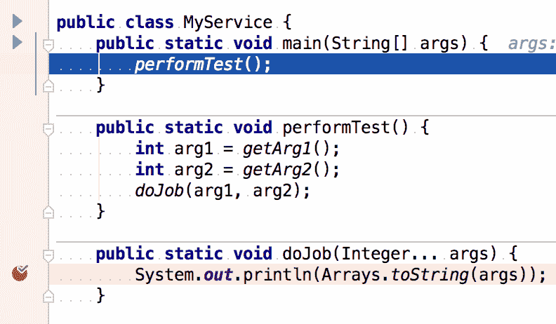
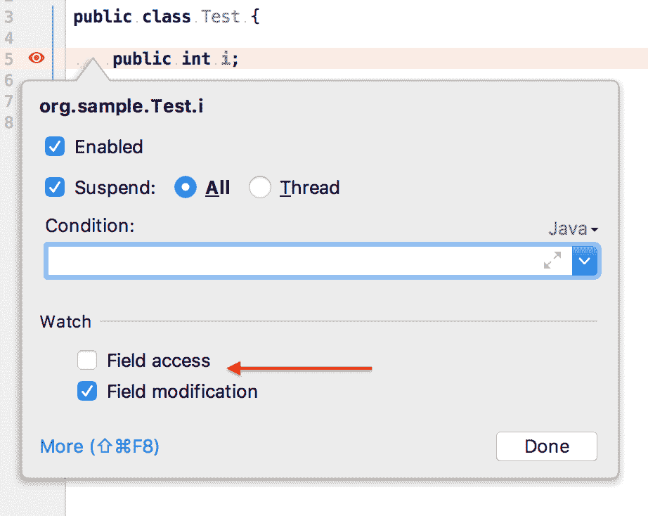
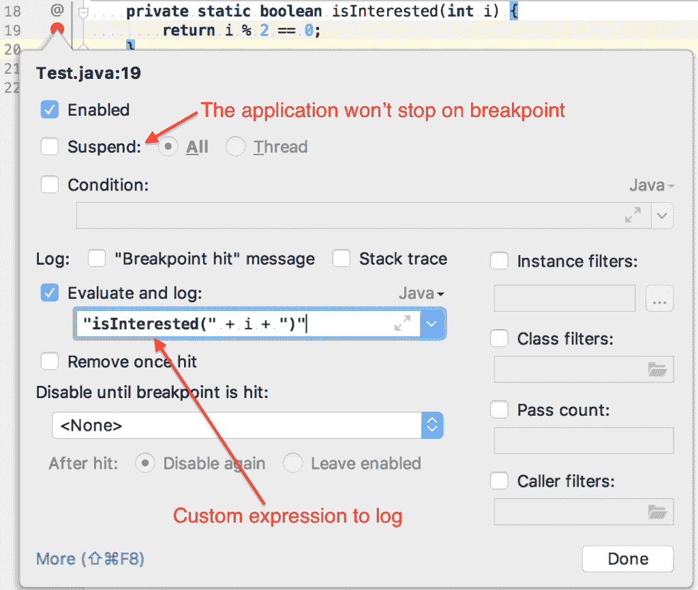
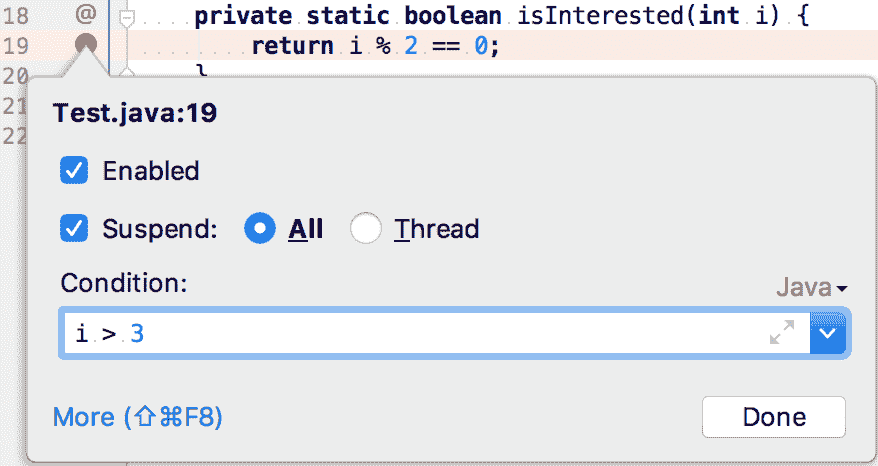
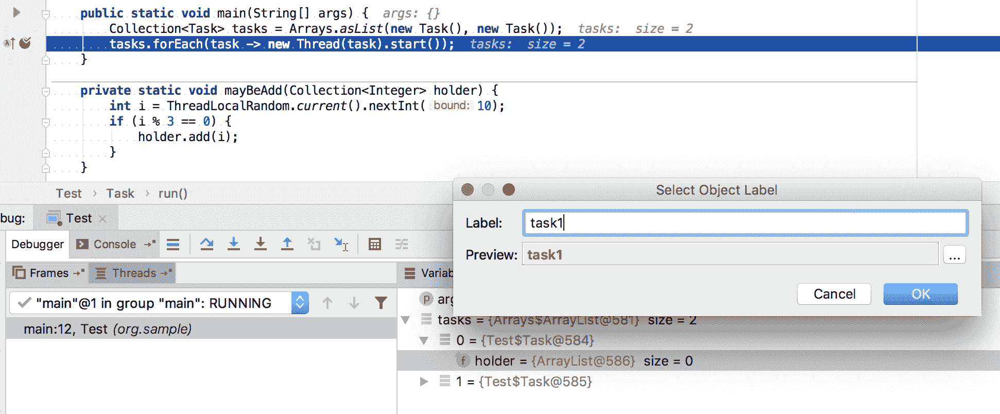
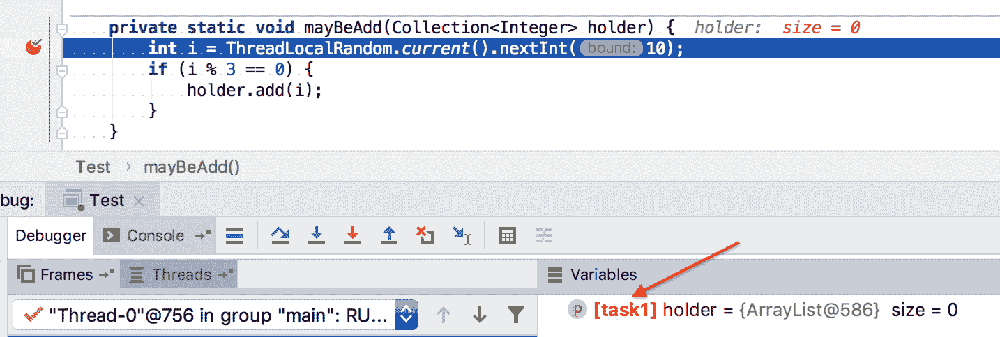
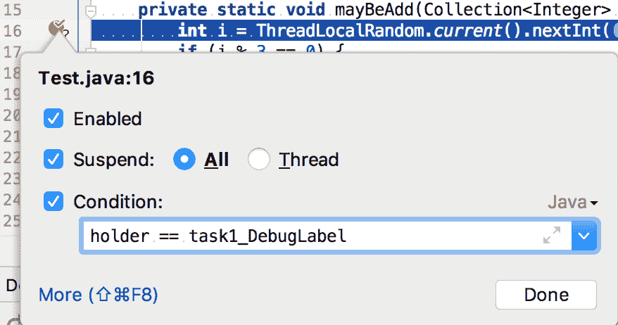

# IntelliJ 调试技巧

> 原文：<https://web.archive.org/web/20220930061024/https://www.baeldung.com/intellij-debugging-tricks>

## 1。概述

在本教程中，我们将研究一些高级 IntelliJ 调试工具。

假设调试基础知识已经知道(如何开始调试、`Step Into`、`Step Over`动作等)。如果没有，请参考[这篇文章](/web/20220628070809/https://www.baeldung.com/intellij-basics)了解更多详情。

## 2。智能踏入

有在一行源代码上调用多个方法的情况，比如`doJob(getArg1(), getArg2())`。如果我们调用`Step Into` action (F7)，调试器将按照 JVM 评估的顺序进入方法:`getArg1`–`getArg2`–`doJob`。

然而，**我们可能想跳过所有的中间调用，直接进入目标方法**。`Smart Step Into`行动允许那样做。

默认情况下，它被**绑定到`Shift + F7`的**，调用时看起来是这样的:

[](/web/20220628070809/https://www.baeldung.com/wp-content/uploads/2018/12/trick1.png)

现在我们可以选择目标方法继续。另外，请注意 IntelliJ 总是将最外层的方法放在列表的顶部。这意味着我们可以通过按下`Shift + F7` | `Enter`快速进入。

## 3。丢帧

我们可能意识到我们感兴趣的一些处理已经发生了(例如，当前方法参数的计算)。在这种情况下，**可以删除当前的 JVM 堆栈帧，以便重新处理它们。**

考虑以下情况:

[](/web/20220628070809/https://www.baeldung.com/wp-content/uploads/2018/12/trick2.png)

假设我们对调试`getArg1`处理感兴趣，那么我们丢弃当前帧(`doJob`方法):

[](/web/20220628070809/https://www.baeldung.com/wp-content/uploads/2018/12/trick3.png)

现在**我们在前面的方法**中:

[](/web/20220628070809/https://www.baeldung.com/wp-content/uploads/2018/12/trick4.png)

然而，此时已经计算了调用参数，因此，**我们需要丢弃当前帧**:

[](/web/20220628070809/https://www.baeldung.com/wp-content/uploads/2018/12/trick5.png)

**现在我们可以通过调用`Step Into`来重新运行处理。**

## 4。字段断点

有时非私有字段会被其他类修改，不是通过 setters 而是直接修改(第三方库就是这种情况，我们不控制源代码)。

在这种情况下，可能很难理解何时完成修改。IntelliJ 允许创建字段级断点来跟踪它。

它们像往常一样设置——在字段行的左侧编辑器栏中单击鼠标左键。之后，可以**打开断点属性(右键单击断点标记)并配置我们是否对字段的读、写或两者感兴趣**:

[](/web/20220628070809/https://www.baeldung.com/wp-content/uploads/2018/12/trick6.png)

## 5。记录断点

有时我们知道应用程序中有一个竞争条件，但不知道具体在哪里。这可能是一个挑战，尤其是在处理新代码的时候。

我们可以在程序源代码中添加调试语句。然而，第三方库没有这种能力。

IDE 可以在这方面有所帮助—**它允许设置断点，一旦命中就不阻止执行，而是生成日志记录语句**。

考虑下面的例子:

```java
public static void main(String[] args) {
    ThreadLocalRandom random = ThreadLocalRandom.current();
    int count = 0;
    for (int i = 0; i < 5; i++) {
        if (isInterested(random.nextInt(10))) {
            count++;
        }
    }
    System.out.printf("Found %d interested values%n", count);
}

private static boolean isInterested(int i) {
    return i % 2 == 0;
}
```

假设我们对记录实际的`isInterested`调用参数感兴趣。

让我们在目标方法中创建一个非阻塞断点(`Shift` +左键点击左边的编辑器槽)。之后，让我们打开它的属性(右键单击断点)，然后**定义目标表达式来记录**:

[](/web/20220628070809/https://www.baeldung.com/wp-content/uploads/2018/12/trick7.png)

当运行应用程序时(注意仍然需要使用调试模式)，我们将看到输出:

```java
isInterested(1)
isInterested(4)
isInterested(3)
isInterested(1)
isInterested(6)
Found 2 interested values
```

## 6。条件断点

我们可能会遇到这样的情况，一个特定的方法被多个线程同时调用，我们需要调试这个过程，只为了一个特定的参数。

IntelliJ 允许**创建断点，这些断点仅在满足用户定义的条件时暂停执行**。

下面是一个使用上述源代码的示例:

[](/web/20220628070809/https://www.baeldung.com/wp-content/uploads/2018/12/trcik8.png)

现在，只有当给定的参数大于 3 时，调试器才会在断点处停止。

## 7 .**。物体标记**

这是 IntelliJ 最强大也是最不为人知的特性。本质上很简单—**我们可以给 JVM 对象**贴上定制标签。

让我们来看一个应用程序，我们将使用它来演示它们:

```java
public class Test {

    public static void main(String[] args) {
        Collection<Task> tasks = Arrays.asList(new Task(), new Task());
        tasks.forEach(task -> new Thread(task).start());
    }

    private static void mayBeAdd(Collection<Integer> holder) {
        int i = ThreadLocalRandom.current().nextInt(10);
        if (i % 3 == 0) {
            holder.add(i);
        }
    }

    private static class Task implements Runnable {

        private final Collection<Integer> holder = new ArrayList<>();

        @Override
        public void run() {
            for (int i = 0; i < 20; i++) {
                mayBeAdd(holder);
            }
        }
    }
}
```

### 7.1。创建标记

当一个应用程序在一个断点上停止，并且目标可以从堆栈帧到达时，可以标记一个对象。

选择它，按`F11` ( `Mark Object`动作)，定义目标名称:

[](/web/20220628070809/https://www.baeldung.com/wp-content/uploads/2018/12/trick9.png)

### 7.2。视图标记

现在，我们甚至可以在应用程序的其他部分看到自定义对象标签:

[](/web/20220628070809/https://www.baeldung.com/wp-content/uploads/2018/12/trick10.png)

最酷的事情是**即使一个被标记的对象目前无法从堆栈帧中到达，我们仍然可以看到它的状态**——打开一个`Evaluate Expression`对话框或添加一个新的手表并开始键入标记的名称。

IntelliJ 提出用`_DebugLabel`后缀来完成:

[](/web/20220628070809/https://www.baeldung.com/wp-content/uploads/2018/12/trick11.png)

当我们评估它时，目标对象的状态显示如下:

[](/web/20220628070809/https://www.baeldung.com/wp-content/uploads/2018/12/trick12.png)

### 7.3。标记为条件

也可以在断点条件中使用标记:

[](/web/20220628070809/https://www.baeldung.com/wp-content/uploads/2018/12/trick13.png)

## 8。结论

在调试多线程应用程序时，我们检查了大量提高生产率的技术。

这通常是一项具有挑战性的任务，我们不能低估工具帮助的重要性。