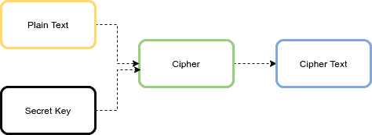

# Java AES 加密和解密

> 原文：<https://web.archive.org/web/20220930061024/https://www.baeldung.com/java-aes-encryption-decryption>

## 1.概观

对称密钥分组密码在数据加密中起着重要的作用。这意味着加密和解密使用同一个密钥。[高级加密标准](https://web.archive.org/web/20221019172203/https://en.wikipedia.org/wiki/Advanced_Encryption_Standard) (AES)是一种广泛使用的对称密钥加密算法。

在本教程中，我们将学习如何在 JDK 中使用 Java 加密体系结构(JCA)实现 AES 加密和解密。

## 延伸阅读:

## [用 Java 加密和解密文件](/web/20221019172203/https://www.baeldung.com/java-cipher-input-output-stream)

Use CipherInputStream and CipherOutputStream classes to encrypt and decrypt files in Java.[Read more](/web/20221019172203/https://www.baeldung.com/java-cipher-input-output-stream) →

## [Java 中的 3 des](/web/20221019172203/https://www.baeldung.com/java-3des)

Learn to create 3DES keys and use them for encrypting and decrypting `String`s and files in Java[Read more](/web/20221019172203/https://www.baeldung.com/java-3des) →

## [Java 中的 RSA](/web/20221019172203/https://www.baeldung.com/java-rsa)

Learn how to create RSA keys in Java and how to use them to encrypt and decrypt messages and files.[Read more](/web/20221019172203/https://www.baeldung.com/java-rsa) →

## 2.AES 算法

AES 算法是一种迭代的对称密钥分组密码，其**支持 128、192 和 256 位的加密密钥(秘密密钥)来加密和解密 128 位的数据块**。下图显示了高级 AES 算法:

[](/web/20221019172203/https://www.baeldung.com/wp-content/uploads/2020/11/Figures.png)

如果要加密的数据不符合 128 位的块大小要求，则必须进行填充。填充是将最后一个块填充到 128 位的过程。

## 3.AES 变体

AES 算法有六种工作模式:

1.  电子代码簿
2.  密码块链接
3.  CFB(密码反馈)
4.  OFB(输出反馈)
5.  计数器
6.  伽罗瓦/计数器模式

我们可以应用这种操作模式来加强加密算法的效果。此外，操作模式可以将分组密码转换成流密码。每种模式都有其优点和缺点。让我们快速回顾一下每一个。

### 3.1.英国板球理事会

这种操作模式是最简单的。明文被分成大小为 128 位的块。然后用相同的密钥和算法加密每个块。因此，它对同一块产生相同的结果。这是这种模式的主要弱点，**不建议加密**。它需要填充数据。

### 3.2.加拿大广播公司

为了克服 ECB 的弱点，CBC 模式使用一个[初始化向量](https://web.archive.org/web/20221019172203/https://en.wikipedia.org/wiki/Initialization_vector) (IV)来增强加密。首先，CBC 使用明文块与 IV 进行异或运算。然后将结果加密成密文块。在下一个块中，它使用加密结果与明文块进行异或运算，直到最后一个块。

在这种模式下，加密不能并行，但解密可以并行。它还需要填充数据。

### 3.3.中心纤维体

这种模式可以用作流密码。首先，它对 IV 进行加密，然后与明文块进行异或运算，得到密文。然后 CFB 对加密结果进行加密，对明文进行异或运算。它需要静脉注射。

在这种模式下，解密可以并行，但加密不能并行。

### 3.4.OFB

这种模式可以用作流密码。首先，它对 IV 进行加密。然后使用加密结果对明文进行异或运算，得到密文。

它不需要填充数据，也不会受到噪声块的影响。

### 3.5.CTR

这种模式使用计数器的值作为 IV。它非常类似于 OFB，但它每次都使用计数器来加密，而不是 IV。

这种模式有两个优点，包括加密/解密并行化，一个模块中的噪声不会影响其他模块。

### 3.6.最大公测度

这种模式是 CTR 模式的扩展。GCM 受到了极大的关注，并得到了 NIST 的推荐。GCM 模型输出密文和认证标签。与算法的其他操作模式相比，这种模式的主要优点是其效率。

在本教程中，我们将使用`AES/CBC/PKCS5Padding `算法，因为它在许多项目中被广泛使用。

### 3.7.加密后的数据大小

如前所述，AES 的块大小为 128 位或 16 字节。AES 不改变大小，密文大小等于明文大小。此外，在 ECB 和 CBC 模式下，我们应该使用类似于`PKCS 5.`的填充算法，因此加密后的数据大小为:

```java
ciphertext_size (bytes) = cleartext_size + (16 - (cleartext_size % 16))
```

为了用密文存储 IV，我们需要增加 16 个字节。

## 4.AES 参数

在 AES 算法中，我们需要三个参数:输入数据、密钥和 IV。在 ECB 模式下不使用 IV。

### 4.1.输入数据

AES 的输入数据可以是基于字符串、文件、对象和密码的。

### 4.2.秘密钥匙

在 AES 中有两种生成密钥的方法:从随机数生成，或者从给定的密码导出。

**在第一种方法中，密钥应该从类似于`SecureRandom` 类的加密安全(伪)随机数生成器中生成。**

为了生成密钥，我们可以使用`KeyGenerator`类。让我们定义一种生成大小为`n` (128、192 和 256)位的 AES 密钥的方法:

```java
public static SecretKey generateKey(int n) throws NoSuchAlgorithmException {
    KeyGenerator keyGenerator = KeyGenerator.getInstance("AES");
    keyGenerator.init(n);
    SecretKey key = keyGenerator.generateKey();
    return key;
}
```

**在第二种方法中，可以使用基于密码的密钥导出函数(如 PBKDF2** )从给定的密码中导出 AES 密钥。我们还需要一个 salt 值来将密码转换成密钥。盐也是一个随机值。

我们可以使用`SecretKeyFactory`类和`PBKDF2WithHmacSHA256`算法从给定的密码中生成一个密钥。

让我们定义一种从给定密码生成 AES 密钥的方法，该方法迭代 65，536 次，密钥长度为 256 位:

```java
public static SecretKey getKeyFromPassword(String password, String salt)
    throws NoSuchAlgorithmException, InvalidKeySpecException {

    SecretKeyFactory factory = SecretKeyFactory.getInstance("PBKDF2WithHmacSHA256");
    KeySpec spec = new PBEKeySpec(password.toCharArray(), salt.getBytes(), 65536, 256);
    SecretKey secret = new SecretKeySpec(factory.generateSecret(spec)
        .getEncoded(), "AES");
    return secret;
}
```

### 4.3.初始化向量(IV)

IV 是一个伪随机值，与加密的块大小相同。我们可以使用`SecureRandom`类来生成一个随机的 IV。

让我们定义一种生成 IV 的方法:

```java
public static IvParameterSpec generateIv() {
    byte[] iv = new byte[16];
    new SecureRandom().nextBytes(iv);
    return new IvParameterSpec(iv);
}
```

## 5.加密和解密

### 5.1.线

要实现输入字符串加密，我们首先需要根据上一节生成密钥和 IV。下一步，我们通过使用`getInstance()`方法从`Cipher`类创建一个实例。

此外，我们使用带有密钥、IV 和加密模式的`init()`方法配置一个密码实例。最后，我们通过调用`doFinal()`方法来加密输入字符串。此方法获取字节的输入，并以字节为单位返回密文:

```java
public static String encrypt(String algorithm, String input, SecretKey key,
    IvParameterSpec iv) throws NoSuchPaddingException, NoSuchAlgorithmException,
    InvalidAlgorithmParameterException, InvalidKeyException,
    BadPaddingException, IllegalBlockSizeException {

    Cipher cipher = Cipher.getInstance(algorithm);
    cipher.init(Cipher.ENCRYPT_MODE, key, iv);
    byte[] cipherText = cipher.doFinal(input.getBytes());
    return Base64.getEncoder()
        .encodeToString(cipherText);
}
```

为了解密输入字符串，我们可以使用`DECRYPT_MODE`初始化我们的密码来解密内容:

```java
public static String decrypt(String algorithm, String cipherText, SecretKey key,
    IvParameterSpec iv) throws NoSuchPaddingException, NoSuchAlgorithmException,
    InvalidAlgorithmParameterException, InvalidKeyException,
    BadPaddingException, IllegalBlockSizeException {

    Cipher cipher = Cipher.getInstance(algorithm);
    cipher.init(Cipher.DECRYPT_MODE, key, iv);
    byte[] plainText = cipher.doFinal(Base64.getDecoder()
        .decode(cipherText));
    return new String(plainText);
}
```

让我们编写一个加密和解密字符串输入的测试方法:

```java
@Test
void givenString_whenEncrypt_thenSuccess()
    throws NoSuchAlgorithmException, IllegalBlockSizeException, InvalidKeyException,
    BadPaddingException, InvalidAlgorithmParameterException, NoSuchPaddingException { 

    String input = "baeldung";
    SecretKey key = AESUtil.generateKey(128);
    IvParameterSpec ivParameterSpec = AESUtil.generateIv();
    String algorithm = "AES/CBC/PKCS5Padding";
    String cipherText = AESUtil.encrypt(algorithm, input, key, ivParameterSpec);
    String plainText = AESUtil.decrypt(algorithm, cipherText, key, ivParameterSpec);
    Assertions.assertEquals(input, plainText);
}
```

### 5.2.文件

现在让我们使用 AES 算法加密一个文件。步骤是相同的，但是我们需要一些`IO`类来处理这些文件。让我们加密一个文本文件:

```java
public static void encryptFile(String algorithm, SecretKey key, IvParameterSpec iv,
    File inputFile, File outputFile) throws IOException, NoSuchPaddingException,
    NoSuchAlgorithmException, InvalidAlgorithmParameterException, InvalidKeyException,
    BadPaddingException, IllegalBlockSizeException {

    Cipher cipher = Cipher.getInstance(algorithm);
    cipher.init(Cipher.ENCRYPT_MODE, key, iv);
    FileInputStream inputStream = new FileInputStream(inputFile);
    FileOutputStream outputStream = new FileOutputStream(outputFile);
    byte[] buffer = new byte[64];
    int bytesRead;
    while ((bytesRead = inputStream.read(buffer)) != -1) {
        byte[] output = cipher.update(buffer, 0, bytesRead);
        if (output != null) {
            outputStream.write(output);
        }
    }
    byte[] outputBytes = cipher.doFinal();
    if (outputBytes != null) {
        outputStream.write(outputBytes);
    }
    inputStream.close();
    outputStream.close();
}
```

请注意，不建议尝试将整个文件读入内存，尤其是当文件很大时。相反，我们一次加密一个缓冲区。

为了解密一个文件，我们使用类似的步骤，并使用前面看到的`DECRYPT_MODE` 初始化我们的密码。

同样，让我们定义一个加密和解密文本文件的测试方法。在这个方法中，我们从测试资源目录中读取`baeldung.txt`文件，将其加密成一个名为`baeldung.encrypted`的文件，然后将该文件解密成一个新文件:

```java
@Test
void givenFile_whenEncrypt_thenSuccess() 
    throws NoSuchAlgorithmException, IOException, IllegalBlockSizeException, 
    InvalidKeyException, BadPaddingException, InvalidAlgorithmParameterException, 
    NoSuchPaddingException {

    SecretKey key = AESUtil.generateKey(128);
    String algorithm = "AES/CBC/PKCS5Padding";
    IvParameterSpec ivParameterSpec = AESUtil.generateIv();
    Resource resource = new ClassPathResource("inputFile/baeldung.txt");
    File inputFile = resource.getFile();
    File encryptedFile = new File("classpath:baeldung.encrypted");
    File decryptedFile = new File("document.decrypted");
    AESUtil.encryptFile(algorithm, key, ivParameterSpec, inputFile, encryptedFile);
    AESUtil.decryptFile(
      algorithm, key, ivParameterSpec, encryptedFile, decryptedFile);
    assertThat(inputFile).hasSameTextualContentAs(decryptedFile);
}
```

### 5.3.基于密码

我们可以使用从给定密码中获得的密钥进行 AES 加密和解密。

为了生成密钥，我们使用了`getKeyFromPassword()`方法。加密和解密步骤与字符串输入部分所示的步骤相同。然后，我们可以使用实例化的密码和提供的密钥来执行加密。

让我们写一个测试方法:

```java
@Test
void givenPassword_whenEncrypt_thenSuccess() 
    throws InvalidKeySpecException, NoSuchAlgorithmException, 
    IllegalBlockSizeException, InvalidKeyException, BadPaddingException, 
    InvalidAlgorithmParameterException, NoSuchPaddingException {

    String plainText = "www.baeldung.com";
    String password = "baeldung";
    String salt = "12345678";
    IvParameterSpec ivParameterSpec = AESUtil.generateIv();
    SecretKey key = AESUtil.getKeyFromPassword(password,salt);
    String cipherText = AESUtil.encryptPasswordBased(plainText, key, ivParameterSpec);
    String decryptedCipherText = AESUtil.decryptPasswordBased(
      cipherText, key, ivParameterSpec);
    Assertions.assertEquals(plainText, decryptedCipherText);
}
```

### 5.4.目标

为了加密一个 Java 对象，我们需要使用`SealedObject`类。对象应该是`Serializable`。让我们从定义一个`Student`类开始:

```java
public class Student implements Serializable {
    private String name;
    private int age;

    // standard setters and getters
} 
```

接下来，让我们加密`Student`对象:

```java
public static SealedObject encryptObject(String algorithm, Serializable object,
    SecretKey key, IvParameterSpec iv) throws NoSuchPaddingException,
    NoSuchAlgorithmException, InvalidAlgorithmParameterException, 
    InvalidKeyException, IOException, IllegalBlockSizeException {

    Cipher cipher = Cipher.getInstance(algorithm);
    cipher.init(Cipher.ENCRYPT_MODE, key, iv);
    SealedObject sealedObject = new SealedObject(object, cipher);
    return sealedObject;
}
```

加密的对象稍后可以使用正确的密码解密:

```java
public static Serializable decryptObject(String algorithm, SealedObject sealedObject,
    SecretKey key, IvParameterSpec iv) throws NoSuchPaddingException,
    NoSuchAlgorithmException, InvalidAlgorithmParameterException, InvalidKeyException,
    ClassNotFoundException, BadPaddingException, IllegalBlockSizeException,
    IOException {

    Cipher cipher = Cipher.getInstance(algorithm);
    cipher.init(Cipher.DECRYPT_MODE, key, iv);
    Serializable unsealObject = (Serializable) sealedObject.getObject(cipher);
    return unsealObject;
}
```

现在让我们编写一个测试用例:

```java
@Test
void givenObject_whenEncrypt_thenSuccess() 
    throws NoSuchAlgorithmException, IllegalBlockSizeException, InvalidKeyException,
    InvalidAlgorithmParameterException, NoSuchPaddingException, IOException, 
    BadPaddingException, ClassNotFoundException {

    Student student = new Student("Baeldung", 20);
    SecretKey key = AESUtil.generateKey(128);
    IvParameterSpec ivParameterSpec = AESUtil.generateIv();
    String algorithm = "AES/CBC/PKCS5Padding";
    SealedObject sealedObject = AESUtil.encryptObject(
      algorithm, student, key, ivParameterSpec);
    Student object = (Student) AESUtil.decryptObject(
      algorithm, sealedObject, key, ivParameterSpec);
    assertThat(student).isEqualToComparingFieldByField(object);
}
```

## 6.结论

在本文中，我们学习了如何使用 Java 中的 AES 算法加密和解密输入数据，如字符串、文件、对象和基于密码的数据。此外，我们讨论了 AES 变体和加密后的数据大小。

和往常一样，GitHub 上的[提供了这篇文章的完整源代码。](https://web.archive.org/web/20221019172203/https://github.com/eugenp/tutorials/tree/master/core-java-modules/core-java-security-algorithms)