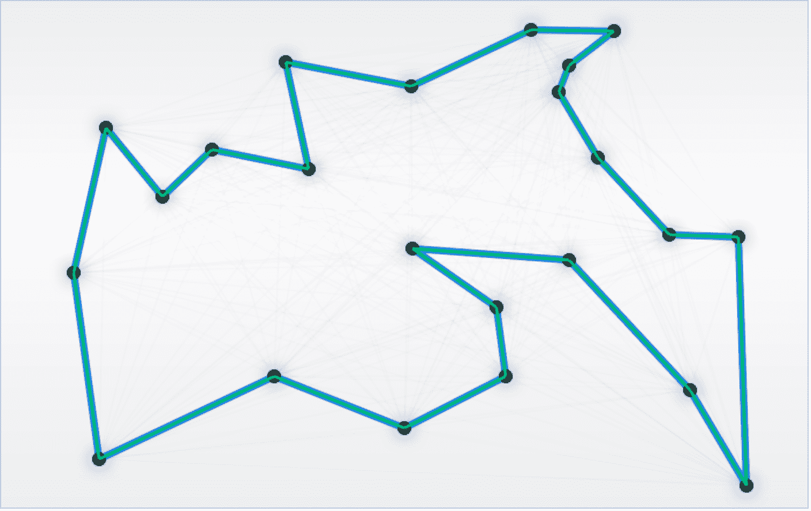

# 蚁群优化与 Java 实例

> 原文：<https://web.archive.org/web/20220930061024/https://www.baeldung.com/java-ant-colony-optimization>

## 1。简介

[这个系列](/web/20220626194919/https://www.baeldung.com/java-genetic-algorithm)的目的是**解释遗传算法的概念，并展示最广为人知的实现**。

在本教程中，我们将**描述蚁群优化** (ACO)的概念，然后是代码示例。

## 2。ACO 如何工作

蚁群算法是一种受蚂蚁自然行为启发的遗传算法。为了充分理解 ACO 算法，我们需要熟悉它的基本概念:

*   蚂蚁利用信息素来寻找家和食物源之间的最短路径
*   信息素蒸发很快
*   蚂蚁更喜欢使用信息素密度更高的短路径

让我们展示一个简单的蚁群算法在旅行推销员问题中的应用。在下面的例子中，我们需要找到图中所有节点之间的最短路径:

[](/web/20220626194919/https://www.baeldung.com/wp-content/uploads/2017/03/ants1.png) 遵循自然行为，蚂蚁会在探索中开始探索新的路径。蓝色表示使用频率最高的路径，而绿色表示当前找到的最短路径:

[](/web/20220626194919/https://www.baeldung.com/wp-content/uploads/2017/03/ants2.png) 这样一来，我们就实现了所有节点之间的最短路径:

[](/web/20220626194919/https://www.baeldung.com/wp-content/uploads/2017/03/ants3.png) 基于 GUI 的 ACO 测试工具可以在[这里](https://web.archive.org/web/20220626194919/http://www.theprojectspot.com/downloads/tsp-aco.html)找到。

## 3。Java 实现

### 3.1。ACO 参数

让我们讨论 ACO 算法的主要参数，在`AntColonyOptimization`类中声明:

```java
private double c = 1.0;
private double alpha = 1;
private double beta = 5;
private double evaporation = 0.5;
private double Q = 500;
private double antFactor = 0.8;
private double randomFactor = 0.01;
```

参数`c`表示模拟开始时的原始轨迹数。此外，`alpha`控制信息素的重要性，而`beta`控制距离优先级。**一般来说，`beta`参数应大于`alpha`以获得最佳效果。**

接下来，`evaporation`变量显示每次迭代中信息素蒸发的百分比，而`Q` 提供关于每个`Ant`留下的信息素总量的信息，而`antFactor`告诉我们每个城市将使用多少只蚂蚁。

最后，我们需要在我们的模拟中有一点随机性，这在`randomFactor`中有所涉及。

### 3.2。创造蚂蚁

每个`Ant` 将能够访问一个特定的城市，记住所有访问过的城市，并跟踪路径长度:

```java
public void visitCity(int currentIndex, int city) {
    trail[currentIndex + 1] = city;
    visited[city] = true;
}

public boolean visited(int i) {
    return visited[i];
}

public double trailLength(double graph[][]) {
    double length = graph[trail[trailSize - 1]][trail[0]];
    for (int i = 0; i < trailSize - 1; i++) {
        length += graph[trail[i]][trail[i + 1]];
    }
    return length;
} 
```

### 3.3。设置蚂蚁

在最开始，我们需要通过提供踪迹和蚂蚁矩阵来初始化我们的 ACO 代码实现:

```java
graph = generateRandomMatrix(noOfCities);
numberOfCities = graph.length;
numberOfAnts = (int) (numberOfCities * antFactor);

trails = new double[numberOfCities][numberOfCities];
probabilities = new double[numberOfCities];
ants = new Ant[numberOfAnts];
IntStream.range(0, numberOfAnts).forEach(i -> ants.add(new Ant(numberOfCities)));
```

接下来，我们需要**设置`ants`矩阵**，从一个随机的城市开始:

```java
public void setupAnts() {
    IntStream.range(0, numberOfAnts)
      .forEach(i -> {
          ants.forEach(ant -> {
              ant.clear();
              ant.visitCity(-1, random.nextInt(numberOfCities));
          });
      });
    currentIndex = 0;
}
```

对于循环的每次迭代，我们将执行以下操作:

```java
IntStream.range(0, maxIterations).forEach(i -> {
    moveAnts();
    updateTrails();
    updateBest();
});
```

### 3.4。移动蚂蚁

先说`moveAnts()`法。我们需要**为所有蚂蚁选择下一个城市，**记住每只蚂蚁都试图跟随其他蚂蚁的足迹:

```java
public void moveAnts() {
    IntStream.range(currentIndex, numberOfCities - 1).forEach(i -> {
        ants.forEach(ant -> {
            ant.visitCity(currentIndex, selectNextCity(ant));
        });
        currentIndex++;
    });
}
```

最重要的是正确选择下一个要去的城市。我们应该根据概率逻辑选择下一个城镇。首先，我们可以检查`Ant`是否应该随机访问一个城市:

```java
int t = random.nextInt(numberOfCities - currentIndex);
if (random.nextDouble() < randomFactor) {
    OptionalInt cityIndex = IntStream.range(0, numberOfCities)
      .filter(i -> i == t && !ant.visited(i))
      .findFirst();
    if (cityIndex.isPresent()) {
        return cityIndex.getAsInt();
    }
}
```

如果我们没有随机选择任何城市，我们需要计算选择下一个城市的概率，记住蚂蚁更喜欢沿着更强更短的路径。我们可以通过在数组中存储移动到每个城市的概率来做到这一点:

```java
public void calculateProbabilities(Ant ant) {
    int i = ant.trail[currentIndex];
    double pheromone = 0.0;
    for (int l = 0; l < numberOfCities; l++) {
        if (!ant.visited(l)){
            pheromone
              += Math.pow(trails[i][l], alpha) * Math.pow(1.0 / graph[i][l], beta);
        }
    }
    for (int j = 0; j < numberOfCities; j++) {
        if (ant.visited(j)) {
            probabilities[j] = 0.0;
        } else {
            double numerator
              = Math.pow(trails[i][j], alpha) * Math.pow(1.0 / graph[i][j], beta);
            probabilities[j] = numerator / pheromone;
        }
    }
} 
```

在我们计算了概率之后，我们可以使用以下公式来决定去哪个城市:

```java
double r = random.nextDouble();
double total = 0;
for (int i = 0; i < numberOfCities; i++) {
    total += probabilities[i];
    if (total >= r) {
        return i;
    }
}
```

### 3.5。更新轨迹

在这一步，我们应该更新踪迹和留下的信息素:

```java
public void updateTrails() {
    for (int i = 0; i < numberOfCities; i++) {
        for (int j = 0; j < numberOfCities; j++) {
            trails[i][j] *= evaporation;
        }
    }
    for (Ant a : ants) {
        double contribution = Q / a.trailLength(graph);
        for (int i = 0; i < numberOfCities - 1; i++) {
            trails[a.trail[i]][a.trail[i + 1]] += contribution;
        }
        trails[a.trail[numberOfCities - 1]][a.trail[0]] += contribution;
    }
}
```

### 3.6。更新最佳解决方案

这是每次迭代的最后一步。我们需要更新最佳解决方案，以便保留对它的引用:

```java
private void updateBest() {
    if (bestTourOrder == null) {
        bestTourOrder = ants[0].trail;
        bestTourLength = ants[0].trailLength(graph);
    }
    for (Ant a : ants) {
        if (a.trailLength(graph) < bestTourLength) {
            bestTourLength = a.trailLength(graph);
            bestTourOrder = a.trail.clone();
        }
    }
}
```

在所有迭代之后，最终结果将指示 ACO 找到的最佳路径。**请注意，随着城市数量的增加，找到最短路径的概率降低。**

## 4。结论

本教程**介绍蚁群优化算法**。你可以学习遗传算法**而不需要任何这方面的知识**，只需要基本的计算机编程技能。

本教程中代码片段的完整源代码可以在 GitHub 项目的[中找到。](https://web.archive.org/web/20220626194919/https://github.com/eugenp/tutorials/tree/master/algorithms-modules/algorithms-genetic)

对于本系列的所有文章，包括遗传算法的其他例子，请查看以下链接:

*   [如何用 Java 设计遗传算法](/web/20220626194919/https://www.baeldung.com/java-genetic-algorithm)
*   [Java 中的旅行推销员问题](/web/20220626194919/https://www.baeldung.com/java-simulated-annealing-for-traveling-salesman)
*   蚁群优化