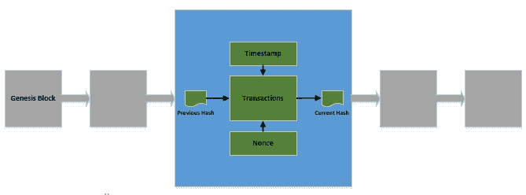
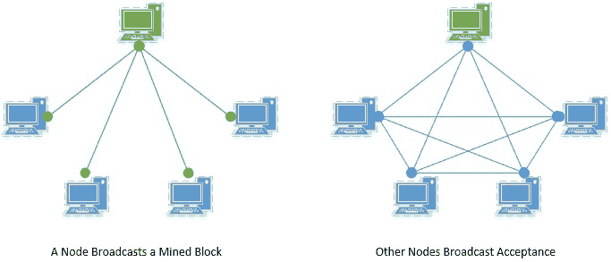

# 用 Java 实现一个简单的区块链

> 原文：<https://web.archive.org/web/20220930061024/https://www.baeldung.com/java-blockchain>

## 1.概观

在本教程中，我们将学习区块链技术的基本概念。我们还将使用 Java 实现一个基本的应用程序，重点放在概念上。

此外，我们将讨论这项技术的一些高级概念和实际应用。

## 2.什么是区块链？

所以，让我们先了解一下区块链到底是什么…

嗯，它的起源可以追溯到 2008 年中本聪发表的关于比特币的白皮书。

**区块链是信息的去中心化账本**。它由通过使用加密技术连接起来的数据块组成。它属于通过公共网络连接的节点网络。当我们稍后试图构建一个基础教程时，我们会更好地理解这一点。

有一些我们必须了解的重要属性，让我们来看一下:

*   防篡改:首先，作为数据块一部分的**数据是防篡改的**。每个块都被一个密码摘要(通常称为哈希)引用，从而使块防篡改。
*   分散化:整个**区块链在整个网络中是完全分散化的**。这意味着没有主节点，网络中的每个节点都有相同的副本。
*   透明:参与网络的每个节点**通过与其他节点达成共识**来验证并向其链中添加新块。因此，每个节点都可以完全看到数据。

## 3.区块链是如何工作的？

现在，让我们了解区块链是如何工作的。

区块链的**基本单位是`blocks`** 。一个块可以封装几个事务或其他有价值的数据:

[](/web/20221206131631/https://www.baeldung.com/wp-content/uploads/2019/09/Blockchain.jpg)

### 3.1.开采一个区块

我们用哈希值来表示一个块。**生成一个块的哈希值称为“挖掘”**该块。开采一个区块的计算成本通常很高，因为它是“工作证明”。

块的散列通常由以下数据组成:

*   首先，块的散列由它封装的事务组成
*   哈希还包含块创建的时间戳
*   它还包括一个随机数，一个在加密中使用的任意数字
*   最后，当前块的散列还包括前一块的散列

网络中的多个**节点可以同时竞争开采**块。除了生成散列之外，节点还必须验证添加到块中的事务是合法的。第一个挖矿的人赢得比赛！

### 3.2.向区块链添加区块

虽然挖掘一个块在计算上很昂贵，但是**验证一个块是否合法相对容易得多**。网络中的所有节点都参与验证新挖掘的块。

[](/web/20221206131631/https://www.baeldung.com/wp-content/uploads/2019/09/Blockchain-Network-1.jpg)

因此，新挖掘的**块被添加到节点共识**的区块链中。

现在，有几种共识方案可供我们用于验证。网络中的节点使用相同的协议来检测链中的恶意分支。因此，恶意分支即使被引入，也会很快被大多数节点拒绝。

## 4.Java 中的基本区块链

现在我们已经有了足够的上下文，可以开始用 Java 构建一个基本的应用程序了。

我们这里简单的**例子将说明我们刚刚看到的基本概念**。生产级应用程序需要考虑很多问题，这些问题超出了本教程的范围。然而，我们稍后将触及一些高级主题。

### 4.1.实现块

首先，我们需要定义一个简单的 POJO 来保存我们的块的数据:

```java
public class Block {
    private String hash;
    private String previousHash;
    private String data;
    private long timeStamp;
    private int nonce;

    public Block(String data, String previousHash, long timeStamp) {
        this.data = data;
        this.previousHash = previousHash;
        this.timeStamp = timeStamp;
        this.hash = calculateBlockHash();
    }
    // standard getters and setters
}
```

让我们了解一下我们在这里打包了什么:

*   前一个块的散列，是构建链的重要部分
*   实际数据，任何有价值的信息，比如合同
*   该块的创建时间戳
*   一个随机数，它是加密中使用的任意数字
*   最后，基于其他数据计算的该块的散列

### 4.2.计算哈希值

现在，我们如何计算一个块的散列？我们已经使用了一个方法`calculateBlockHash`，但是还没有看到实现。在我们实现这个方法之前，有必要花一些时间来理解到底什么是 hash。

哈希是哈希函数的输出。一个**散列函数将任意大小的输入数据映射到固定大小的输出数据**。散列对输入数据的任何变化都非常敏感，不管变化有多小。

此外，仅仅从输入数据的散列中获取输入数据是不可能的。这些特性使得哈希函数在密码学中非常有用。

那么，让我们看看如何用 Java 生成我们的块的散列:

```java
public String calculateBlockHash() {
    String dataToHash = previousHash 
      + Long.toString(timeStamp) 
      + Integer.toString(nonce) 
      + data;
    MessageDigest digest = null;
    byte[] bytes = null;
    try {
        digest = MessageDigest.getInstance("SHA-256");
        bytes = digest.digest(dataToHash.getBytes(UTF_8));
    } catch (NoSuchAlgorithmException | UnsupportedEncodingException ex) {
        logger.log(Level.SEVERE, ex.getMessage());
    }
    StringBuffer buffer = new StringBuffer();
    for (byte b : bytes) {
        buffer.append(String.format("%02x", b));
    }
    return buffer.toString();
}
```

这里发生了相当多的事情，我们来详细了解一下:

*   首先，我们连接块的不同部分来生成散列
*   然后，我们从`MessageDigest`得到一个 SHA-256 散列函数的实例
*   然后，我们生成输入数据的哈希值，这是一个字节数组
*   最后，我们将字节数组转换为十六进制字符串，哈希通常表示为 32 位十六进制数

### 4.3.我们开采了这个区块了吗？

到目前为止，一切听起来简单而优雅，除了我们还没有开采这个区块。那么到底是什么需要开采一个区块，这已经吸引了开发者一段时间了！

嗯，**挖掘一个区块意味着为这个区块解决一个计算复杂的任务**。虽然计算一个块的散列值有些琐碎，但是找到以五个零开始的散列值却不简单。更复杂的是找到一个以十个零开始的散列，然后我们得到一个大概的概念。

那么，我们到底该怎么做呢？老实说，这个解决方案并不花哨！我们试图用蛮力来实现这个目标。我们在这里使用 nonce:

```java
public String mineBlock(int prefix) {
    String prefixString = new String(new char[prefix]).replace('\0', '0');
    while (!hash.substring(0, prefix).equals(prefixString)) {
        nonce++;
        hash = calculateBlockHash();
    }
    return hash;
}
```

让我们看看我们在这里要做的是:

*   我们首先定义想要查找的前缀
*   然后我们检查是否找到了解决方案
*   如果不是，我们递增 nonce 并在循环中计算散列
*   循环往复，直到我们中了头彩

我们从 nonce 的默认值开始，并将其递增 1。但是在现实世界的应用中，有更多复杂的策略来启动和增加随机数。此外，我们在这里不验证我们的数据，这通常是一个重要的部分。

### 4.4.让我们运行这个例子

现在我们已经定义了块及其函数，我们可以用它来创建一个简单的区块链。我们将把它存储在一个`ArrayList`中:

```java
List<Block> blockchain = new ArrayList<>();
int prefix = 4;
String prefixString = new String(new char[prefix]).replace('\0', '0');
```

此外，我们定义了前缀 4，这实际上意味着我们希望我们的散列以四个零开始。

让我们看看如何在这里添加一个块:

```java
@Test
public void givenBlockchain_whenNewBlockAdded_thenSuccess() {
    Block newBlock = new Block(
      "The is a New Block.", 
      blockchain.get(blockchain.size() - 1).getHash(),
      new Date().getTime());
    newBlock.mineBlock(prefix);
    assertTrue(newBlock.getHash().substring(0, prefix).equals(prefixString));
    blockchain.add(newBlock);
}
```

### 4.5.区块链验证

节点如何验证区块链是否有效？虽然这可能相当复杂，但让我们考虑一个简单的版本:

```java
@Test
public void givenBlockchain_whenValidated_thenSuccess() {
    boolean flag = true;
    for (int i = 0; i < blockchain.size(); i++) {
        String previousHash = i==0 ? "0" : blockchain.get(i - 1).getHash();
        flag = blockchain.get(i).getHash().equals(blockchain.get(i).calculateBlockHash())
          && previousHash.equals(blockchain.get(i).getPreviousHash())
          && blockchain.get(i).getHash().substring(0, prefix).equals(prefixString);
            if (!flag) break;
    }
    assertTrue(flag);
}
```

因此，这里我们对每个数据块进行三项特定检查:

*   当前块存储的散列实际上是它计算的结果
*   存储在当前块中的前一个块的散列是前一个块的散列
*   当前区块已被开采

## 5.一些高级概念

虽然我们的基本示例引出了区块链的基本概念，但它肯定是不完整的。要将这项技术投入实际使用，还需要考虑其他几个因素。

虽然不可能一一列举，但让我们来看一些重要的例子:

### 5.1.交易验证

计算块的哈希并找到所需的哈希只是挖掘的一部分。块由数据组成，通常以多个事务的形式出现。在它们成为一个区块的一部分并被开采之前，必须对它们进行验证。

**区块链的典型实现对多少数据可以成为块**的一部分设置了限制。它还**建立了如何验证交易的规则**。网络中的多个节点参与验证过程。

### 5.2.替代共识协议

我们看到像“工作证明”这样的共识算法被用来挖掘和验证一个块。然而，这不是唯一可用的共识算法。

有**几种其他的共识算法可以从**中选择，比如利害关系证明、权威证明和权重证明。所有这些都有其利弊。使用哪一个取决于我们打算设计的应用程序的类型。

### 5.3.采矿奖励

区块链网络通常由自愿节点组成。现在，为什么会有人想为这个复杂的过程做贡献，并保持它的合法性和成长性呢？

这是因为**节点因验证交易和挖掘块**而获得奖励。这些奖励通常是与应用程序相关的硬币形式。但是应用程序可以决定任何有价值的奖励。

### 5.4.节点类型

区块链完全依靠它的网络来运作。理论上，网络是完全去中心化的，每个节点都是平等的。然而，实际上，网络由多种类型的节点组成。

完整节点有完整的事务列表，而轻量节点只有部分列表。此外，并非所有节点都参与验证和确认。

### 5.5.安全通信

区块链技术的特点之一是它的开放性和匿名性。但是，它如何为内部进行的交易提供安全性呢？这是**基于密码学和公钥基础设施**。

交易的发起者使用他们的私钥来保护它，并将其附加到接收者的公钥上。节点可以使用参与者的公钥来验证事务。

## 6.区块链的实际应用

因此，区块链似乎是一项令人兴奋的技术，但它也必须证明是有用的。这项技术已经存在了一段时间，不用说，它已经被证明在许多领域具有颠覆性。

它在许多其他领域的应用正在积极进行。让我们了解一下最受欢迎的应用:

*   货币:由于比特币的成功，这是区块链最古老也是最广为人知的用途。它们向全球各地的人们提供安全、无摩擦的资金，没有任何中央权力机构或政府干预。
*   **身份**:数字身份正迅速成为当今世界的规范。然而，这受到安全问题和篡改的困扰。区块链以完全安全和防篡改的身份彻底改变了这一领域，这是不可避免的。
*   **医疗保健**:医疗保健行业承载着大量数据，大部分由中央政府处理。这降低了处理此类数据的透明度、安全性和效率。区块链技术可以提供一个没有任何第三方的系统来提供急需的信任。
*   政府:这也许是一个很容易被区块链技术颠覆的领域。政府通常是几个公民服务的中心，这些服务往往充满了效率低下和腐败。区块链可以帮助建立更好的政府与公民关系。

## 7.贸易工具

虽然我们这里的基本实现有助于引出概念，但是在区块链上从头开始开发产品是不实际的。幸运的是，这个领域现在已经成熟，我们确实有一些非常有用的工具可以开始。

让我们来看看在这一领域工作的一些流行工具:

*   [Solidity](https://web.archive.org/web/20221206131631/https://github.com/ethereum/solidity) : Solidity 是**一种静态类型和面向对象的编程语言**，为编写智能合同而设计。它可以用来在各种区块链平台上编写智能合同，如[以太坊](https://web.archive.org/web/20221206131631/https://www.ethereum.org/)。
*   Remix IDE : Remix 是一个强大的**开源工具，用来编写智能合同**。这使用户能够直接从浏览器编写智能合同。
*   [Truffle Suite](https://web.archive.org/web/20221206131631/https://www.trufflesuite.com/) : Truffle 为**提供了一系列工具，帮助开发者开始开发分布式应用**。这包括松露，加纳切和毛毛雨。
*   Ethlint/Solium : Solium 允许开发者确保他们写在 Solidity 上的**智能合同没有风格和安全问题**。Solium 也有助于解决这些问题。
*   [奇偶校验](https://web.archive.org/web/20221206131631/https://www.parity.io/):奇偶校验帮助**在 Etherium 上建立智能合约**的开发环境。它提供了一种快速安全的方式来与区块链进行交互。

## 8.结论

总之，在本教程中，我们经历了区块链技术的基本概念。我们了解了网络如何在区块链开采和添加新区块。此外，我们用 Java 实现了基本概念。我们还讨论了与这项技术相关的一些高级概念。

最后，我们总结了区块链和可用工具的一些实际应用。

和往常一样，代码可以在 GitHub 上找到[。](https://web.archive.org/web/20221206131631/https://github.com/eugenp/tutorials/tree/master/java-blockchain)