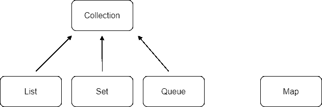
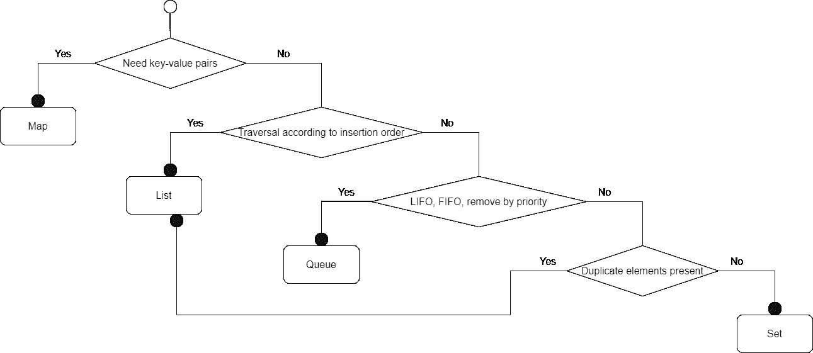

# 选择正确的 Java 集合

> 原文：<https://web.archive.org/web/20220930061024/https://www.baeldung.com/java-choose-list-set-queue-map>

## 1.介绍

在本教程中，我们将讨论如何在 Java 库中选择合适的集合接口和类。我们在讨论中跳过遗留集合，例如 [`Vector`](/web/20221129122644/https://www.baeldung.com/java-arraylist-vs-vector "Vector link") `, [Stack](/web/20221129122644/https://www.baeldung.com/java-stack "Stack link"), and [Hashtable](/web/20221129122644/https://www.baeldung.com/java-hash-table "Hashtable link")`，因为我们需要避免使用它们来支持新集合。并发集合值得单独讨论，所以我们也不讨论它们。

## 2.Java 库中的集合接口

在尝试有效地使用它们之前，了解 Java 库中集合接口和类的组织是非常有用的。`[Collection](https://web.archive.org/web/20221129122644/https://docs.oracle.com/javase/8/docs/api/java/util/Collection.html) `接口是所有集合接口的根。 [`List`](https://web.archive.org/web/20221129122644/https://docs.oracle.com/javase/8/docs/api/java/util/List.html) 、`[Set](https://web.archive.org/web/20221129122644/https://docs.oracle.com/javase/8/docs/api/java/util/Set.html),`和 [`Queue`](https://web.archive.org/web/20221129122644/https://docs.oracle.com/javase/8/docs/api/java/util/Queue.html) 接口扩展了 `Collection.`

Java 库中的映射不被视为常规集合，因此 [`Map`](https://web.archive.org/web/20221129122644/https://docs.oracle.com/javase/8/docs/api/java/util/Map.html) 接口不扩展`Collection.`下面是 Java 库中的接口关系图:

任何具体的集合实现(集合类)都是从其中一个集合接口派生的。集合类的语义是由其接口定义的，因为具体的集合为其父接口定义的操作提供了特定的实现。因此，在选择合适的集合类之前，我们需要选择合适的集合接口。

## 3.选择正确的收集接口

选择正确的收集接口有些简单。事实上，下图显示了逻辑接口选择流程:

总而言之，当元素的插入顺序很重要并且存在重复元素时，我们使用列表。当元素被视为一组对象，没有重复，插入顺序无关紧要时，使用集合。

当需要通过优先级语义进行`LIFO`、`FIFO`或移除时，使用队列，最后，当需要键和值的关联时，使用映射。

## 4.选择正确的集合实现

下面我们可以找到集合类的比较表，这些集合类由它们实现的接口分开。这些比较是基于常见操作及其性能进行的。具体来说，使用 [`Big-O`](/web/20221129122644/https://www.baeldung.com/java-algorithm-complexity) 符号来估计运算的性能。关于 Java 集合中操作持续时间的更实用的指南可以在集合操作的[基准中找到。](/web/20221129122644/https://www.baeldung.com/java-collections-complexity)

### 4.1.列表

先来一个列表对照表。列表的常见操作包括添加和删除元素、通过索引访问元素、遍历元素以及查找元素:

| 列表比较表 | 在开头添加/删除元素 | 添加/删除中间的元素 | 最后添加/删除元素 | 获取第 I 个元素(随机访问) | 查找单元 | 遍历顺序 |
| `[ArrayList](/web/20221129122644/https://www.baeldung.com/java-arraylist)` | `O(n)` | `O(n)` | `O(1)` | `O(1)` | `O(n)`，`O(log(n))`如果排序 | 插入时 |
| [T2`LinkedList`](/web/20221129122644/https://www.baeldung.com/java-linkedlist) | `O(1)` | `O(1)` | `O(1)` | `O(n)` | `O(n)` | 插入时 |

我们可以看到，`ArrayList`擅长最后添加和删除元素，以及对元素的随机访问。相反，它不擅长在任意位置添加和删除元素。同时，`LinkedList`擅长在任意位置添加和删除元素。然而，它不支持真正的`O(1)`随机访问。因此，关于列表，默认选择是`ArrayList`，直到我们需要在任何位置快速添加和移除元素。

### 4.2.设置

对于集合，我们感兴趣的是添加和删除元素、遍历元素以及查找元素:

| 设置比较表 | 添加元素 | 移除元素 | 查找单元 | 遍历顺序 |
| [T2`HashSet`](/web/20221129122644/https://www.baeldung.com/java-hashset) | 摊销`O(1)` | 摊销`O(1)` | `O(1)` | 随机，由哈希函数分散 |
| [T2`LinkedHashSet`](/web/20221129122644/https://www.baeldung.com/java-linkedhashset) | 摊销`O(1)` | 摊销`O(1)` | `O(1)` | 插入时 |
| [T2`TreeSet`](/web/20221129122644/https://www.baeldung.com/java-tree-set) | `O(log(n))` | `O(log(n))` | `O(log(n))` | 根据元素比较标准排序 |
| [T2`EnumSet`](/web/20221129122644/https://www.baeldung.com/java-enumset) | `O(1)` | `O(1)` | `O(1)` | 根据枚举值的定义顺序 |

正如我们所见，默认选择是`HashSet`集合，因为它对于它支持的所有操作都非常快。此外，如果元素的插入顺序也很重要，我们使用`LinkedHashSet`。基本上，它是`HashSet`的扩展，通过在内部使用链表结构来跟踪元素的插入顺序。

如果需要对元素进行排序，并且在添加和删除元素时需要保持排序后的顺序，那么我们使用`TreeSet`。

如果集合中的元素只是单个枚举类型的枚举值，那么最明智的选择是`EnumSet`。

### 4.3.行列

队列可以分为两组:

1.  `LinkedList`、[、`ArrayDeque`、](/web/20221129122644/https://www.baeldung.com/java-array-deque)–[、`Queue`、](/web/20221129122644/https://www.baeldung.com/java-queue)接口实现可以充当堆栈、队列和出列的数据结构。一般来说，`ArrayDeque`比`LinkedList`快。因此这是默认的选择
2.  `[PriorityQueue](https://web.archive.org/web/20221129122644/https://docs.oracle.com/en/java/javase/11/docs/api/java.base/java/util/PriorityQueue.html) – Queue `二进制堆数据结构支持的接口实现。用于快速(`O(1)`)元素检索，具有最高优先级。在`O(log(n))`时间内的添加和删除工作

### 4.4.地图

与集合类似，我们考虑添加和删除元素、遍历元素以及为地图寻找元素的操作:

| 地图对照表 | 添加元素 | 移除元素 | 查找单元 | 遍历顺序 |
| [T2`HashMap`](/web/20221129122644/https://www.baeldung.com/java-hashmap) | 摊销`O(1)` | 摊销`O(1)` | `O(1)` | 随机，由哈希函数分散 |
| [T2`LinkedHashMap`](/web/20221129122644/https://www.baeldung.com/java-linked-hashmap) | 摊销`O(1)` | 摊销`O(1)` | `O(1)` | 插入时 |
| [T2`TreeMap`](/web/20221129122644/https://www.baeldung.com/java-treemap) | `O(log(n))` | `O(log(n))` | `O(log(n))` | 根据元素比较标准排序 |
| [T2`EnumMap`](/web/20221129122644/https://www.baeldung.com/java-enum-map) | `O(1)` | `O(1)` | `O(1)` | 根据枚举值的定义顺序 |

映射的选择逻辑类似于集合的选择逻辑:默认情况下我们使用`HashMap`,如果插入顺序很重要的话使用`LinkedHashMap`,排序使用`TreeMap`,键属于特定枚举类型的值时使用`EnumMap`。

最后，`Map`接口有两个实现，有非常具体的应用: [`IdentityHashMap`](/web/20221129122644/https://www.baeldung.com/java-identityhashmap) 和 [`WeakHashMap`](/web/20221129122644/https://www.baeldung.com/java-weakhashmap) 。

## 5.具体集合选择图

我们可以扩展图表，选择合适的集合接口来选择具体的集合实现:

## 6.结论

在本文中，我们介绍了 Java 库中的集合接口和集合类。此外，我们还提出了选择正确接口和实现的方法。