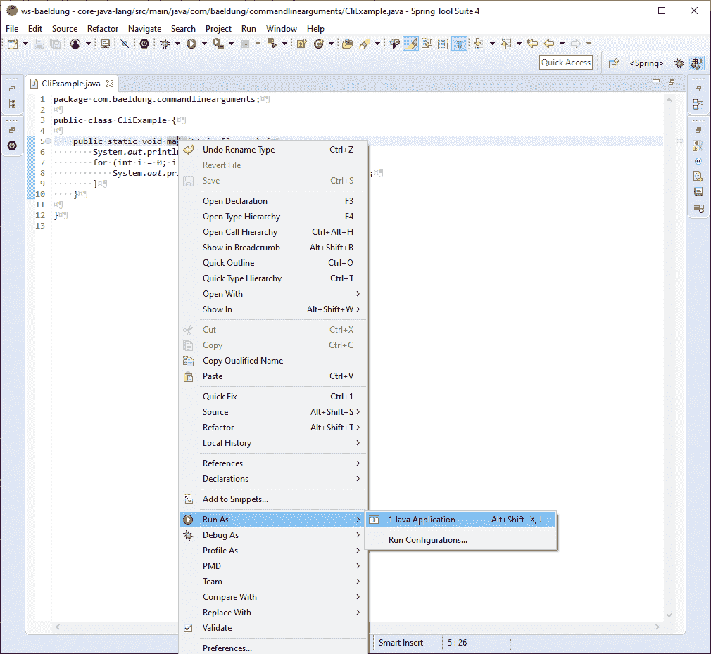
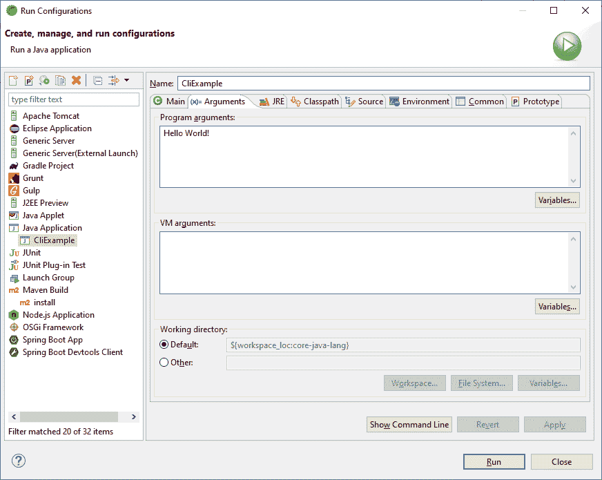
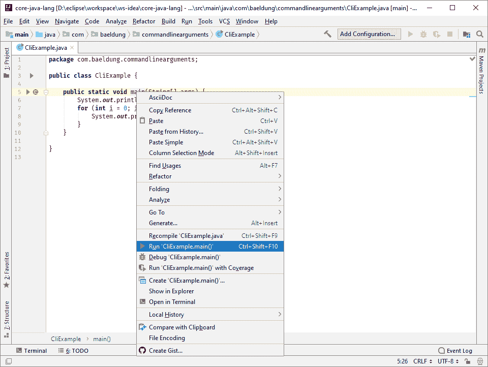
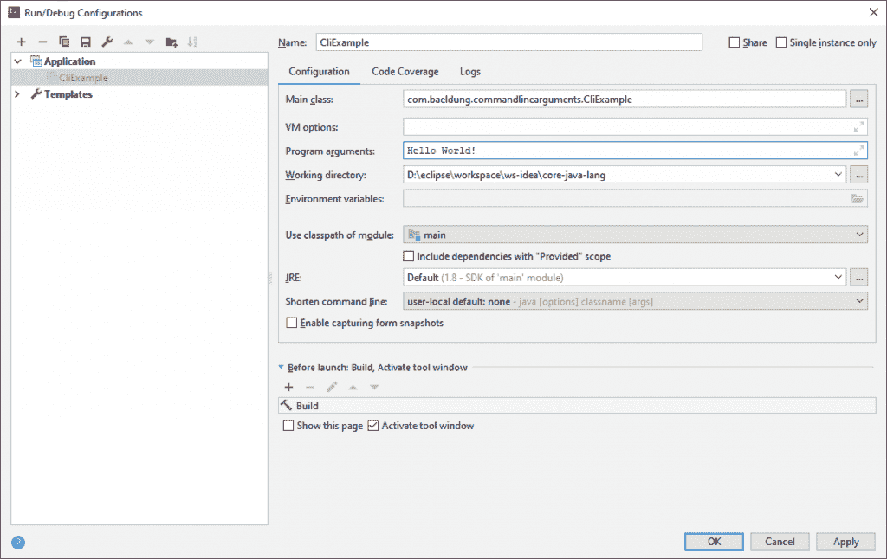
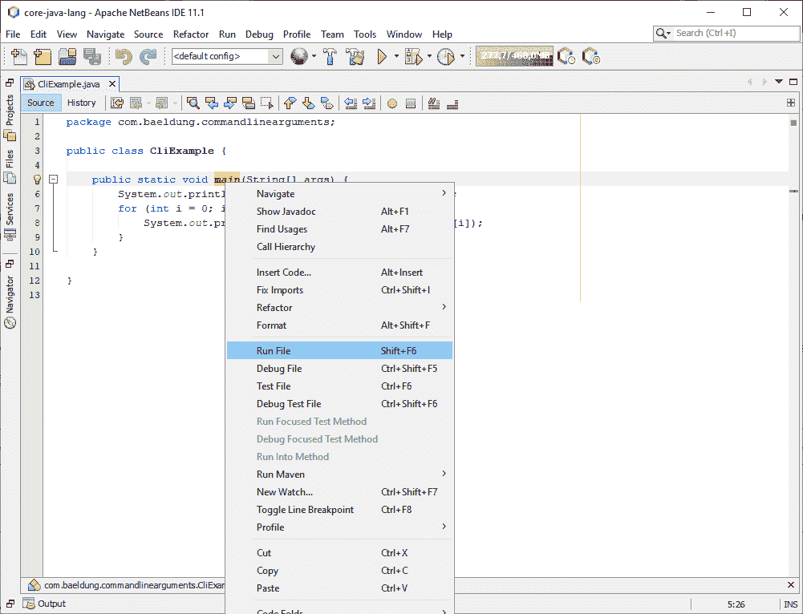
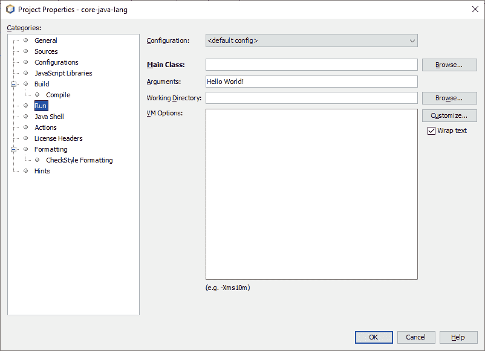

# Java 中的命令行参数

> 原文：<https://web.archive.org/web/20220930061024/https://www.baeldung.com/java-command-line-arguments>

## 1.介绍

使用参数从命令行运行应用程序是很常见的。尤其是在服务器端。通常，我们不希望应用程序每次运行都做同样的事情:我们希望以某种方式配置它的行为。

在这个简短的教程中，我们将探索如何在 Java 中处理命令行参数。

## 2.在 Java 中访问命令行参数

**因为`main`方法是 Java 应用程序的入口点，JVM 通过它的参数传递命令行参数。**

传统的方法是使用一个`String`数组:

```
public static void main(String[] args) {
    // handle arguments
}
```

但是 Java 5 引入了 varargs，这是披着羊皮的数组。因此，我们可以用一个`String`变量来定义我们的`main`:

```
public static void main(String... args) {
    // handle arguments
}
```

它们是一样的，因此选择它们完全取决于个人的品味和偏好。

**`main`方法的方法参数包含命令行参数，其顺序与我们在执行时传递的顺序相同。**如果我们想知道我们得到了多少参数，我们只需要检查数组的`length`。

例如，我们可以在标准输出中打印参数的数量及其值:

```
public static void main(String[] args) {
    System.out.println("Argument count: " + args.length);
    for (int i = 0; i < args.length; i++) {
        System.out.println("Argument " + i + ": " + args[i]);
    }
}
```

请注意，在某些语言中，第一个参数是应用程序的名称。另一方面，在 Java 中，这个数组只包含参数。

## 3.如何传递命令行参数

现在我们有了一个处理命令行参数的应用程序，我们渴望尝试一下。让我们看看我们有什么选择。

### 3.1.命令行

最明显的方法是命令行。假设我们已经用我们的`main`方法编译了类`com.baeldung.commandlinearguments.CliExample`。

然后，我们可以使用以下命令运行它:

```
java com.baeldung.commandlinearguments.CliExample
```

它产生以下输出:

```
Argument count: 0
```

现在，我们可以在类名后传递参数:

```
java com.baeldung.commandlinearguments.CliExample Hello World!
```

输出是:

```
Argument count: 2
Argument 0: Hello
Argument 1: World!
```

通常，我们将应用程序发布为 jar 文件，而不是一堆`.class`文件。比方说，我们将它打包在`cli-example.jar`中，并将`com.baeldung.commandlinearguments.CliExample`设置为主类。

现在，我们可以按如下方式不带参数地运行它:

```
java -jar cli-example.jar
```

或带参数:

```
java -jar cli-example.jar Hello World!
Argument count: 2 
Argument 0: Hello 
Argument 1: World!
```

注意， **Java 会将我们在类名或 jar 文件名后传递的每个参数视为我们的应用程序**的参数。因此，我们在此之前传递的所有内容都是 JVM 本身的参数。

### 3.2.黯然失色

当我们开发应用程序时，我们需要检查它是否按照我们想要的方式工作。

在 Eclipse 中，我们可以借助运行配置来运行应用程序。例如，运行配置定义了使用哪个 JVM、入口点是什么、类路径等等。当然，我们可以指定命令行参数。

创建适当运行配置的最简单方法是右键单击我们的`main`方法，然后从上下文菜单中选择`Run As > Java Application`:

[](/web/20221123134136/https://www.baeldung.com/wp-content/uploads/2019/09/eclipse-run.png)

有了这个，我们就可以立即运行我们的应用程序，其设置符合我们的项目设置。

为了提供参数，我们应该编辑运行配置。我们可以通过`Run > Run Configurations…`菜单选项来完成。在这里，我们应该单击`Arguments`选项卡并填写`Program arguments`文本框:

[](/web/20221123134136/https://www.baeldung.com/wp-content/uploads/2019/09/eclipse-configure.png)

点击`Run`将运行应用程序并传递我们刚刚输入的参数。

### 3.3\. IntelliJ

IntelliJ 使用类似的过程来运行应用程序。它将这些选项简单地称为配置。

首先，我们需要右击`main`方法，然后选择`Run ‘CliExample.main()':`

[](/web/20221123134136/https://www.baeldung.com/wp-content/uploads/2019/09/intellij-run.png)

这将运行我们的程序，但也会将其添加到`Run`列表中，以便进一步配置。

因此，要配置参数，我们应该选择`Run > Edit Configurations…`并编辑`Program arguments`文本框:

[](/web/20221123134136/https://www.baeldung.com/wp-content/uploads/2019/09/intellij-configure-1024x646.png)

之后，我们应该点击 OK 并重新运行我们的应用程序，例如使用工具栏中的 run 按钮。

### 3.4.NetBeans

NetBeans 也符合其运行和配置流程。

我们应该首先通过右击`main`方法并选择`Run File:`来运行我们的应用程序

[](/web/20221123134136/https://www.baeldung.com/wp-content/uploads/2019/09/netbeans-run.png)

像前面一样，这将创建一个运行配置并运行程序。

接下来，我们必须在运行配置中配置参数。我们可以通过选择`Run > Set Project Configuration > Customize…` 来完成，然后我们应该在左边选择`Run`并填写`Arguments`文本字段:

[](/web/20221123134136/https://www.baeldung.com/wp-content/uploads/2019/09/netbeans-configure.png)

之后，我们应该点击 OK 并启动应用程序。

## 4.第三方库

在简单的场景中，手动处理命令行参数非常简单。然而，随着我们的需求变得越来越复杂，我们的代码也越来越复杂。因此，如果我们想要创建一个具有多个命令行选项的应用程序，使用第三方库会更容易。

幸运的是，有很多支持大多数用例的库。两个流行的例子是 [Picocli](/web/20221123134136/https://www.baeldung.com/java-picocli-create-command-line-program) 和 [Spring Shell](/web/20221123134136/https://www.baeldung.com/spring-shell-cli) 。

## 5.结论

让应用程序的行为可配置总是一个好主意。在本文中，我们看到了如何使用命令行参数来实现这一点。此外，我们还讨论了传递这些参数的各种方法。

像往常一样，这些例子可以在 GitHub 的[上找到。](https://web.archive.org/web/20221123134136/https://github.com/eugenp/tutorials/tree/master/core-java-modules/core-java-lang-2)