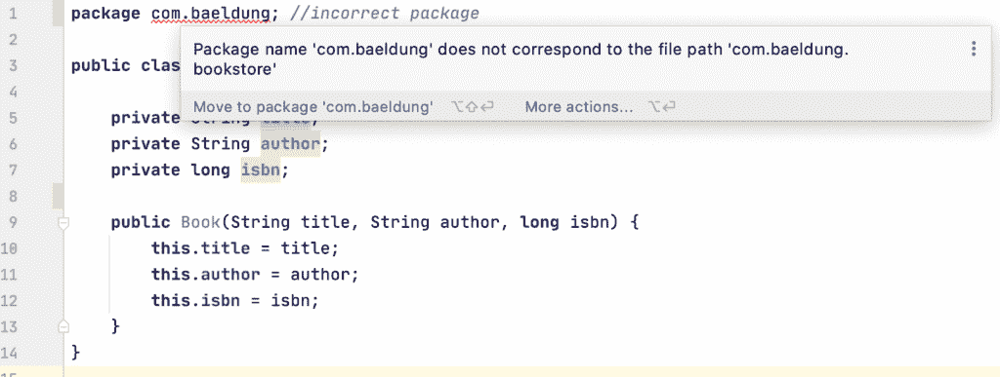
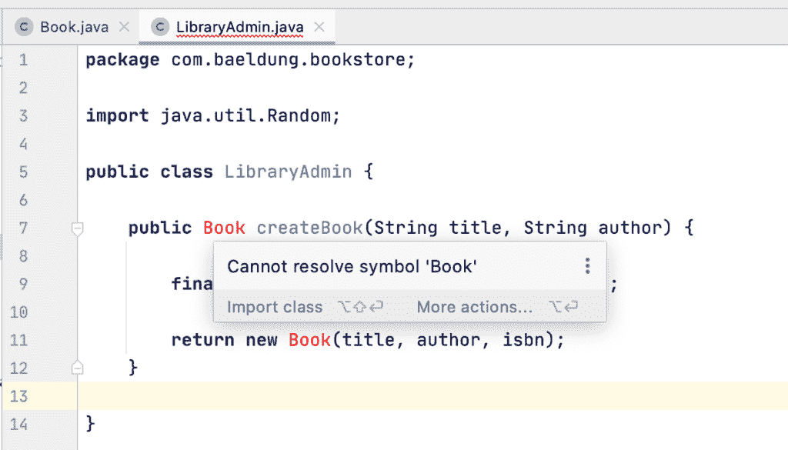

# 修复“声明的包与预期的包不匹配”错误

> 原文：<https://web.archive.org/web/20220930061024/https://www.baeldung.com/java-declared-expected-package-error>

## 1.概观

在本文中，我们将研究 java 项目中的“`Declared package does not match the expected package`”错误。

我们通常希望将 java 文件放在与[包结构](/web/20220529024805/https://www.baeldung.com/java-packages)匹配的文件夹中。该错误最常见的原因是当我们的 IDE 遇到包声明和 java 文件的物理位置不匹配时。

在这个简短的教程中，我们将看看这个错误的一个例子，它是如何在 IDEs 和 Maven 中出现的，以及如何解决它。我们还将看看其他一些技巧和窍门。

## 2.错误示例

假设我们在`src/main/java/com/baeldung/bookstore`目录中有下面的类:

```java
package com.baeldung;

public class Book {
    // fields and methods
}
```

我们预计这会导致 IDE 出错，因为包名暗示了路径`src/main/java/com/baeldung`。

## 3.解决问题

解决这个问题通常相当简单。

### 3.1.更正包声明

首先，让我们确保包声明和相对源文件路径匹配。如果已经是这种情况，我们可以尝试关闭并重新打开项目。有时，IDE 可能与磁盘上的项目不同步，需要重新导入文件、解决依赖关系并成功重新编译。

否则，我们可以用以下反向 DNS 格式更正包声明:

```java
package com.baeldung.bookstore;
```

### 3.2.更正源代码的物理位置

可能的情况是，包声明正确，而 java 文件被错误地放在了错误的目录中。

然后，我们将把`Book` 类移动到以下正确的目录位置:

```java
<source-path>/com/baeldung/bookstore
```

## 4.问题的症状

根据我们选择的 IDE，错误消息可能会有所不同。同样，我们可能会在 maven 中看到错误。

### 4.1.Eclipse 中的错误

在 Eclipse 中，我们会看到这样一个错误:

[](/web/20220529024805/https://www.baeldung.com/wp-content/uploads/2021/09/1.Screenshot-2021-08-05-at-12.02.28-AM-1024x279-1.png)

### 4.2.IntelliJ 中的错误

在 [IntelliJ](/web/20220529024805/https://www.baeldung.com/intellij-basics) 中，我们会得到类似的错误消息:

[](/web/20220529024805/https://www.baeldung.com/wp-content/uploads/2021/09/2.Screenshot-2021-08-03-at-11.36.51-PM-1-1024x387-1.png)

### 4.3.Maven 中的错误

同样，当[运行 maven 构建](/web/20220529024805/https://www.baeldung.com/maven)时，我们会得到下面的错误:

```java
[ERROR] COMPILATION ERROR : 
[INFO] -------------------------------------------------------------
[ERROR] /Users/saichakr2/baeldung-projects/tutorials/core-java-modules/core-java-lang-4/src/main/java/com/baeldung/bookstore/Book.java:[3,8] duplicate class: com.baeldung.Book
[ERROR] /Users/saichakr2/baeldung-projects/tutorials/core-java-modules/core-java-lang-4/src/main/java/com/baeldung/bookstore/LibraryAdmin.java:[7,12] cannot access com.baeldung.bookstore.Book
  bad source file: /Users/saichakr2/baeldung-projects/tutorials/core-java-modules/core-java-lang-4/src/main/java/com/baeldung/bookstore/Book.java
    file does not contain class com.baeldung.bookstore.Book
    Please remove or make sure it appears in the correct subdirectory of the sourcepath
```

然而，我们应该注意到，使用独立的`javac`命令可以很好地编译`Book`类。这是因为**Java 编译器不要求包声明路径和相对源路径匹配**。

## 5.相关代码中的错误

我们可能没有发现受影响的类文件本身的问题。它可能出现在具有同伴依赖性的类中:

[](/web/20220529024805/https://www.baeldung.com/wp-content/uploads/2021/09/3.Screenshot-2021-08-04-at-10.46.04-AM-1024x585-1.png)

不出所料，上面的类无法解析 `Book ` 类  ，因为 `Book` 类未能编译到预期的包中。

## 6.其他提示和技巧

虽然当文件位于错误的路径时，这是一个简单的修复方法，但我们仍然可能会遇到源文件位于源代码树中正确位置的困难。

### 6.1.验证构建路径

我们需要验证 IDE 中的构建路径没有错误。默认源路径被称为`<project-name>/src/main/java`和`<project-name>/src/test/java`。构建路径应该有正确的依赖项和库。

### 6.2.附加源路径

有时，需要添加一个源文件夹来让 maven 编译这些类文件。但是不建议这样做，因为预定义的源文件夹在大多数情况下已经足够了。

然而，我们可以在需要的时候使用*构建-助手-maven-插件:*来[添加额外的源代码](/web/20220529024805/https://www.baeldung.com/maven-project-multiple-src-directories)

```java
<plugin>
    <groupId>org.codehaus.mojo</groupId>
    <artifactId>build-helper-maven-plugin</artifactId>
    <version>3.0.0</version>
    <executions>
        <execution>
            <phase>generate-sources</phase>
            <goals>
                <goal>add-source</goal>
            </goals>
            <configuration>
                <sources>
                    <source>src/main/<another-src></source>
                </sources>
            </configuration>
        </execution>
    </executions>
</plugin>
```

## 7.结论

在本文中，我们已经了解了包声明和 java 文件的相应目录之间的不匹配如何导致 ide 中的错误。我们还探索了解决这个问题的几种方法。

与往常一样，GitHub 上的[提供了示例的完整源代码。](https://web.archive.org/web/20220529024805/https://github.com/eugenp/tutorials/tree/master/core-java-modules/core-java-lang-4)