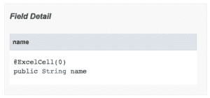

# Java 内置注释概述

> 原文：<https://web.archive.org/web/20220930061024/https://www.baeldung.com/java-default-annotations>

## 1.**概述**

在本文中，我们将讨论 Java 语言的一个核心特性——JDK 中可用的默认注释。

## 2。什么是注释

简单地说，注释是前面带有“@”符号的 **Java 类型。**

从 1.5 版本开始，Java 就有了注释。从那以后，它们塑造了我们设计应用的方式。

Spring 和 Hibernate 是非常依赖注释来支持各种设计技术的框架的典型例子。

基本上，**一个注释将额外的元数据分配给它绑定到**的源代码。通过向方法、接口、类或字段添加注释，我们可以:

1.  通知编译器警告和错误
2.  在编译时操作源代码
3.  修改或检查运行时的行为

## 3。Java 内置注释

既然我们已经回顾了基础知识，让我们来看看 core Java 附带的一些注释。首先，有几个通知编译:

1.  `@Override`
2.  `@SuppressWarnings`
3.  `@Deprecated`
4.  `@SafeVarargs`
5.  `@FunctionalInterface`
6.  `@Native`

这些注释生成或抑制编译器警告和错误。一致地应用它们通常是一个好的实践，因为添加它们可以防止将来程序员出错。

**[`@Override`](/web/20220625164214/https://www.baeldung.com/java-override)** 注释用于表示一个方法覆盖或替换一个继承方法的行为。

**[`@SuppressWarnings`](/web/20220625164214/https://www.baeldung.com/java-suppresswarnings)** 表示我们想要忽略来自某部分代码的某些警告。 **[`@SafeVarargs`](/web/20220625164214/https://www.baeldung.com/java-safevarargs)** 注释也作用于一种与使用 varargs 相关的警告。

**[`@Deprecated`](/web/20220625164214/https://www.baeldung.com/java-deprecated)** 注释可用于将 API 标记为不再使用。此外，这个注释已经在 [Java 9](/web/20220625164214/https://www.baeldung.com/java-deprecated#optional-attributes) 中进行了改进，以表示关于弃用的更多信息。

对于所有这些，您可以在链接的文章中找到更详细的信息。

### 3.1。`@FunctionalInterface`

Java 8 允许我们以一种更加函数化的方式编写代码。

[单一抽象方法接口](/web/20220625164214/https://www.baeldung.com/java-8-functional-interfaces)是其中很大的一部分。**如果我们打算让 lambdas 使用一个 SAM 接口，我们可以选择用`@FunctionalInterface`** 标记它:

```java
@FunctionalInterface
public interface Adder {
    int add(int a, int b);
}
```

就像`@Override`用方法一样，`@FunctionalInterface` 用`Adder`声明我们的意图。

现在，不管我们是否使用`@FunctionalInterface` ，我们仍然可以以同样的方式使用`Adder` :

```java
Adder adder = (a,b) -> a + b;
int result = adder.add(4,5);
```

但是，如果我们给`Adder,` 添加第二个方法，那么编译器会抱怨:

```java
@FunctionalInterface
public interface Adder { 
    // compiler complains that the interface is not a SAM

    int add(int a, int b);
    int div(int a, int b);
}
```

现在，如果没有`@FunctionalInterface` 注释，它就会被编译。那么，它给了我们什么？

像`@Override`一样，这个注释保护我们免受未来程序员的错误。**尽管在一个接口上拥有多个方法是合法的，但是当这个接口被用作 lambda 目标时就不合法了。**如果没有这个注释，编译器会在几十个使用`Adder` 作为 lambda 的地方出错。现在，**它正好在 `Adder` 自己身上爆发。**

### 3.2.`@Native`

从 Java 8 开始，`java.lang.annotation `包中有一个新的注释叫做`[Native](https://web.archive.org/web/20220625164214/https://docs.oracle.com/en/java/javase/11/docs/api/java.base/java/lang/annotation/Native.html). ``@Native `注释只适用于字段。**表示注释字段是一个常量，可以从本机代码**中引用。例如，下面是它在`Integer `类中的用法:

```java
public final class Integer {
    @Native public static final int MIN_VALUE = 0x80000000;
    // omitted
}
```

这个注释也可以作为工具生成一些辅助头文件的提示。

## 4。元注释

接下来，元注释是可以应用于其他注释的注释。

例如，这些元注释用于注释配置:

1.  `@Target`
2.  `@Retention`
3.  `@Inherited`
4.  `@Documented`
5.  `@Repeatable`

### 4.1。`@Target`

注释的范围可以根据需求而变化。虽然一个注释只与方法一起使用，但另一个注释可以与构造函数和字段声明一起使用。

**为了确定定制注释的目标元素，我们需要用`@Target`注释来标记它。**

`@Target`可以与 [12 种不同的元素类型](https://web.archive.org/web/20220625164214/https://docs.oracle.com/en/java/javase/15/docs/api/java.base/java/lang/annotation/ElementType.html)一起工作。如果我们看一下`@SafeVarargs`的源代码，那么我们可以看到它必须只附加到构造函数或方法上:

```java
@Documented
@Retention(RetentionPolicy.RUNTIME)
@Target({ElementType.CONSTRUCTOR, ElementType.METHOD})
public @interface SafeVarargs {
}
```

### 4.2。`@Retention`

一些注释是用来作为编译器的提示，而另一些是在运行时使用的。

**我们使用`@Retention`注释来说明我们的注释在程序生命周期中的什么地方适用**。

为此，我们需要为`@Retention`配置三种保留策略之一:

1.  对编译器和运行时都不可见
2.  `RetentionPolicy.CLASS`–编译器可见
3.  `RetentionPolicy.RUNTIME –` 对编译器和运行时可见

**如果注释声明中没有`@Retention` 注释，那么[保留策略默认为`RetentionPolicy.CLASS`](https://web.archive.org/web/20220625164214/https://docs.oracle.com/en/java/javase/15/docs/api/java.base/java/lang/annotation/Retention.html) 。**

如果我们有一个应该在运行时可访问的注释:

```java
@Retention(RetentionPolicy.RUNTIME)
@Target(TYPE)
public @interface RetentionAnnotation {
}
```

然后，如果我们给一个类添加一些注释:

```java
@RetentionAnnotation
@Generated("Available only on source code")
public class AnnotatedClass {
}
```

现在我们可以反思一下`AnnotatedClass`，看看保留了多少注释:

```java
@Test
public void whenAnnotationRetentionPolicyRuntime_shouldAccess() {
    AnnotatedClass anAnnotatedClass = new AnnotatedClass();
    Annotation[] annotations = anAnnotatedClass.getClass().getAnnotations();
    assertThat(annotations.length, is(1));
}
```

**值为 1，因为** **`@RetentionAnnotation`具有`RUNTIME` 的保留策略，而`[@Generated](https://web.archive.org/web/20220625164214/https://docs.oracle.com/en/java/javase/15/docs/api/java.compiler/javax/annotation/processing/Generated.html) `没有。**

### 4.3。`@Inherited`

在某些情况下，我们可能需要一个子类来将注释绑定到父类。

**我们可以使用`@Inherited` 注释让我们的注释从一个被注释的类传播到它的子类。**

如果我们将`@Inherited` 应用于我们的自定义注释，然后将它应用于`BaseClass`:

```java
@Inherited
@Target(ElementType.TYPE)
@Retention(RetentionPolicy.RUNTIME)
public @interface InheritedAnnotation {
}

@InheritedAnnotation
public class BaseClass {
}

public class DerivedClass extends BaseClass {
}
```

然后，在扩展了基类之后，我们应该看到`DerivedClass` 在运行时似乎有相同的注释:

```java
@Test
public void whenAnnotationInherited_thenShouldExist() {
    DerivedClass derivedClass = new DerivedClass();
    InheritedAnnotation annotation = derivedClass.getClass()
      .getAnnotation(InheritedAnnotation.class);

    assertThat(annotation, instanceOf(InheritedAnnotation.class));
}
```

**如果没有`@Inherited`注释，上面的测试将会失败。**

### 4.4。`@Documented`

默认情况下，Java 不会记录注释在 Javadocs 中的用法。

**但是，我们可以使用`@Documented` 注释来改变 Java 的默认行为**。

如果我们创建一个使用`@Documented`的定制注释:

```java
@Documented
@Target(ElementType.FIELD)
@Retention(RetentionPolicy.RUNTIME)
public @interface ExcelCell {
    int value();
}
```

并将它应用到适当的 Java 元素:

```java
public class Employee {
    @ExcelCell(0)
    public String name;
}
```

然后，`Employee` Javadoc 将揭示注释的用法:



### 4.5。`@Repeatable`

有时，在给定的 Java 元素上多次指定相同的注释会很有用。

在 Java 7 之前，我们必须将注释组合到一个容器注释中:

```java
@Schedules({
    @Schedule(time = "15:05"),
    @Schedule(time = "23:00")
})
void scheduledAlarm() {
}
```

然而，Java 7 带来了更干净的方法。**用****`@Repeatable`****标注，我们可以使标注可重复**:

```java
@Repeatable(Schedules.class)
public @interface Schedule {
    String time() default "09:00";
}
```

要使用`@Repeatable`，我们也需要一个容器注释`.` 在这种情况下，我们将重用`@Schedules`:

```java
public @interface Schedules {
    Schedule[] value();
}
```

当然，这看起来很像 Java 7 之前的样子。但是，现在的价值是，当我们需要重复`@Schedule`时，不再指定包装器`@Schedules`:

```java
@Schedule
@Schedule(time = "15:05")
@Schedule(time = "23:00")
void scheduledAlarm() {
}
```

因为 Java 需要包装器注释，所以我们很容易从 Java 7 以前的注释列表迁移到可重复的注释。

## 5。结论

在本文中，我们讨论了每个 Java 开发人员都应该熟悉的 Java 内置注释。

和往常一样，这篇文章的所有例子都可以在 GitHub 上找到[。](https://web.archive.org/web/20220625164214/https://github.com/eugenp/tutorials/tree/master/core-java-modules/core-java-annotations)