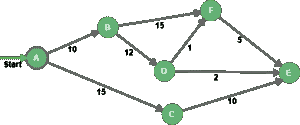
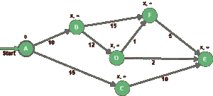
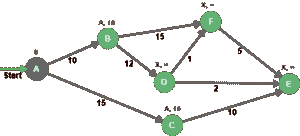
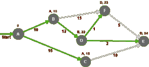

# Java 中的 Dijkstra 最短路径算法

> 原文：<https://web.archive.org/web/20220930061024/https://www.baeldung.com/java-dijkstra>

## 1。概述

本文的重点是最短路径问题(SPP)，这是图论中已知的基本理论问题之一，以及如何使用 Dijkstra 算法来解决它。

该算法的基本目标是确定起始节点和图的其余部分之间的最短路径。

## 2。Dijkstra 的最短路径问题

给定一个正的[加权图](/web/20221005224814/https://www.baeldung.com/cs/weighted-vs-unweighted-graphs)和一个起始节点(A)，Dijkstra 确定图中从源到所有目的地的最短路径和距离:

[](/web/20221005224814/https://www.baeldung.com/wp-content/uploads/2017/01/initial-graph.png)

Dijkstra 算法的核心思想是不断消除起始节点和所有可能目的地之间的较长路径。

为了跟踪这个过程，我们需要两组不同的节点，固定的和未固定的。

已确定的节点是那些与源有已知最小距离的节点。不稳定节点集收集了我们可以从源到达的节点，但是我们不知道从开始节点的最小距离。

以下是用 Dijkstra 解决 SPP 的步骤列表:

*   将`startNode`的距离设置为零。
*   将所有其他距离设置为无穷大值。
*   我们将`startNode`添加到未解决的节点集中。
*   当未结算节点集不为空时，我们:
    *   从未确定的节点集中选择一个评估节点，该评估节点应该是与源距离最小的节点。
    *   通过在每次评估时保持最低距离来计算到直接邻居的新距离。
    *   将尚未结算的邻居添加到未结算节点集中。

这些步骤可以归纳为两个阶段，初始化和评估。让我们看看这如何应用于我们的示例图:

### 2.1。初始化

在我们开始探索图中的所有路径之前，我们首先需要初始化所有具有无限距离和未知前任的节点，除了源节点。

作为初始化过程的一部分，我们需要将值 0 赋给节点 A(我们知道从节点 A 到节点 A 的距离显然是 0)

因此，图的其余部分中的每个节点将用一个前任和一个距离来区分:

[](/web/20221005224814/https://www.baeldung.com/wp-content/uploads/2017/01/step1.png)

为了完成初始化过程，我们需要将节点 A 添加到未处理的节点中，并将其设置为在评估步骤中首先被选取。请记住，已结算的节点集仍然是空的。

### 2.2。评估

既然我们已经初始化了我们的图，我们从未解决的集合中挑选具有最低距离的节点，然后我们评估不在已解决的节点中的所有相邻节点:

[](/web/20221005224814/https://www.baeldung.com/wp-content/uploads/2017/01/step2.png)

想法是将边权重添加到评估节点距离，然后将其与目的地的距离进行比较。例如，对于节点 B，0+10 小于无穷大，因此节点 B 的新距离是 10，新的前任是 A，这同样适用于节点 c

然后，节点 A 从未稳定节点集移动到稳定节点集。

节点 B 和 C 被添加到未解决的节点中，因为它们可以被到达，但是它们需要被评估。

既然我们在未确定的集合中有两个节点，我们选择具有最低距离的一个(节点 B)，然后我们重复直到我们确定了图中的所有节点:

[](/web/20221005224814/https://www.baeldung.com/wp-content/uploads/2017/01/step8.png)

下表总结了评估步骤中执行的迭代:

| 循环 | 不稳定的 | 稳定的 | 评估节点 | A | B | C | D | E | F |
| one | A | – | A | Zero | A-10 | A-15 | X-∞ | X-∞ | X-∞ |
| Two | 乙，丙 | A | B | Zero | A-10 | A-15 | B-22 | X-∞ | B-25 |
| three | c、F、D | 甲，乙 | C | Zero | A-10 | A-15 | B-22 | C-25 | B-25 |
| four | d、E、F | 甲、乙、丙 | D | Zero | A-10 | A-15 | B-22 | D-24 | D-23 |
| five | 英、法 | 甲、乙、丙、丁 | F | Zero | A-10 | A-15 | B-22 | D-24 | D-23 |
| six | E | 甲、乙、丙、丁、己 | E | Zero | A-10 | A-15 | B-22 | D-24 | D-23 |
| **决赛** | **–** | **全部** | **无** | **0** | **A-10** | **A-15** | **B-22** | D-24 | D-23 |

例如，符号 B-22 表示节点 B 是直接的前趋节点，与节点 a 的总距离为 22。

最后，我们可以计算出从节点 A 开始的最短路径如下:

*   节点 B:A –> B(总距离= 10)
*   节点 C:A –> C(总距离= 15)
*   节点 D:A –> B –> D(总距离= 22)
*   节点 E:A –> B –> D –> E(总距离= 24)
*   节点 F:A –> B –> D –> F(总距离= 23)

## 3。Java 实现

在这个简单的实现中，我们将图表示为一组节点:

```java
public class Graph {

    private Set<Node> nodes = new HashSet<>();

    public void addNode(Node nodeA) {
        nodes.add(nodeA);
    }

    // getters and setters 
}
```

一个节点可以用一个`name`、一个参照`shortestPath`的`LinkedList`、一个来自源的`distance` 和一个名为`adjacentNodes`的邻接表来描述:

```java
public class Node {

    private String name;

    private List<Node> shortestPath = new LinkedList<>();

    private Integer distance = Integer.MAX_VALUE;

    Map<Node, Integer> adjacentNodes = new HashMap<>();

    public void addDestination(Node destination, int distance) {
        adjacentNodes.put(destination, distance);
    }

    public Node(String name) {
        this.name = name;
    }

    // getters and setters
}
```

`adjacentNodes`属性用于将近邻与边长相关联。这是邻接表的简化实现，比邻接矩阵更适合 Dijkstra 算法。

至于`shortestPath`属性，它是一个节点列表，描述了从起始节点开始计算的最短路径。

默认情况下，所有节点距离都用`Integer.MAX_VALUE`初始化，以模拟无限距离，如初始化步骤中所述。

现在，让我们实现 Dijkstra 算法:

```java
public static Graph calculateShortestPathFromSource(Graph graph, Node source) {
    source.setDistance(0);

    Set<Node> settledNodes = new HashSet<>();
    Set<Node> unsettledNodes = new HashSet<>();

    unsettledNodes.add(source);

    while (unsettledNodes.size() != 0) {
        Node currentNode = getLowestDistanceNode(unsettledNodes);
        unsettledNodes.remove(currentNode);
        for (Entry < Node, Integer> adjacencyPair: 
          currentNode.getAdjacentNodes().entrySet()) {
            Node adjacentNode = adjacencyPair.getKey();
            Integer edgeWeight = adjacencyPair.getValue();
            if (!settledNodes.contains(adjacentNode)) {
                calculateMinimumDistance(adjacentNode, edgeWeight, currentNode);
                unsettledNodes.add(adjacentNode);
            }
        }
        settledNodes.add(currentNode);
    }
    return graph;
}
```

`getLowestDistanceNode()`方法从未解决的节点集合中返回距离最小的节点，而`calculateMinimumDistance()`方法在遵循新探索的路径时将实际距离与新计算的距离进行比较:

```java
private static Node getLowestDistanceNode(Set < Node > unsettledNodes) {
    Node lowestDistanceNode = null;
    int lowestDistance = Integer.MAX_VALUE;
    for (Node node: unsettledNodes) {
        int nodeDistance = node.getDistance();
        if (nodeDistance < lowestDistance) {
            lowestDistance = nodeDistance;
            lowestDistanceNode = node;
        }
    }
    return lowestDistanceNode;
}
```

```java
private static void CalculateMinimumDistance(Node evaluationNode,
  Integer edgeWeigh, Node sourceNode) {
    Integer sourceDistance = sourceNode.getDistance();
    if (sourceDistance + edgeWeigh < evaluationNode.getDistance()) {
        evaluationNode.setDistance(sourceDistance + edgeWeigh);
        LinkedList<Node> shortestPath = new LinkedList<>(sourceNode.getShortestPath());
        shortestPath.add(sourceNode);
        evaluationNode.setShortestPath(shortestPath);
    }
}
```

现在，所有必要的部分都已就绪，让我们将 Dijkstra 算法应用于作为本文主题的示例图:

```java
Node nodeA = new Node("A");
Node nodeB = new Node("B");
Node nodeC = new Node("C");
Node nodeD = new Node("D"); 
Node nodeE = new Node("E");
Node nodeF = new Node("F");

nodeA.addDestination(nodeB, 10);
nodeA.addDestination(nodeC, 15);

nodeB.addDestination(nodeD, 12);
nodeB.addDestination(nodeF, 15);

nodeC.addDestination(nodeE, 10);

nodeD.addDestination(nodeE, 2);
nodeD.addDestination(nodeF, 1);

nodeF.addDestination(nodeE, 5);

Graph graph = new Graph();

graph.addNode(nodeA);
graph.addNode(nodeB);
graph.addNode(nodeC);
graph.addNode(nodeD);
graph.addNode(nodeE);
graph.addNode(nodeF);

graph = Dijkstra.calculateShortestPathFromSource(graph, nodeA); 
```

计算之后，为图中的每个节点设置了`shortestPath`和`distance`属性，我们可以遍历它们来验证结果是否与上一节中的结果完全匹配。

## 4。结论

在本文中，我们看到了 Dijkstra 算法如何解决 SPP，以及如何用 Java 实现它。

这个简单项目的实现可以在下面的 [GitHub 项目链接](https://web.archive.org/web/20221005224814/https://github.com/eugenp/tutorials/tree/master/algorithms-modules/algorithms-miscellaneous-2)中找到。