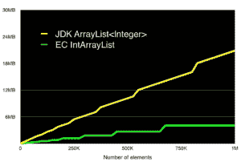

# Eclipse 集合中的原始集合

> 原文：<https://web.archive.org/web/20220930061024/https://www.baeldung.com/java-eclipse-primitive-collections>

## 1.介绍

在本教程中，我们将讨论 Java 中的原语集合，以及 [Eclipse 集合](/web/20220626210131/https://www.baeldung.com/eclipse-collections)如何提供帮助。

## 2.动机

假设我们想要创建一个简单的整数列表:

```java
List<Integer> myList = new ArrayList<>; 
int one = 1; 
myList.add(one);
```

因为集合只能保存对象引用，所以在后台，`one`被转换成流程中的`Integer` 。**当然，装箱和拆箱都不是免费的。结果，在这个过程中有一个[性能](/web/20220626210131/https://www.baeldung.com/java-list-primitive-performance)损失。**

因此，首先，使用 Eclipse 集合中的原始集合可以提高我们的速度。

其次，它减少了内存占用。下图比较了 Eclipse 集合中传统的`ArrayList`和`IntArrayList`的内存使用情况:

[](/web/20220626210131/https://www.baeldung.com/wp-content/uploads/2019/09/ints.png)

`*Image extracted from https://www.eclipse.org/collections/#concept`

当然，我们不要忘记，各种各样的实现是 Eclipse 集合的一大卖点。

还要注意，到目前为止，Java 还不支持基本集合。然而，**项目瓦尔哈拉通过 [JEP 218](https://web.archive.org/web/20220626210131/https://openjdk.java.net/jeps/218) 旨在增加它。**

## 3.属国

我们将使用 [Maven](https://web.archive.org/web/20220626210131/https://search.maven.org/search?q=g:org.eclipse.collections) 来包含所需的依赖项:

```java
<dependency>
    <groupId>org.eclipse.collections</groupId>
    <artifactId>eclipse-collections-api</artifactId>
    <version>10.0.0</version>
</dependency>

<dependency>
    <groupId>org.eclipse.collections</groupId>
    <artifactId>eclipse-collections</artifactId>
    <version>10.0.0</version>
</dependency>
```

## 4.*长*列表

Eclipse Collections 为所有的[原语](/web/20220626210131/https://www.baeldung.com/java-primitives)类型提供了内存优化的列表、集合、堆栈、地图和包。我们来看几个例子。

首先，让我们来看看一系列的`long`:

```java
@Test
public void whenListOfLongHasOneTwoThree_thenSumIsSix() {
    MutableLongList longList = LongLists.mutable.of(1L, 2L, 3L);
    assertEquals(6, longList.sum());
}
```

## 5. *int* 列表

同样，我们可以创建一个不可变的`int`列表:

```java
@Test
public void whenListOfIntHasOneTwoThree_thenMaxIsThree() {
    ImmutableIntList intList = IntLists.immutable.of(1, 2, 3);
    assertEquals(3, intList.max());
}
```

## 6.地图

除了`Map`接口方法，Eclipse 集合为每个原语配对提供了新的接口方法:

```java
@Test
public void testOperationsOnIntIntMap() {
    MutableIntIntMap map = new IntIntHashMap();
    assertEquals(5, map.addToValue(0, 5));
    assertEquals(5, map.get(0));
    assertEquals(3, map.getIfAbsentPut(1, 3));
}
```

## 7.从`Iterable`到原始集合

此外，Eclipse Collections 与`Iterable`一起工作:

```java
@Test
public void whenConvertFromIterableToPrimitive_thenValuesAreEqual() {
    Iterable<Integer> iterable = Interval.oneTo(3);
    MutableIntSet intSet = IntSets.mutable.withAll(iterable);
    IntInterval intInterval = IntInterval.oneTo(3);
    assertEquals(intInterval.toSet(), intSet);
}
```

此外，我们可以从`Iterable:`创建一个原始地图

```java
@Test
public void whenCreateMapFromStream_thenValuesMustMatch() {
    Iterable<Integer> integers = Interval.oneTo(3);
    MutableIntIntMap map = 
      IntIntMaps.mutable.from(
        integers,
        key -> key,
        value -> value * value);
    MutableIntIntMap expected = IntIntMaps.mutable.empty()
      .withKeyValue(1, 1)
      .withKeyValue(2, 4)
      .withKeyValue(3, 9);
    assertEquals(expected, map);
}
```

## 8.`Streams`论原语

因为 Java 已经有了原始流，并且 Eclipse 集合与它们很好地集成在一起:

```java
@Test
public void whenCreateDoubleStream_thenAverageIsThree() {
    DoubleStream doubleStream = DoubleLists
      .mutable.with(1.0, 2.0, 3.0, 4.0, 5.0)
      .primitiveStream();
    assertEquals(3, doubleStream.average().getAsDouble(), 0.001);
}
```

## 9.结论

总之，本教程展示了 Eclipse 集合中的原始集合。我们展示了使用它的理由，并展示了如何轻松地将它添加到我们的应用程序中。

与往常一样，GitHub 上的[代码是可用的。](https://web.archive.org/web/20220626210131/https://github.com/eugenp/tutorials/tree/master/libraries-primitive)