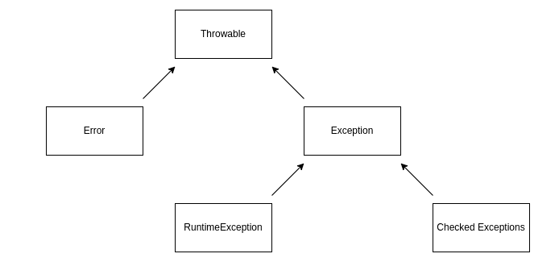

# Java 中的错误和异常

> 原文：<https://web.archive.org/web/20220930061024/https://www.baeldung.com/java-errors-vs-exceptions>

## 1.概观

在本教程中，我们将学习 Java 错误和异常以及它们的区别。

## 2.`Throwable`类

**`[Error](https://web.archive.org/web/20221205141901/https://docs.oracle.com/javase/7/docs/api/java/lang/Error.html) ``[Exception](https://web.archive.org/web/20221205141901/https://docs.oracle.com/javase/7/docs/api/java/lang/Exception.html) `都是`[Throwable](https://web.archive.org/web/20221205141901/https://docs.oracle.com/javase/7/docs/api/java/lang/Throwable.html) `类的子类，用来表示发生了异常情况**。此外，只有`Throwable`及其子类的实例可以被 Java 虚拟机抛出或者被`catch `子句捕获。

创建了`Error`和`Exception`的实例来包含关于情况的信息(例如，堆栈跟踪):

[](/web/20221205141901/https://www.baeldung.com/wp-content/uploads/2022/12/Throwable.png)

## 3.`Error`

错误表示不应该发生的异常情况。当出现严重问题时，抛出错误。**此外，错误被视为未检查的异常，应用程序不应该试图捕捉和处理它们**。此外，错误发生在运行时，并且无法恢复。

现在让我们看一个例子:

```java
public class ErrorExample {

    public static void main(String[] args) {
        overflow();
    }

    public static void overflow() {
        System.out.println("overflow...");
        overflow();
    }

}
```

如果我们运行上面的代码，我们会得到以下结果:

```java
overflow...
overflow...
overflow...
overflow...
...
Exception in thread "main" java.lang.StackOverflowError
  at sun.nio.cs.UTF_8$Encoder.encodeLoop(UTF_8.java:691)
  at java.nio.charset.CharsetEncoder.encode(CharsetEncoder.java:579)
  ...
  at com.baeldung.exception.exceptions_vs_errors.ErrorExample.overflow(ErrorExample.java:10)
```

代码导致了一个名为 [`StackOverflowError`](https://web.archive.org/web/20221205141901/https://docs.oracle.com/javase/7/docs/api/java/lang/StackOverflowError.html) 的错误，当应用程序递归太深导致堆栈溢出时就会抛出这个错误。

其他 Java 错误的例子还有[`AssertionError`](https://web.archive.org/web/20221205141901/https://docs.oracle.com/javase/7/docs/api/java/lang/AssertionError.html)[`LinkageError`](https://web.archive.org/web/20221205141901/https://docs.oracle.com/javase/7/docs/api/java/lang/LinkageError.html)[`IOError`](https://web.archive.org/web/20221205141901/https://docs.oracle.com/javase/7/docs/api/java/io/IOError.html)[`VirtualMachineError`](https://web.archive.org/web/20221205141901/https://docs.oracle.com/javase/7/docs/api/java/lang/VirtualMachineError.html)。

## 4.`Exception`

**异常是应用程序可能想要捕捉和处理的异常情况**。异常可以使用`try-catch block`来恢复，并且可以在运行时和编译时发生。

用于[异常处理](/web/20221205141901/https://www.baeldung.com/java-exceptions)的一些技术有`try-catch`块、`throws`关键字和`try-with-resources`块。

异常分为两类:运行时异常和检查异常。

### 4.1.运行时异常

`[RuntimeException](https://web.archive.org/web/20221205141901/https://docs.oracle.com/javase/7/docs/api/java/lang/RuntimeException.html) `及其子类是 Java 虚拟机运行时可以抛出的异常。此外，它们是未检查的异常。如果未检查的异常可以在方法执行后抛出并传播到方法范围之外，则不需要使用`throws`关键字在方法签名中声明它们。

让我们看一个例子:

```java
public class RuntimeExceptionExample {
    public static void main(String[] args) {
        int[] arr = new int[20];

        arr[20] = 20;

        System.out.println(arr[20]);
    }
}
```

运行上述代码后，我们得到以下结果:

```java
Exception in thread "main" java.lang.ArrayIndexOutOfBoundsException: 20
  at com.baeldung.exception.exceptions_vs_errors.RuntimeExceptionExample.main(RuntimeExceptionExample.java:7)
```

正如我们所见，我们得到了一个 [`ArrayIndexOutOfBoundsException`](https://web.archive.org/web/20221205141901/https://docs.oracle.com/javase/7/docs/api/java/lang/ArrayIndexOutOfBoundsException.html) ，它是`[IndexOutOfBoundsException](https://web.archive.org/web/20221205141901/https://docs.oracle.com/javase/7/docs/api/java/lang/IndexOutOfBoundsException.html), `的子类，而`[IndexOutOfBoundsException](https://web.archive.org/web/20221205141901/https://docs.oracle.com/javase/7/docs/api/java/lang/IndexOutOfBoundsException.html), `本身又是`RuntimeException`的子类。

`RuntimeException`的其他子类还包括[`IllegalArgumentException`](https://web.archive.org/web/20221205141901/https://docs.oracle.com/javase/7/docs/api/java/lang/IllegalArgumentException.html "class in java.lang")[`NullPointerException`](https://web.archive.org/web/20221205141901/https://docs.oracle.com/javase/7/docs/api/java/lang/NullPointerException.html)[`ArithmeticException`](https://web.archive.org/web/20221205141901/https://docs.oracle.com/javase/7/docs/api/java/lang/ArithmeticException.html)。

### 4.2.检查异常

不是`RuntimeException`子类的其他异常是检查异常。如果一旦方法被执行并且传播到方法范围之外，它们就可以被抛出，那么需要在方法签名中使用`throws`关键字来声明它们:

```java
public class CheckedExceptionExcample {
    public static void main(String[] args) {
        try (FileInputStream fis = new FileInputStream(new File("test.txt"))) {
            fis.read();
        } catch (IOException e) {
            e.printStackTrace();
        }
    }
}
```

如果我们运行上面的代码，我们会得到以下结果:

```java
java.io.FileNotFoundException: test.txt (No such file or directory)
  at java.io.FileInputStream.open0(Native Method)
  at java.io.FileInputStream.open(FileInputStream.java:195)
  at java.io.FileInputStream.<init>(FileInputStream.java:138)
  at com.baeldung.exception.exceptions_vs_errors.CheckedExceptionExcample.main(CheckedExceptionExcample.java:9)
```

我们得到了一个 [`FileNotFoundException`](https://web.archive.org/web/20221205141901/https://docs.oracle.com/javase/7/docs/api/java/io/FileNotFoundException.html) ，它是 [`IOException`](https://web.archive.org/web/20221205141901/https://docs.oracle.com/javase/7/docs/api/java/io/IOException.html) 的子类，它是`Exception`的子类。

[`TimeoutException`](https://web.archive.org/web/20221205141901/https://docs.oracle.com/javase/7/docs/api/java/util/concurrent/TimeoutException.html) 和 [`SQLException`](https://web.archive.org/web/20221205141901/https://docs.oracle.com/javase/7/docs/api/java/sql/SQLException.html) 是检查异常的其他例子。

## 5.结论

在本文中，我们了解了 Java 生态系统中错误和异常的区别。

和往常一样，完整的代码样本可以在 GitHub 的[上找到。](https://web.archive.org/web/20221205141901/https://github.com/eugenp/tutorials/tree/master/core-java-modules/core-java-exceptions-4)