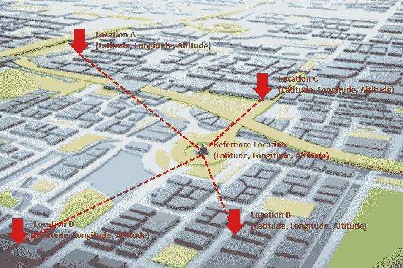
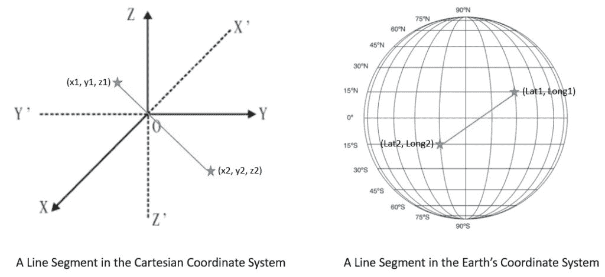
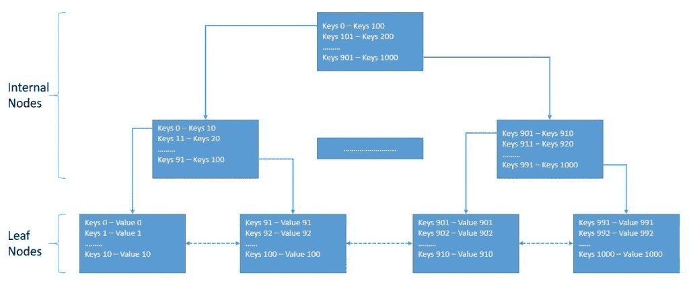

# 基于 Java 的地理空间应用架构

> 原文：<https://web.archive.org/web/20220930061024/https://www.baeldung.com/java-geospatial-applications>

## 1.介绍

在本文中，我们将了解地理空间应用程序的核心架构和重要元素。我们将从理解什么是地理空间应用程序以及构建地理空间应用程序的典型挑战开始。

地理空间应用程序的一个重要方面是在直观的地图上表示有用的数据。但是，在本文中，我们将主要关注在后端处理地理空间数据，以及当今行业中可用的选项。

## 2.什么是地理空间应用？

让我们从理解地理空间应用程序的含义开始。这些基本上是利用地理空间数据来提供核心功能的应用程序。

简而言之，地理空间数据是表示地点、位置、地图、导航等的任何数据。即使没有任何花哨的定义，我们还是被这些应用程序包围着。例如，我们最喜欢的拼车应用程序、送餐应用程序和电影预订应用程序都是地理空间应用程序。

地理空间数据基本上是描述位于地球表面上或附近的物体、事件或其他特征的信息。例如，考虑一个应用程序，它可以向我们建议今天晚上播放我们最喜欢的莎士比亚戏剧的最近的剧院。这可以通过将剧院的位置信息与戏剧的属性信息和事件的时间信息相结合来实现。

地理空间数据还有几个其他有用的应用，为我们提供日常价值——例如，当我们试图在一天中的任何时间找到一辆愿意带我们去目的地的出租车时。或者当我们等不及重要的货物到达时，谢天谢地，我们可以找到它在运输途中的确切位置。

事实上，这已经成为我们目前经常使用的几个应用程序的基本要求。

## 3.地理空间技术

在我们理解构建地理空间应用程序的细微差别之前，让我们先来了解一些支持此类应用程序的核心技术。这些是帮助我们以有用的形式生成、处理和呈现地理空间数据的底层技术。

**遥感(RS)是通过在一定距离测量一个区域的反射和发射辐射来检测和监测该区域的物理特征的过程**。通常这是通过遥感卫星完成的。它在测量、智能以及商业应用领域具有重要的用途。

**全球定位系统(GPS)是指基于在中地球轨道(MEO)飞行的 24 颗卫星**网络的卫星导航系统。它可以向地球上任何地方的合适的接收器提供地理位置和时间信息，在那里它具有到四个或更多 GPS 卫星的畅通无阻的视线。

**地理信息系统(GIS)是一个创建、管理、分析和绘制所有类型数据的系统**。例如，它有助于我们将位置数据与更具描述性的信息(如该位置存在的信息)相结合。它有助于改善几个行业的沟通和决策。

## 4.构建地理空间应用程序的挑战

为了理解在构建地理空间应用程序时我们应该做出什么样的设计选择，了解所涉及的挑战是很重要的。通常，**地理空间应用需要对大量地理空间数据进行实时分析**。例如，对于第一反应者来说，找到到达最近发生自然灾害的地方的最快替代路线是至关重要的。

因此，基本上，地理空间应用程序的基本要求之一是**存储大量地理空间数据，并以非常低的延迟促进任意查询**。现在，理解空间数据的本质以及为什么它需要特殊处理也很重要。基本上，空间数据表示在几何空间中定义的对象。

假设我们在一个城市周围有几个感兴趣的地点。位置通常由其纬度、经度和(可能)海拔来描述:

[](/web/20220625081306/https://www.baeldung.com/wp-content/uploads/2021/07/Geospatial-Application-Locations.jpg)

现在，我们真正感兴趣的是找到给定位置的邻近位置。所以，我们需要计算从这个位置到所有可能位置的距离。这种查询与我们熟悉的常规数据库查询非常不同。这些被称为空间查询。它们涉及几何数据类型，并考虑这些几何图形之间的空间关系。

我们已经知道，没有有效的索引，任何生产数据库都不可能生存。空间数据也是如此。然而，由于其性质，**常规索引对于空间数据和我们想要执行的空间查询类型来说不是很有效**。因此，我们需要称为空间索引的专门索引，它可以帮助我们更有效地执行空间操作。

## 5.空间数据类型和查询

既然我们已经了解了处理空间数据的挑战，那么注意几种类型的空间数据就很重要。此外，我们可以对它们执行一些有趣的查询来满足独特的需求。我们将讨论其中一些数据类型以及我们可以对它们执行的操作。

我们通常谈论相对于空间参考系统的**空间数据。这由一个坐标系和一个基准面组成。有几种坐标系，如仿射坐标系、圆柱坐标系、笛卡尔坐标系、椭球坐标系、线性坐标系、极坐标坐标系、球面坐标系和垂直坐标系。基准是一组定义坐标系原点位置、比例和方向的参数。**

一般来说，**许多支持空间数据的数据库将它们分为两类，几何和地理**:

[](/web/20220625081306/https://www.baeldung.com/wp-content/uploads/2021/07/Geospatial-Application-Coordinate-Systems.jpg)

几何在平面坐标系中存储空间数据。这有助于我们用笛卡尔空间中的坐标来表示像点、线和区域这样的形状。地理基于地球坐标系存储空间数据。这对于用纬度和经度坐标表示地球表面上的相同形状非常有用。

我们可以对空间数据进行两种基本类型的查询。这些基本上是**寻找最近的邻居或发送不同类型的范围查询**。我们已经看到了查找最近邻居的查询示例。总的想法是识别离查询点最近的一定数量的项目。

另一种重要的查询类型是范围查询。在这里，我们有兴趣知道一个查询范围内的所有项目。查询范围可以是以查询点为半径的矩形或圆形。例如，我们可以使用这种查询来识别离我们站的地方 2 英里半径范围内的所有意大利餐馆。

## 6.空间数据的数据结构

现在，我们将了解一些更适合构建空间索引的数据结构。这将有助于我们理解它们与常规索引有何不同，以及为什么它们在处理空间操作时更有效。几乎所有这些数据结构都是树数据结构的变体。

### 6.1.常规数据库索引

数据库索引基本上是一种提高数据检索操作速度的数据结构。如果没有索引，我们将不得不遍历所有的行来搜索我们感兴趣的行。但是，对于一个很大的表来说，即使遍历索引也会花费大量的时间。

然而，减少获取键的步骤和减少这样做的磁盘操作的数量是很重要的。B 树或**平衡树是一种自平衡树数据结构，在每个节点**中存储几个排序的键值对。这有助于在从磁盘的单次读取操作中，在处理器缓存中提取更大的一组键。

虽然 B 树工作得很好，但一般来说，我们使用一个[b+树来构建数据库索引](/web/20220625081306/https://www.baeldung.com/cs/b-trees-vs-btrees)。B+树与 B 树非常相似，只是它只在叶节点存储值或数据:

[](/web/20220625081306/https://www.baeldung.com/wp-content/uploads/2021/07/Database-Index-Btree.jpg)

在这里，所有的叶节点也是链接的，因此提供了对键值对的有序访问。这里的好处是叶节点提供第一级索引，而内部节点提供多级索引。

常规数据库索引侧重于在单一维度上对其键进行排序。例如，我们可以在数据库表中的一个属性上创建一个索引，比如邮政编码。这将有助于我们查询具有特定邮政编码或邮政编码范围内的所有位置。

### 6.2.空间数据库索引

在地理空间应用中，我们通常对最近邻或范围查询感兴趣。例如，我们可能希望找到某个特定点 10 英里范围内的所有位置。常规的数据库索引在这里并不十分有用。事实上，还有其他更适合构建空间索引的数据结构。

最常用的数据结构之一是 R 树。R 树由 Antonin Guttman 在 1984 年首次提出，适用于存储空间对象，如位置。R-tree 背后的基本**思想是将附近的对象分组，并在树的下一个更高层用它们的最小外接矩形**来表示它们:

[](/web/20220625081306/https://www.baeldung.com/wp-content/uploads/2021/07/Database-Index-R-tree.jpg)

对于大多数操作，R 树和 B 树没有太大的不同。关键的区别在于使用包围矩形来决定是否在子树内部搜索。为了获得更好的性能，我们应该确保矩形不会覆盖太多的空白空间，也不会重叠太多。最有趣的是，R 树可以扩展到覆盖三个甚至更多的维度！

构建空间索引的另一种数据结构是 Kd 树，这是 R 树的一个微小变化。 **Kd 树将数据空间一分为二，而不是分割成多个矩形**。因此，Kd 树中的树节点代表分离的平面，而不是边界框。虽然 Kd-tree 被证明更容易实现并且更快，但是它不适合总是变化的数据。

这些数据结构背后的关键思想基本上是将数据划分成轴对齐的区域，并将它们存储在树节点中。事实上，我们可以使用很多其他这样的数据结构，比如 BSP-tree 和 R*-tree。

## 7.具有本机支持的数据库

我们已经看到了空间数据与常规数据的不同之处，以及它们需要特殊处理的原因。因此，我们构建地理空间应用程序所需要的是一个能够支持存储空间数据类型并且能够高效执行空间查询的数据库。我们将这样的数据库管理系统称为空间数据库管理系统。

几乎所有主流数据库都开始为空间数据提供某种程度的支持。这包括一些流行的数据库管理系统，如 [MySQL](https://web.archive.org/web/20220625081306/https://www.mysql.com/) 、[微软 SQL Server](https://web.archive.org/web/20220625081306/https://www.microsoft.com/en-in/sql-server/sql-server-downloads) 、 [PostgreSQL](https://web.archive.org/web/20220625081306/https://www.postgresql.org/) 、 [Redis](https://web.archive.org/web/20220625081306/https://redis.io/) 、 [MongoDB](https://web.archive.org/web/20220625081306/https://www.mongodb.com/) 、 [Elasticsearch](https://web.archive.org/web/20220625081306/https://www.elastic.co/) 和 [Neo4J](https://web.archive.org/web/20220625081306/https://neo4j.com/) 。然而，也有一些专门构建的空间数据库可用，如 [GeoMesa](https://web.archive.org/web/20220625081306/https://www.geomesa.org/) 、 [PostGIS](https://web.archive.org/web/20220625081306/http://postgis.net/) 和 [Oracle Spatial](https://web.archive.org/web/20220625081306/https://www.oracle.com/database/spatial/) 。

### 7.1.雷迪斯

[Redis](https://web.archive.org/web/20220625081306/https://redis.io/) 是**一种内存中的数据结构存储，我们可以将其用作数据库、缓存或消息代理**。它可以最小化网络开销和延迟，因为它在内存中高效地执行操作。Redis 支持各种数据结构，如散列、集合、排序集合、列表和字符串。我们特别感兴趣的是向成员添加有序视图的排序集，按分数排序。

地理空间索引在 Redis 中使用排序集作为底层数据结构来实现。Redis 实际上**使用[geo hash 算法](https://web.archive.org/web/20220625081306/https://en.wikipedia.org/wiki/Geohash)将纬度和经度编码到有序集合**的分数中。Geo Set 是使用有序集合实现的关键数据结构，在更抽象的层次上支持 Redis 中的地理空间数据。

Redis 提供了简单的命令来处理地理空间索引，并执行常见的操作，如创建新的集合，添加或更新集合中的成员。例如，要从命令行创建一个新的集合并向其中添加成员，我们可以使用 GEOADD 命令:

```java
GEOADD locations 20.99 65.44 Vehicle-1 23.99 55.45 Vehicle-2
```

这里，我们将一些车辆的位置添加到名为“位置”的地理集合中。

Redis 还提供了几种读取索引的方法，比如 ZRANGE、ZSCAN 和 GEOPOS。此外，我们可以使用 GEODIST 命令来计算集合中成员之间的距离。但是最有趣的命令是那些允许我们按位置搜索索引的命令。例如，我们可以使用 GEORADIUSYMEMBER 命令来搜索特定成员半径范围内的成员:

```java
GEORADIUSBYMEMBER locations Vehicle-3 1000 m
```

在这里，我们感兴趣的是找到第三辆车方圆一公里内的所有其他车辆。

Redis 在支持存储大量地理空间数据和执行低延迟地理空间查询方面非常强大和简单。

### 7.2.MongoDB

[MongoDB](https://web.archive.org/web/20220625081306/https://www.mongodb.com/) 是**一个面向文档的数据库管理系统，它使用类似 JSON 的文档**和可选的模式来存储数据。它提供了几种搜索文档的方法，如字段查询、范围查询和正则表达式。我们甚至可以将文档编入一级索引和二级索引。此外，带有分片和复制的 MongoDB 提供了高可用性和水平可伸缩性。

我们可以**将空间数据存储在 MongoDB 中，或者作为 GeoJSON 对象，或者作为遗留坐标对**。GeoJSON 对象可用于存储类似地球表面的位置数据，而传统坐标对可用于存储我们可以在欧几里得平面中表示的数据。

要指定 GeoJSON 数据，我们可以使用一个嵌入式文档，其中一个名为`type`的字段用于指示 GeoJSON 对象类型，另一个名为`coordinates`的字段用于指示对象的坐标:

```java
db.vehicles.insert( {
    name: "Vehicle-1",
    location: { type: "Point", coordinates: [ 83.97, 70.77 ] }
} )
```

这里，我们在集合中添加一个名为`vehicles`的文档。嵌入的文档是一个类型为`Point`的 GeoJSON 对象，带有经度和纬度坐标。

此外，MongoDB **提供了多种地理空间索引类型，如`2dsphere`和`2d`** 来支持地理空间查询。一个`2dsphere`支持在类地球球体上计算几何图形的查询:

```java
db.vehicles.createIndex( { location : "2dsphere" } )
```

这里，我们在集合的`location`字段上创建了一个`2dsphere`索引。

最后，MongoDB **提供了几个地理空间查询操作符来帮助搜索地理空间数据**。一些操作符是`geoIntersects`、`geoWithin`、`near`和`nearSphere`。这些运算符可以解释平面或球体上的几何图形。

例如，让我们看看如何使用`near`操作符:

```java
db.places.find(
   {
     location:
       { $near:
          {
            $geometry: { type: "Point", coordinates: [ 93.96, 30.78 ] },
            $minDistance: 500,
            $maxDistance: 1000
          }
       }
   }
)
```

在这里，我们正在搜索距离提到的 GeoJSON `Point`至少 500 米、最多 1000 米的文档。

用灵活的模式表示类似 JSON 的数据的能力、伸缩效率和对地理空间数据的内在支持使 MongoDB 非常适合地理空间应用程序。

### 7.3.波斯特吉斯

[PostgreSQL](https://web.archive.org/web/20220625081306/https://www.postgresql.org/) 是**一个关系数据库管理系统，它提供 SQL 遵从性并以 ACID 事务**为特色。它在支持各种工作负载方面非常灵活。PostgreSQL 包括对同步复制的内置支持，以及对常规 B 树和哈希表索引的内置支持。 [PostGIS](https://web.archive.org/web/20220625081306/https://postgis.net/) 是 PostgreSQL 的空间数据库扩展器。

基本上， **PostGIS 增加了在 PostgreSQL** 中存储地理空间数据和在 SQL 中执行位置查询的支持。它为`Point`、`LineString`、`Polygon`等增加了几何类型。此外，它使用基于 GiST 的 R 树(广义搜索树)提供空间索引。最后，它还为地理空间测量和集合操作添加了空间运算符。

我们可以像往常一样[在 PostgreSQL](https://web.archive.org/web/20220625081306/https://postgis.net/workshops/postgis-intro/creating_db.html) 中创建一个数据库，并启用 PostGIS 扩展来开始使用它。基本上，数据存储在行和列中，但 PostGIS 引入了一个几何列，其中包含由空间参考标识符(SRID)定义的特定坐标系中的数据。PostGIS 还增加了许多加载不同 GIS 数据格式的选项。

PostGIS **支持几何和地理数据类型**。我们可以使用常规的 SQL 查询来创建一个表并插入一个地理数据类型:

```java
CREATE TABLE vehicles (name VARCHAR, geom GEOGRAPHY(Point));
INSERT INTO vehicles VALUES ('Vehicle-1', 'POINT(44.34 82.96)');
```

这里，我们创建了一个新的表“vehicles ”,并使用`Point`几何图形添加了特定车辆的位置。

PostGIS 添加了相当多的空间功能来对数据执行空间操作。例如，我们可以使用空间函数`ST_AsText`将几何数据作为文本读取:

```java
SELECT name, ST_AsText(geom) FROM vehicles;
```

当然，对我们来说，更有用的查询是查找给定点附近的所有车辆:

```java
SELECT geom FROM vehicles 
  WHERE ST_Distance( geom, 'SRID=4326;POINT(43.32 68.35)' ) < 1000
```

在这里，我们搜索所提供的点的一公里半径内的所有车辆。

PostGIS 向 PostgreSQL 添加了空间功能，允许我们利用众所周知的空间数据 SQL 语义。此外，我们可以受益于使用 PostgreSQL 的所有优势。

## 8.行业标准和规范

虽然我们已经看到数据库层对空间数据的支持在增长，但是应用层呢？为了构建地理空间应用程序，我们需要编写能够高效处理空间数据的代码。

此外，我们需要标准和规范来表示空间数据并在不同的组件之间进行传输。此外，语言绑定可以支持我们用 Java 这样的语言构建地理空间应用程序。

在这一节中，我们将介绍地理空间应用领域的一些标准化，他们已经制定的标准，以及可供我们使用的库。

### 8.1.标准化工作

这一领域已经有了很大的发展，通过多个组织的协作，已经建立了一些标准和最佳实践。让我们先来看看一些为不同行业的地理空间应用程序的进步和标准化做出贡献的组织。

**[【ESRI】](https://web.archive.org/web/20220625081306/https://www.esri.com/en-us/home)**环境系统研究所也许是历史最悠久、规模最大的地理信息系统(GIS)软件和地理数据库管理应用程序的国际供应商之一。他们**开发了一套名为 ArcGIS 的 GIS 软件，目标是桌面、服务器和移动等多种平台**。它还建立并推广了矢量和栅格数据类型的数据格式，例如 Shapefile、文件地理数据库、Esri 格网和镶嵌。

**[【OGC】](https://web.archive.org/web/20220625081306/https://www.ogc.org/)**开放地理空间联盟是一个由 300 多家公司、政府机构和大学组成的国际行业联盟，他们参与了一个共识过程，以开发公开可用的接口规范。这些**规范使得复杂的空间信息和服务能够被各种应用程序访问和使用**。目前，OGC 标准由 30 多个标准组成，包括空间参考系统标识符(SRID)、地理标记语言(GML)和简单要素 SQL (SFS)。

[**【OS geo】**](https://web.archive.org/web/20220625081306/https://www.osgeo.org/)开源地理空间基金会(OSGeo)是一个非营利、非政府组织，支持和促进开放地理空间技术和数据的协作开发。它促进地理空间规范，如切片地图服务(TMS)。此外，它还**帮助开发几个地理空间库，如 GeoTools 和 PostGIS** 。它也适用于像 QGIS 这样的应用程序，这是一个用于数据查看、编辑和分析的桌面 GIS。这些只是 OSGeo 在其保护伞下推动的几个项目。

### 8.2.地理空间标准:OGC GeoAPI

[GeoAPI](https://web.archive.org/web/20220625081306/http://www.geoapi.org/) 实现标准通过 GeoAPI 库**定义了一个 Java 语言 API，包括一组类型和方法，我们可以使用**来操作地理信息。地理信息的底层结构应遵循国际标准化组织(ISO)技术委员会 211 和 OGC 采用的规范。

GeoAPI 提供了与实现无关的 Java 接口。在我们实际使用 GeoAPI 之前，我们必须**从第三方实现列表中选择**。我们可以使用 GeoAPI 执行一些地理空间操作。例如，我们可以从 EPSG 电码得到一个坐标参考系统。然后，我们可以在一对坐标系之间执行类似地图投影的坐标操作:

```java
CoordinateReferenceSystem sourceCRS = 
  crsFactory.createCoordinateReferenceSystem("EPSG:4326");  // WGS 84
CoordinateReferenceSystem targetCRS = 
  crsFactory.createCoordinateReferenceSystem("EPSG:3395");  // WGS 84 / World Mercator
CoordinateOperation operation = opFactory.createOperation(sourceCRS, targetCRS);
double[] sourcePt = new double[] {
  27 + (59 + 17.0 / 60) / 60,         // 27°59'17"N
  86 + (55 + 31.0 / 60) / 60          // 86°55'31"E
};
double[] targetPt = new double[2];
operation.getMathTransform().transform(sourcePt, 0, targetPt, 0, 1);
```

这里，我们使用 GeoAPI 执行地图投影来转换单个 CRS 点。

有几个第三方实现的 GeoAPI 可作为现有库的包装器使用，例如 NetCDF 包装器、Proj.6 包装器和 GDAL 包装器。

### 8.3.地理空间库:OSGeo 地理工具

GeoTools 是一个 OSGeo 项目，**提供了一个开源的 Java 库来处理地理空间数据**。GeoTools 数据结构基本上基于 OGC 规范。它定义了关键空间概念和数据结构的接口。它还附带了一个支持特性访问的数据访问 API、一个无状态的低内存渲染，以及一个使用 XML schema 绑定到 GML 内容的解析技术。

要在地理工具中创建地理空间数据，我们需要定义一个要素类型。最简单的方法是使用类`SimpleFeatureType`:

```java
SimpleFeatureTypeBuilder builder = new SimpleFeatureTypeBuilder();
builder.setName("Location");
builder.setCRS(DefaultGeographicCRS.WGS84);
builder
  .add("Location", Point.class);
  .length(15)
  .add("Name", String.class);
SimpleFeatureType VEHICLE = builder.buildFeatureType();
```

一旦我们准备好了特征类型，我们就可以用它来创建带有`SimpleFeatureBuilder`的特征:

```java
SimpleFeatureBuilder featureBuilder = new SimpleFeatureBuilder(VEHICLE);
DefaultFeatureCollection collection = new DefaultFeatureCollection();
GeometryFactory geometryFactory = JTSFactoryFinder.getGeometryFactory(null);
```

我们还实例化了存储我们的特性的集合和为位置创建一个`Point`的 GeoTools 工厂类。现在，我们可以将特定位置作为特征添加到我们的系列中:

```java
Point point = geometryFactory.createPoint(new Coordinate(13.46, 42.97));
featureBuilder.add(point);
featureBuilder.add("Vehicle-1");
collection.add(featureBuilder.buildFeature(null))
```

这只是我们可以用 GeoTools 库做的事情的皮毛。GeoTools **支持使用矢量和栅格数据类型**。它还允许我们处理像`shapefile`这样的标准格式的数据。

## 9.结论

在本教程中，我们学习了构建地理空间应用程序的基础知识。我们讨论了构建这样一个应用程序的性质和挑战。这有助于我们理解我们可以利用的不同类型的空间数据和数据结构。

此外，我们浏览了一些开源数据库，这些数据库本身支持存储空间数据、构建空间索引和执行空间操作。最后，我们还介绍了一些推动地理空间应用程序标准化工作的行业协作。