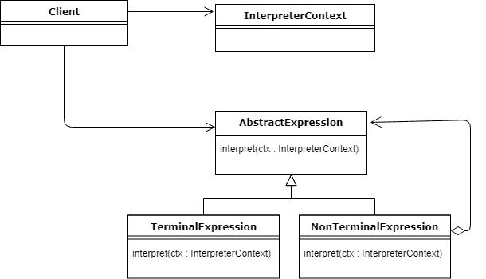

# Java 中的解释器设计模式

> 原文：<https://web.archive.org/web/20220930061024/https://www.baeldung.com/java-interpreter-pattern>

## 1.概观

在本教程中，我们将介绍一种行为 GoF 设计模式——解释器。

首先，我们将概述它的目的，并解释它试图解决的问题。

然后，我们将看看解释器的 UML 图和实际例子的实现。

## 2.解释器设计模式

简而言之，模式**以面向对象的方式定义了特定语言**的语法，可以由解释器自己评估。

记住这一点，从技术上来说，我们可以构建我们的定制正则表达式，定制 DSL 解释器，或者我们可以解析任何人类语言，构建抽象语法树，然后运行解释。

这些只是一些潜在的用例，但是如果我们想一想，我们会发现更多的用法，例如在我们的 ide 中，因为它们不断地解释我们正在编写的代码，从而为我们提供了无价的提示。

当语法相对简单时，通常应该使用解释器模式。

否则，可能会变得难以维护。

## 3.UML 图

[](/web/20221223123116/https://www.baeldung.com/wp-content/uploads/2018/07/Interpreter.png)

上图显示了两个主要实体:`Context`和`Expression`。

现在，任何语言都需要以某种方式来表达，而单词(表达)会根据给定的上下文产生某种意义。

`AbstractExpression `定义了一个抽象方法，该方法将上下文作为参数。由于这个原因，**每个表达式将影响上下文**，改变它的状态，或者继续解释或者返回结果本身。

因此，上下文将是处理的全局状态的持有者，并且它将在整个解释过程中被重用。

那么`TerminalExpression`和`NonTerminalExpression`有什么区别呢？

一个`NonTerminalExpression`可能与一个或多个其他`AbstractExpressions`相关联，因此它可以被递归解释。最后，**解释过程必须以返回结果的`a TerminalExpression`结束。**

值得注意的是，`NonTerminalExpression`是 **[的复合](/web/20221223123116/https://www.baeldung.com/java-composite-pattern)。**

最后，客户端的角色是创建或使用已经创建的**抽象语法树**，它只不过是用创建的语言定义的**句子。**

## 4.履行

为了展示这种模式，我们将以面向对象的方式构建一个简单的类似 SQL 的语法，然后对其进行解释并返回结果。

首先，我们将定义`Select, From,` 和 `Where`表达式，在客户端的类中构建一个语法树并运行解释。

`Expression`接口将有解释方法:

```java
List<String> interpret(Context ctx);
```

接下来，我们定义第一个表达式，即`Select`类:

```java
class Select implements Expression {

    private String column;
    private From from;

    // constructor

    @Override
    public List<String> interpret(Context ctx) {
        ctx.setColumn(column);
        return from.interpret(ctx);
    }
}
```

它获取要选择的列名和另一个类型为`From`的具体的`Expression`作为构造函数中的参数。

注意，在被覆盖的`interpret()`方法中，它设置上下文的状态，并将解释连同上下文一起进一步传递给另一个表达式。

这样，我们看到它是一个`NonTerminalExpression.`

另一个表达式是`From`类:

```java
class From implements Expression {

    private String table;
    private Where where;

    // constructors

    @Override
    public List<String> interpret(Context ctx) {
        ctx.setTable(table);
        if (where == null) {
            return ctx.search();
        }
        return where.interpret(ctx);
    }
}
```

现在，在 SQL 中，where 子句是可选的，因此这个类要么是一个终结表达式，要么是非终结表达式。

如果用户决定不使用 where 子句，`From`表达式将终止于`ctx.search()`调用并返回结果。否则就会被进一步解读。

`Where `表达式通过设置必要的过滤器再次修改上下文，并通过搜索调用终止解释:

```java
class Where implements Expression {

    private Predicate<String> filter;

    // constructor

    @Override
    public List<String> interpret(Context ctx) {
        ctx.setFilter(filter);
        return ctx.search();
    }
}
```

例如，`Context `类保存模拟数据库表的数据。

注意，它有三个关键字段，由`Expression`的每个子类和搜索方法修改:

```java
class Context {

    private static Map<String, List<Row>> tables = new HashMap<>();

    static {
        List<Row> list = new ArrayList<>();
        list.add(new Row("John", "Doe"));
        list.add(new Row("Jan", "Kowalski"));
        list.add(new Row("Dominic", "Doom"));

        tables.put("people", list);
    }

    private String table;
    private String column;
    private Predicate<String> whereFilter;

    // ... 

    List<String> search() {

        List<String> result = tables.entrySet()
          .stream()
          .filter(entry -> entry.getKey().equalsIgnoreCase(table))
          .flatMap(entry -> Stream.of(entry.getValue()))
          .flatMap(Collection::stream)
          .map(Row::toString)
          .flatMap(columnMapper)
          .filter(whereFilter)
          .collect(Collectors.toList());

        clear();

        return result;
    }
}
```

搜索完成后，上下文会自动清除，因此列、表和过滤器都设置为默认值。

这样每个解释都不会影响到另一个。

## 5.测试

出于测试目的，让我们看看`InterpreterDemo `类:

```java
public class InterpreterDemo {
    public static void main(String[] args) {

        Expression query = new Select("name", new From("people"));
        Context ctx = new Context();
        List<String> result = query.interpret(ctx);
        System.out.println(result);

        Expression query2 = new Select("*", new From("people"));
        List<String> result2 = query2.interpret(ctx);
        System.out.println(result2);

        Expression query3 = new Select("name", 
          new From("people", 
            new Where(name -> name.toLowerCase().startsWith("d"))));
        List<String> result3 = query3.interpret(ctx);
        System.out.println(result3);
    }
}
```

首先，我们用创建的表达式构建一个语法树，初始化上下文，然后运行解释。上下文是重用的，但是正如我们上面所展示的，它会在每次搜索调用后自我清理。

通过运行该程序，输出应该如下所示:

```java
[John, Jan, Dominic]
[John Doe, Jan Kowalski, Dominic Doom]
[Dominic]
```

## 6.下降趋势

当语法变得越来越复杂时，维护就变得越来越困难。

从给出的例子中可以看出。添加另一个表达式相当容易，比如`Limit`，但是如果我们决定用所有其他表达式来扩展它，那么维护起来就不太容易了。

## 7.结论

解释器设计模式对于相对简单的语法解释来说很棒**，不需要太多的进化和扩展。**

在上面的例子中，我们展示了在解释器模式的帮助下，以面向对象的方式构建类似 SQL 的查询是可能的。

最后，你可以在 JDK 找到这种模式的用法，特别是在`java.util.Pattern`、`java.text.Format` 或`java.text.Normalizer`中。

像往常一样，Github 项目的[上有完整的代码。](https://web.archive.org/web/20221223123116/https://github.com/eugenp/tutorials/tree/master/patterns-modules/design-patterns-behavioral)