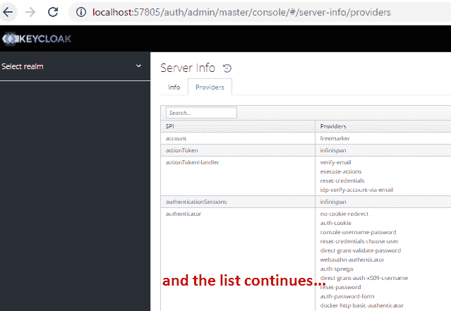
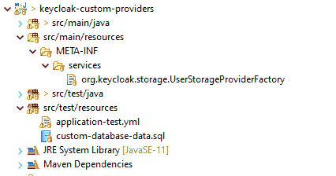
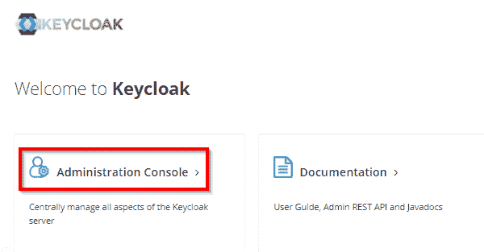
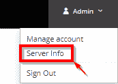
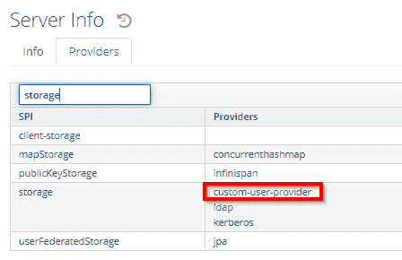
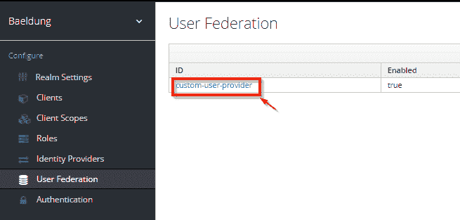

# 将自定义用户提供程序与 Keycloak 一起使用

> 原文：<https://web.archive.org/web/20220930061024/https://www.baeldung.com/java-keycloak-custom-user-providers>

## 1.介绍

在本教程中，我们将展示如何向一个流行的开源身份管理解决方案 [Keycloak](/web/20220702084456/https://www.baeldung.com/spring-boot-keycloak) 添加一个自定义提供程序，这样我们就可以将其用于现有的和/或非标准的用户存储。

## 2.带有 Keycloak 的自定义提供程序概述

Keycloak 提供了一系列现成的基于标准的集成，这些集成基于 SAML、OpenID Connect 和 [OAuth2](/web/20220702084456/https://www.baeldung.com/spring-security-oauth) 等协议。**虽然这个内置功能相当强大，但有时还不够**。一个常见的需求是将这些系统中的用户集成到 Keycloak 中，尤其是在涉及遗留系统的时候。**为了适应这种和类似的集成场景，Keycloak 支持定制提供者的概念。**

自定义提供程序在 Keycloak 的架构中起着关键作用。对于每个主要功能，比如登录流、身份验证、授权，都有一个相应的服务提供者接口。这种方法允许我们为这些服务中的任何一个插入定制的实现，然后 Keycloak 会像使用自己的服务一样使用它。

### 2.1.自定义提供程序部署和发现

**最简单的形式是，定制提供者只是一个包含一个或多个服务实现的标准 jar 文件。**在启动时，Keycloak 将扫描它的类路径，并使用标准的 [`java.util.ServiceLoader`机制](/web/20220702084456/https://www.baeldung.com/java-spi)挑选所有可用的提供者。这意味着我们所要做的就是在 jar 的`META-INF/services`文件夹中创建一个以我们想要提供的特定服务接口命名的文件，并将我们实现的完全限定名放入其中。

但是，我们能给 Keycloak 添加什么样的服务呢？如果我们转到 Keycloak 管理控制台上的`server info`页面，我们会看到很多这样的页面:

[](/web/20220702084456/https://www.baeldung.com/wp-content/uploads/2021/01/keycloak_server_info_providers-1.png)

在这张图片中，左边的列对应于一个给定的服务提供者接口(简称 SPI)，右边的列显示了该特定 SPI 的可用提供者。

### 2.2.可用 SPI

Keycloak 的主要文档列出了以下 SPI:

*   `org.keycloak.authentication.AuthenticatorFactory`:定义认证用户或客户端应用程序所需的动作和交互流
*   `org.keycloak.authentication.actiontoken.ActionTokenHandlerFactory`:允许我们创建自定义动作，当到达`**/auth/realms/master/login-actions/action-token**`端点时，Keycloak 将执行这些动作。例如，这种机制是标准密码重置流程的基础。包括在电子邮件中的链接包括这样的动作令牌
*   `org.keycloak.events.EventListenerProviderFactory`:创建一个监听 Keycloak 事件的提供程序。 [`EventType` Javadoc 页面](https://web.archive.org/web/20220702084456/https://www.keycloak.org/docs-api/11.0/javadocs/org/keycloak/events/EventType.html)包含一个提供者可以处理的可用事件定制列表。使用这个 SPI 的典型用途是创建一个审计数据库
*   `org.keycloak.adapters.saml.RoleMappingsProvider`:将从外部身份提供者接收的 SAML 角色映射到 Keycloak 的角色。这种映射非常灵活，允许我们在给定领域的上下文中重命名、删除和/或添加角色
*   `org.keycloak.storage.UserStorageProviderFactory`:允许 Keycloak 访问自定义用户存储
*   允许我们使用自定义的金库来存储特定领域的秘密。这些信息包括加密密钥、数据库凭证等。

现在，这个列表并没有涵盖所有可用的 SPI:它们只是记录最完整的，并且在实践中，最有可能需要定制。

## 3.自定义提供程序实现

正如我们在本文的介绍中提到的，我们的提供者示例将允许我们使用带有只读自定义用户存储库的 Keycloak。例如，在我们的例子中，这个用户存储库只是一个带有几个属性的常规 SQL 表:

```java
create table if not exists users(
    username varchar(64) not null primary key,
    password varchar(64) not null,
    email varchar(128),
    firstName varchar(128) not null,
    lastName varchar(128) not null,
    birthDate DATE not null
); 
```

为了支持这个定制用户存储，我们必须实现`UserStorageProviderFactory` SPI 并将其部署到现有的 Keycloak 实例中。

这里的一个关键点是只读部分。我们的意思是，用户将能够使用他们的凭证登录到 Keycloak，但不能更改自定义存储中的任何信息，包括他们的密码。然而，这不是一个 Keycloak 限制，因为它实际上支持双向更新。内置 LDAP 提供程序是支持此功能的提供程序的一个很好的例子。

### 3.1.项目设置

我们的定制提供者项目只是一个创建 jar 文件的常规 Maven 项目。为了避免我们的提供者进入常规的 Keycloak 实例的耗时的编译-部署-重启循环，我们将使用一个好的技巧:将 Keycloak 作为测试时依赖嵌入到我们的项目中。

**我们已经介绍过[如何在 SpringBoot 应用](/web/20220702084456/https://www.baeldung.com/keycloak-embedded-in-spring-boot-app)中嵌入 Keycloack，所以我们在这里就不再赘述了**。通过采用这种技术，我们将获得更快的启动时间和热重新加载能力，提供更流畅的开发人员体验。这里，我们将重用示例 SpringBoot 应用程序直接从我们的自定义提供程序运行我们的测试，因此我们将把它作为测试依赖项添加进来:

```java
<dependency>
    <groupId>org.keycloak</groupId>
    <artifactId>keycloak-core</artifactId>
    <version>12.0.2</version>
</dependency>

<dependency>
    <groupId>org.keycloak</groupId>
    <artifactId>keycloak-server-spi</artifactId>
    <version>12.0.2</version>
</dependency>

<dependency>
    <groupId>com.baeldung</groupId>
    <artifactId>oauth-authorization-server</artifactId>
    <version>0.1.0-SNAPSHOT</version>
    <scope>test</scope>
</dependency> 
```

我们对 [`keycloak-core`](https://web.archive.org/web/20220702084456/https://search.maven.org/search?q=g:org.keycloak%20AND%20a:keycloak-core) 和 [`keycloak-server-spi`](https://web.archive.org/web/20220702084456/https://search.maven.org/search?q=g:org.keycloak%20AND%20a:keycloak-server-spi) 键盘锁依赖使用的是最新的 11 系列版本。

然而，`oauth-authorization-server`依赖项必须从 [Baeldung 的 Spring Security OAuth 库](https://web.archive.org/web/20220702084456/https://github.com/Baeldung/spring-security-oauth/tree/master/oauth-rest/oauth-authorization-server)本地构建。

### 3.2.`UserStorageProviderFactory`实施

让我们通过创建`UserStorageProviderFactory`实现来启动我们的提供者，并让 Keycloak 发现它。

这个接口包含 11 个方法，但是我们只需要实现其中的两个:

*   `getId()`:返回这个提供者的唯一标识符，Keycloak 将在它的管理页面上显示这个标识符。
*   `create()`:返回实际的提供者实现。

**Keycloak 为每个事务调用`create()`方法，传递一个`KeycloakSession`和一个`ComponentModel`作为参数**。这里，事务意味着需要访问用户存储的任何操作。主要的例子是登录流:在某个时刻，Keycloak 将调用给定领域的每个已配置的用户存储来验证凭证。因此，我们应该避免在这一点上做任何昂贵的初始化动作，因为`create()`方法一直被调用。

也就是说，实现相当简单:

```java
public class CustomUserStorageProviderFactory
  implements UserStorageProviderFactory<CustomUserStorageProvider> {
    @Override
    public String getId() {
        return "custom-user-provider";
    }

    @Override
    public CustomUserStorageProvider create(KeycloakSession ksession, ComponentModel model) {
        return new CustomUserStorageProvider(ksession,model);
    }
}
```

我们选择了`“custom-user-provider”`作为我们的提供者 id，我们的`create()`实现简单地返回了我们的`UserStorageProvider `实现的一个新实例。现在，我们不能忘记创建一个服务定义文件，并将其添加到我们的项目中。这个文件应该被命名为`org.keycloak.storage.UserStorageProviderFactory`，并放在我们最后一个 jar 的`META-INF/services` 文件夹中。

由于我们使用的是标准的 Maven 项目，这意味着我们将把它添加到`src/main/resources/META-INF/services`文件夹中:

[](/web/20220702084456/https://www.baeldung.com/wp-content/uploads/2021/01/keycloak_server_info_providers-pic2.png)

该文件的内容只是 SPI 实现的全限定名称:

```java
# SPI class implementation
com.baeldung.auth.provider.user.CustomUserStorageProviderFactory
```

### 3.3.`UserStorageProvider`实施

乍一看， `UserStorageProvider`的实现并不像我们预期的那样。它只包含几个回调方法，没有一个与实际用户相关。原因是 Keycloak 希望我们的提供者也能实现其他支持特定用户管理方面的混合接口。

可用接口[的完整列表可以在 Keycloak 的文档](https://web.archive.org/web/20220702084456/https://www.keycloak.org/docs/11.0/server_development/index.html#provider-capability-interfaces)中找到，在那里它们被称为`Provider Capabilities. ` **对于一个简单的只读提供者，我们需要实现的唯一接口是`UserLookupProvider`。它只提供查找功能，这意味着 Keycloak 会在需要时自动将用户导入其内部数据库。但是，原始用户的密码不会用于身份验证。为此，我们还需要实施`CredentialInputValidator`。**

最后，一个常见的需求是能够在 Keycloak 的管理界面中显示我们的自定义存储中的现有用户。这要求我们实现另一个接口:`UserQueryProvider`。这一个添加了一些查询方法，充当我们的存储的 DAO。

因此，考虑到这些需求，我们的实现应该是这样的:

```java
public class CustomUserStorageProvider implements UserStorageProvider, 
  UserLookupProvider,
  CredentialInputValidator, 
  UserQueryProvider {

    // ... private members omitted

    public CustomUserStorageProvider(KeycloakSession ksession, ComponentModel model) {
      this.ksession = ksession;
      this.model = model;
    }

    // ... implementation methods for each supported capability
}
```

注意，我们正在保存传递给构造函数的值。稍后我们将看到它们如何在我们的实现中发挥重要作用。

### 3.4.`UserLookupProvider`实施

Keycloak 使用这个接口中的方法来恢复一个给定了`id`、用户名或电子邮件的`UserModel`实例。在这种情况下，id 是该用户的唯一标识符，格式如下:“f:'【T2]':'`external_id`

*   f:'只是一个固定的前缀，表示这是一个联邦用户
*   `unique_id`是用户的 key cloak id
*   `external_id`是给定用户存储使用的用户标识符。在我们的例子中，这将是`username`列的值

让我们继续实现这个接口的方法，从`getUserByUsername()`开始:

```java
@Override
public UserModel getUserByUsername(String username, RealmModel realm) {
    try ( Connection c = DbUtil.getConnection(this.model)) {
        PreparedStatement st = c.prepareStatement(
          "select " +
          "  username, firstName, lastName, email, birthDate " + 
          "from users " + 
          "where username = ?");
        st.setString(1, username);
        st.execute();
        ResultSet rs = st.getResultSet();
        if ( rs.next()) {
            return mapUser(realm,rs);
        }
        else {
            return null;
        }
    }
    catch(SQLException ex) {
        throw new RuntimeException("Database error:" + ex.getMessage(),ex);
    }
} 
```

正如所料，这是一个简单的数据库查询，使用提供的`username`来查找它的信息。有两个有趣的地方需要解释一下:`DbUtil.getConnection()`和`mapUser()`。

`DbUtil`是一个助手类，它从我们在构造函数中获取的`ComponentModel`中包含的信息返回一个 JDBC `Connection`。我们稍后将介绍它的细节。

**至于`mapUser()`，它的工作是将包含用户数据的数据库记录映射到一个`UserModel`实例。**一个`UserModel`代表一个用户实体，如 Keycloak 所见，并且有方法读取其属性。我们在这里实现了这个接口，它扩展了 Keycloak 提供的`AbstractUserAdapter` 类。我们还在实现中添加了一个`Builder`内部类，因此`mapUser()` 可以轻松创建`UserModel` 实例:

```java
private UserModel mapUser(RealmModel realm, ResultSet rs) throws SQLException {
    CustomUser user = new CustomUser.Builder(ksession, realm, model, rs.getString("username"))
      .email(rs.getString("email"))
      .firstName(rs.getString("firstName"))
      .lastName(rs.getString("lastName"))
      .birthDate(rs.getDate("birthDate"))
      .build();
    return user;
} 
```

类似地，其他方法基本上遵循上述相同的模式，所以我们不会详细讨论它们。请参考提供者的代码并检查所有的`getUserByXXX`和`searchForUser`方法。

### 3.5.得到一个`Connection`

现在，让我们来看看`DbUtil.getConnection()`方法:

```java
public class DbUtil {

    public static Connection getConnection(ComponentModel config) throws SQLException{
        String driverClass = config.get(CONFIG_KEY_JDBC_DRIVER);
        try {
            Class.forName(driverClass);
        }
        catch(ClassNotFoundException nfe) {
           // ... error handling omitted
        }

        return DriverManager.getConnection(
          config.get(CONFIG_KEY_JDBC_URL),
          config.get(CONFIG_KEY_DB_USERNAME),
          config.get(CONFIG_KEY_DB_PASSWORD));
    }
}
```

我们可以看到`ComponentModel` 是所有需要创建的参数所在的位置。但是，Keycloak 如何知道我们的定制提供者需要哪些参数呢？要回答这个问题，我们需要回到`CustomUserStorageProviderFactory.`

### 3.6.配置元数据

**`CustomUserStorageProviderFactory`，`UserStorageProviderFactory`的基本契约包含允许 Keycloak 查询配置属性元数据的方法，同样重要的是，验证赋值**。在我们的例子中，我们将定义一些建立 JDBC 连接所需的配置参数。因为这个元数据是静态的，我们将在构造函数中创建它，`getConfigProperties() `将简单地返回它。

```java
public class CustomUserStorageProviderFactory
  implements UserStorageProviderFactory<CustomUserStorageProvider> {
    protected final List<ProviderConfigProperty> configMetadata;

    public CustomUserStorageProviderFactory() {
        configMetadata = ProviderConfigurationBuilder.create()
          .property()
            .name(CONFIG_KEY_JDBC_DRIVER)
            .label("JDBC Driver Class")
            .type(ProviderConfigProperty.STRING_TYPE)
            .defaultValue("org.h2.Driver")
            .helpText("Fully qualified class name of the JDBC driver")
            .add()
          // ... repeat this for every property (omitted)
          .build();
    }
    // ... other methods omitted

    @Override
    public List<ProviderConfigProperty> getConfigProperties() {
        return configMetadata;
    }

    @Override
    public void validateConfiguration(KeycloakSession session, RealmModel realm, ComponentModel config)
      throws ComponentValidationException {
       try (Connection c = DbUtil.getConnection(config)) {
           c.createStatement().execute(config.get(CONFIG_KEY_VALIDATION_QUERY));
       }
       catch(Exception ex) {
           throw new ComponentValidationException("Unable to validate database connection",ex);
       }
    }
} 
```

**在`validateConfiguration()`中，当我们提供的被添加到一个领域**时，我们将得到验证参数所需的一切。在我们的例子中，我们使用这些信息建立数据库连接并执行验证查询。如果出错，我们只需抛出一个`ComponentValidationException`，通知 Keycloak 参数无效。

**此外，尽管这里没有显示，我们也可以使用`onCreated()`方法来附加逻辑，每次管理员将我们的提供者添加到领域**时，都会执行该逻辑。这允许我们执行一次初始化时逻辑来准备我们的存储以供使用，这对于某些场景可能是必要的。例如，我们可以使用这个方法来修改我们的数据库，并添加一个列来记录给定用户是否已经使用了 Keycloak。

### 3.7.`CredentialInputValidator` 实施

**该接口包含验证用户凭证的方法**。因为 Keycloak 支持不同类型的凭证(密码、OTP 令牌、X.509 证书等。)，我们的提供者必须告知它是否支持`supportsCredentialType()` `and`中的给定类型，它是在`isConfiguredFor()`中的给定领域的上下文中为它配置的。

在我们的例子中，我们只支持密码，因为它们不需要任何额外的配置，我们可以将后一种方法委托给前一种方法:

```java
@Override
public boolean supportsCredentialType(String credentialType) {
    return PasswordCredentialModel.TYPE.endsWith(credentialType);
}

@Override
public boolean isConfiguredFor(RealmModel realm, UserModel user, String credentialType) {
    return supportsCredentialType(credentialType);
} 
```

实际的密码验证发生在`isValid() `方法中:

```java
@Override
public boolean isValid(RealmModel realm, UserModel user, CredentialInput credentialInput) {
    if(!this.supportsCredentialType(credentialInput.getType())) {
        return false;
    }
    StorageId sid = new StorageId(user.getId());
    String username = sid.getExternalId();

    try (Connection c = DbUtil.getConnection(this.model)) {
        PreparedStatement st = c.prepareStatement("select password from users where username = ?");
        st.setString(1, username);
        st.execute();
        ResultSet rs = st.getResultSet();
        if ( rs.next()) {
            String pwd = rs.getString(1);
            return pwd.equals(credentialInput.getChallengeResponse());
        }
        else {
            return false;
        }
    }
    catch(SQLException ex) {
        throw new RuntimeException("Database error:" + ex.getMessage(),ex);
    }
} 
```

这里有几点值得讨论。首先，注意我们是如何使用从 Keycloak 的 id 初始化的`StorageId `对象从`UserModel, `中提取外部 id 的。**我们可以利用这个 id 具有众所周知的格式这一事实，从那里提取用户名，但是为了安全起见，最好将这些知识封装在 Keycloak 提供的类中。**

接下来，是实际的密码验证。对于我们简单的、当然非常不安全的数据库，密码检查是微不足道的:只需将数据库值与用户提供的值进行比较，就可以通过`getChallengeResponse()`获得了，然后我们就完成了。当然，真实世界的提供者可能需要更多的步骤，比如从数据库中生成基于散列的密码和 salt 值，并比较散列。

最后，用户存储通常有一些与密码相关的生命周期:最长期限、阻止和/或不活动状态等等。无论如何，当实现一个提供者时，`isValid()`方法是添加这个逻辑的地方。

### 3.8.`UserQueryProvider`实施

`UserQueryProvider`功能接口告诉 Keycloak，我们的提供商可以在其商店中搜索用户。**这很方便，因为通过支持这一功能，我们将能够在管理控制台中看到用户。**

这个接口的方法有`getUsersCount(),` 获取商店的用户总数，还有几个`getXXX()`和`searchXXX()` 方法。这个查询接口不仅支持查找用户，还支持查找组，这一点我们这次不讨论。

由于这些方法的实现非常相似，让我们只看其中的一种，`searchForUser()`:

```java
@Override
public List<UserModel> searchForUser(String search, RealmModel realm, int firstResult, int maxResults) {
    try (Connection c = DbUtil.getConnection(this.model)) {
        PreparedStatement st = c.prepareStatement(
          "select " + 
          "  username, firstName, lastName, email, birthDate " +
          "from users " + 
          "where username like ? + 
          "order by username limit ? offset ?");
        st.setString(1, search);
        st.setInt(2, maxResults);
        st.setInt(3, firstResult);
        st.execute();
        ResultSet rs = st.getResultSet();
        List<UserModel> users = new ArrayList<>();
        while(rs.next()) {
            users.add(mapUser(realm,rs));
        }
        return users;
    }
    catch(SQLException ex) {
        throw new RuntimeException("Database error:" + ex.getMessage(),ex);
    }
} 
```

正如我们所看到的，这里没有什么特别的:只是普通的 JDBC 代码。一个值得一提的实现注意事项:`UserQueryProvider`方法通常有分页和非分页两种版本。因为用户存储可能有大量记录，所以非分页版本应该简单地委托给分页版本，使用合理的默认值。更好的是，我们可以添加一个配置参数来定义什么是“合理的默认”。

## 4.测试

现在我们已经实现了我们的提供者，是时候使用嵌入式 Keycloak 实例在本地测试它了。该项目的代码包含一个实时测试类，我们用它来引导 Keycloak 和自定义用户数据库，然后在睡觉前一个小时在控制台上打印访问 URL。

使用这种设置，我们只需在浏览器中打开打印的 URL，就可以验证我们的自定义提供程序是否正常工作:

[](/web/20220702084456/https://www.baeldung.com/wp-content/uploads/2021/01/keycloak_server_info_providers-pic3.png)

为了访问管理控制台，我们将使用管理员凭证，这可以通过查看 `application-test.yml`文件来获得。登录后，让我们导航到“服务器信息”页面:

[](/web/20220702084456/https://www.baeldung.com/wp-content/uploads/2021/01/keycloak_server_info_providers-pic4.png)

在“Providers”选项卡上，我们可以看到我们的自定义提供商与其他内置存储提供商一起显示:

[](/web/20220702084456/https://www.baeldung.com/wp-content/uploads/2021/01/keycloak_server_info_providers-pic5.png)

我们还可以检查 Baeldung 领域是否已经在使用这个提供者。为此，我们可以在左上角的下拉菜单中选择它，然后导航到`User Federation`页面:

[](/web/20220702084456/https://www.baeldung.com/wp-content/uploads/2021/01/keycloak_server_info_providers-pic6-1.png)

接下来，让我们测试这个领域的实际登录。我们将使用该领域的帐户管理页面，用户可以在其中管理其数据。我们的现场测试将在进入睡眠之前打印这个 URL，所以我们可以从控制台复制它并粘贴到浏览器的地址栏中。

测试数据包含三个用户:用户 1、用户 2 和用户 3。它们的密码都是一样的:“changeit”。成功登录后，我们将看到帐户管理页面显示导入的用户数据:

[](/web/20220702084456/https://www.baeldung.com/wp-content/uploads/2021/01/keycloak_server_info_providers-pic7-1.png)

然而，如果我们试图修改任何数据，我们会得到一个错误。这是意料之中的，因为我们的提供者是只读的，所以 Keycloak 不允许修改它。目前，我们将保持原样，因为支持双向同步超出了本文的范围。

## 5.结论

在本文中，我们展示了如何为 Keycloak 创建一个定制的提供者，使用用户存储提供者作为一个具体的例子。这些例子的完整源代码可以在 GitHub 上找到[。](https://web.archive.org/web/20220702084456/https://github.com/Baeldung/spring-security-oauth/tree/master/oauth-rest/keycloak-custom-providers)