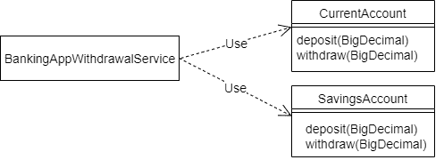
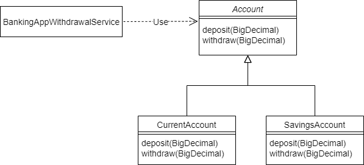
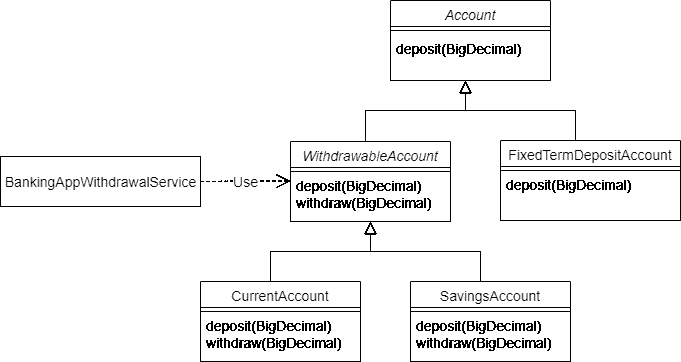

# Java 中的 Liskov 替换原理

> 原文：<https://web.archive.org/web/20220930061024/https://www.baeldung.com/java-liskov-substitution-principle>

## 1.概观

罗伯特·c·马丁在他 2000 年的论文`[Design Principles and Design Patterns](https://web.archive.org/web/20221203233830/https://fi.ort.edu.uy/innovaportal/file/2032/1/design_principles.pdf)`中介绍了[固体设计原则](/web/20221203233830/https://www.baeldung.com/solid-principles)。坚实的设计原则帮助我们**创建更易维护、更易理解、更灵活的软件。**

在本文中，我们将讨论利斯科夫替代原理，即首字母缩写词中的“L”。

## 2.开放/封闭原则

要理解利斯科夫替代原理，首先要理解开/闭原理(来自固体的“O”)。

开放/封闭原则的目标鼓励我们设计我们的软件，所以我们**只通过添加新代码**来添加新特性。当这成为可能时，我们就有了松散耦合的、因而易于维护的应用程序。

## 3.一个示例用例

让我们看一个银行应用程序的例子来更好地理解开放/封闭原则。

### 3.1.没有开/关原理

我们的银行应用程序支持两种账户类型——“活期”和“储蓄”。这些分别由类`CurrentAccount`和`SavingsAccount`表示。

`BankingAppWithdrawalService`为其用户提供取款功能:

[](/web/20221203233830/https://www.baeldung.com/wp-content/uploads/2020/07/1.png)

不幸的是，扩展这种设计有一个问题。`BankingAppWithdrawalService`知道账户`.`的两个具体实现，因此，每次引入新的账户类型时，`BankingAppWithdrawalService`都需要改变。

### 3.2.使用开放/封闭原则使代码可扩展

让我们重新设计解决方案，以符合开放/封闭原则。当需要新的账户类型时，我们将通过使用一个`Account`基类来关闭`BankingAppWithdrawalService`的修改:

[](/web/20221203233830/https://www.baeldung.com/wp-content/uploads/2020/07/2.png)

这里，我们引入了一个新的抽象类`Account`，它是`CurrentAccount`和`SavingsAccount`的扩展。

`BankingAppWithdrawalService`不再依赖于具体的账户类。因为它现在只依赖于抽象类，所以当引入新的帐户类型时，它不需要改变。

因此，`BankingAppWithdrawalService`对于具有新账户类型的扩展来说是**开放的，但是对于修改**来说**是关闭的，因为新类型不需要为了集成而改变它。**

### 3.3.Java 代码

让我们用 Java 来看看这个例子。首先，让我们定义一下`Account`类:

```
public abstract class Account {
    protected abstract void deposit(BigDecimal amount);

    /**
     * Reduces the balance of the account by the specified amount
     * provided given amount > 0 and account meets minimum available
     * balance criteria.
     *
     * @param amount
     */
    protected abstract void withdraw(BigDecimal amount);
} 
```

并且，让我们定义一下`BankingAppWithdrawalService`:

```
public class BankingAppWithdrawalService {
    private Account account;

    public BankingAppWithdrawalService(Account account) {
        this.account = account;
    }

    public void withdraw(BigDecimal amount) {
        account.withdraw(amount);
    }
}
```

现在，让我们来看看，在这个设计中，一个新的帐户类型是如何违反 Liskov 替代原则的。

### 3.4.新的帐户类型

该银行现在想向客户提供一个高利息的定期存款账户。

为了支持这一点，让我们引入一个新的`FixedTermDepositAccount`类。现实世界中的定期存款账户是一种账户类型。这意味着我们面向对象设计中的继承。

所以，我们让`FixedTermDepositAccount`成为`Account`的子类:

```
public class FixedTermDepositAccount extends Account {
    // Overridden methods...
}
```

到目前为止，一切顺利。然而，银行不允许定期存款账户提款。

这意味着新的`FixedTermDepositAccount`类不能有意义地提供`Account`定义的`withdraw`方法。一个常见的解决方法是让`FixedTermDepositAccount`在它无法实现的方法中抛出一个`UnsupportedOperationException`:

```
public class FixedTermDepositAccount extends Account {
    @Override
    protected void deposit(BigDecimal amount) {
        // Deposit into this account
    }

    @Override
    protected void withdraw(BigDecimal amount) {
        throw new UnsupportedOperationException("Withdrawals are not supported by FixedTermDepositAccount!!");
    }
}
```

### 3.5.使用新帐户类型进行测试

虽然这个新类工作得很好，但是让我们试着将它与`BankingAppWithdrawalService`一起使用:

```
Account myFixedTermDepositAccount = new FixedTermDepositAccount();
myFixedTermDepositAccount.deposit(new BigDecimal(1000.00));

BankingAppWithdrawalService withdrawalService = new BankingAppWithdrawalService(myFixedTermDepositAccount);
withdrawalService.withdraw(new BigDecimal(100.00));
```

不出所料，银行应用程序崩溃了，错误如下:

```
Withdrawals are not supported by FixedTermDepositAccount!!
```

如果一个有效的对象组合导致了一个错误，那么这个设计显然有问题。

### 3.6.哪里出了问题？

`BankingAppWithdrawalService`是`Account`类的客户端。它期望`Account`及其子类型都保证`Account`类为其`withdraw`方法指定的行为:

```
/**
 * Reduces the account balance by the specified amount
 * provided given amount > 0 and account meets minimum available
 * balance criteria.
 *
 * @param amount
 */
protected abstract void withdraw(BigDecimal amount);
```

然而，由于不支持`withdraw`方法，`FixedTermDepositAccount`违反了这个方法规范`.`，因此，我们不能可靠地用`FixedTermDepositAccount`代替`Account`。

换句话说，`FixedTermDepositAccount`违背了利斯科夫替代原理。

### 3.7.我们不能处理`BankingAppWithdrawalService`中的错误吗？

我们可以修改设计，让`Account`的`withdraw`方法的客户端知道调用它时可能会出错。然而，这将意味着客户必须具有意外子类型行为的特殊知识。这开始打破开/关原则。

换句话说，为了让开放/封闭原则很好地工作，所有的**子类型必须可以替换它们的父类型，而不必修改客户端代码**。坚持利斯科夫替代原理确保了这种可替代性。

现在让我们详细看看利斯科夫替代原理。

## 4.利斯科夫替代原理

### 4.1.定义

罗伯特·马丁总结道:

> 子类型必须可以替换它们的基本类型。

Barbara Liskov 在 1988 年定义了它，提供了一个更数学化的定义:

> `If for each object o1 of type S there is an object o2 of type T such that for all programs P defined in terms of T, the behavior of P is unchanged when o1 is substituted for o2 then S is a subtype of T.`

让我们多理解一下这些定义。

### 4.2.什么时候子类型可以替代它的父类型？

子类型不会自动替换其父类型。为了能够被替换，子类型必须表现得像它的父类型一样。

一个对象的行为是它的客户可以依赖的契约。行为由公共方法、对其输入的任何约束、对象经历的任何状态变化以及方法执行的副作用来指定。

Java 中的子类型要求基类的属性和方法在子类中可用。

然而，[行为子类型化](https://web.archive.org/web/20221203233830/https://en.wikipedia.org/wiki/Behavioral_subtyping)意味着子类型不仅提供父类型中的所有方法，而且它**必须遵守父类型**的行为规范。这确保了子类型满足客户对超类型行为的任何假设。

这是利斯科夫替代原则给面向对象设计带来的额外约束。

现在让我们重构我们的银行应用程序，以解决我们之前遇到的问题。

## 5.重构

为了解决我们在银行示例中发现的问题，让我们从理解根本原因开始。

### 5.1.根本原因

在这个例子中，我们的`FixedTermDepositAccount`不是`Account`的行为子类型。

`Account`的设计错误地假设所有`Account`类型都允许提款。因此，`Account,`的所有子类型，包括不支持撤销的`FixedTermDepositAccount`，都继承了`withdraw`方法。

虽然我们可以通过延长`Account`的合同来解决这个问题，但是还有其他的解决方案。

### 5.2.修改后的类图

让我们以不同的方式设计我们的帐户层次结构:

[](/web/20221203233830/https://www.baeldung.com/wp-content/uploads/2020/07/3.png)

因为所有的账户都不支持取款，我们将`Account`类中的`withdraw`方法移到了一个新的抽象子类`WithdrawableAccount`。`CurrentAccount`和`SavingsAccount`都允许取款。所以它们现在已经成为新`WithdrawableAccount`的子类。

这意味着`BankingAppWithdrawalService`可以信任正确类型的帐户来提供`withdraw`功能。

### 5.3.重构后的`BankingAppWithdrawalService`

`BankingAppWithdrawalService`现在需要使用`WithdrawableAccount` `:`

```
public class BankingAppWithdrawalService {
    private WithdrawableAccount withdrawableAccount;

    public BankingAppWithdrawalService(WithdrawableAccount withdrawableAccount) {
        this.withdrawableAccount = withdrawableAccount;
    }

    public void withdraw(BigDecimal amount) {
        withdrawableAccount.withdraw(amount);
    }
}
```

至于`FixedTermDepositAccount`，我们保留`Account`作为它的父类。因此，它只继承它能可靠实现的`deposit`行为，而不再继承它不想要的`withdraw`方法。这种新设计避免了我们之前看到的问题。

## 6.规则

现在让我们看看一些关于方法签名、不变量、前置条件和后置条件的规则/技术，我们可以遵循这些规则/技术来确保创建行为良好的子类型。

在他们的书 [`Program Development in Java: Abstraction, Specification, and Object-Oriented Design`](https://web.archive.org/web/20221203233830/https://www.oreilly.com/library/view/program-development-in/9780768685299/) 中，Barbara Liskov 和 John Guttag 将这些规则分为三类——签名规则、属性规则和方法规则。

这些实践中的一些已经被 Java 的首要规则强制执行了。

这里我们应该注意一些术语。宽类型更一般——例如，`Object`可以表示任何 Java 对象，比`CharSequence`更宽，而`String`非常具体，因此范围更窄。

### 6.1.签名规则-方法参数类型

该规则规定**被覆盖的子类型方法参数类型可以与超类型方法参数类型**相同或更宽。

Java 的方法覆盖规则通过强制被覆盖的方法参数类型与超类型方法完全匹配来支持这一规则。

### 6.2.签名规则–返回类型

被覆盖的子类型方法的返回类型可以比超类型方法的返回类型更窄。这被称为返回类型的[协方差](https://web.archive.org/web/20221203233830/https://en.wikipedia.org/wiki/Covariance_and_contravariance_(computer_science)#Covariant_method_return_type)。协方差表示何时接受子类型代替超类型。Java 支持返回类型的协变性。让我们看一个例子:

```
public abstract class Foo {
    public abstract Number generateNumber();    
    // Other Methods
} 
```

`Foo`中的`generateNumber`方法的返回类型为`Number`。现在让我们通过返回一个更窄类型的`Integer`来覆盖这个方法:

```
public class Bar extends Foo {
    @Override
    public Integer generateNumber() {
        return new Integer(10);
    }
    // Other Methods
}
```

因为`Integer`是-A `Number`，一个期望`Number`的客户端代码可以用`Bar`替换`Foo`没有任何问题。

另一方面，如果在`Bar`中被覆盖的方法要返回一个比`Number`更宽的类型，例如`Object`，那可能包括`Object`的任何子类型，例如`Truck`。任何依赖于返回类型`Number`的客户端代码都不能处理`Truck`！

幸运的是，Java 的方法覆盖规则防止覆盖方法返回更宽的类型。

### 6.3.签名规则–例外

与超类型方法相比，子类型方法可以抛出更少或更窄(但不是任何额外或更宽)的异常。

这是可以理解的，因为当客户端代码替换子类型时，它可以处理比超类型方法抛出更少异常的方法。但是，如果子类型的方法抛出新的或更广泛的检查异常，它将破坏客户端代码。

Java 的方法覆盖规则已经对检查的异常实施了这个规则。但是，Java 中的**重写方法可以抛出任何** **`RuntimeException`** 而不管被重写的方法是否声明异常。

### 6.4.属性规则–类不变量

[类不变量](https://web.archive.org/web/20221203233830/https://en.wikipedia.org/wiki/Class_invariant)是关于对象属性的断言，对于对象的所有有效状态，该断言必须为真。

让我们看一个例子:

```
public abstract class Car {
    protected int limit;

    // invariant: speed < limit;
    protected int speed;

    // postcondition: speed < limit
    protected abstract void accelerate();

    // Other methods...
}
```

`Car`类指定了一个类不变量，即`speed`必须总是在`limit`之下。不变式规则声明**所有子类型方法(继承的和新的)必须维护或加强超类型的类不变式**。

让我们定义一个保持类不变量的子类`Car`:

```
public class HybridCar extends Car {
    // invariant: charge >= 0;
    private int charge;

      @Override
    // postcondition: speed < limit
    protected void accelerate() {
        // Accelerate HybridCar ensuring speed < limit
    }

    // Other methods...
}
```

在这个例子中，`Car`中的不变量由`HybridCar`中被覆盖的`accelerate`方法保存。`HybridCar`额外定义了自己的类不变量`charge >= 0`，这完全没问题。

相反，如果类不变量没有被子类型保留，它会破坏任何依赖于父类型的客户端代码。

### 6.5.属性规则–历史约束

历史约束声明**子类** **方法(继承的或新的)不应该允许基类不允许**的状态改变。

让我们看一个例子:

```
public abstract class Car {

    // Allowed to be set once at the time of creation.
    // Value can only increment thereafter.
    // Value cannot be reset.
    protected int mileage;

    public Car(int mileage) {
        this.mileage = mileage;
    }

    // Other properties and methods...

}
```

`Car`类指定了对`mileage`属性的约束。`mileage`属性只能在创建时设置一次，之后不能重置。

现在让我们定义一个扩展了`Car:`的`ToyCar`

```
public class ToyCar extends Car {
    public void reset() {
        mileage = 0;
    }

    // Other properties and methods
}
```

`ToyCar`有一个额外的方法`reset`来重置`mileage`属性。在这样做的时候，`ToyCar`忽略了其父节点对`mileage`属性的约束。这将破坏任何依赖于该约束的客户端代码。所以，`ToyCar`不可替代`Car`。

类似地，如果基类有一个不可变的属性，子类不应该允许这个属性被修改。这就是为什么[不可变类](/web/20221203233830/https://www.baeldung.com/java-immutable-object)应该是`final`。

### 6.6.方法规则-前提条件

在一个方法可以被执行之前，一个[先决条件](https://web.archive.org/web/20221203233830/https://en.wikipedia.org/wiki/Precondition)应该被满足。让我们看一个关于参数值的前提条件的例子:

```
public class Foo {

    // precondition: 0 < num <= 5
    public void doStuff(int num) {
        if (num <= 0 || num > 5) {
            throw new IllegalArgumentException("Input out of range 1-5");
        }
        // some logic here...
    }
}
```

这里，`doStuff`方法的前提条件规定`num`参数值必须在 1 和 5 之间。我们在方法中使用了范围检查来强制这个前提条件。**子类型可以削弱(但不能加强)它所覆盖的方法的前提条件**。当子类型削弱了前提条件时，它放松了父类型方法施加的约束。

现在让我们用一个弱化的前提条件覆盖`doStuff`方法:

```
public class Bar extends Foo {

    @Override
    // precondition: 0 < num <= 10
    public void doStuff(int num) {
        if (num <= 0 || num > 10) {
            throw new IllegalArgumentException("Input out of range 1-10");
        }
        // some logic here...
    }
}
```

这里，前置条件在被覆盖的`doStuff`方法中被弱化为`0 < num <= 10`，允许`num`有更大范围的值。对`Foo.doStuff`有效的`num`的所有值对`Bar.doStuff`也有效。因此，`Foo.doStuff`的客户端在用`Bar`替换`Foo`时不会注意到差异。

相反，当一个子类型加强了前提条件时(例如，在我们的例子中的`0 < num <= 3`),它应用了比父类型更严格的限制。例如，`num`的值 4 & 5 对`Foo.doStuff`有效，但对`Bar.doStuff`不再有效。

这将破坏不期望这种新的更严格约束的客户端代码。

### 6.7.方法规则–后置条件

一个[后置条件](https://web.archive.org/web/20221203233830/https://en.wikipedia.org/wiki/Postcondition)是一个方法执行后应该满足的条件。

让我们看一个例子:

```
public abstract class Car {

    protected int speed;

    // postcondition: speed must reduce
    protected abstract void brake();

    // Other methods...
} 
```

这里，`Car`的`brake`方法指定了一个后置条件，`Car`的`speed`在方法执行结束时必须减少这个后置条件。**子类型可以加强(但不是削弱)它覆盖的方法的后置条件**。当子类型加强后置条件时，它提供的不仅仅是超类型方法。

现在，让我们定义一个`Car`的派生类来加强这个前提条件:

```
public class HybridCar extends Car {

   // Some properties and other methods...

    @Override
    // postcondition: speed must reduce
    // postcondition: charge must increase
    protected void brake() {
        // Apply HybridCar brake
    }
}
```

在`HybridCar`中被覆盖的`brake`方法通过额外确保`charge`也被增加来加强后置条件。因此，任何依赖于`Car`类中`brake`方法的后置条件的客户端代码在用`HybridCar`替换`Car`时都不会注意到任何差异。

相反，如果`HybridCar`削弱被覆盖的`brake`方法的后置条件，它将不再保证`speed`将被减少。这可能会破坏用`HybridCar`代替`Car`的客户端代码。

## 7.代码气味

我们如何在现实世界中发现一个不可替代其父类型的子类型？

让我们看看一些常见的代码气味，它们是违反利斯科夫替换原则的迹象。

### 7.1.子类型为它不能实现的行为抛出异常

在前面的银行应用程序示例中，我们已经看到了这样一个例子。

在重构之前，`Account`类有一个它的子类`FixedTermDepositAccount`不想要的额外方法`withdraw`。`FixedTermDepositAccount`类通过为`withdraw`方法抛出`UnsupportedOperationException`来解决这个问题。然而，这只是为了掩盖继承层次结构建模中的弱点。

### 7.2.子类型不为它不能实现的行为提供实现

这是上述代码气味的变体。子类型不能完成一个行为，所以它在被重写的方法中什么也不做。

这里有一个例子。让我们定义一个`FileSystem`接口:

```
public interface FileSystem {
    File[] listFiles(String path);

    void deleteFile(String path) throws IOException;
} 
```

让我们定义一个实现`FileSystem:`的`ReadOnlyFileSystem`

```
public class ReadOnlyFileSystem implements FileSystem {
    public File[] listFiles(String path) {
        // code to list files
        return new File[0];
    }

    public void deleteFile(String path) throws IOException {
        // Do nothing.
        // deleteFile operation is not supported on a read-only file system
    }
}
```

这里，`ReadOnlyFileSystem`不支持`deleteFile`操作，因此不提供实现。

### 7.3.客户端了解子类型

如果客户端代码需要使用`instanceof`或向下转换，那么很可能同时违反了开/闭原则和 Liskov 替换原则。

让我们用一个`FilePurgingJob`来说明这一点:

```
public class FilePurgingJob {
    private FileSystem fileSystem;

    public FilePurgingJob(FileSystem fileSystem) {
        this.fileSystem = fileSystem;
    }

    public void purgeOldestFile(String path) {
        if (!(fileSystem instanceof ReadOnlyFileSystem)) {
            // code to detect oldest file
            fileSystem.deleteFile(path);
        }
    }
}
```

因为`FileSystem`模型从根本上与只读文件系统不兼容，所以`ReadOnlyFileSystem` 继承了它不支持的`deleteFile`方法。这个示例代码使用一个`instanceof`检查来完成基于子类型实现的特殊工作。

### 7.4.子类型方法总是返回相同的值

这是一个比其他更微妙的违规行为，也更难被发现。在本例中，`ToyCar`总是为`remainingFuel`属性返回一个固定值:

```
public class ToyCar extends Car {

    @Override
    protected int getRemainingFuel() {
        return 0;
    }
} 
```

这取决于接口，以及值的含义，但通常硬编码应该是对象的可变状态值是一个标志，表明子类没有完成其父类型的全部，并且不能真正替代它。

## 8.结论

在这篇文章中，我们看了里斯科夫替代固体设计原则。

Liskov 替换原则有助于我们建立良好的继承层次模型。它帮助我们防止不符合开放/封闭原则的模型层次结构。

任何遵循 Liskov 替代原则的继承模型都将隐含地遵循开放/封闭原则。

首先，我们看了一个用例，它试图遵循开放/封闭原则，但是违反了 Liskov 替换原则。接下来，我们看了 Liskov 替换原则的定义，行为子类型的概念，以及子类型必须遵循的规则。

最后，我们看了一些常见的代码气味，它们可以帮助我们检测现有代码中的违规行为。

和往常一样，本文的示例代码可以在 [GitHub](https://web.archive.org/web/20221203233830/https://github.com/eugenp/tutorials/tree/master/patterns-modules/solid) 上找到。