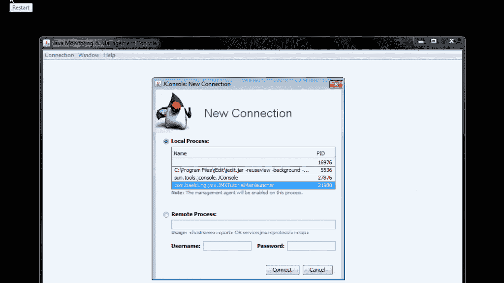

# JMX 基本介绍

> 原文：<https://web.archive.org/web/20220930061024/https://www.baeldung.com/java-management-extensions>

## 1。简介

Java 管理扩展(JMX)框架是在 Java 1.5 中引入的，从一开始就被 Java 开发人员社区广泛接受。

它为本地或远程管理 Java 应用程序提供了一个易于配置、可伸缩、可靠且或多或少友好的基础设施。该框架为应用程序的实时管理引入了 MBeans 的概念。

本文是初学者创建和设置基本 MBean 并通过 JConsole 管理它的逐步指南。

## 2。JMX 建筑

JMX 架构遵循三层方法:

1.  **工具层:**向 JMX 代理注册的 MBeans，通过它管理资源
2.  **JMX 代理层:**核心组件(MbeanServer ),维护被管理 MBeans 的注册表，并提供访问它们的接口
3.  **远程管理层:**通常是客户端工具，如 JConsole

## 3。 **创建 MBean 类**

在创建 MBeans 时，我们必须遵循一种特殊的设计模式。模型 MBean 类必须实现具有以下名称的接口:`**“model class name” plus MBean**.`

因此，让我们定义我们的 MBean 接口和实现它的类:

```java
public interface GameMBean {

    public void playFootball(String clubName);

    public String getPlayerName();

    public void setPlayerName(String playerName);

}
public class Game implements GameMBean {

    private String playerName;

    @Override
    public void playFootball(String clubName) {
        System.out.println(
          this.playerName + " playing football for " + clubName);
    }

    @Override
    public String getPlayerName() {
        System.out.println("Return playerName " + this.playerName);
        return playerName;
    }

    @Override
    public void setPlayerName(String playerName) {
        System.out.println("Set playerName to value " + playerName);
        this.playerName = playerName;
    }
}
```

`Game`类覆盖了父接口的方法 `playFootball()`。除此之外，这个类还有一个成员变量`playerName`和 getter/setter。

注意，getter/setter 也在父接口中声明。

## 4。使用 JMX 代理

JMX 代理是在本地或远程运行的实体，它们提供对向它们注册的 MBeans 的管理访问。

让我们使用 JMX 代理的核心组件`PlatformMbeanServer`，并向其注册 `Game` MBean。

我们将使用另一个实体-`ObjectNam`e-向`PlatformMbeanServer`注册`Game`类实例；这是一个由两部分组成的字符串:

*   **域**:可以是任意字符串，但是根据 MBean 命名约定，它应该有 Java 包名(避免命名冲突)
*   **键:**由逗号分隔的“`key=value`”对的列表

在这个例子中，我们将使用:`“com.baledung.tutorial:type=basic,name=game”.`

我们将从工厂类`java.lang.management.ManagementFactory.`中获取`MBeanServer`

然后我们将使用创建的`ObjectName:`注册模型 MBean

```java
try {
    ObjectName objectName = new ObjectName("com.baeldung.tutorial:type=basic,name=game");
    MBeanServer server = ManagementFactory.getPlatformMBeanServer();
    server.registerMBean(new Game(), objectName);
} catch (MalformedObjectNameException | InstanceAlreadyExistsException |
        MBeanRegistrationException | NotCompliantMBeanException e) {
    // handle exceptions
}
```

最后，为了能够测试它，我们将添加一个`while`循环来防止应用程序在我们能够通过 JConsole 访问 MBean 之前终止:

```java
while (true) {
}
```

## 5。访问 MBean

### 5.1。从客户端连接

1.  在 Eclipse 中启动应用程序
2.  启动 Jconsole(位于机器的 JDK 安装目录的 bin 文件夹中)
3.  连接->新连接->选择本教程的本地 Java 进程->连接->不安全 SSl 连接警告->继续使用不安全连接
4.  建立连接后，单击视图窗格右上角的 MBeans 选项卡
5.  已注册的 MBeans 列表将出现在左栏中
6.  点击 com.baeldung.tutorial ->基础->游戏
7.  在游戏下面，有两行，属性和操作各一行

下面简单介绍一下这个过程中的 JConsole 部分:

[](/web/20220928134139/https://www.baeldung.com/wp-content/uploads/2016/12/edited_jmx_tutorial.gif)

### 5.2。管理 MBean

MBean 管理的基础很简单:

*   属性可以读取或写入
*   方法可以被调用，参数可以被提供给它们或者从它们返回值

让我们看看这对实践中的`Game` MBean 意味着什么:

*   **`attribute` :** 为属性 `playerName`键入一个新值——例如“梅西”，然后点击**刷新按钮** 

Eclipse 控制台中将出现以下日志:

`Set playerName to value Messi`

*   **`operations` :** 为方法`playFootBall()` 的字符串参数键入一个值，例如“巴塞罗那”，然后单击方法按钮。将出现一个**窗口提示成功调用**

eclipse 控制台中将出现以下日志:

`Messi playing football for Barcelona`

## 6。结论

本教程介绍了使用 MBeans 设置支持 JMX 的应用程序的基础知识。此外，它还讨论了如何使用 JConsole 这样的典型客户端工具来管理插装的 MBean。

JMX 技术的领域非常广泛。本教程可以被认为是初学者的第一步。

本教程的源代码可以在 Github 上找到[。](https://web.archive.org/web/20220928134139/https://github.com/eugenp/tutorials/tree/master/core-java-modules/core-java-perf)