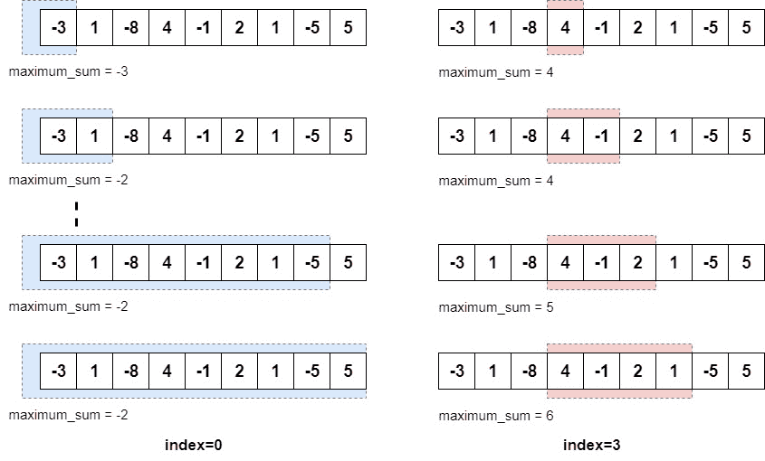
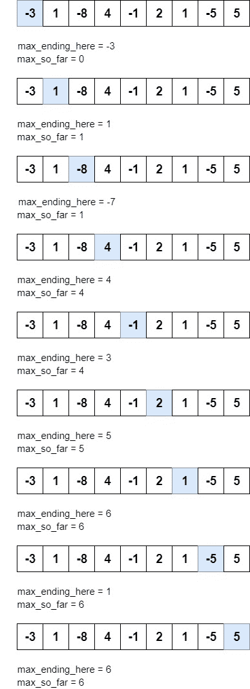

# Java 中的最大子数组问题

> 原文：<https://web.archive.org/web/20220930061024/https://www.baeldung.com/java-maximum-subarray>

## 1.概观

最大子阵列问题是在任何给定的阵列中寻找具有最大和的一系列连续元素的任务。

例如，在下面的数组中，**突出显示的子数组具有最大和(6):**

[](/web/20221206010448/https://www.baeldung.com/wp-content/uploads/2019/12/max_subarray_example.jpg)

**在本教程中，我们将看看寻找数组中最大子数组的两种解决方案**。其中一个我们将用`O(n)` [的时间和空间复杂度](/web/20221206010448/https://www.baeldung.com/java-algorithm-complexity)来设计。

## 2.强力算法

蛮力是一种解决问题的迭代方法。在大多数情况下，解决方案需要对数据结构进行多次迭代。在接下来的几节中，我们将应用这种方法来解决最大子阵列问题。

### 2.1.方法

一般来说，想到的第一个解决方案是计算每个可能的子数组的和，并返回和最大的那个。

首先，我们将计算从索引 0 开始的每个子数组的总和。同样，**我们会找到从`0`到 `n-1`** 的每个索引开始的所有子数组，其中`n`是数组的长度:

[](/web/20221206010448/https://www.baeldung.com/wp-content/uploads/2019/12/brute-force-v2.jpg)

因此，我们将从索引`0`开始，在迭代中将每个元素添加到运行总和中。我们还将**跟踪目前为止看到的最大金额**。这个迭代显示在上图的左侧。

在图像的右侧，我们可以看到从索引`3`开始的迭代。在这张图片的最后部分，我们得到了索引`3`和`6`之间最大和的子阵列。

然而，**我们的算法将继续寻找从`0`和`n-1`** 之间的索引开始的所有子阵列。

### 2.2.履行

现在让我们看看如何用 Java 实现这个解决方案:

```
public int maxSubArray(int[] nums) {

    int n = nums.length;
    int maximumSubArraySum = Integer.MIN_VALUE;
    int start = 0;
    int end = 0;

    for (int left = 0; left < n; left++) {

        int runningWindowSum = 0;

        for (int right = left; right < n; right++) {
            runningWindowSum += nums[right];

            if (runningWindowSum > maximumSubArraySum) {
                maximumSubArraySum = runningWindowSum;
                start = left;
                end = right;
            }
        }
    }
    logger.info("Found Maximum Subarray between {} and {}", start, end);
    return maximumSubArraySum;
}
```

正如所料，如果当前总和大于先前的最大总和，我们将更新`maximumSubArraySum `。值得注意的是，**然后我们也更新`start `和`end`来找出这个子阵列**的索引位置。

### 2.3.复杂性

一般来说，暴力解决方案在数组上迭代多次，以获得每个可能的解决方案。这意味着这个解决方案所花费的时间随着数组中元素的数量成二次方增长。对于小尺寸的阵列来说，这可能不是问题。**但是随着阵列规模的增长，这种解决方案效率不高。**

通过检查代码，我们还可以看到有两个嵌套的`for `循环。**因此，我们可以得出该算法的时间复杂度为`O(n²)`** 。

在后面的章节中，我们将使用动态编程来解决这个复杂的问题。

## 3.动态规划

动态规划通过将问题分成更小的子问题来解决问题。这与分治算法求解技术非常相似。然而，主要的区别在于，动态规划只解决一次子问题。

然后，它存储这个子问题的结果，并在以后重用这个结果来解决其他相关的子问题。这个过程被称为记忆化。

### 3.1.卡丹算法

Kadane 的算法是最大子阵列问题的流行解决方案，该解决方案基于动态规划。

解决动态规划**问题最重要的挑战是找到最优子问题**。

### 3.2.方法

让我们换一种方式来理解这个问题:

[](/web/20221206010448/https://www.baeldung.com/wp-content/uploads/2019/12/kadane-1.jpg)

在上图中，我们假设最大子数组在最后一个索引位置结束。因此，子阵列的最大和将是:

```
maximumSubArraySum = max_so_far + arr[n-1]
```

**`max_so_far`是结束于索引`n-2`** 的子阵列的最大和。上图也显示了这一点。

现在，我们可以将这个假设应用于数组中的任何索引。例如，结束于`n-2`的最大子阵列和可以计算为:

```
maximumSubArraySum[n-2] = max_so_far[n-3] + arr[n-2]
```

因此，我们可以得出结论:

```
maximumSubArraySum[i] = maximumSubArraySum[i-1] + arr[i]
```

现在，由于数组中的每个元素都是大小为 1 的特殊子数组，我们还需要检查元素是否大于最大和本身:

```
maximumSubArraySum[i] = Max(arr[i], maximumSubArraySum[i-1] + arr[i])
```

通过查看这些等式，我们可以看到，我们需要在数组的每个索引处找到最大的子数组和。因此，我们将我们的问题分成`n`个子问题。我们可以通过只迭代一次数组来找到每个索引处的最大和:

[](/web/20221206010448/https://www.baeldung.com/wp-content/uploads/2019/12/kadane-final.jpg)

突出显示的元素显示迭代中的当前元素。在每个索引处，我们将应用前面导出的等式来计算`max_ending_here`的值。这有助于我们识别**是否应该将当前元素包含在子数组中，或者从这个索引**开始一个新的子数组。

另一个变量`max_so_far`用于存储迭代期间找到的最大子阵列和。一旦我们迭代了最后一个索引，`max_so_far`将存储最大子数组的和。

### 3.3.履行

再一次，让我们看看如何按照上面的方法在 Java 中实现 Kadane 算法:

```
public int maxSubArraySum(int[] arr) {

    int size = arr.length;
    int start = 0;
    int end = 0;

    int maxSoFar = arr[0], maxEndingHere = arr[0];

    for (int i = 1; i < size; i++) {
        if (arr[i] > maxEndingHere + arr[i]) {
            start = i;
            maxEndingHere = arr[i];
        } else
            maxEndingHere = maxEndingHere + arr[i];

        if (maxSoFar < maxEndingHere) {
            maxSoFar = maxEndingHere;
            end = i;
        }
    }
    logger.info("Found Maximum Subarray between {} and {}", Math.min(start, end), end);
    return maxSoFar;
}
```

这里，我们更新了`start `和`end `以找到最大子阵列索引。

注意，我们取`Math.min(start, end)`而不是`start`作为最大子阵列的起始索引。这是因为，如果数组只包含负数，最大的子数组将是最大的元素本身。在这种情况下，`if (arr[i] > maxEndingHere + arr[i])`永远是`true`。即，`start`的值大于`end.`的值

### 3.4.复杂性

**由于我们只需要迭代一次数组，所以这个算法的时间复杂度是`O(n)`** 。

正如我们所看到的，这个解决方案所花费的时间随着数组中元素的数量而线性增长。因此，它比我们在上一节中讨论的强力方法更有效。

## 4.结论

在这个快速教程中，我们描述了两种解决最大子阵列问题的方法。

首先，我们探索了一种强力方法，并看到这种迭代解决方案产生了二次时间。随后，我们讨论了 Kadane 算法，并使用动态规划在线性时间内解决问题。

和往常一样，GitHub 上的[提供了这篇文章的完整源代码。](https://web.archive.org/web/20221206010448/https://github.com/eugenp/tutorials/tree/master/algorithms-modules/algorithms-miscellaneous-5)