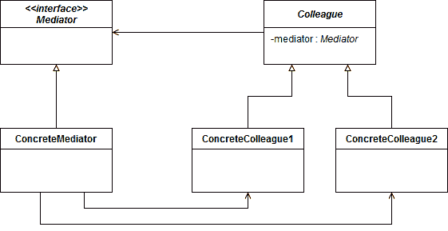

# Java 中的中介模式

> 原文：<https://web.archive.org/web/20220930061024/https://www.baeldung.com/java-mediator-pattern>

## 1.概观

在本文中，我们将了解**中介模式，它是 [GoF 行为模式](https://web.archive.org/web/20221205235840/https://en.wikipedia.org/wiki/Design_Patterns)** 的一种。我们将描述它的用途，并解释何时应该使用它。

像往常一样，我们还将提供一个简单的代码示例。

## 2.中介模式

在面向对象的编程中，我们应该总是试图以组件松散耦合和可重用的方式来设计系统。这种方法使得我们的代码更容易维护和测试。

然而，在现实生活中，我们经常需要处理一组复杂的依赖对象。这就是中介模式派上用场的时候了。

**中介模式的目的是降低直接相互通信的紧密耦合对象之间的复杂性和依赖性**。这是通过创建一个负责相关对象之间交互的中介对象来实现的。因此，所有的交流都要通过中介。

这促进了松散耦合，因为一组协同工作的组件不再需要直接交互。相反，它们只引用单个中介对象。这样，在系统的其他部分重用这些对象也更容易。

## 3.中介模式的 UML 图

现在让我们直观地看看这个模式:

[](/web/20221205235840/https://www.baeldung.com/wp-content/uploads/2019/03/mediator.png)

在上面的 UML 图中，我们可以识别下列参与者:

*   `Mediator`定义了`Colleague`对象用来通信的接口
*   `Colleague`定义了一个抽象类，它持有一个对`Mediator`的引用
*   `ConcreteMediator`封装了`Colleague`对象之间的交互逻辑
*   `ConcreteColleague1`和`ConcreteColleague2`只能通过`Mediator`进行通信

我们可以看到， **`Colleague`物体并不直接相互指称。相反，所有的通信都是由**和`**Mediator**.`进行的

因此，`ConcreteColleague1`和`ConcreteColleague2`可以更容易地被重用。

同样，如果我们需要改变`Colleague`对象一起工作的方式，我们只需要修改`ConcreteMediator`逻辑。或者我们可以创建一个新的`Mediator.`实现

## 4.Java 实现

现在我们对理论有了一个清晰的概念，让我们看一个例子来更好地理解实践中的概念。

### 4.1。示例场景

假设我们正在构建一个简单的冷却系统，由一个风扇、一个电源和一个按钮组成。按下这个按钮可以打开或关闭风扇。在我们打开风扇之前，我们需要打开电源。同样，我们必须在风扇关闭后立即关闭电源。

现在让我们看一下示例实现:

```
public class Button {
    private Fan fan;

    // constructor, getters and setters

    public void press(){
        if(fan.isOn()){
            fan.turnOff();
        } else {
            fan.turnOn();
        }
    }
}
```

```
public class Fan {
    private Button button;
    private PowerSupplier powerSupplier;
    private boolean isOn = false;

    // constructor, getters and setters

    public void turnOn() {
        powerSupplier.turnOn();
        isOn = true;
    }

    public void turnOff() {
        isOn = false;
        powerSupplier.turnOff();
    }
}
```

```
public class PowerSupplier {
    public void turnOn() {
        // implementation
    }

    public void turnOff() {
        // implementation
    }
}
```

接下来，让我们测试功能:

```
@Test
public void givenTurnedOffFan_whenPressingButtonTwice_fanShouldTurnOnAndOff() {
    assertFalse(fan.isOn());

    button.press();
    assertTrue(fan.isOn());

    button.press();
    assertFalse(fan.isOn());
}
```

一切似乎都很好。但是请注意 **`Button, Fan,` 和`PowerSupplier`类是如何紧密耦合的**。`Button`直接在`Fan`上操作，`Fan` 同时与`Button`和`PowerSupplier.`交互

很难在其他模块中重用`Button`类。此外，如果我们需要在系统中添加第二个电源，那么我们必须修改`Fan`类的逻辑。

### 4.2.添加中介模式

现在，让我们实现中介模式，以减少类之间的依赖性，并使代码更加可重用。

首先，我们来介绍一下`Mediator`类:

```
public class Mediator {
    private Button button;
    private Fan fan;
    private PowerSupplier powerSupplier;

    // constructor, getters and setters

    public void press() {
        if (fan.isOn()) {
            fan.turnOff();
        } else {
            fan.turnOn();
        }
    }

    public void start() {
        powerSupplier.turnOn();
    }

    public void stop() {
        powerSupplier.turnOff();
    }
}
```

接下来，让我们修改剩余的类:

```
public class Button {
    private Mediator mediator;

    // constructor, getters and setters

    public void press() {
        mediator.press();
    }
}
```

```
public class Fan {
    private Mediator mediator;
    private boolean isOn = false;

    // constructor, getters and setters

    public void turnOn() {
        mediator.start();
        isOn = true;
    }

    public void turnOff() {
        isOn = false;
        mediator.stop();
    }
}
```

让我们再次测试功能:

```
@Test
public void givenTurnedOffFan_whenPressingButtonTwice_fanShouldTurnOnAndOff() {
    assertFalse(fan.isOn());

    button.press();
    assertTrue(fan.isOn());

    button.press();
    assertFalse(fan.isOn());
}
```

我们的冷却系统工作正常。

**既然我们已经实现了中介模式，那么`Button`、`Fan`或`PowerSupplier`类都不会直接通信**。他们只有一个对`Mediator.`的引用

如果以后需要增加第二个电源，我们要做的就是更新`Mediator's`逻辑；`Button`和`Fan`类保持不变。

这个例子显示了我们可以多么容易地分离依赖对象，并使我们的系统更容易维护。

## 5.何时使用中介模式

如果我们必须处理一组紧密耦合且难以维护的对象，那么中介模式是一个不错的选择。通过这种方式，我们可以减少对象之间的依赖性，降低整体复杂性。

此外，通过使用中介对象，我们将通信逻辑提取到单一组件，因此我们遵循[单一责任原则](/web/20221205235840/https://www.baeldung.com/solid-principles#s)。此外，我们可以引入新的中介，而无需改变系统的其余部分。因此，我们遵循开闭原则。

然而，有时由于系统的错误设计，我们可能有太多紧密耦合的对象。如果是这种情况，我们不应该应用中介模式。相反，我们应该后退一步，重新思考我们建模类的方式。

与所有其他模式一样，**在盲目实现中介模式**之前，我们需要考虑我们的具体用例。

## 6.结论

在本文中，我们学习了中介模式。我们解释了这种模式解决了什么问题，以及何时应该考虑使用它。我们还实现了一个简单的设计模式示例。

和往常一样，完整的代码样本可以在 GitHub 的[上找到。](https://web.archive.org/web/20221205235840/https://github.com/eugenp/tutorials/tree/master/patterns-modules/design-patterns-behavioral)