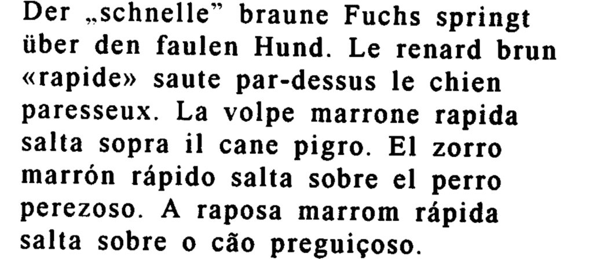
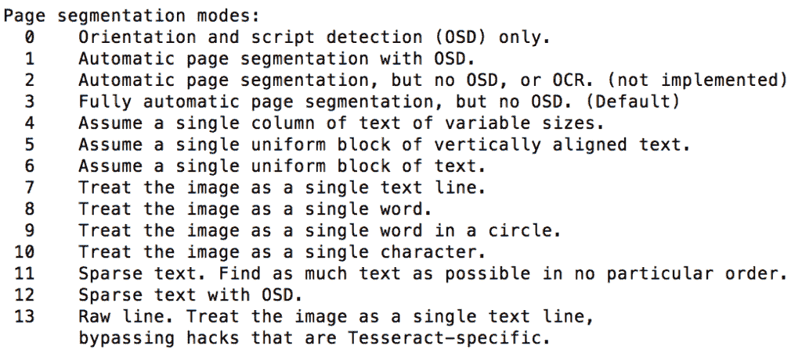

# 用宇宙魔方进行光学字符识别

> 原文：<https://web.archive.org/web/20220930061024/https://www.baeldung.com/java-ocr-tesseract>

## 1.概观

随着人工智能和机器学习技术的进步，我们需要工具来识别图像中的文本。

在本教程中，我们将通过几个图像到文本处理的例子来探索光学字符识别(OCR)引擎 Tesseract。

## 2.宇宙魔方

[Tesseract](https://web.archive.org/web/20220628065817/https://github.com/tesseract-ocr/tesseract) 是由惠普开发的开源 OCR 引擎，**可以识别 100 多种语言，并支持表意文字和从右向左的语言。**另外，**我们可以训练宇宙魔方识别其他语言**。

它包含**两个用于图像处理的 OCR 引擎**——一个 LSTM(长短期记忆)OCR 引擎和一个通过识别字符模式工作的传统 OCR 引擎。

OCR 引擎使用 [Leptonica 库](https://web.archive.org/web/20220628065817/https://github.com/DanBloomberg/leptonica)打开图像，并支持**各种输出格式，如纯文本、hOCR(用于 OCR 的 HTML)、PDF 和 TSV。**

## 3.设置

Tesseract 可在所有主要操作系统上下载/安装。

例如，如果我们使用 macOS，我们可以使用[自制软件](https://web.archive.org/web/20220628065817/https://brew.sh/)安装 OCR 引擎:

```
brew install tesseract 
```

我们将观察到，默认情况下，该包包含一组语言数据文件，如英语、方向和脚本检测(OSD ):

```
==> Installing tesseract 
==> Downloading https://homebrew.bintray.com/bottles/tesseract-4.1.1.high_sierra.bottle.tar.gz
==> Pouring tesseract-4.1.1.high_sierra.bottle.tar.gz
==> Caveats
This formula contains only the "eng", "osd", and "snum" language data files.
If you need any other supported languages, run `brew install tesseract-lang`.
==> Summary
/usr/local/Cellar/tesseract/4.1.1: 65 files, 29.9MB
```

但是，我们可以安装`tesseract-lang`模块来支持其他语言:

```
brew install tesseract-lang
```

对于 Linux，我们可以使用`yum`命令安装 Tesseract:

```
yum install tesseract
```

同样，让我们添加语言支持:

```
yum install tesseract-langpack-eng
yum install tesseract-langpack-spa
```

这里，我们添加了英语和西班牙语的语言训练数据。

对于 Windows，我们可以从 UB Mannheim 的 [Tesseract 获取安装程序。](https://web.archive.org/web/20220628065817/https://github.com/UB-Mannheim/tesseract/wiki)

## 4.宇宙魔方命令行

### 4.1.奔跑

我们可以使用 Tesseract 命令行工具从图像中提取文本。

例如，让我们拍一张我们网站的快照:

[](/web/20220628065817/https://www.baeldung.com/wp-content/uploads/2020/03/Screen-Shot-2020-02-28-at-6.29.53-PM.png)

然后，我们将运行`tesseract`命令来读取`baeldung.png` 快照，并将文本写入`output.txt`文件:

```
tesseract baeldung.png output
```

`output.txt`文件将看起来像这样:

```
a REST with Spring Learn Spring (new!)
The canonical reference for building a production
grade API with Spring.
From no experience to actually building stuff.
y
Java Weekly Reviews
```

我们可以观察到宇宙魔方没有处理图像的全部内容。因为**输出的准确性取决于各种参数，如图像质量、语言、页面分割、训练数据和用于图像处理的引擎。**

### 4.2.语言支持

默认情况下，OCR 引擎在处理图像时使用英语。然而，我们可以通过使用`-l`参数来声明语言:

让我们来看另一个多语言文本的例子:

[](/web/20220628065817/https://www.baeldung.com/wp-content/uploads/2020/03/Screen-Shot-2020-03-08-at-10.43.12-AM.png)

首先，让我们用默认的英语语言处理图像:

```
tesseract multiLanguageText.png output 
```

输出将类似于:

```
Der ,.schnelle” braune Fuchs springt
iiber den faulen Hund. Le renard brun
«rapide» saute par-dessus le chien
paresseux. La volpe marrone rapida
salta sopra il cane pigro. El zorro
marron rapido salta sobre el perro
perezoso. A raposa marrom rapida
salta sobre 0 cao preguicoso.
```

然后，让我们用葡萄牙语处理图像:

```
tesseract multiLanguageText.png output -l por
```

因此，OCR 引擎也将检测葡萄牙字母:

```
Der ,.schnelle” braune Fuchs springt
iber den faulen Hund. Le renard brun
«rapide» saute par-dessus le chien
paresseux. La volpe marrone rapida
salta sopra il cane pigro. El zorro
marrón rápido salta sobre el perro
perezoso. A raposa marrom rápida
salta sobre o cão preguiçoso.
```

同样，我们可以声明语言的组合:

```
tesseract multiLanguageText.png output -l spa+por
```

这里，OCR 引擎将首先使用西班牙语，然后使用葡萄牙语进行图像处理。但是，根据我们指定的语言顺序，输出可能会有所不同。

### 4.3.页面分段模式

Tesseract 支持各种页面分段模式，如 OSD、自动页面分段和稀疏文本。

我们可以通过使用值为 0 到 13 的`–psm`参数声明页面分段模式，用于各种模式:

```
tesseract multiLanguageText.png output --psm 1
```

这里，通过定义值 1，我们已经声明了使用 OSD 进行图像处理的自动页面分割。

让我们看看所有支持的页面分段模式:

[](/web/20220628065817/https://www.baeldung.com/wp-content/uploads/2020/03/Screen-Shot-2020-03-08-at-2.28.30-PM.png)

### 4.4.OCR 引擎模式

同样，我们可以在处理图像时使用各种引擎模式，如传统引擎和 LSTM 引擎。

为此，我们可以使用值为 0 到 3 的`–oem`参数:

```
tesseract multiLanguageText.png output --oem 1
```

OCR 引擎模式有:

[](/web/20220628065817/https://www.baeldung.com/wp-content/uploads/2020/03/Screen-Shot-2020-03-08-at-2.28.48-PM.png)

### 4.5\. Tessdata

**Tesseract 包含 LSTM OCR 引擎的两组训练数据——[最佳训练 LSTM 模型](https://web.archive.org/web/20220628065817/https://github.com/tesseract-ocr/tessdata_best)和[训练 LSTM 模型的快速整数版本](https://web.archive.org/web/20220628065817/https://github.com/tesseract-ocr/tessdata_fast)。**

前者提供更好的精度，后者提供更快的图像处理速度。

此外，Tesseract 还提供了一个对传统和 LSTM OCR 引擎都支持的组合训练数据。

如果我们使用遗留的 OCR 引擎而不提供支持的训练数据，Tesseract 将抛出一个错误:

```
Error: Tesseract (legacy) engine requested, but components are not present in /usr/local/share/tessdata/eng.traineddata!!
Failed loading language 'eng'
Tesseract couldn't load any languages!
```

因此，我们应该下载所需的`.traineddata`文件，或者将它们保存在默认的`tessdata`位置，或者使用`–tessdata-dir` 参数声明该位置:

```
tesseract multiLanguageText.png output --tessdata-dir /image-processing/tessdata
```

### 4.6.输出

我们可以声明一个参数来获得所需的输出格式。

例如，要获得可搜索的 PDF 输出:

```
tesseract multiLanguageText.png output pdf
```

这将在提供的图像上创建带有可搜索文本层(带有可识别文本)的`output.pdf`文件。

同样，对于 hOCR 输出:

```
tesseract multiLanguageText.png output hocr
```

此外，我们可以使用`tesseract –help`和`tesseract –help-extra`命令来获得关于 tesseract 命令行用法的更多信息。

## 5.Tess4J

Tess4J 是 Tesseract APIs 的 Java 包装器，它为 JPEG、GIF、PNG 和 BMP 等各种图像格式提供 OCR 支持。

首先，让我们将最新的 [`tess4j`](https://web.archive.org/web/20220628065817/https://search.maven.org/search?q=g:net.sourceforge.tess4j%20a:tess4j) Maven 依赖添加到我们的`pom.xml`:

```
<dependency>
    <groupId>net.sourceforge.tess4j</groupId>
    <artifactId>tess4j</artifactId>
    <version>4.5.1</version>
</dependency>
```

然后，我们可以使用`tess4j`提供的 [`Tesseract`](https://web.archive.org/web/20220628065817/http://tess4j.sourceforge.net/docs/docs-4.4/net/sourceforge/tess4j/Tesseract.html) 类来处理图像:

```
File image = new File("src/main/resourcimg/multiLanguageText.png");
Tesseract tesseract = new Tesseract();
tesseract.setDatapath("src/main/resources/tessdata");
tesseract.setLanguage("eng");
tesseract.setPageSegMode(1);
tesseract.setOcrEngineMode(1);
String result = tesseract.doOCR(image);
```

这里，我们将`datapath`的值设置为包含`osd.traineddata`和`eng.traineddata`文件的目录位置。

最后，我们可以验证经过处理的图像的`String`输出:

```
Assert.assertTrue(result.contains("Der ,.schnelle” braune Fuchs springt"));
Assert.assertTrue(result.contains("salta sopra il cane pigro. El zorro"));
```

此外，我们可以使用`setHocr`方法获得 HTML 输出:

```
tesseract.setHocr(true);
```

默认情况下，库处理整个图像。然而，我们可以通过使用 [`java.awt.Rectangle`](https://web.archive.org/web/20220628065817/https://docs.oracle.com/en/java/javase/11/docs/api/java.desktop/java/awt/Rectangle.html) 对象同时调用`doOCR`方法来处理图像的特定部分:

```
result = tesseract.doOCR(imageFile, new Rectangle(1200, 200));
```

类似于 Tess4J，我们可以使用 [Tesseract 平台](https://web.archive.org/web/20220628065817/https://github.com/bytedeco/javacpp-presets/tree/master/tesseract)在 Java 应用中集成 Tesseract。这是基于 [JavaCPP 预置](https://web.archive.org/web/20220628065817/https://github.com/bytedeco/javacpp-presets)库的 Tesseract APIs 的 JNI 包装器。

## 6.结论

在本文中，我们通过几个图像处理的例子探索了 Tesseract OCR 引擎。

首先，我们检查了用于处理图像的`tesseract`命令行工具，以及一组参数，如`-l`、`–psm`和`–oem`。

然后，我们探索了`tess4j`，一个在 Java 应用程序中集成 Tesseract 的 Java 包装器。

像往常一样，所有的代码实现都可以在 GitHub 上获得[。](https://web.archive.org/web/20220628065817/https://github.com/eugenp/tutorials/tree/master/image-processing)