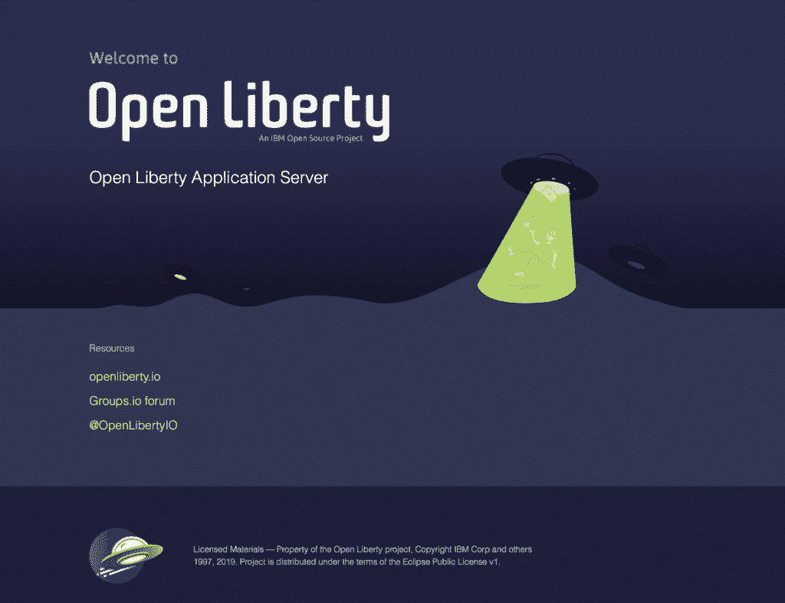

# 开放自由简介

> 原文：<https://web.archive.org/web/20220930061024/https://www.baeldung.com/java-open-liberty>

## 1.概观

随着微服务架构和云原生应用开发的流行，对快速和轻量级应用服务器的需求越来越大。

在这个介绍性教程中，我们将探索[开放自由框架](https://web.archive.org/web/20221205162813/https://openliberty.io/)来创建和消费 RESTful web 服务。我们还将研究它提供的一些基本特性。

## 2.开放自由

Open Liberty 是 Java 生态系统的一个开放框架，允许使用 [Eclipse MicroProfile](/web/20221205162813/https://www.baeldung.com/eclipse-microprofile) 和 [Jakarta EE](/web/20221205162813/https://www.baeldung.com/kotlin/java-ee-kotlin-app) 平台的特性开发微服务。

它是一个灵活、快速、轻量级的 Java 运行时，对于云原生微服务开发来说似乎很有前途。

该框架允许我们只配置应用程序所需的功能，从而在启动时减少内存占用。此外，它可以部署在任何使用容器的云平台上，比如 T2 的 Docker 和 T4 的 Kubernetes。

它通过实时重载代码来支持快速开发，从而实现快速迭代。

## 3.构建并运行

首先，我们将创建一个简单的名为`open-liberty`的基于 Maven 的项目，然后将最新的 [`liberty-maven-plugin`](https://web.archive.org/web/20221205162813/https://search.maven.org/search?q=g:io.openliberty.tools%20a:liberty-maven-plugin) 插件添加到`pom.xml`中:

```java
<plugin>
    <groupId>io.openliberty.tools</groupId>
    <artifactId>liberty-maven-plugin</artifactId>
    <version>3.3-M3</version>
</plugin>
```

或者，我们可以添加最新的 [`openliberty-runtime`](https://web.archive.org/web/20221205162813/https://search.maven.org/search?q=g:io.openliberty%20a:openliberty-runtime) Maven 依赖作为`liberty-maven-plugin`的替代:

```java
<dependency>
    <groupId>io.openliberty</groupId>
    <artifactId>openliberty-runtime</artifactId>
    <version>20.0.0.1</version>
    <type>zip</type>
</dependency>
```

类似地，我们可以将最新的 Gradle 依赖项添加到`build.gradle`:

```java
dependencies {
    libertyRuntime group: 'io.openliberty', name: 'openliberty-runtime', version: '20.0.0.1'
}
```

然后，我们再添加最新的 [`jakarta.jakartaee-web-api`](https://web.archive.org/web/20221205162813/https://search.maven.org/search?q=g:jakarta.platform%20a:jakarta.jakartaee-web-api) 和 [`microprofile`](https://web.archive.org/web/20221205162813/https://search.maven.org/search?q=g:org.eclipse.microprofile%20a:microprofile) 美文依赖关系:

```java
<dependency>
    <groupId>jakarta.platform</groupId>
    <artifactId>jakarta.jakartaee-web-api</artifactId>
    <version>8.0.0</version>
    <scope>provided</scope>
</dependency>
<dependency>
    <groupId>org.eclipse.microprofile</groupId>
    <artifactId>microprofile</artifactId>
    <version>3.2</version>
    <type>pom</type>
    <scope>provided</scope>
</dependency>
```

然后，让我们将默认的 HTTP 端口属性添加到 `pom.xml`:

```java
<properties>
    <liberty.var.default.http.port>9080</liberty.var.default.http.port>
    <liberty.var.default.https.port>9443</liberty.var.default.https.port>
</properties>
```

接下来，我们将在`src/main/liberty/config`目录中创建`server.xml`文件:

```java
<server description="Baeldung Open Liberty server">
    <featureManager>
        <feature>mpHealth-2.0</feature>
    </featureManager>
    <webApplication location="open-liberty.war" contextRoot="/" />
    <httpEndpoint host="*" httpPort="${default.http.port}" 
      httpsPort="${default.https.port}" id="defaultHttpEndpoint" />
</server>
```

这里，我们添加了`mpHealth-2.0`特性来检查应用程序的健康状况。

这就是所有的基本设置。让我们第一次运行 Maven 命令来编译文件:

```java
mvn clean package
```

最后，让我们使用 Liberty 提供的 Maven 命令运行服务器:

```java
mvn liberty:dev
```

瞧啊。我们的应用程序已经启动，将于`localhost:9080`开始访问:

[](/web/20221205162813/https://www.baeldung.com/wp-content/uploads/2020/02/Screen-Shot-2020-01-15-at-1.46.17-PM.png)

此外，我们可以在`localhost:9080/health`访问应用程序的运行状况:

```java
{"checks":[],"status":"UP"}
```

**`liberty:dev`命令在开发模式**下启动 Open Liberty 服务器，它热重新加载对代码或配置所做的任何更改，而无需重启服务器。

类似地，`liberty:run` 命令可用于在生产模式下启动服务器。

同样，我们可以使用 **`liberty:start-server`和`liberty:` `stop-server` 在后台**启动/停止服务器。

## 4.小型应用程序

为了在应用程序中使用 servlets，我们将在`server.xml`中添加`servlet-4.0`特性:

```java
<featureManager>
    ...
    <feature>servlet-4.0</feature>
</featureManager>
```

如果使用`pom.xml`中的`openliberty-runtime` Maven 依赖，则添加最新的 [`servlet-4.0`](https://web.archive.org/web/20221205162813/https://search.maven.org/search?q=g:io.openliberty.features%20a:servlet-4.0) Maven 依赖:

```java
<dependency>
    <groupId>io.openliberty.features</groupId>
    <artifactId>servlet-4.0</artifactId>
    <version>20.0.0.1</version>
    <type>esa</type>
</dependency>
```

然而，如果我们使用的是`liberty-maven-plugin`插件，这是没有必要的。

然后，我们将创建扩展了`HttpServlet`类的`AppServlet`类:

```java
@WebServlet(urlPatterns="/app")
public class AppServlet extends HttpServlet {
    private static final long serialVersionUID = 1L;

    @Override
    protected void doGet(HttpServletRequest request, HttpServletResponse response) 
      throws ServletException, IOException {
        String htmlOutput = "<html><h2>Hello! Welcome to Open Liberty</h2></html>";
        response.getWriter().append(htmlOutput);
    }
}
```

这里，我们添加了 [`@WebServlet`](https://web.archive.org/web/20221205162813/https://jakarta.ee/specifications/platform/8/apidocs/javax/servlet/annotation/WebServlet.html) 注释，这将使`AppServlet`在指定的 URL 模式中可用。

让我们在`localhost:9080/app`访问 servlet:

**[](/web/20221205162813/https://www.baeldung.com/wp-content/uploads/2020/02/Screen-Shot-2020-01-18-at-4.21.46-PM.png)**

## 5.创建 RESTful Web 服务

首先，让我们将 [`jaxrs-2.1`](https://web.archive.org/web/20221205162813/https://search.maven.org/search?q=g:io.openliberty.features%20a:jaxrs-2.1) 特性添加到`server.xml`中:

```java
<featureManager>
    ...
    <feature>jaxrs-2.1</feature>
</featureManager>
```

然后`,` 我们将创建`ApiApplication` 类，它提供 RESTful web 服务的端点:

```java
@ApplicationPath("/api")
public class ApiApplication extends Application {
}
```

这里，我们使用了 [`@ApplicationPath`](https://web.archive.org/web/20221205162813/https://jakarta.ee/specifications/platform/8/apidocs/javax/ws/rs/ApplicationPath.html) 标注为 URL 路径。

然后，让我们创建服务于模型的`Person` 类:

```java
public class Person {
    private String username;
    private String email;

    // getters and setters
    // constructors
}
```

接下来，我们将创建`PersonResource` 类来定义 HTTP 映射:

```java
@RequestScoped
@Path("persons")
public class PersonResource {
    @GET
    @Produces(MediaType.APPLICATION_JSON)
    public List<Person> getAllPersons() {
        return Arrays.asList(new Person(1, "normanlewis", "[[email protected]](/web/20221205162813/https://www.baeldung.com/cdn-cgi/l/email-protection)"));
    }
}
```

这里，我们已经添加了用于 GET 映射到`/api/persons`端点的`getAllPersons`方法。所以，我们已经准备好了一个 RESTful web 服务，并且`liberty:dev` 命令将动态加载更改。

让我们使用 curl GET 请求来访问`/api/persons` RESTful web 服务:

```java
curl --request GET --url http://localhost:9080/api/persons
```

然后，我们将得到一个 JSON 数组作为响应:

```java
[{"id":1, "username":"normanlewis", "email":"[[email protected]](/web/20221205162813/https://www.baeldung.com/cdn-cgi/l/email-protection)"}]
```

类似地，我们可以通过创建`addPerson`方法来添加 POST 映射:

```java
@POST
@Consumes(MediaType.APPLICATION_JSON)
public Response addPerson(Person person) {
    String respMessage = "Person " + person.getUsername() + " received successfully.";
    return Response.status(Response.Status.CREATED).entity(respMessage).build();
}
```

现在，我们可以用 curl POST 请求调用端点:

```java
curl --request POST --url http://localhost:9080/api/persons \
  --header 'content-type: application/json' \
  --data '{"username": "normanlewis", "email": "[[email protected]](/web/20221205162813/https://www.baeldung.com/cdn-cgi/l/email-protection)"}'
```

响应将类似于:

```java
Person normanlewis received successfully.
```

## 6.坚持

### 6.1.配置

让我们为 RESTful web 服务添加持久性支持。

首先，我们将把 [`derby`](https://web.archive.org/web/20221205162813/https://search.maven.org/search?q=g:org.apache.derby%20a:derby%20AND%20v:10.14.2.0) Maven 依赖项添加到`pom.xml`:

```java
<dependency>
    <groupId>org.apache.derby</groupId>
    <artifactId>derby</artifactId>
    <version>10.14.2.0</version>
</dependency>
```

然后，我们将向`server.xml`添加一些特性，如`jpa-2.2`、`jsonp-1.1`和`cdi-2.0`:

```java
<featureManager>
    ...
    <feature>jpa-2.2</feature> 
    <feature>jsonp-1.1</feature>
    <feature>cdi-2.0</feature>
</featureManager> 
```

这里， [`jsonp-1.1`](https://web.archive.org/web/20221205162813/https://search.maven.org/search?q=g:io.openliberty.features%20a:jsonp-1.1) 特性提供了 JSON 处理的 Java API， [`cdi-2.0`](https://web.archive.org/web/20221205162813/https://search.maven.org/search?q=g:io.openliberty.features%20a:cdi-2.0) 特性处理作用域和依赖注入。

接下来，我们将在`src/main/resources/META-INF`目录中创建`persistence.xml`:

```java
<?xml version="1.0" encoding="UTF-8"?>
<persistence version="2.2"

    xmlns:xsi="http://www.w3.org/2001/XMLSchema-instance"
    xsi:schemaLocation="http://xmlns.jcp.org/xml/ns/persistence
                        http://xmlns.jcp.org/xml/ns/persistence/persistence_2_2.xsd">
    <persistence-unit name="jpa-unit" transaction-type="JTA">
        <jta-data-source>jdbc/jpadatasource</jta-data-source>
        <properties>
            <property name="eclipselink.ddl-generation" value="create-tables"/>
            <property name="eclipselink.ddl-generation.output-mode" value="both" />
        </properties>
    </persistence-unit>
</persistence>
```

这里，我们使用了 [EclipseLink DDL 生成](https://web.archive.org/web/20221205162813/https://www.eclipse.org/eclipselink/documentation/2.5/jpa/extensions/p_ddl_generation.htm)来自动创建我们的数据库模式。我们也可以使用其他替代方法，比如 Hibernate。

然后，让我们将`dataSource`配置添加到`server.xml`中:

```java
<library id="derbyJDBCLib">
    <fileset dir="${shared.resource.dir}" includes="derby*.jar"/> 
</library>
<dataSource id="jpadatasource" jndiName="jdbc/jpadatasource">
    <jdbcDriver libraryRef="derbyJDBCLib" />
    <properties.derby.embedded databaseName="libertyDB" createDatabase="create" />
</dataSource>
```

注意，`jndiName`与`persistence.xml.`中的`jta-data-source` 标签具有相同的引用

### 6.2.实体与道

然后，我们将把 [`@Entity`](/web/20221205162813/https://www.baeldung.com/jpa-entities) 注释和一个标识符添加到我们的`Person`类中:

```java
@Entity
public class Person {
    @GeneratedValue(strategy = GenerationType.AUTO)
    @Id
    private int id;

    private String username;
    private String email;

    // getters and setters
}
```

接下来，让我们创建将使用 [`EntityManager`](/web/20221205162813/https://www.baeldung.com/hibernate-entitymanager) 实例与数据库交互的`PersonDao`类:

```java
@RequestScoped
public class PersonDao {
    @PersistenceContext(name = "jpa-unit")
    private EntityManager em;

    public Person createPerson(Person person) {
        em.persist(person);
        return person;
    }

    public Person readPerson(int personId) {
        return em.find(Person.class, personId);
    }
}
```

注意， [`@PersistenceContext`](https://web.archive.org/web/20221205162813/https://jakarta.ee/specifications/platform/8/apidocs/javax/persistence/PersistenceContext.html) 定义了对`persistence.xml`中的`persistence-unit`标签的相同引用。

现在，我们将在`PersonResource`类中注入`PersonDao`依赖项:

```java
@RequestScoped
@Path("person")
public class PersonResource {
    @Inject
    private PersonDao personDao;

    // ...
}
```

这里，我们使用了 CDI 特性提供的 [`@Inject`](https://web.archive.org/web/20221205162813/https://jakarta.ee/specifications/platform/8/apidocs/javax/inject/Inject.html) 注释。

最后，我们将更新`PersonResource`类的`addPerson`方法来持久化`Person`对象:

```java
@POST
@Consumes(MediaType.APPLICATION_JSON)
@Transactional
public Response addPerson(Person person) {
    personDao.createPerson(person);
    String respMessage = "Person #" + person.getId() + " created successfully.";
    return Response.status(Response.Status.CREATED).entity(respMessage).build();
}
```

这里，`addPerson`方法用 [`@Transactional`](https://web.archive.org/web/20221205162813/https://jakarta.ee/specifications/platform/8/apidocs/javax/transaction/Transactional.html) 注释进行了注释，以控制 CDI 托管 beans 上的事务。

让我们用已经讨论过的 curl POST 请求调用端点:

```java
curl --request POST --url http://localhost:9080/api/persons \
  --header 'content-type: application/json' \
  --data '{"username": "normanlewis", "email": "[[email protected]](/web/20221205162813/https://www.baeldung.com/cdn-cgi/l/email-protection)"}'
```

然后，我们会收到一条短信回复:

```java
Person #1 created successfully.
```

类似地，让我们添加带有 GET 映射的`getPerson`方法来获取一个`Person`对象:

```java
@GET
@Path("{id}")
@Produces(MediaType.APPLICATION_JSON)
@Transactional
public Person getPerson(@PathParam("id") int id) {
    Person person = personDao.readPerson(id);
    return person;
}
```

让我们使用 curl GET 请求调用端点:

```java
curl --request GET --url http://localhost:9080/api/persons/1
```

然后，我们将获得作为 JSON 响应的`Person`对象:

```java
{"email":"[[email protected]](/web/20221205162813/https://www.baeldung.com/cdn-cgi/l/email-protection)","id":1,"username":"normanlewis"}
```

## 7.使用`JSON-B`消费`RESTful`网络服务

首先，我们将通过向`server.xml`添加 [`jsonb-1.0`](https://web.archive.org/web/20221205162813/https://search.maven.org/search?q=g:io.openliberty.features%20a:jsonb-1.0) 特性来启用直接序列化和反序列化模型的能力:

```java
<featureManager>
    ...
    <feature>jsonb-1.0</feature>
</featureManager>
```

然后，让我们用`consumeWithJsonb` 方法创建`RestConsumer`类:

```java
public class RestConsumer {
    public static String consumeWithJsonb(String targetUrl) {
        Client client = ClientBuilder.newClient();
        Response response = client.target(targetUrl).request().get();
        String result = response.readEntity(String.class);
        response.close();
        client.close();
        return result;
    }
}
```

这里，我们使用了 [`ClientBuilder`](https://web.archive.org/web/20221205162813/https://jakarta.ee/specifications/platform/8/apidocs/javax/ws/rs/client/ClientBuilder.html) 类来请求 RESTful web 服务端点。

最后，让我们编写一个单元测试来使用`/api/person` RESTful web 服务并验证响应:

```java
@Test
public void whenConsumeWithJsonb_thenGetPerson() {
    String url = "http://localhost:9080/api/persons/1";
    String result = RestConsumer.consumeWithJsonb(url);        

    Person person = JsonbBuilder.create().fromJson(result, Person.class);
    assertEquals(1, person.getId());
    assertEquals("normanlewis", person.getUsername());
    assertEquals("[[email protected]](/web/20221205162813/https://www.baeldung.com/cdn-cgi/l/email-protection)", person.getEmail());
}
```

这里，我们使用了 [`JsonbBuilder`](https://web.archive.org/web/20221205162813/https://jakarta.ee/specifications/platform/8/apidocs/javax/json/bind/JsonbBuilder.html) 类将`String`响应解析为`Person`对象。

此外，我们可以通过添加 [`mpRestClient-1.3`](https://web.archive.org/web/20221205162813/https://search.maven.org/search?q=g:io.openliberty.features%20a:mpRestClient-1.3) 特性来使用 **MicroProfile Rest 客户端来消费 RESTful web 服务**。它提供了 [`RestClientBuilder`](https://web.archive.org/web/20221205162813/https://download.eclipse.org/microprofile/microprofile-rest-client-1.3/apidocs/org/eclipse/microprofile/rest/client/RestClientBuilder.html) 接口来请求 RESTful web 服务端点。

## 8.结论

在本文中，我们探索了 Open Liberty 框架——一个快速、轻量级的 Java 运行时，它提供了 Eclipse MicroProfile 和 Jakarta EE 平台的全部功能。

首先，我们使用 JAX RS 创建了一个 RESTful web 服务。然后，我们使用 JPA 和 CDI 之类的特性来支持持久性。

最后，我们使用 JSON-B 消费 RESTful web 服务。

像往常一样，所有的代码实现都可以在 GitHub 上获得[。](https://web.archive.org/web/20221205162813/https://github.com/eugenp/tutorials/tree/master/microservices-modules/open-liberty)