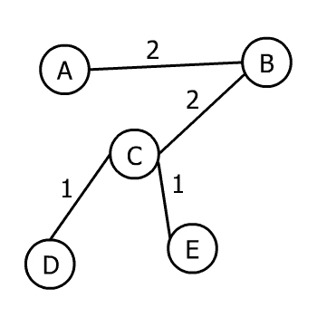
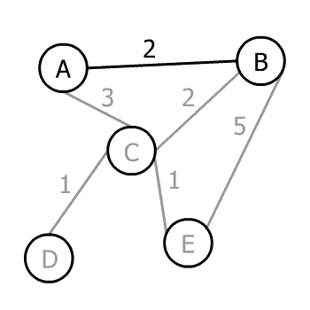
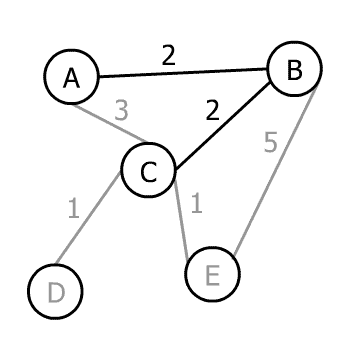
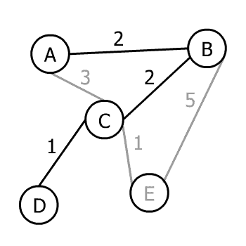

# Prim 算法及其 Java 实现

> 原文：<https://web.archive.org/web/20220930061024/https://www.baeldung.com/java-prim-algorithm>

## 1.介绍

在本教程中，我们首先学习什么是最小生成树。之后，我们将使用 [Prim 的算法](/web/20221207071952/https://www.baeldung.com/cs/prim-algorithm)来找到一个。

## 2.最小生成树

**最小生成树(MST)是一个加权的、无向的连通图，其总边权重已经通过移除较重的边而最小化**。换句话说，我们保持图的所有顶点不变，但是我们可以删除一些边，使得所有边的总和最小。

我们从加权图开始，因为如果这些边没有权重，那么最小化总边权重是没有意义的。让我们来看一个示例图:

[](/web/20221207071952/https://www.baeldung.com/wp-content/uploads/2019/12/prim0001.jpg)

上图是一个加权的，无向的，连通图。下面是该图 MST:

[](/web/20221207071952/https://www.baeldung.com/wp-content/uploads/2019/12/prim0000.jpg)

然而，图的 MST 不是唯一的。如果一个图有多个 MST，那么每个 MST 都有相同的总边权。

## 3.普里姆算法

Prim 的算法将一个加权的、无方向的连通图作为输入，并返回该图的 MST 作为输出。

它以贪婪的方式工作。第一步，它选择一个任意的顶点。此后，**每一个新的步骤都将最近的顶点添加到目前构建的树中**，直到没有不连通的顶点。

让我们一步一步地在这张图上运行 Prim 的算法:

[](/web/20221207071952/https://www.baeldung.com/wp-content/uploads/2019/12/prim0007.jpg)

假设开始算法的任意顶点是 B，我们有三个选择 A，C 和 E。边的相应权重是 2、2 和 5，因此最小值是 2。在这种情况下，我们有两条权重为 2 的边，所以我们可以选择其中任何一条(哪一条都无所谓)。让我们选择一个:

[](/web/20221207071952/https://www.baeldung.com/wp-content/uploads/2019/12/prim0006.jpg)

现在我们有了一个树，它有两个顶点 A 和 B。我们可以选择 A 或 B 的任何一条尚未添加的边，这些边会导致一个未添加的顶点。所以，我们可以选 AC，BC，或者 BE。

Prim 的算法选择最小值，即 2 或 BC:

[](/web/20221207071952/https://www.baeldung.com/wp-content/uploads/2019/12/prim0003.jpg)

现在我们有了一个树，它有三个顶点和三条可能的边:CD、CE 或 BE。AC 不包括在内，因为它不会给树添加新的顶点。这三个中的最小权重是 1。

然而，有两条边的权重都是 1。因此，Prim 的算法在这一步中选择了其中一个(也不在乎是哪一个): [](/web/20221207071952/https://www.baeldung.com/wp-content/uploads/2019/12/prim0004.jpg)

只剩下一个顶点要加入，所以我们可以从 CE 和 BE 中选择。可以将我们的树连接到它的最小权重是 1，Prim 的算法会选择它:

[](/web/20221207071952/https://www.baeldung.com/wp-content/uploads/2019/12/prim0005.jpg)

当输入图的所有顶点都出现在输出树中时，Prim 的算法结束。因此，这棵树是输入图的 MST。

## 4.履行

顶点和边构成了图形，所以我们需要一个数据结构来存储这些元素。让我们创建类`Edge`:

```java
public class Edge {

    private int weight;
    private boolean isIncluded = false;

}
```

每个`Edge`必须有一个`weight` ,因为 Prim 的算法在加权图上工作。`isIncluded`显示`Edge`是否出现在最小生成树中。

现在，让我们添加`Vertex`类:

```java
public class Vertex {

    private String label = null;
    private Map<Vertex, Edge> edges = new HashMap<>();
    private boolean isVisited = false;

}
```

每个`Vertex`可以选择有一个`label`。我们使用`edges`地图来存储顶点之间的连接。最后，`isVisited`显示顶点到目前为止是否被 Prim 的算法访问过。

让我们创建我们的`Prim`类，我们将在其中实现逻辑:

```java
public class Prim {

    private List<Vertex> graph;

}
```

顶点列表足以存储整个图，因为在每个`Vertex`中，我们有一个`Map<Vertex, Edge>`来标识所有连接。在`Prim,` 中，我们创建了一个`run()` 方法:

```java
public void run() {
    if (graph.size() > 0) {
        graph.get(0).setVisited(true);
    }
    while (isDisconnected()) {
        Edge nextMinimum = new Edge(Integer.MAX_VALUE);
        Vertex nextVertex = graph.get(0);
        for (Vertex vertex : graph) {
            if (vertex.isVisited()) {
                Pair<Vertex, Edge> candidate = vertex.nextMinimum();
                if (candidate.getValue().getWeight() < nextMinimum.getWeight()) {
                    nextMinimum = candidate.getValue();
                    nextVertex = candidate.getKey();
                }
            }
        }
        nextMinimum.setIncluded(true);
        nextVertex.setVisited(true);
    }
}
```

我们首先将`List<Vertex> graph`的第一个元素设置为 visited。第一个元素可以是任何顶点，这取决于它们最初被添加到列表中的顺序。`isDisconnected()`返回`true`如果有到目前为止没有访问过的`Vertex`:

```java
private boolean isDisconnected() {
    for (Vertex vertex : graph) {
        if (!vertex.isVisited()) {
            return true;
        }
    }
    return false;
}
```

而最小生成树`isDisconnected()`，我们在已经访问过的顶点上循环，找到具有最小权重的`Edge`作为`nextVertex:`的候选

```java
public Pair<Vertex, Edge> nextMinimum() {
    Edge nextMinimum = new Edge(Integer.MAX_VALUE);
    Vertex nextVertex = this;
    Iterator<Map.Entry<Vertex,Edge>> it = edges.entrySet()
        .iterator();
    while (it.hasNext()) {
        Map.Entry<Vertex,Edge> pair = it.next();
        if (!pair.getKey().isVisited()) {
            if (!pair.getValue().isIncluded()) {
                if (pair.getValue().getWeight() < nextMinimum.getWeight()) {
                    nextMinimum = pair.getValue();
                    nextVertex = pair.getKey();
                }
            }
        }
    }
    return new Pair<>(nextVertex, nextMinimum);
}
```

我们找到主循环中所有`candidate`的最小值，并将其存储在`nextVertex`中。然后，我们将`nextVertex`设置为已访问。循环继续，直到所有顶点都被访问。

最后，**与`isIncluded`等于`true`的每个`Edge`都存在。**

注意，由于`nextMinimum()`迭代通过边缘，该实现的时间复杂度是`O(V²)`。如果我们将边存储在优先级队列中(按权重排序),算法将在`O(E log V)`中执行。

## 5.测试

好了，现在我们已经有了一些代码，让我们用一个真实的例子来测试它。首先，我们构建我们的图表:

```java
public static List<Vertex> createGraph() {
    List<Vertex> graph = new ArrayList<>();
    Vertex a = new Vertex("A");
    ...
    Vertex e = new Vertex("E");
    Edge ab = new Edge(2);
    a.addEdge(b, ab);
    b.addEdge(a, ab);
    ...
    Edge ce = new Edge(1);
    c.addEdge(e, ce);
    e.addEdge(c, ce);
    graph.add(a);
    ...
    graph.add(e);
    return graph;
}
```

`Prim`类的构造函数获取它并将其存储在类中。我们可以用`originalGraphToString()`方法打印输入图形:

```java
Prim prim = new Prim(createGraph());
System.out.println(prim.originalGraphToString());
```

我们的示例将输出:

```java
A --- 2 --- B
A --- 3 --- C
B --- 5 --- E
B --- 2 --- C
C --- 1 --- E
C --- 1 --- D
```

现在，我们运行 Prim 的算法并用`minimumSpanningTreeToString()`方法打印结果 MST:

```java
prim.run();
prim.resetPrintHistory();
System.out.println(prim.minimumSpanningTreeToString());
```

最后，我们打印出我们的 MST:

```java
A --- 2 --- B
B --- 2 --- C
C --- 1 --- E
C --- 1 --- D
```

## 6.结论

在本文中，我们学习了 Prim 的算法如何找到一个图的最小生成树。代码可以在 GitHub 上的[处获得。](https://web.archive.org/web/20221207071952/https://github.com/eugenp/tutorials/tree/master/algorithms-modules/algorithms-miscellaneous-5)