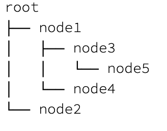
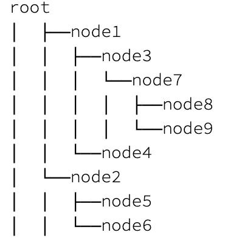
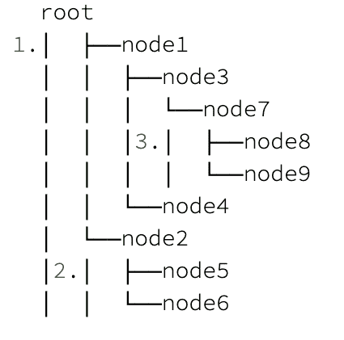

# 如何打印二叉树图

> 原文：<https://web.archive.org/web/20220930061024/https://www.baeldung.com/java-print-binary-tree-diagram>

## 1.介绍

打印是一种非常常见的数据结构可视化技术。然而，当涉及到树时，由于它们的等级性质，这可能会很棘手。

在本教程中，我们将学习一些 Java 中[二叉树](/web/20221006232646/https://www.baeldung.com/java-binary-tree)的打印技术。

## 2.树形图

尽管在控制台上只绘制字符有局限性，但是有许多不同的图表形状来表示树结构。选择其中之一主要取决于树的大小和平衡。

让我们看看可以打印的一些可能的图表类型:

[](/web/20221006232646/https://www.baeldung.com/wp-content/uploads/2019/12/tree-diagram-1-e1576291985120.png)

但是，我们将解释一个更容易实现的实用方法。通过考虑树生长的方向，我们可以称之为`horizontal tree`:

[](/web/20221006232646/https://www.baeldung.com/wp-content/uploads/2019/12/tree-diagram-2-e1576292159112.png)

因为**水平树总是与文本流向**相同，我们选择水平图比其他图有一些好处:

1.  我们也可以想象大而不平衡的树
2.  节点值的长度不影响显示结构
3.  这更容易实现

因此，在接下来的部分中，我们将使用水平图并实现一个简单的二叉树打印机类。

## 3.二叉树模型

首先，我们应该建立一个基本的二叉树模型，只用几行代码就可以完成。

让我们定义一个简单的`BinaryTreeModel`类:

```
public class BinaryTreeModel {

    private Object value;
    private BinaryTreeModel left;
    private BinaryTreeModel right;

    public BinaryTreeModel(Object value) {
        this.value = value;
    }

    // standard getters and setters

} 
```

## 4.样本测试数据

在我们开始实现二叉树打印机之前，我们需要创建一些样本数据来增量测试我们的可视化:

```
BinaryTreeModel root = new BinaryTreeModel("root");

BinaryTreeModel node1 = new BinaryTreeModel("node1");
BinaryTreeModel node2 = new BinaryTreeModel("node2");
root.setLeft(node1);
root.setRight(node2);

BinaryTreeModel node3 = new BinaryTreeModel("node3");
BinaryTreeModel node4 = new BinaryTreeModel("node4");
node1.setLeft(node3);
node1.setRight(node4);

node2.setLeft(new BinaryTreeModel("node5"));
node2.setRight(new BinaryTreeModel("node6"));

BinaryTreeModel node7 = new BinaryTreeModel("node7");
node3.setLeft(node7);
node7.setLeft(new BinaryTreeModel("node8"));
node7.setRight(new BinaryTreeModel("node9"));
```

## 5.二叉树打印机

当然，为了[单一责任原则](/web/20221006232646/https://www.baeldung.com/solid-principles#s)，我们需要一个单独的类来保持我们的`BinaryTreeModel`干净。

现在，我们可以使用[访问者模式](/web/20221006232646/https://www.baeldung.com/java-visitor-pattern)以便树处理层次结构，而我们的打印机只处理打印。但是对于本教程，为了简单起见，我们将它们放在一起。

因此，我们定义了一个名为`BinaryTreePrinter`的类并开始实现它。

### 5.1.前序遍历

考虑到我们的水平图，为了正确地打印它，我们可以通过使用`pre-order`遍历做一个简单的开始。

因此，**为了执行前序遍历，我们需要实现一个递归方法，首先访问根节点，然后是左子树，最后是右子树。**

让我们定义一个方法来遍历我们的树:

```
public void traversePreOrder(StringBuilder sb, BinaryTreeModel node) {
    if (node != null) {
        sb.append(node.getValue());
        sb.append("\n");
        traversePreOrder(sb, node.getLeft());
        traversePreOrder(sb, node.getRight());
    }
} 
```

接下来，让我们定义我们的打印方法:

```
public void print(PrintStream os) {
    StringBuilder sb = new StringBuilder();
    traversePreOrder(sb, this.tree);
    os.print(sb.toString());
} 
```

因此，我们可以简单地打印我们的测试树:

```
new BinaryTreePrinter(root).print(System.out); 
```

输出将是按遍历顺序排列的树节点列表:

```
root
node1
node3
node7
node8
node9
node4
node2
node5
node6 
```

### 5.2.添加树边

为了正确设置我们的图表，我们使用三种类型的字符“├──”、“└──”和“│”来可视化节点。前两个是指针，最后一个是填充边缘和连接指针。

让我们更新我们的`traversePreOrder`方法，添加两个参数作为`padding`和`pointer`，并分别使用字符:

```
public void traversePreOrder(StringBuilder sb, String padding, String pointer, BinaryTreeModel node) {
    if (node != null) {
        sb.append(padding);
        sb.append(pointer);
        sb.append(node.getValue());
        sb.append("\n");

        StringBuilder paddingBuilder = new StringBuilder(padding);
        paddingBuilder.append("│  ");

        String paddingForBoth = paddingBuilder.toString();
        String pointerForRight = "└──";
        String pointerForLeft = (node.getRight() != null) ? "├──" : "└──";

        traversePreOrder(sb, paddingForBoth, pointerForLeft, node.getLeft());
        traversePreOrder(sb, paddingForBoth, pointerForRight, node.getRight());
    }
} 
```

同样，我们也更新了`print`方法:

```
public void print(PrintStream os) {
    StringBuilder sb = new StringBuilder();
    traversePreOrder(sb, "", "", this.tree);
    os.print(sb.toString());
} 
```

那么，让我们再次测试我们的`BinaryTreePrinter`:

[](/web/20221006232646/https://www.baeldung.com/wp-content/uploads/2019/12/tree-diagram-3-e1576292322449.png)

因此，有了所有的填充和指针，我们的图已经成形得很好了。

然而，我们仍然需要去掉一些额外的行:

[](/web/20221006232646/https://www.baeldung.com/wp-content/uploads/2019/12/tree-diagram-4-e1576292387918.png)

当我们查看图表时，仍然有三个错误的字符位置:

1.  根节点下的额外行的列
2.  右边子树下面的多余行
3.  没有右兄弟的左子树下的多余行

### 5.3.根节点和子节点的不同实现

为了固定额外的线，我们可以拆分我们的遍历方法。我们将对根节点应用一种行为，对子节点应用另一种行为。

让我们只为根节点定制`traversePreOrder`:

```
public String traversePreOrder(BinaryTreeModel root) {

    if (root == null) {
        return "";
    }

    StringBuilder sb = new StringBuilder();
    sb.append(root.getValue());

    String pointerRight = "└──";
    String pointerLeft = (root.getRight() != null) ? "├──" : "└──";

    traverseNodes(sb, "", pointerLeft, root.getLeft(), root.getRight() != null);
    traverseNodes(sb, "", pointerRight, root.getRight(), false);

    return sb.toString();
} 
```

接下来，我们将为子节点创建另一个方法，如`traverseNodes. A`另外，我们将添加一个新参数`hasRightSibling`来正确实现前面的代码行:

```
public void traverseNodes(StringBuilder sb, String padding, String pointer, BinaryTreeModel node, 
  boolean hasRightSibling) {
    if (node != null) {
        sb.append("\n");
        sb.append(padding);
        sb.append(pointer);
        sb.append(node.getValue());

        StringBuilder paddingBuilder = new StringBuilder(padding);
        if (hasRightSibling) {
            paddingBuilder.append("│  ");
        } else {
            paddingBuilder.append("   ");
        }

        String paddingForBoth = paddingBuilder.toString();
        String pointerRight = "└──";
        String pointerLeft = (node.getRight() != null) ? "├──" : "└──";

        traverseNodes(sb, paddingForBoth, pointerLeft, node.getLeft(), node.getRight() != null);
        traverseNodes(sb, paddingForBoth, pointerRight, node.getRight(), false);
    }
} 
```

此外，我们需要对我们的`print`方法做一点小小的改变:

```
public void print(PrintStream os) {
    os.print(traversePreOrder(tree));
} 
```

最后，我们的图表已经形成了一个清晰的输出:

[](/web/20221006232646/https://www.baeldung.com/wp-content/uploads/2019/12/tree-diagram-5-e1576292525922.png)

## 6.结论

在本文中，**我们学习了用 Java** 打印二叉树的简单实用的方法。

GitHub 上的[提供了本文的所有示例和其他测试案例。](https://web.archive.org/web/20221006232646/https://github.com/eugenp/tutorials/tree/master/data-structures)