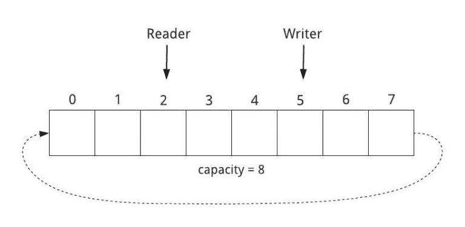
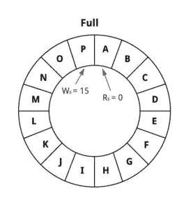
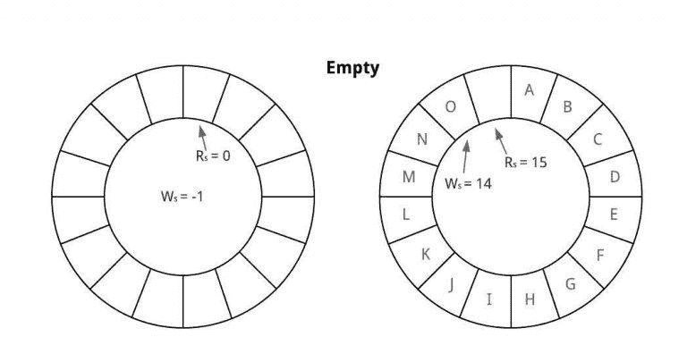

# 用 Java 实现环形缓冲区

> 原文：<https://web.archive.org/web/20220930061024/https://www.baeldung.com/java-ring-buffer>

## 1.概观

在本教程中，我们将学习如何用 Java 实现一个环形缓冲区。

## 2.环形缓冲区

**环形缓冲区(或循环缓冲区)是一种有界循环数据结构，用于在两个或多个线程之间缓冲数据**。当我们不断向环形缓冲区写入数据时，它会在到达末尾时绕回。

### 2.1.它是如何工作的

**使用固定大小的数组实现环形缓冲区，该数组在边界处环绕**。

除了数组之外，它还跟踪三样东西:

*   缓冲区中用于插入元素的下一个可用槽，
*   缓冲区中的下一个未读元素，
*   数组的结尾——缓冲区绕到数组开始的地方

[](/web/20221206025158/https://www.baeldung.com/wp-content/uploads/2020/06/Ring-Buffer-Array-768x376-1.jpeg)

环形缓冲区处理这些需求的机制随着实现的不同而不同。例如，关于这个主题的[维基百科](https://web.archive.org/web/20221206025158/https://en.wikipedia.org/wiki/Circular_buffer#Circular_buffer_mechanics)条目显示了一种使用四指针的方法。

我们将借用 [Disruptor](/web/20221206025158/https://www.baeldung.com/lmax-disruptor-concurrency) 使用序列实现环形缓冲区的方法。

我们需要知道的第一件事是容量——缓冲区的固定最大大小。接下来，**我们将使用两个单调递增的** **序列**:

*   写序列:从-1 开始，每插入一个元素就增加 1
*   读取序列:从 0 开始，每消耗一个元素就增加 1

我们可以使用 mod 操作将序列映射到数组中的索引:

```java
arrayIndex = sequence % capacity 
```

**mod 操作将序列环绕在边界周围，以在缓冲器**中导出一个槽:

[](/web/20221206025158/https://www.baeldung.com/wp-content/uploads/2020/06/RB-RING-1-768x409-1.jpeg)

让我们看看如何插入一个元素:

```java
buffer[++writeSequence % capacity] = element 
```

我们在插入一个元素之前对序列进行预递增。

为了消耗一个元素，我们进行后增量:

```java
element = buffer[readSequence++ % capacity] 
```

在这种情况下，我们对序列执行后递增。消耗一个元素并不会将其从缓冲区中移除——它只是留在数组中，直到被覆盖。

### 2.2.空的和满的缓冲器

当我们环绕数组时，我们将开始覆盖缓冲区中的数据。**如果缓冲区已满，我们可以选择覆盖最早的数据，而不管阅读器是否已经使用它，或者防止覆盖尚未读取的数据**。

如果读者可以忽略中间值或旧值(例如，股票报价器)，我们可以覆盖数据，而不必等待它被消费。另一方面，如果读取器必须使用所有的值(就像电子商务交易一样)，我们应该等待(阻塞/忙-等待)直到缓冲区有一个可用的槽。

**如果缓冲区的大小等于其容量**，则缓冲区已满，其中缓冲区的大小等于未读元素的数量:

```java
size = (writeSequence - readSequence) + 1
isFull = (size == capacity) 
```

[](/web/20221206025158/https://www.baeldung.com/wp-content/uploads/2020/06/RB-Full.jpeg)

**如果写序列落后于读序列，则缓冲器为空**:

```java
isEmpty = writeSequence < readSequence 
```

[](/web/20221206025158/https://www.baeldung.com/wp-content/uploads/2020/06/RB-EMPTY-1-768x405-1.jpeg) 如果缓冲区为空，则返回一个`null`值。

### 2.2.优点和缺点

环形缓冲器是一种有效的 FIFO 缓冲器。它使用可预先分配的固定大小的数组，并允许高效的内存访问模式。所有的缓冲操作都是恒定时间`O(1)`，包括消耗一个元素，因为它不需要元素的移位。

另一方面，确定正确的环形缓冲区大小也很关键。例如，如果缓冲区大小不足且读取缓慢，写入操作可能会阻塞很长时间。我们可以使用动态调整大小，但是这需要移动数据，而且我们会错过上面讨论的大部分优势。

## 3.用 Java 实现

现在我们已经了解了环形缓冲区是如何工作的，让我们继续用 Java 来实现它。

### 3.1.初始化

首先，让我们定义一个用预定义容量初始化缓冲区的构造函数:

```java
public CircularBuffer(int capacity) {
    this.capacity = (capacity < 1) ? DEFAULT_CAPACITY : capacity;
    this.data = (E[]) new Object[this.capacity];
    this.readSequence = 0;
    this.writeSequence = -1;
} 
```

这将创建一个空缓冲区并初始化序列字段，如前一节所述。

### 3.2.提供

接下来，我们将实现`offer`操作，该操作将一个元素插入到下一个可用槽的缓冲区中，并在成功时返回`true`。如果缓冲区找不到空槽，则返回`false`，即**我们无法覆盖未读值**。

让我们用 Java 实现`offer`方法:

```java
public boolean offer(E element) {
    boolean isFull = (writeSequence - readSequence) + 1 == capacity;
    if (!isFull) {
        int nextWriteSeq = writeSequence + 1;
        data[nextWriteSeq % capacity] = element;
        writeSequence++;
        return true;
    }
    return false;
} 
```

因此，我们递增写序列，并计算下一个可用片段在数组中的索引。然后，我们将数据写入缓冲区，并存储更新后的写序列。

让我们试一试:

```java
@Test
public void givenCircularBuffer_whenAnElementIsEnqueued_thenSizeIsOne() {
    CircularBuffer buffer = new CircularBuffer<>(defaultCapacity);

    assertTrue(buffer.offer("Square"));
    assertEquals(1, buffer.size());
} 
```

### 3.3.投票

最后，我们将实现检索和删除下一个未读元素的`poll`操作。**`poll`操作不会删除元素，但会增加读取顺序**。

让我们来实现它:

```java
public E poll() {
    boolean isEmpty = writeSequence < readSequence;
    if (!isEmpty) {
        E nextValue = data[readSequence % capacity];
        readSequence++;
        return nextValue;
    }
    return null;
} 
```

这里，我们通过计算数组中的索引来读取当前读取序列中的数据。然后，如果缓冲区不为空，我们递增序列并返回值。

让我们来测试一下:

```java
@Test
public void givenCircularBuffer_whenAnElementIsDequeued_thenElementMatchesEnqueuedElement() {
    CircularBuffer buffer = new CircularBuffer<>(defaultCapacity);
    buffer.offer("Triangle");
    String shape = buffer.poll();

    assertEquals("Triangle", shape);
} 
```

## 4.生产者-消费者问题

我们已经讨论了使用环形缓冲区在两个或多个线程之间交换数据，这是一个叫做[生产者-消费者](https://web.archive.org/web/20221206025158/https://en.wikipedia.org/wiki/Producer%E2%80%93consumer_problem)问题的同步问题的例子。在 Java 中，我们可以使用[信号量](/web/20221206025158/https://www.baeldung.com/java-semaphore)、[有界队列](/web/20221206025158/https://www.baeldung.com/java-blocking-queue#multithreaded-producer-consumer-example)、环形缓冲区等多种方式来解决生产者-消费者问题。

让我们实现一个基于环形缓冲区的解决方案。

### 4.1.`volatile`序列字段

我们实现的环形缓冲区不是线程安全的。对于简单的单生产者和单消费者的情况，让它成为线程安全的。

生产者向缓冲区写入数据并递增`writeSequence`，而消费者只从缓冲区读取数据并递增`readSequence`。因此，后备阵列是无争用的，我们可以不进行任何同步。

但是我们仍然需要确保消费者可以看到`writeSequence`字段的最新值([可见性](/web/20221206025158/https://www.baeldung.com/java-volatile#1-memory-visibility))，并且在数据在缓冲区中实际可用之前`writeSequence`不会被更新([排序](/web/20221206025158/https://www.baeldung.com/java-volatile#2-reordering))。

**在这种情况下，我们可以通过设置序列字段 [`volatile`](/web/20221206025158/https://www.baeldung.com/java-volatile)** 来使环形缓冲区并发且无锁:

```java
private volatile int writeSequence = -1, readSequence = 0; 
```

在`offer`方法中，对`volatile`字段`writeSequence` 的写入保证了对缓冲器的写入发生在更新序列之前。同时，`volatile`可见性保证确保消费者将始终看到`writeSequence`的最新值。

### 4.2.生产者

让我们实现一个简单的生产者`Runnable`来写入环形缓冲区:

```java
public void run() {
    for (int i = 0; i < items.length;) {
        if (buffer.offer(items[i])) {
           System.out.println("Produced: " + items[i]);
            i++;
        }
    }
} 
```

生产者线程将等待循环中的空槽(忙等待)。

### 4.3.消费者

我们将实现一个从缓冲区读取数据的消费者`Callable`:

```java
public T[] call() {
    T[] items = (T[]) new Object[expectedCount];
    for (int i = 0; i < items.length;) {
        T item = buffer.poll();
        if (item != null) {
            items[i++] = item;
            System.out.println("Consumed: " + item);
        }
    }
    return items;
} 
```

如果消费者线程从缓冲区接收到一个`null`值，它将继续执行而不打印。

让我们编写驱动程序代码:

```java
executorService.submit(new Thread(new Producer<String>(buffer)));
executorService.submit(new Thread(new Consumer<String>(buffer))); 
```

执行我们的生产者-消费者程序产生如下输出:

```java
Produced: Circle
Produced: Triangle
  Consumed: Circle
Produced: Rectangle
  Consumed: Triangle
  Consumed: Rectangle
Produced: Square
Produced: Rhombus
  Consumed: Square
Produced: Trapezoid
  Consumed: Rhombus
  Consumed: Trapezoid
Produced: Pentagon
Produced: Pentagram
Produced: Hexagon
  Consumed: Pentagon
  Consumed: Pentagram
Produced: Hexagram
  Consumed: Hexagon
  Consumed: Hexagram 
```

## 5.**结论**

在本教程中，我们学习了如何实现一个环形缓冲区，并探讨了如何用它来解决生产者-消费者问题。

像往常一样，所有例子的源代码都可以在 GitHub 的[上找到。](https://web.archive.org/web/20221206025158/https://github.com/eugenp/tutorials/tree/master/data-structures)