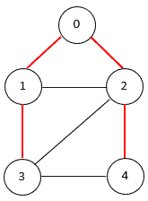
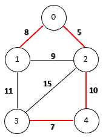
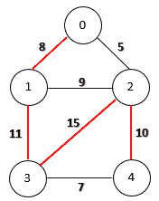

# Kruskal 的生成树算法及其 Java 实现

> 原文：<https://web.archive.org/web/20220930061024/https://www.baeldung.com/java-spanning-trees-kruskal>

## 1.概观

在上一篇文章中，我们介绍了 [Prim 的算法来寻找最小生成树](/web/20220730070126/https://www.baeldung.com/java-prim-algorithm)。在本文中，我们将使用另一种方法，Kruskal 算法，来解决最小和最大生成树问题。

## 2.生成树

无向图的生成树是一个连通的子图，它以尽可能少的边数覆盖了所有的图节点。一般来说，一个图可以有不止一个生成树。下图显示了一个带有生成树的图形(生成树的边用红色表示):

[](/web/20220730070126/https://www.baeldung.com/wp-content/uploads/2019/12/spanning_tree.png)

如果图是边加权的，我们可以将生成树的权重定义为其所有边的权重之和。**最小生成树是所有可能生成树中权重最小的生成树。**下图显示了边加权图上的最小生成树:

[](/web/20220730070126/https://www.baeldung.com/wp-content/uploads/2019/12/minimum_spanning_tree.png)

同样，**最大生成树在所有生成树中权重最大。**下图显示了边加权图上的最大生成树:

[](/web/20220730070126/https://www.baeldung.com/wp-content/uploads/2019/12/maximum_spanning_tree.png)

## 3.克鲁斯卡尔算法

给定一个图，我们可以用 Kruskal 的算法求出它的最小生成树。如果一个图中的节点数是`V`，那么它的每个生成树应该有(V-1)条边，并且不包含圈。我们可以用下面的伪代码来描述克鲁斯卡尔的算法:

```java
Initialize an empty edge set T. 
Sort all graph edges by the ascending order of their weight values. 
foreach edge in the sorted edge list
    Check whether it will create a cycle with the edges inside T.
    If the edge doesn't introduce any cycles, add it into T. 
    If T has (V-1) edges, exit the loop. 
return T
```

让我们在示例图上一步一步地运行 Kruskal 的最小生成树算法:

[](/web/20220730070126/https://www.baeldung.com/wp-content/uploads/2019/12/minimum_spanning_tree_alg.png)

首先，我们选择边(0，2 ),因为它的权重最小。然后，我们可以添加边(3，4)和(0，1)，因为它们不会创建任何循环。现在下一个候选是权重为 9 的 edge (1，2)。然而，如果我们包括这条边，我们将产生一个循环(0，1，2)。因此，我们丢弃这条边，继续选择下一条最小的边。最后，算法通过添加权重为 10 的边(2，4)结束。

**为了计算最大生成树，我们可以将排序顺序改为降序。**其他步骤保持不变。下图显示了我们的示例图上最大生成树的逐步构造。

[](/web/20220730070126/https://www.baeldung.com/wp-content/uploads/2019/12/maxmum_spanning_tree_alg.png)

## 4.具有不相交集的循环检测

在 Kruskal 的算法中，关键的部分是检查如果我们将一条边添加到现有的边集中，它是否会创建一个循环。我们可以使用几种图循环检测算法。例如，我们可以使用一个[深度优先搜索(DFS)算法](/web/20220730070126/https://www.baeldung.com/java-graph-has-a-cycle)来遍历图形，并检测是否存在循环。

然而，每次测试新的边时，我们都需要对现有的边进行循环检测。**一个更快的解决方案是使用具有不相交数据结构的联合查找算法，因为** **也使用增量边缘添加方法来检测循环。**我们可以将此融入我们的生成树构建流程。

### 4.1.不交集与生成树构造

首先，我们将图中的每个节点视为只包含一个节点的独立集合。然后，每当我们引入一条边时，我们检查它的两个节点是否在同一个集合中。如果答案是肯定的，那么这将形成一个循环。否则，我们将两个不相交的集合合并成一个集合，并包括生成树的边。

我们可以重复上述步骤，直到构建出完整的生成树。

例如，在上面的最小生成树构造中，我们首先有 5 个节点集:{0}、{1}、{2}、{3}、{4}。当我们检查第一条边(0，2)时，它的两个节点在不同的节点集中。因此，我们可以包含这条边，并将{0}和{2}合并为一个集合{0，2}。

我们可以对边(3，4)和(0，1)进行类似的操作。然后，节点集变成{0，1，2}和{3，4}。当我们检查下一条边(1，2)时，我们可以看到这条边的两个节点都在同一个集合中。因此，我们丢弃这条边，继续检查下一条边。最后，边(2，4)满足我们的条件，我们可以将它包含在最小生成树中。

### 4.2.不相交集实现

我们可以用一个树形结构来表示一个不相交的集合。每个节点都有一个指向其父节点的`parent`指针。在每个集合中，有一个唯一的根节点代表这个集合。根节点有一个自引用的`parent`指针。

让我们使用一个 Java 类来定义不相交集信息:

```java
public class DisjointSetInfo {
    private Integer parentNode;
    DisjointSetInfo(Integer parent) {
        setParentNode(parent);
    }

    //standard setters and getters
}
```

让我们用一个整数标记每个图节点，从 0 开始。我们可以使用一个列表数据结构`List<DisjointSetInfo> nodes`，来存储一个图的不相交集合信息。一开始，每个节点都是其自身集合的代表成员:

```java
void initDisjointSets(int totalNodes) {
    nodes = new ArrayList<>(totalNodes);
    for (int i = 0; i < totalNodes; i++) {
        nodes.add(new DisjointSetInfo(i));
    }
} 
```

### 4.3.查找操作

为了找到节点所属的集合，我们可以沿着节点的父链向上，直到到达根节点:

```java
Integer find(Integer node) {
    Integer parent = nodes.get(node).getParentNode();
    if (parent.equals(node)) {
        return node;
    } else {
        return find(parent);
    }
}
```

对于一个不相交的集合，可能有一个高度不平衡的树结构。**我们可以通过使用`p` *ath 压缩*技术来改进`find`操作。**

因为我们在到根节点的途中访问的每个节点都是同一个集合的一部分，所以我们可以将根节点直接附加到它的`parent `引用。下次当我们访问这个节点时，我们需要一个查找路径来获取根节点:

```java
Integer pathCompressionFind(Integer node) {
    DisjointSetInfo setInfo = nodes.get(node);
    Integer parent = setInfo.getParentNode();
    if (parent.equals(node)) {
        return node;
    } else {
        Integer parentNode = find(parent);
        setInfo.setParentNode(parentNode);
        return parentNode;
    }
}
```

### 4.4.联合操作

如果一条边的两个节点在不同的集合中，我们将把这两个集合合并成一个集合。我们可以通过将一个代表节点的根设置到另一个代表节点来实现这个`union`操作:

```java
void union(Integer rootU, Integer rootV) {
    DisjointSetInfo setInfoU = nodes.get(rootU);
    setInfoU.setParentNode(rootV);
}
```

这个简单的联合操作可能会产生一个非常不平衡的树，因为我们为合并的集合选择了一个随机的根节点。**我们可以使用 `union by rank`技术来提高性能。**

因为树的深度影响了`find` 操作`,` 的运行时间，所以我们将具有较短树的集合附加到具有较长树的集合。如果最初的两棵树具有相同的深度，则该技术仅增加合并树的深度。

为了实现这一点，我们首先向`DisjointSetInfo`类添加一个*等级*属性:

```java
public class DisjointSetInfo {
    private Integer parentNode;
    private int rank;
    DisjointSetInfo(Integer parent) {
        setParentNode(parent);
        setRank(0);
    }

    //standard setters and getters
}
```

开始时，单个不相交节点的秩为 0。在两个集合的并集过程中，排序较高的根节点成为合并集合的根节点。只有当原始的两个秩相同时，我们才将新的根节点的秩增加 1:

```java
void unionByRank(int rootU, int rootV) {
    DisjointSetInfo setInfoU = nodes.get(rootU);
    DisjointSetInfo setInfoV = nodes.get(rootV);
    int rankU = setInfoU.getRank();
    int rankV = setInfoV.getRank();
    if (rankU < rankV) {
        setInfoU.setParentNode(rootV);
    } else {
        setInfoV.setParentNode(rootU);
        if (rankU == rankV) {
            setInfoU.setRank(rankU + 1);
        }
    }
}
```

### 4.5.循环检测

我们可以通过比较两个`find`运算的结果来确定两个节点是否在同一个不相交集合中。如果它们有相同的代表性根节点，那么我们已经检测到一个循环。否则，我们通过使用一个`union`操作来合并两个不相交的集合:

```java
boolean detectCycle(Integer u, Integer v) {
    Integer rootU = pathCompressionFind(u);
    Integer rootV = pathCompressionFind(v);
    if (rootU.equals(rootV)) {
        return true;
    }
    unionByRank(rootU, rootV);
    return false;
} 
```

循环检测，单独使用`union by rank` 技术，[的运行时间为`O(logV)`](https://web.archive.org/web/20220730070126/https://en.wikipedia.org/wiki/Disjoint-set_data_structure) 。我们可以用 `path compression`和`union by rank` 技术获得更好的性能。运行时间为 [`O(α(V))`](https://web.archive.org/web/20220730070126/https://en.wikipedia.org/wiki/Disjoint-set_data_structure) ，其中`α(V)`为总节点数的[逆阿克曼函数](https://web.archive.org/web/20220730070126/https://en.wikipedia.org/wiki/Ackermann_function#Inverse)。在现实世界的计算中，它是一个小于 5 的小常数。

## 5.克鲁斯卡尔算法的 Java 实现

我们可以使用[谷歌番石榴](https://web.archive.org/web/20220730070126/https://search.maven.org/classic/#search%7Cga%7C1%7Cg%3A%22com.google.guava%22%20a%3A%22guava%22)中的 [`ValueGraph`](https://web.archive.org/web/20220730070126/https://guava.dev/releases/snapshot-jre/api/docs/com/google/common/graph/ValueGraph.html) 数据结构来表示一个边加权图。

要使用`ValueGraph`，我们首先需要将番石榴依赖项添加到我们项目的`pom.xml`文件中:

```java
<dependency>
    <groupId>com.google.guava</groupId>
    <artifactId>guava</artifactId>
    <version>31.0.1-jre</version>
</dependency>
```

我们可以把上面的循环检测方法包装成一个`CycleDetector `类，用在 Kruskal 的算法中。由于最小和最大生成树构造算法只有微小的差别，我们可以使用一个通用函数来实现这两种构造:

```java
ValueGraph<Integer, Double> spanningTree(ValueGraph<Integer, Double> graph, boolean minSpanningTree) {
    Set<EndpointPair> edges = graph.edges();
    List<EndpointPair> edgeList = new ArrayList<>(edges);

    if (minSpanningTree) {
        edgeList.sort(Comparator.comparing(e -> graph.edgeValue(e).get()));
    } else {
        edgeList.sort(Collections.reverseOrder(Comparator.comparing(e -> graph.edgeValue(e).get())));
    }

    int totalNodes = graph.nodes().size();
    CycleDetector cycleDetector = new CycleDetector(totalNodes);
    int edgeCount = 0;

    MutableValueGraph<Integer, Double> spanningTree = ValueGraphBuilder.undirected().build();
    for (EndpointPair edge : edgeList) {
        if (cycleDetector.detectCycle(edge.nodeU(), edge.nodeV())) {
            continue;
        }
        spanningTree.putEdgeValue(edge.nodeU(), edge.nodeV(), graph.edgeValue(edge).get());
        edgeCount++;
        if (edgeCount == totalNodes - 1) {
            break;
        }
    }
    return spanningTree;
}
```

在 Kruskal 的算法中，我们首先根据权重对所有图的边进行排序。该操作花费`O(ElogE)`时间，其中`E`是边的总数。

然后我们使用一个循环遍历排序后的边列表。在每次迭代中，我们检查是否会通过将边添加到当前生成树边集中来形成循环。这种循环检测最多花费`O(ElogV)` 时间。

所以整体运行时间为 `O(ELogE + ELogV)`。由于`E`的值在`O(V²)`的尺度内，所以克鲁斯卡尔算法的时间复杂度为`O(ElogE)`或`O(ElogV)`。

## 6.结论

在本文中，我们学习了如何使用 Kruskal 算法来寻找一个图的最小或最大生成树。和往常一样，这篇文章的源代码可以在 GitHub 的[上找到。](https://web.archive.org/web/20220730070126/https://github.com/eugenp/tutorials/tree/master/algorithms-modules/algorithms-miscellaneous-6)