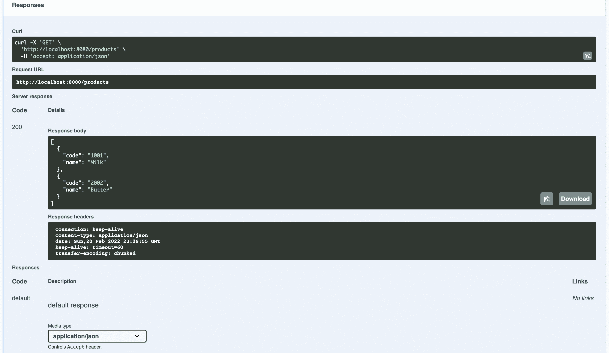

# 在 Swagger API 响应中设置对象列表

> 原文：<https://web.archive.org/web/20220930061024/https://www.baeldung.com/java-swagger-set-list-response>

## 1.概观

在本教程中，我们将学习如何修改 Swagger API 响应。首先，我们将从 OpenAPI 规范和 Swagger API 响应的一些解释开始。然后，我们将实现一个简单的例子，使用 Spring Boot 到[用 OpenApi 3.0](/web/20220613105332/https://www.baeldung.com/spring-rest-openapi-documentation) 记录一个 spring REST API。之后，我们将使用 Swagger 的注释来设置响应体，以传递对象列表。

## 2.履行

在这个实现中，我们将使用 Swagger UI 建立一个简单的 Spring Boot 项目。因此，我们将拥有包含应用程序所有端点的 Swagger UI。之后，我们将修改响应体以返回一个列表。

### 2.1.使用 Swagger UI 设置 Spring Boot 项目

首先，我们将创建一个保存产品列表的`ProductService`类。接下来，在`ProductController,`中，我们定义 REST APIs，让用户获得已创建产品的列表。

首先，让我们定义一下`Product`类:

```java
public class Product {
    String code;
    String name;

<span style="font-weight: 400">    // standard getters and setters</span>
}
```

然后，我们实现了`ProductService`类:

```java
@Service
public class ProductService {
    List<Product> productsList = new ArrayList<>();

    public List<Product> getProductsList() {
        return productsList;
    }
}
```

最后，我们将有一个`Controller`类来定义 REST APIs:

```java
@RestController
public class ProductController {
    final ProductService productService;

    public ProductController(ProductService productService) {
        this.productService = productService;
    }

    @GetMapping("/products")
    public List<Product> getProductsList(){
        return productService.getProductsList();
    }
}
```

### 2.2.修改 Swagger API 响应

有几个 Swagger 注释可用于记录 REST APIs。**使用`@ApiResponses`，我们可以定义一个@ApiResponse 数组来定义我们对 REST API 的预期响应。**

现在，让我们使用@ApiResponses 为`getProductList`方法的一系列`Product`对象设置响应内容:

```java
@ApiResponses(
  value = {
    @ApiResponse(
      content = {
        @Content(
          mediaType = "application/json",
          array = @ArraySchema(schema = @Schema(implementation = Product.class)))
      })
  })
@GetMapping("/products")
public List<Product> getProductsList() {
    return productService.getProductsList();
}
```

在这个例子中，我们在响应体中将媒体类型设置为`application/json `。此外，我们使用关键字`content`修改了响应主体。同样，使用`array`关键字，我们将响应设置为一组`Product`对象:

[](/web/20220613105332/https://www.baeldung.com/wp-content/uploads/2022/03/List-of-Products.png)

## 3.结论

在本教程中，我们快速浏览了 OpenAPI 规范和 Swagger API 响应。Swagger 为我们提供了`@ApiResponses`等各种注释，包括不同的关键词。因此，我们可以很容易地使用它们来修改请求和响应，以满足应用程序的需求。在我们的实现中，我们使用了`@ApiResponses`来修改 Swagger 响应体中的内容。

和往常一样，代码可以在 GitHub 的[上获得。](https://web.archive.org/web/20220613105332/https://github.com/eugenp/tutorials/tree/master/spring-boot-modules/spring-boot-springdoc)