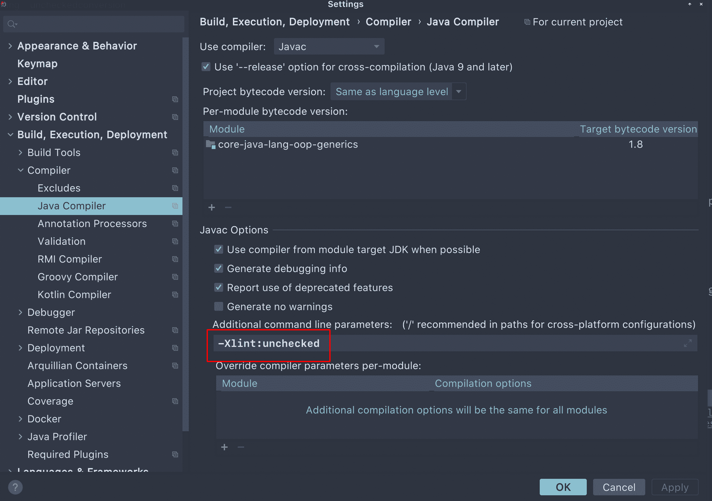

# Java 警告“未检查的转换”

> 原文：<https://web.archive.org/web/20220930061024/https://www.baeldung.com/java-unchecked-conversion>

## 1.概观

有时，当我们编译 Java 源代码时，编译器可能会打印一条警告消息`“unchecked conversion”` 或`The expression of type List needs unchecked conversion`。

在本教程中，我们将深入了解警告消息。我们将讨论这个警告意味着什么，它会导致什么问题，以及如何解决潜在的问题。

## 2.启用`Unchecked`警告选项

在我们查看“`unchecked conversion`”警告之前，让我们确保打印该警告的 Java 编译器选项已经启用。

如果我们使用的是 [Eclipse JDT 编译器](https://web.archive.org/web/20220807212928/https://www.eclipse.org/jdt/core/)，默认情况下这个警告是启用的。

**当我们使用 Oracle 或 OpenJDK javac 编译器时，我们可以通过添加编译器选项`-Xlint:unchecked.`** 来启用此警告

通常，我们在 IDE 中编写和构建 Java 程序。我们可以在 IDE 的编译器设置中添加这个选项。

例如，下面的截图显示了如何在 [JetBrains IntelliJ](https://web.archive.org/web/20220807212928/https://www.jetbrains.com/idea/) 中启用该警告:

[](/web/20220807212928/https://www.baeldung.com/wp-content/uploads/2021/01/screenshot_2021-01-21_22-27-48.png)

[Apache Maven](/web/20220807212928/https://www.baeldung.com/maven) 是一个广泛用于构建 Java 应用程序的工具。我们可以配置`maven-compiler-plugin`的`compilerArguments`来启用该选项:

```java
<build>
...
    <plugins>
    ...
        <plugin>
            <groupId>org.apache.maven.plugins</groupId>
            <artifactId>maven-compiler-plugin</artifactId>
            ...
            <configuration>
                ...
                <compilerArguments>
                    <Xlint:unchecked/>
                </compilerArguments>
            </configuration>
        </plugin>
    </plugins>
</build> 
```

既然我们已经确认 Java 编译器启用了这个警告选项，那么让我们更仔细地看看这个警告。

## 3.编译器什么时候会警告我们:`“unchecked conversion”?`

在上一节中，我们已经了解了如何通过设置 Java 编译器选项来启用警告。因此，不难想象 **`“unchecked conversion”`是一个编译时警告。**通常，**我们会在没有类型检查的情况下将原始类型赋给参数化类型时看到这个警告。**

编译器允许这种赋值，因为**编译器必须允许这种赋值，以保持与不支持泛型**的旧 Java 版本的向后兼容性。

举个例子就很快解释清楚了。假设我们有一个简单的方法来返回原始类型`List`:

```java
public class UncheckedConversion {
    public static List getRawList() {
        List result = new ArrayList();
        result.add("I am the 1st String.");
        result.add("I am the 2nd String.");
        result.add("I am the 3rd String.");
        return result;
    }
...
} 
```

接下来，让我们创建一个测试方法，它调用这个方法并将结果分配给一个类型为`List<String>`的变量:

```java
@Test
public void givenRawList_whenAssignToTypedList_shouldHaveCompilerWarning() {
    List<String> fromRawList = UncheckedConversion.getRawList();
    Assert.assertEquals(3, fromRawList.size());
    Assert.assertEquals("I am the 1st String.", fromRawList.get(0));
} 
```

现在，如果我们编译上面的测试，我们将会看到来自 Java 编译器的警告。

让我们使用 Maven 构建并测试我们的程序:

```java
$ mvn clean test
...
[WARNING] .../UncheckedConversionDemoUnitTest.java:[12,66] unchecked conversion
  required: java.util.List<java.lang.String>
  found:    java.util.List
...
[INFO] -------------------------------------------------------
[INFO] T E S T S
[INFO] -------------------------------------------------------
...
[INFO] Tests run: 13, Failures: 0, Errors: 0, Skipped: 0
[INFO] ------------------------------------------------------------------------
[INFO] BUILD SUCCESS
...
```

正如上面的输出所示，我们再现了编译器警告。

现实世界中的一个典型例子是当我们使用 [Java 持久性 API](/web/20220807212928/https://www.baeldung.com/hibernate-entitymanager) 的`[Query.getResultList()](https://web.archive.org/web/20220807212928/https://docs.oracle.com/javaee/7/api/javax/persistence/Query.html#getResultList--)`方法时。该方法返回一个原始类型`List`对象。

然而，当我们试图将原始类型列表赋给参数化类型的列表时，我们会在编译时看到以下警告:

```java
List<MyEntity> results = entityManager.createNativeQuery("... SQL ...", MyEntity.class).getResultList();
```

此外，我们知道如果编译器警告我们一些事情，这意味着有潜在的风险。如果我们回顾上面的 Maven 输出，我们将会看到，虽然我们得到了“`unchecked conversion`”警告，但是我们的测试方法没有任何问题。

很自然，我们可能会问为什么编译器用这个消息警告我们，我们可能会有什么潜在的问题？

接下来，我们来搞清楚。

## 4.为什么 Java 编译器会警告我们？

我们的测试方法在前面的部分中工作得很好，即使我们得到了“`unchecked conversion`”警告。这是因为`getRawList() `方法只将`String` s 添加到返回列表中。

现在，让我们稍微改变一下方法:

```java
public static List getRawListWithMixedTypes() {
    List result = new ArrayList();
    result.add("I am the 1st String.");
    result.add("I am the 2nd String.");
    result.add("I am the 3rd String.");
    result.add(new Date());
    return result;
} 
```

在新的`getRawListWithMixedTypes()`方法中，我们向返回的列表中添加了一个`Date`对象。这是允许的，因为我们正在返回一个可以包含任何类型的原始类型列表。

接下来，让我们创建一个新的测试方法来调用`getRawListWithMixedTypes()`方法并测试返回值:

```java
@Test(expected = ClassCastException.class)
public void givenRawList_whenListHasMixedType_shouldThrowClassCastException() {
    List<String> fromRawList = UncheckedConversion.getRawListWithMixedTypes();
    Assert.assertEquals(4, fromRawList.size());
    Assert.assertFalse(fromRawList.get(3).endsWith("String."));
} 
```

如果我们运行上面的测试方法，我们将再次看到“`unchecked conversion`”警告，测试将通过。

这意味着当我们通过调用`get(3)` 获得`Date`对象并试图将其类型转换为`String.`时，抛出了一个`ClassCastException`

**在现实世界中，根据需求的不同，有时异常抛出得太晚。**

例如，我们为`strList,`中的每个`String`对象分配`List<String> strList = getRawListWithMixedTypes().` ，假设我们在一个非常复杂或昂贵的过程中使用它，比如外部 API 调用或事务性数据库操作。

当我们在`strList`中的一个元素上遇到`ClassCastException`时，有些元素已经被处理了。因此，`ClassCastException`来得太晚，可能会导致一些额外的恢复或数据清理过程。

到目前为止，我们已经理解了`“unchecked conversion”`警告背后的潜在风险。接下来，让我们看看我们可以做些什么来避免风险。

## 5.我们该如何处理这个警告？

如果我们被允许改变返回原始类型集合的方法，我们应该考虑把它转换成一个泛型方法。通过这种方式，将确保类型安全。

然而，当我们遇到“`unchecked conversion`”警告时，很可能我们正在使用外部库中的方法。让我们看看在这种情况下我们能做些什么。

### 5.1.抑制警告

我们可以使用注释`SuppressWarnings(“unchecked”)`来取消警告。

然而，**只有当我们确信类型转换是安全的**时，我们才应该使用`@SuppressWarnings(“unchecked”)`注释，因为它只是抑制了警告消息，而没有任何类型检查。

让我们看一个例子:

```java
Query query = entityManager.createQuery("SELECT e.field1, e.field2, e.field3 FROM SomeEntity e");
@SuppressWarnings("unchecked")
List<Object[]> list = query.list();
```

正如我们前面提到的，JPA 的`Query.getResultList()`方法返回一个原始类型的`List`对象。根据我们的查询，我们确信原始类型列表可以转换为`List<Object[]>`。因此，我们可以在赋值语句上方添加`@SuppressWarnings`来抑制“`unchecked conversion`”警告。

### 5.2.在使用原始类型集合之前检查类型转换

警告消息“`unchecked conversion`”暗示我们应该在赋值前检查转换。

为了检查类型转换，我们可以遍历原始类型集合，并将每个元素转换为参数化类型。这样，如果有一些类型错误的元素，我们可以在真正使用元素之前得到`ClassCastException`。

我们可以构建一个泛型方法来进行类型转换。根据具体的需求，我们可以用不同的方式处理`ClassCastException`。

首先，假设我们将过滤掉具有错误类型的元素:

```java
public static <T> List<T> castList(Class<? extends T> clazz, Collection<?> rawCollection) {
    List<T> result = new ArrayList<>(rawCollection.size());
    for (Object o : rawCollection) {
        try {
            result.add(clazz.cast(o));
        } catch (ClassCastException e) {
            // log the exception or other error handling
        }
    }
    return result;
} 
```

让我们通过一个单元测试方法来测试上面的`castList()`方法:

```java
@Test
public void givenRawList_whenAssignToTypedListAfterCallingCastList_shouldOnlyHaveElementsWithExpectedType() {
    List rawList = UncheckedConversion.getRawListWithMixedTypes();
    List<String> strList = UncheckedConversion.castList(String.class, rawList);
    Assert.assertEquals(4, rawList.size());
    Assert.assertEquals("One element with the wrong type has been filtered out.", 3, strList.size());
    Assert.assertTrue(strList.stream().allMatch(el -> el.endsWith("String.")));
} 
```

当我们构建并执行测试方法时，“`unchecked conversion`”警告消失了，测试通过了。

当然，如果需要的话，我们可以改变我们的`castList() `方法来中断类型转换，并在检测到错误类型时立即抛出`ClassCastException`:

```java
public static <T> List<T> castList2(Class<? extends T> clazz, Collection<?> rawCollection) 
  throws ClassCastException {
    List<T> result = new ArrayList<>(rawCollection.size());
    for (Object o : rawCollection) {
        result.add(clazz.cast(o));
    }
    return result;
} 
```

像往常一样，让我们创建一个单元测试方法来测试`castList2()`方法:

```java
@Test(expected = ClassCastException.class)
public void givenRawListWithWrongType_whenAssignToTypedListAfterCallingCastList2_shouldThrowException() {
    List rawList = UncheckedConversion.getRawListWithMixedTypes();
    UncheckedConversion.castList2(String.class, rawList);
} 
```

如果我们试一试，上面的测试方法就会通过。这意味着一旦`rawList`中有错误类型的元素，`castList2()`方法将停止类型转换并抛出`ClassCastException.`

## 6.结论

在本文中，我们已经了解了什么是“`unchecked conversion`”编译器警告。此外，我们已经讨论了该警告的原因以及如何避免潜在风险。

和往常一样，这篇文章中的代码都可以在 GitHub 的[上找到。](https://web.archive.org/web/20220807212928/https://github.com/eugenp/tutorials/tree/master/core-java-modules/core-java-lang-oop-generics)