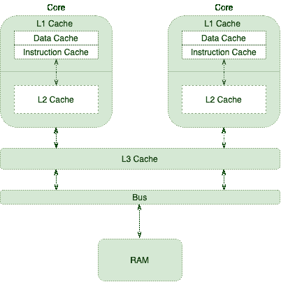

# Java 中的 Volatile 关键字指南

> 原文：<https://web.archive.org/web/20220930061024/https://www.baeldung.com/java-volatile>

## 1。概述

如果没有必要的同步，编译器、运行时或处理器可能会应用各种优化。尽管这些优化在大多数情况下是有益的，但有时它们会导致一些微妙的问题。

缓存和重新排序是在并发环境中可能会让我们惊讶的优化之一。Java 和 JVM 提供了许多控制[内存顺序](/web/20221006231457/http://www.baeldung.com/java-variable-handles#memory-ordering)的方法，`volatile `关键字就是其中之一。

在本教程中，我们将把重点放在 Java 语言中最基本但经常被误解的概念上，即`volatile`关键字。首先，我们将从底层计算机体系结构如何工作的一些背景知识开始，然后我们将熟悉 Java 中的内存顺序。

## 2.共享多处理器体系结构

处理器负责执行程序指令。因此，它们需要从 ram 中检索程序指令和所需的数据。

由于 CPU 每秒钟能够执行大量的指令，从 RAM 中取数据对它们来说并不理想。为了改善这种情况，处理器正在使用诸如[无序执行](https://web.archive.org/web/20221006231457/https://en.wikipedia.org/wiki/Out-of-order_execution)、[分支预测](https://web.archive.org/web/20221006231457/https://en.wikipedia.org/wiki/Branch_predictor)、[推测执行](https://web.archive.org/web/20221006231457/https://en.wikipedia.org/wiki/Speculative_execution)等技巧，当然还有缓存。

这就是以下内存层次发挥作用的地方:

[](/web/20221006231457/http://www.baeldung.com/wp-content/uploads/2017/08/cpu.png)

随着不同的内核执行更多的指令和处理更多的数据，它们会用更多相关的数据和指令来填充缓存。**这将提高整体性能，但代价是引入了[缓存一致性](https://web.archive.org/web/20221006231457/https://en.wikipedia.org/wiki/Cache_coherence)挑战**。

简单地说，当一个线程更新一个缓存值时，我们应该三思而行。

## 3。何时使用`volatile`

为了对缓存一致性进行更多的扩展，我们将从《实践中的 Java 并发性》一书中借用一个例子:

```
public class TaskRunner {

    private static int number;
    private static boolean ready;

    private static class Reader extends Thread {

        @Override
        public void run() {
            while (!ready) {
                Thread.yield();
            }

            System.out.println(number);
        }
    }

    public static void main(String[] args) {
        new Reader().start();
        number = 42;
        ready = true;
    }
}
```

`TaskRunner `类维护两个简单的变量。在其 main 方法中，它创建了另一个线程，只要它是`false. `就在`ready `变量上旋转。当变量变成`true, `时，线程将简单地打印`number `变量。

许多人可能希望这个程序在短暂的延迟后只打印 42 页；然而，在现实中，延迟可能要长得多。它甚至可能永远挂起，或者打印零。

**这些异常的原因是缺乏适当的内存可见性和重新排序**。让我们更详细地评估它们。

### 3.1.内存可见性

在这个简单的例子中，我们有两个应用程序线程:主线程和阅读器线程。让我们想象一个场景，操作系统在两个不同的 CPU 内核上调度这些线程，其中:

*   主线程在其核心缓存中有其`ready `和`number `变量的副本。
*   阅读器线程也以它的副本结束。
*   主线程更新缓存的值。

在大多数现代处理器上，写请求不会在发出后立即被应用。事实上，**处理器倾向于将这些写操作放在一个特殊的写缓冲区**中排队。过一会儿，它们会将这些写操作一次全部应用到主内存中。

综上所述，**当主线程更新`number `和`ready `变量时，不能保证读者线程会看到什么。换句话说，读取器线程可能会立即看到更新后的值，或者延迟一段时间，或者根本看不到。**

这种内存可见性可能会导致依赖于可见性的程序出现活动问题。

### 3.2.再订购

更糟糕的是，**读者线程可能会看到这些写操作的顺序不同于实际的程序顺序**。例如，因为我们首先更新了`number `变量:

```
public static void main(String[] args) { 
    new Reader().start();
    number = 42; 
    ready = true; 
}
```

我们可能期望读者线程打印 42。但是，实际上可以将打印值视为零。

重新排序是一种性能改进的优化技术。有趣的是，不同的组件可能会应用这种优化:

*   处理器可以以不同于程序顺序的顺序刷新其写缓冲器。
*   处理器可以应用无序执行技术。
*   JIT 编译器可以通过重新排序来优化。

### 3.3.`volatile`记忆顺序

**为了确保对变量的更新可以预测地传播到其他线程，我们应该对这些变量应用`volatile `修饰符:**

```
public class TaskRunner {

    private volatile static int number;
    private volatile static boolean ready;

    // same as before
}
```

通过这种方式，我们与运行时和处理器进行通信，以便不对任何涉及`volatile`变量的指令进行重新排序。此外，处理器知道它们应该立即刷新对这些变量的任何更新。

## 4。`volatile`和线程同步

对于多线程应用程序，我们需要确保几个规则来实现一致的行为:

*   互斥——一次只有一个线程执行一个关键部分
*   可见性——一个线程对共享数据所做的更改对其他线程是可见的，以保持数据的一致性

方法和块以应用程序性能为代价提供了上述两种特性。

`volatile`是一个非常有用的关键字，因为它**可以帮助确保数据变化的可见性，而不会导致互斥**。因此，在我们可以接受多线程并行执行一个代码块，但是我们需要确保可见性属性的地方，这是很有用的。

## 5。发生在订购前

`volatile`变量的内存可见性影响超出了`volatile`变量本身。

更具体地说，让我们假设线程 A 写入一个`volatile`变量，然后线程 B 读取同一个`volatile`变量。在这种情况下，**在写入`volatile`变量之前对 A 可见的值将在读取`volatile`变量:**之后对 B 可见

[](/web/20221006231457/http://www.baeldung.com/wp-content/uploads/2017/08/happens-before.png)

**从技术上讲，对`volatile`字段的任何写入都发生在对同一字段**的每次后续读取之前。这就是 Java 内存模型的`volatile`变量规则( [JMM](https://web.archive.org/web/20221006231457/https://docs.oracle.com/javase/specs/jls/se8/html/jls-17.html) )。

### 5.1.背负式装运

**由于发生前记忆排序的强度，有时我们可以借用另一个`volatile`变量**的可见性属性。例如，在我们的特定例子中，我们只需要将`ready `变量标记为`volatile`:

```
public class TaskRunner {

    private static int number; // not volatile
    private volatile static boolean ready;

    // same as before
}
```

在将`true `写入`ready`变量之前的任何内容在读取`ready `变量之后对任何内容都是可见的。因此，`number `变量依赖于由`ready`变量执行的内存可见性。简单地说`**, **` **即使它不是一个`volatile` 变量，它也展示了一个`volatile`行为。**

通过利用这些语义，我们可以只将类中的一些变量定义为`volatile` ，并优化可见性保证。

## 6。结论

在本文中，我们探索了关键字`volatile` 及其功能，以及从 Java 5 开始对其进行的改进。

和往常一样，代码示例可以在 GitHub 上找到[。](https://web.archive.org/web/20221006231457/https://github.com/eugenp/tutorials/tree/master/core-java-modules/core-java-concurrency-simple)