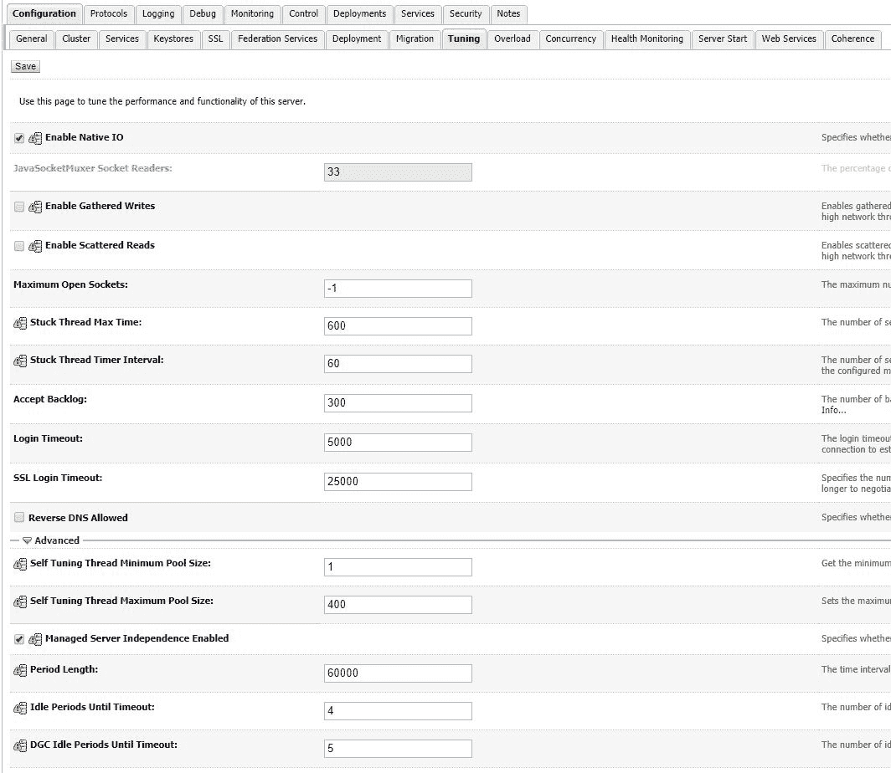

# 为 Java Web 服务器配置线程池

> 原文：<https://web.archive.org/web/20220930061024/https://www.baeldung.com/java-web-thread-pool-config>

## 1.介绍

在本教程中，我们将了解 Apache Tomcat、Glassfish Server 和 Oracle Weblogic 等 Java web 应用服务器的线程池配置。

## 2.服务器线程池

**[服务器线程池](/web/20221206000620/https://www.baeldung.com/thread-pool-java-and-guava)由 web 应用服务器为部署的应用使用和管理。**这些线程池存在于 web 容器或 servlet 之外，因此它们不受制于相同的上下文边界。

与应用程序线程不同，服务器线程甚至在部署的应用程序停止后仍然存在。

## 3.阿帕奇雄猫

首先，我们可以通过我们的`server.xml`中的`Executor `配置类配置 Tomcat 的服务器线程池:

```java
<Executor name="tomcatThreadPool" namePrefix="catalina-exec-" maxThreads="150" minSpareThreads="25"/>
```

`minSpareThreads`是最小的池，包括启动时。在服务器开始对请求进行排队之前，`maxThreads` 是最大的池，**。**

Tomcat 默认分别为 25 和 200。在这个配置中，我们已经使线程池比缺省值小了一点。

### 3.1.嵌入式 Tomcat

类似地，我们可以为 Spring Boot 修改一个[嵌入式 Tomcat 服务器](/web/20221206000620/https://www.baeldung.com/spring-boot-configure-tomcat)，通过设置一个应用程序属性来配置一个线程池:

```java
server.tomcat.max-threads=250
```

从 Boot 2.3 开始，该属性已更改为:

```java
server.tomcat.threads.max=250
```

## 4.玻璃鱼

接下来，让我们更新我们的 Glassfish 服务器。

Glassfish 使用 admin 命令，而不是 Tomcat 的 XML 配置文件，`server.xml.` 在提示符下，我们运行:

```java
create-threadpool
```

我们可以给`create-threadpool` 添加标志`maxthreadpoolsize` 和`minthreadpoolsize.` ，它们的功能类似于 Tomcat `minSpareThreads`和`maxThreads`:

```java
--maxthreadpoolsize 250 --minthreadpoolsize 25
```

我们还可以指定线程在返回池之前可以空闲多长时间:

```java
--idletimeout=2
```

然后，我们在最后提供线程池的名称:

```java
asadmin> create-threadpool --maxthreadpoolsize 250 --minthreadpoolsize 25 --idletimeout=2 threadpool-1
```

## 5.中间件

Oracle Weblogic 为我们提供了使用工作管理器改变自调优线程池的能力。

与线程队列类似，工作管理器将线程池作为一个队列来管理。但是，WorkManager 会根据实时吞吐量添加动态线程。Weblogic 定期对吞吐量进行分析，以优化线程利用率。

这对我们意味着什么？这意味着虽然我们可以改变线程池，但是 web 服务器将最终决定是否产生新的线程。

我们可以在 Weblogic 管理控制台中配置线程池:

[](/web/20221206000620/https://www.baeldung.com/wp-content/uploads/2020/02/Weblogic_screen_1.jpg)

更新`Self Tuning Minimum Thread Pool Size`和`Self Tuning Thread Maximum Pool Size`值为工作管理器设置最小和最大边界。

注意`Stuck Thread Max Time`和`Stuck Thread Timer Interval `值。这些帮助工作管理器对阻塞的线程进行分类。

有时，长时间运行的进程可能会导致线程阻塞。工作管理器将从线程池中产生新的线程来进行补偿。对这些值的任何更新都可能会延长流程完成的时间。

线程停滞可能是代码问题的征兆，所以最好是解决根本原因，而不是使用变通方法。

## 6.结论

在这篇简短的文章中，我们研究了配置应用服务器线程池的多种方法。

虽然应用服务器管理各种线程池的方式有所不同，但它们是使用类似的概念进行配置的。

最后，让我们记住，改变 web 服务器的配置值并不是对性能差的代码和糟糕的应用程序设计的适当修正。