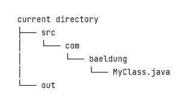

# 用 javac 编译目录结构中的所有 Java 类

> 原文：<https://web.archive.org/web/20220930061024/https://www.baeldung.com/javac-compile-classes-directory>

## 1.概观

在一些特殊情况下，我们没有安装第三方的构建工具，比如 Ant 或者 Maven。而且，我们仍然需要编译一个包含许多包和类的项目。

在本教程中，我们将使用 [`javac`](/web/20220815034224/https://www.baeldung.com/javac) 命令在不同的场景下完成这项任务。

## 2.使用文件名

假设我们在当前目录中有两个目录:`src`和`out`。`src`目录保存我们的 Java 源文件，`out`目录将包含相应的编译后的类文件。

让我们从一个简单的场景开始。`src`目录包含一个名为`com/baeldung/MyClass.java`的 Java 源文件:

[](/web/20220815034224/https://www.baeldung.com/wp-content/uploads/2022/03/2_javac-compile-all-java-source-files-in-a-directory-structure-01.png)

然后，让我们用`javac`将`MyClass.java`文件编译到`out`目录中:

```java
$ javac -d ./out/ ./src/com/baeldung/MyClass.java
```

在上面的命令中，`-d`选项指定了类文件的目标目录。此外，我们应该注意到,`MyClass.java`文件的确切代码并不重要，我们只需要确保它是一个语法正确的 Java 文件。

稍微复杂一点，让我们再添加三个 Java 文件——`YourClass.java`、`HerClass.java`和`HisClass.java`:

[](/web/20220815034224/https://www.baeldung.com/wp-content/uploads/2022/03/javac-compile-all-java-source-files-in-a-directory-structure-02.png)

要编译上述所有四个 Java 文件，我们可以在命令行中列出它们:

```java
$ javac -d ./out/ \
./src/com/baeldung/MyClass.java \
./src/com/baeldung/YourClass.java \
./src/com/baeldung/HerClass.java \
./src/com/baeldung/HisClass.java
```

然后，让我们添加一个新的`Main.java`文件，该文件引用其他四个 Java 文件，例如，通过调用方法或创建一个对象实例: [](/web/20220815034224/https://www.baeldung.com/wp-content/uploads/2022/03/2_javac-compile-all-java-source-files-in-a-directory-structure-03.png)

在这种情况下，我们只需要编译`Main.java`文件:

```java
$ javac -sourcepath ./src/ -d ./out/ ./src/com/baeldung/Main.java
```

在上面的命令之后，其他四个类文件也将被编译。那是因为`javac`默认会搜索需要的类型并编译相应的源文件。如果我们不想编译所需的类型，我们可以添加`-implicit:none`选项。

`-sourcepath`选项告诉 Java 编译器在哪里可以找到输入源文件。如果没有指定`-sourcepath`选项，`javac`将利用用户类路径来搜索类文件和源文件。因此，我们可以用`-classpath`或`-cp`选项替换`-sourcepath`选项:

```java
$ javac -cp ./src/ -d ./out/ ./src/com/baeldung/Main.java
```

**然而，这种方法有其局限性:`javac`命令只编译所需的类型，忽略了其他源文件**。例如，如果我们添加一个新的`ItsClass.java`，而`Main.java`没有引用它，那么`ItsClass.java`将不会被编译:

[](/web/20220815034224/https://www.baeldung.com/wp-content/uploads/2022/03/2_javac-compile-all-java-source-files-in-a-directory-structure-04.png)

总而言之，有两种情况适合在`javac`命令行中列出文件名:只有几个 Java 源文件时，以及有一个递归引用其他类的启动器类时。

## 3.使用通配符

`javac`命令还支持通配符(*)，用于编译同一目录下的多个源文件。

例如，我们可以使用通配符来编译上面的源文件:

```java
$ javac -d ./out/ ./src/com/baeldung/*.java
```

为了使我们的场景更加复杂，让我们添加四个子包(`spring`、`summer`、`autumn`和`winter`)和相应的类:

[](/web/20220815034224/https://www.baeldung.com/wp-content/uploads/2022/03/javac-compile-all-java-source-files-in-a-directory-structure-05.png)

现在，在命令行中，我们可以用通配符列出每个包来编译它们:

```java
$ javac -d ./out/ \
./src/com/baeldung/*.java \
./src/com/baeldung/spring/*.java \
./src/com/baeldung/summer/*.java \
./src/com/baeldung/autumn/*.java \
./src/com/baeldung/winter/*.java
```

当只有几个包时，不管源文件号是多少，都适合使用这种通配符方法。

## 4.使用参数文件

当有多个包要编译时，使用带有参数文件的`javac`命令就很方便了。**一个参数文件可以包含`javac`选项和源文件名。**

要使用一个参数文件，我们需要在参数文件名前面加上 at 符号(`@`)前导字符:

```java
$ javac -d ./out/ @sources.txt
```

但是怎样才能生成这样一个`@sources.txt`文件呢？这取决于我们使用的操作系统。在 Linux 或 macOS 中，我们可以使用`find`命令:

```java
$ find ./src/ -type f -name "*.java" > sources.txt
```

在上面的命令行中，`./src/`是我们的搜索起点目录，`-type f`选项只过滤常规文件，`-name “*.java”`选项匹配所有扩展名为`.java`的文件名。

但是，在 Windows 中，我们可以使用`dir`命令:

```java
> dir src /b /s *.java > sources.txt
```

在上面的命令行中，`src`文件夹是我们的搜索路径，`/b`开关显示了没有附加信息的目录和文件名，`/s`选项列出了指定目录和所有子目录中的所有文件。

**这种方法的缺点是，每次我们添加一个新的或者删除一个现有的 Java 源文件，我们都需要重新生成`sources.txt`文件**。

## 5.其他方法

除了上述常见方法之外，还存在其他依赖于操作系统的方法，例如使用`globstar`或管道。

### 5.1.使用 Globstar

Bash 版本增加了一个新的名为`globstar`的 globbing 选项，它以不同的方式处理双通配符(`**`)。启用它后，Bash 将遍历多级目录；否则，Bash 只会搜索单级目录。

但是，默认情况下，此选项是禁用的。并且，我们可以使用`shopt` (sh + opt，shell options)命令来检查 Bash 选项设置。如果我们不带任何参数地执行`shopt`命令，它将输出一长串选项及其状态(`on`或`off`)。

目前，我们只关心`globstar`选项:

```java
$ shopt globstar
globstar       	off
```

为了启用它，我们使用带有`-s`选项的`shopt`命令:

```java
$ shopt -s globstar
```

要禁用它，我们调用带有 `-u`选项的`shopt`命令:

```java
$ shopt -u globstar
```

启用该选项后，我们可以用双通配符调用**:**

```java
$ javac -d ./out/ ./src/**/*.java
```

### 5.2.使用管道

从概念上讲，管道是两个进程之间的连接。而且，我们可以利用这个管道机制来连接多个命令，以产生我们想要的结果。

为了编译我们的 Java 源文件，我们可以组合使用`find`、`xargs`和`javac`命令:

```java
$ find ./src/ -type f -name "*.java" | xargs javac -cp ./src/ -d ./out/
```

另外，`find`命令支持`-exec`动作:

```java
$ find ./src/ -type f -name "*.java" -exec javac -cp ./src/ -d ./out/ '{}' ';'
```

**上面的命令行可能运行得有点慢**。这是因为`javac`命令将为每个匹配的文件运行。更多信息，我们可以使用`man find`命令来阅读`-exec`选项的文档。

**要快一点，我们可以把分号(`;`)改成加号(`+` )** 。然后，`javac`命令将收集所有匹配的文件，并且只执行一次:

```java
$ find ./src/ -type f -name "*.java" -exec javac -cp ./src/ -d ./out/ '{}' +
```

## 6.结论

在本文中，我们首先研究了在目录结构中编译所有 Java 源文件的一些常用方法，比如使用文件名、通配符和参数文件。然后，我们看了一些依赖于操作系统的方法，比如使用`globstar`和管道。