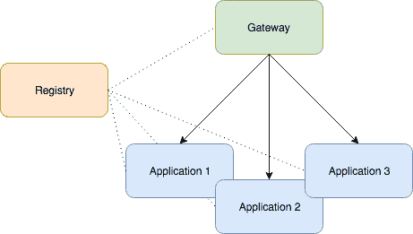
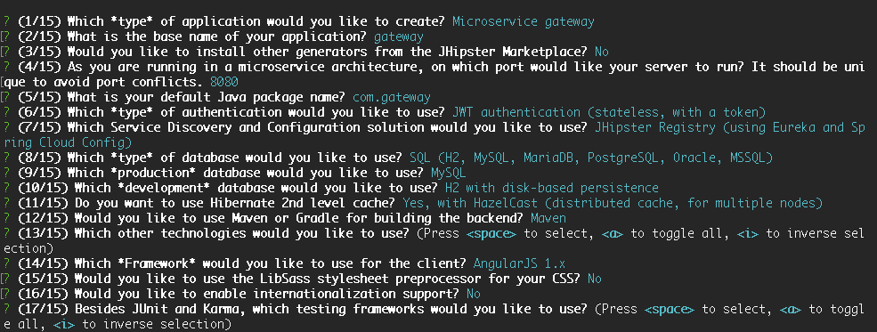

# JHipster 采用微服务架构

> 原文：<https://web.archive.org/web/20220930061024/https://www.baeldung.com/jhipster-microservices>

## 1。简介

在这篇文章中，我们将探索一个有趣的例子——构建一个简单的微服务架构。我们将展示如何构建和部署所有必需的部分，最终，我们将有一个成熟的微服务应用程序启动并运行。

如果您是 JHipster 的新手，请在继续深入了解这个项目生成工具的基础知识之前，查看我们的介绍文章。

## 2。整体服务与微服务

在我们的第一篇文章中，我们说明了如何创建和引导一个相对容易维护的整体应用程序。

另一方面，我们的微服务系统将前端和后端分开，后端又可以分成几个小的应用程序，每个应用程序处理整个应用程序域的一个子集。当然，与所有微服务实现一样，这解决了一些问题，但也带来了一些复杂性，例如处理组件注册和安全性。

JHipster 将在现代开源工具的帮助下解决管理微服务应用程序的大多数困难，如网飞的 [Eureka Server](https://web.archive.org/web/20221128113847/https://github.com/Netflix/eureka/) 和哈希公司的 [Consul](https://web.archive.org/web/20221128113847/https://www.hashicorp.com/blog/consul-announcement/) 。

当然，这里需要考虑一些事情，比如我们的域有多大或有多复杂，我们的应用程序有多重要，我们需要什么级别的可用性，我们是否要在不同的服务器和位置上托管我们的服务，等等。这些工具的目标当然是使这些排列成为可能并易于管理。

### 2.1。JHipster 微服务组件

当使用 JHipster 处理微服务架构时，我们需要构建和部署至少三个不同的项目:一个 JHipster 注册表、一个微服务网关和至少一个微服务应用程序。

JHipster 注册中心是微服务架构的重要组成部分。它将所有其他组件联系在一起，使它们能够相互通信。

**微服务应用**包含后端代码。一旦运行，它将公开它所关心的领域的 API。一个微服务架构可能由许多微服务应用程序组成，每个应用程序都包含一些相关的实体和业务规则。

**而微服务网关**拥有所有的前端(Angular)代码，将会消费整组微服务应用创建的 API:

[](/web/20221128113847/https://www.baeldung.com/wp-content/uploads/2017/05/JHipster-Microservice-Architecture.png)

## 3。安装

有关安装过程的所有细节，请查看我们关于 JHipster 的介绍文章。

## 4。创建微服务项目

现在让我们安装微服务项目的三个核心组件。

### 4.1。安装 JHipster 注册表

由于 JHipster 注册表是一个标准的 JHipster，所以我们只需要下载并运行它。没有必要修改它:

```java
git clone https://github.com/jhipster/jhipster-registry
cd jhipster-registry && ./mvnw
```

这将从 GitHub 克隆`jhipster` `-registry`项目并启动应用程序。一旦成功启动，我们可以访问 http://localhost:8761/并使用用户`admin`和密码`admin`登录:

[](/web/20221128113847/https://www.baeldung.com/wp-content/uploads/2017/05/Captura-de-Tela-2017-05-16-às-19.21.58.png)

### 4.2。安装微服务应用

这里是我们开始构建项目的实际特性的地方。在本例中，我们将创建一个管理汽车的简单微服务应用程序。因此，首先我们将创建应用程序，然后我们将向它添加一个实体:

```java
# create a directory for the app and cd to it
mkdir car-app && cd car-app
# run the jhipster wizard
yo jhipster
```

向导启动后，让我们按照说明创建一个名为`carapp`的微服务类型应用程序。一些其他相关参数是:

*   端口:8081
*   包装:`com.car.app`
*   认证:JWT
*   服务发现:JHipster 注册表

下面的屏幕截图显示了完整的选项集:

[](/web/20221128113847/https://www.baeldung.com/wp-content/uploads/2017/05/jhipster-microservice-app-wizard.png)

现在我们将向我们的应用程序添加一个`car`实体:

```java
# runs entity creation wizard
yo jhipster:entity car
```

实体创建向导将启动。我们应该按照说明创建一个名为`car` 的实体，它有三个字段:`make`、`model`和`price.`

一旦完成，我们的第一个微服务应用就完成了。如果我们看一下生成的代码，我们会注意到没有 javascript、HTML、CSS 或任何前端代码。这些都将在微服务网关创建后产生。此外，查看自述文件，了解关于该项目的重要信息和有用的命令。

最后，让我们运行新创建的组件:

```java
./mvnw
```

在运行上面的命令之前，我们应该确保`jhipster-registry`组件已经启动并正在运行。否则，我们会得到一个错误。

如果一切都按计划进行，我们的`car-app`将会启动，并且`jhipster-registry`日志将会告诉我们该应用已经成功注册:

```java
Registered instance CARAPP/carapp:746e7525dffa737747dcdcee55ab43f8
  with status UP (replication=true)
```

### 4.3。安装微服务网关

现在是前端部分。我们将创建一个微服务网关，并向它表明我们在现有组件上有一个实体，我们希望为其创建前端代码:

```java
# Create a directory for our gateway app
mkdir gateway-app && cd gateway-app
# Runs the JHipster wizard
yo jhipster
```

让我们按照说明创建一个微服务网关类型的应用程序。我们将应用程序命名为`gateway`，并为其他参数选择以下选项:

*   端口:8080
*   包装:`com.gateway`
*   作者:JWT
*   服务发现:JHipster 注册表

下面是一组完整参数的汇总:

[](/web/20221128113847/https://www.baeldung.com/wp-content/uploads/2017/05/jhipster-microservice-gateway-wizard.png)

让我们继续实体创建:

```java
# Runs entity creation wizard
yo jhipster:entity car
```

当被问及我们是否想从现有的微服务中生成时，选择`Yes` `,` ，然后输入`car-app`根目录的相对路径(例如：../car-app)。最后，当询问我们是否要更新实体时，选择`Yes, regenerate the entity`。

JHipster 将找到`Car.json`文件，它是我们之前创建的现有微服务应用程序的一部分，并将使用该文件中包含的元数据为该实体创建所有必要的 UI 代码:

```java
Found the .jhipster/Car.json configuration file, entity can be automatically generated!
```

运行`gateway-app`并测试一切是否正常的时间到了:

```java
# Starts up the gateway-app component
./mvnw
```

现在让我们导航到 http://localhost:8080/并用用户`admin` 和密码 `admin`登录。在顶部菜单上，我们应该会看到一个项目`Car`，它会带我们到汽车列表页面。一切都好！

[](/web/20221128113847/https://www.baeldung.com/wp-content/uploads/2017/05/jhipster-car-page.png) [](/web/20221128113847/https://www.baeldung.com/wp-content/uploads/2017/05/jhipster-create-car.png)

### 4.4。创建第二个微服务应用

接下来，让我们的系统更进一步，**创建微服务应用**类型的第二个组件。这个新组件将管理汽车经销商，所以我们将向它添加一个名为`dealer`的实体。

让我们创建一个新目录，导航到该目录并运行`yo jhipster`命令:

```java
mkdir dealer-app && cd dealer-app
yo jhipster
```

之后，我们键入`dealerapp`作为应用程序的名称，并选择端口`8082`让它运行(这是一个不同于我们用于`jhipster-` `registry`和`car-app`的端口，这一点很关键)。

对于其他参数，我们可以选择任何我们想要的选项。请记住，这是一个独立的微服务，因此它可以使用与`car-app`组件不同的数据库类型、缓存策略和测试。

让我们给我们的`dealer`实体添加几个字段。例如`name`和`address:`

```java
# Runs the create entity wizard
yo jhipster:entity dealer
```

我们不应该忘记导航到`gateway-app`并告诉它为`dealer`实体生成前端代码:

```java
# Navigate to the gateway-app root directory
cd ../gateway-app
# Runs the create entity wizard 
yo jhipster:entity dealer
```

最后，在`dealer-app`根目录上运行`./mvnw` 来启动该组件。

接下来，我们可以访问我们的网关应用程序 http://localhost:8080，并刷新页面以查看为经销商实体新创建的菜单项。

在我们结束之前，让我们再看一下 http://localhost:8761/上的`jhipster-registry`应用程序。单击“应用程序”菜单项，检查我们的三个组件是否都已成功识别和注册:
[](/web/20221128113847/https://www.baeldung.com/wp-content/uploads/2017/05/jhipster-registered-applications-1.png)
[](/web/20221128113847/https://www.baeldung.com/wp-content/uploads/2017/05/Captura-de-Tela-2017-05-16-às-19.26.48.png)
就是这样！我们创建了一个复杂的架构，由一个网关应用组成，所有前端代码由两个微服务在几分钟内提供支持。

## 5。结论

用 JHipster 启动一个微服务架构项目相当容易；我们只需要根据需要创建尽可能多的微服务应用和一个微服务网关，就万事俱备了。

你可以在 JHipster 官方网站上进一步探索这个框架。

和往常一样，我们的汽车应用程序、经销商应用程序和网关应用程序的代码库可以在 GitHub 上获得[。](https://web.archive.org/web/20221128113847/https://github.com/eugenp/tutorials/tree/master/jhipster-modules/jhipster-microservice)