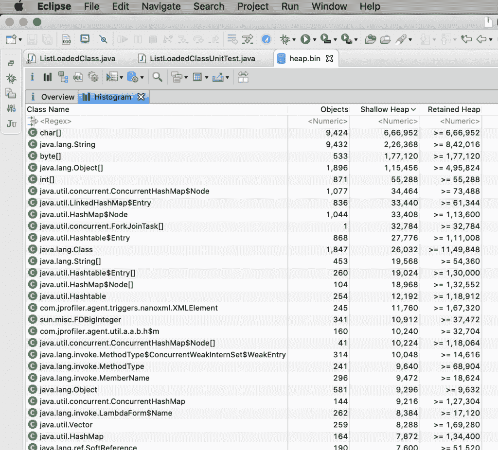
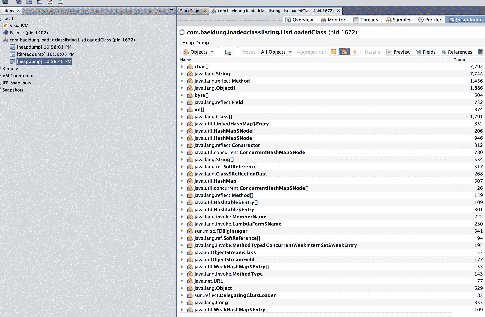
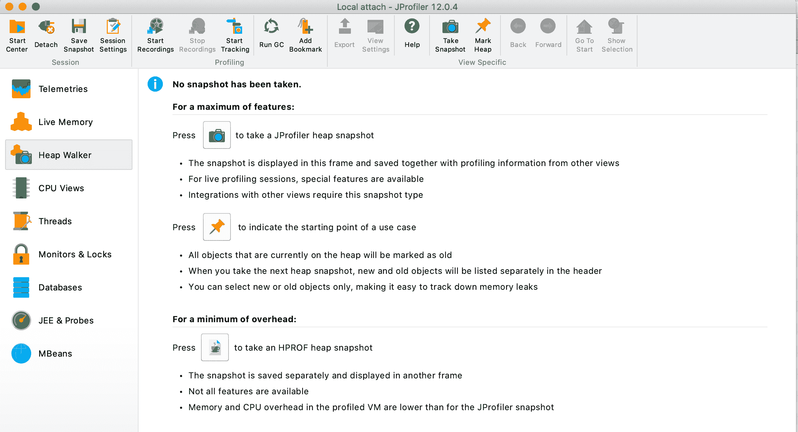
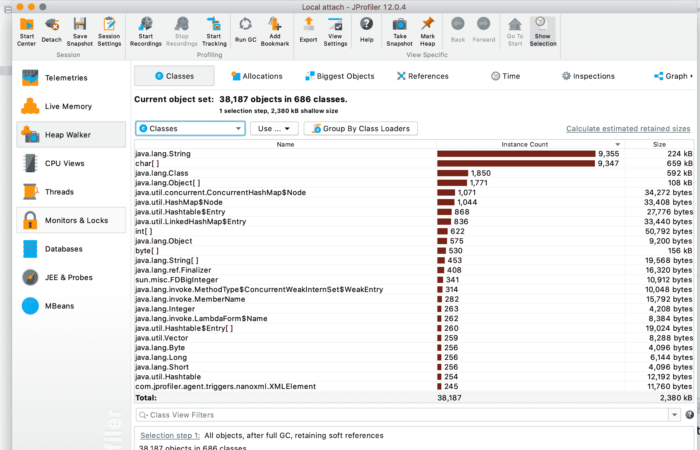

# 列出 JVM 中加载的所有类

> 原文：<https://web.archive.org/web/20220930061024/https://www.baeldung.com/jvm-list-all-classes-loaded>

## 1.概观

在本教程中，我们将学习不同的技术来列出 JVM 中加载了的所有[类。例如，我们可以加载 JVM 的堆转储，或者将正在运行的应用程序连接到各种工具，并列出该工具中加载的所有类。此外，有各种各样的库可以通过编程实现这一点。](/web/20220525130342/https://www.baeldung.com/java-classloaders)

我们将探索非编程方法和编程方法。

## 2.非方案方法

### 2.1.使用虚拟机参数

列出所有加载的类的最直接的方法是将它记录在控制台输出或文件中。

我们将使用下面的 JVM 参数运行 Java 应用程序:

```java
java <app_name> --verbose:class 
```

```java
[Opened /Library/Java/JavaVirtualMachines/jdk1.8.0_241.jdk/Contents/Home/jre/lib/rt.jar]
[Loaded java.lang.Object from /Library/Java/JavaVirtualMachines/jdk1.8.0_241.jdk/Contents/Home/jre/lib/rt.jar] 
[Loaded java.io.Serializable from /Library/Java/JavaVirtualMachines/jdk1.8.0_241.jdk/Contents/Home/jre/lib/rt.jar] 
[Loaded java.lang.Comparable from /Library/Java/JavaVirtualMachines/jdk1.8.0_241.jdk/Contents/Home/jre/lib/rt.jar] 
[Loaded java.lang.CharSequence from /Library/Java/JavaVirtualMachines/jdk1.8.0_241.jdk/Contents/Home/jre/lib/rt.jar] 
[Loaded java.lang.String from /Library/Java/JavaVirtualMachines/jdk1.8.0_241.jdk/Contents/Home/jre/lib/rt.jar] 
[Loaded java.lang.reflect.AnnotatedElement from /Library/Java/JavaVirtualMachines/jdk1.8.0_241.jdk/Contents/Home/jre/lib/rt.jar] 
[Loaded java.lang.reflect.GenericDeclaration from /Library/Java/JavaVirtualMachines/jdk1.8.0_241.jdk/Contents/Home/jre/lib/rt.jar] 
[Loaded java.lang.reflect.Type from /Library/Java/JavaVirtualMachines/jdk1.8.0_241.jdk/Contents/Home/jre/lib/rt.jar] 
[Loaded java.lang.Class from /Library/Java/JavaVirtualMachines/jdk1.8.0_241.jdk/Contents/Home/jre/lib/rt.jar] 
...............................
```

对于 Java 9，我们将使用`-Xlog` JVM 参数来记录加载到文件中的类:

```java
java <app_name> -Xlog:class+load=info:classloaded.txt
```

### 2.2.使用堆转储

我们将看到不同的工具如何使用 JVM [堆转储](/web/20220525130342/https://www.baeldung.com/java-heap-dump-capture)来提取类加载的信息。但是，首先，我们将使用下面的命令生成堆转储:

```java
jmap -dump:format=b,file=/opt/tmp/heapdump.bin <app_pid> 
```

上面的堆转储可以在各种工具中打开，以获得不同的指标。

在 Eclipse 中，我们将在 [Eclipse 内存分析器](https://web.archive.org/web/20220525130342/https://www.eclipse.org/mat/)中加载堆转储文件`heapdump.bin`，并使用直方图接口:

[](/web/20220525130342/https://www.baeldung.com/wp-content/uploads/2021/11/eclipse-histogram.png)

我们现在将在 Java [VisualVM](https://web.archive.org/web/20220525130342/https://visualvm.github.io/) 接口中打开堆转储文件`heapdump.bin` ，并使用按实例或大小分类选项:

[](/web/20220525130342/https://www.baeldung.com/wp-content/uploads/2021/11/heapdump-visualvm.png)

### 2.3.JProfiler

JProfiler 是顶级的 Java 应用程序分析器之一，它拥有一组丰富的特性来查看不同的指标。

在 [JProfiler](https://web.archive.org/web/20220525130342/https://www.ej-technologies.com/products/jprofiler/overview.html) 中，我们可以**附加到正在运行的 JVM 或加载堆转储文件**并获取所有与 JVM 相关的指标，包括所有加载的类的名称。

我们将使用附加进程特性让 JProfiler 连接到正在运行的应用程序`ListLoadedClass`:

[](/web/20220525130342/https://www.baeldung.com/wp-content/uploads/2021/11/jprofiler-attach-process.png)

然后，我们将获取应用程序的快照，并使用它来加载所有的类:

[](/web/20220525130342/https://www.baeldung.com/wp-content/uploads/2021/11/jprofiler-snapshot.png)

下面，我们可以看到使用堆遍历器功能加载的类实例计数的名称:

[](/web/20220525130342/https://www.baeldung.com/wp-content/uploads/2021/11/jprofiler-heapwalker.png)

## 3.纲领性方法

### 3.1.仪器 API

Java 提供了[插装 API](/web/20220525130342/https://www.baeldung.com/java-list-classes-class-loader) ，这有助于获取应用程序的有价值的指标。首先，我们必须创建并加载一个 Java 代理来获取应用程序中的`Instrumentation`接口实例。Java 代理是一种工具，用于检测 JVM 上运行的程序。

然后，我们需要调用`Instrumentation` 方法 `[getInitiatedClasses(Classloader loader)](https://web.archive.org/web/20220525130342/https://docs.oracle.com/en/java/javase/14/docs/api/java.instrument/java/lang/instrument/Instrumentation.html#getInitiatedClasses(java.lang.ClassLoader))` 来获取由特定类加载器类型加载的所有类。

### 3.2.谷歌番石榴

我们将看到 Guava 库如何使用当前的类加载器获得加载到 JVM 中的所有类的列表。

让我们首先将[番石榴依赖项](https://web.archive.org/web/20220525130342/https://search.maven.org/search?q=g:com.google.guava%20AND%20a:guava)添加到我们的 Maven 项目中:

```java
<dependency>
    <groupId>com.google.guava</groupId>
    <artifactId>guava</artifactId>
    <version>31.0.1-jre</version>
</dependency> 
```

我们将用当前的类加载器实例初始化`ClassPath`对象:

```java
ClassPath classPath = ClassPath.from(ListLoadedClass.class.getClassLoader());
Set<ClassInfo> classes = classPath.getAllClasses();
Assertions.assertTrue(4 < classes.size());
```

### 3.3.反射 API

我们将使用扫描当前类路径并允许我们在运行时查询它的[反射](/web/20220525130342/https://www.baeldung.com/reflections-library)库。

让我们从将 [`reflections`依赖项](https://web.archive.org/web/20220525130342/https://search.maven.org/search?q=g:org.reflections%20AND%20a:reflections)添加到我们的 Maven 项目开始:

```java
<dependency>
    <groupId>org.reflections</groupId>
    <artifactId>reflections</artifactId>
    <version>0.10.2</version>
</dependency>
```

现在，我们来看看示例代码，它返回一个包下的一组类:

```java
Reflections reflections = new Reflections(packageName, new SubTypesScanner(false));
Set<Class> classes = reflections.getSubTypesOf(Object.class)
  .stream()
  .collect(Collectors.toSet());
Assertions.assertEquals(4, classes.size());
```

## 4.结论

在本文中，我们学习了列出 JVM 中加载的所有类的各种方法。首先，我们已经看到了如何使用 VM 参数来记录加载类的列表。

然后，我们探索了各种工具如何加载堆转储或连接到 JVM 以显示各种度量，包括加载的类。最后，我们讨论了一些 Java 库。

和往常一样，GitHub 上的所有代码[都是可用的。](https://web.archive.org/web/20220525130342/https://github.com/eugenp/tutorials/tree/master/core-java-modules/core-java-jvm-2)