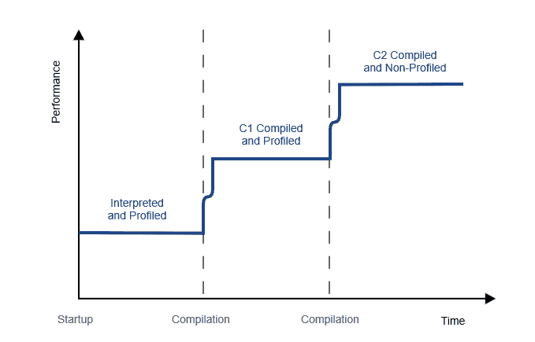
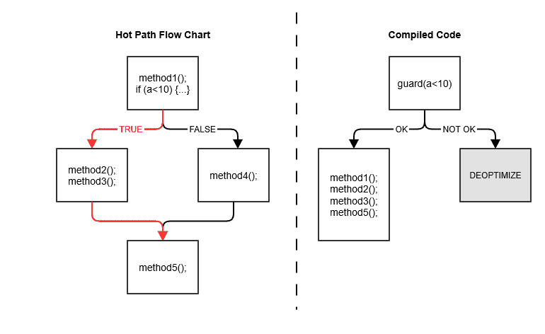
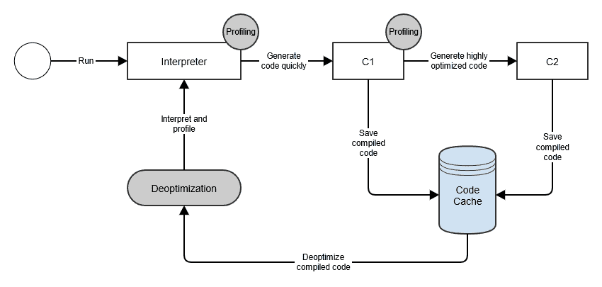

# JVM 中的分层编译

> 原文：<https://web.archive.org/web/20220930061024/https://www.baeldung.com/jvm-tiered-compilation>

## 1.概观

JVM [在运行时解释](/web/20220529023135/https://www.baeldung.com/java-compiled-interpreted)并执行[字节码](/web/20220529023135/https://www.baeldung.com/java-class-view-bytecode)。此外，它利用实时(JIT)编译来提高性能。

在 Java 的早期版本中，我们不得不在 Hotspot JVM 中可用的两种类型的 JIT 编译器之间手动选择。一个针对更快的应用启动进行了优化，而另一个则实现了更好的整体性能。Java 7 引入了分层编译，以达到两全其美。

在本教程中，我们将看看客户端和服务器 JIT 编译器。我们将回顾分层编译及其五个编译级别。最后，我们将通过跟踪编译日志来了解方法编译是如何工作的。

## 2.JIT 编译器

JIT 编译器**将字节码编译成本机代码，用于频繁执行的部分**。这些部分被称为热点，因此得名热点 JVM。因此，Java 可以以与完全编译的语言相似的性能运行。让我们看看 JVM 中可用的两种类型的 JIT 编译器。

### 2.1.C1-客户编译器

客户端编译器，也称为 C1，是一种针对更快启动时间而优化的 **JIT 编译器。它试图尽快优化和编译代码。**

过去，我们将 C1 用于短期应用程序和启动时间是重要的非功能需求的应用程序。在 Java 8 之前，我们必须指定 `-client`标志来使用 C1 编译器。但是，如果我们使用 Java 8 或更高版本，这个标志将不起作用。

### 2.2.C2-服务器编译器

服务器编译器，也称为 C2，是一种针对更好的整体性能而优化的 JIT 编译器。与 C1 相比，C2 观察和分析代码的时间更长。这使得 C2 可以在编译后的代码中进行更好的优化。

在历史上，我们将 C2 用于长期运行的服务器端应用程序。在 Java 8 之前，我们必须指定 `-server` 标志来使用 C2 编译器。但是，这个标志在 Java 8 或更高版本中不起作用。

我们应该注意到，从 Java 10 开始， [Graal](/web/20220529023135/https://www.baeldung.com/graal-java-jit-compiler) JIT 编译器也是可用的，作为 C2 的替代。与 C2 不同，Graal 可以运行在即时和提前编译模式下生成本地代码。

## 3.分层编译

C2 编译器编译同样的方法通常需要更多的时间和内存。但是，它生成的本机代码比 C1 生成的代码优化得更好。

Java 7 中首次引入了分层编译的概念。其目标是**混合使用 C1 和 C2 编译器，以实现快速启动和良好的长期性能**。

### 3.1.两全其美

在应用程序启动时，JVM 首先解释所有的字节码，并收集关于它的分析信息。然后，JIT 编译器利用收集的分析信息来查找热点。

首先，JIT 编译器用 C1 编译频繁执行的代码段，以快速达到本机代码的性能。稍后，当更多的剖析信息可用时，C2 开始发挥作用。C2 用更激进、更耗时的优化来重新编译代码，以提升性能:

[](/web/20220529023135/https://www.baeldung.com/wp-content/uploads/2021/07/1.png)

总的来说， **C1 的性能提升更快，而 C2 基于更多的热点信息做出了更好的性能提升**。

### 3.2.精确剖析

分层编译的另一个好处是更准确的分析信息。在分层编译之前，JVM 只在解释期间收集分析信息。

启用分层编译后， **JVM 还收集关于 C1 编译代码**的 **分析信息。由于编译后的代码获得了更好的性能，它允许 JVM 收集更多的分析样本。**

### 3.3.代码缓存

[代码缓存](/web/20220529023135/https://www.baeldung.com/jvm-code-cache)是一个内存区域，JVM 在这里存储所有编译成本机代码的字节码。分层编译将需要缓存的代码量增加了四倍。

从 Java 9 开始，JVM 将代码缓存分成三个区域:

*   非方法段——JVM 内部相关代码(大约 5 MB，可通过`-XX:NonNMethodCodeHeapSize`配置)
*   概要代码段——C1 编译的代码具有潜在的短生命周期(默认情况下大约 122 MB，可通过`-XX:ProfiledCodeHeapSize`配置)
*   非概要段——C2 编译的代码具有潜在的长生命周期(默认情况下也是 122 MB，可通过`-XX:NonProfiledCodeHeapSize`配置)

分段代码缓存**有助于提高代码局部性，减少内存碎片**。因此，它提高了整体性能。

### 3.4.去优化

尽管 C2 编译的代码是高度优化的，并且寿命很长，但它可能会被去优化。因此，JVM 会暂时回滚到解释。

当编译器的乐观假设被证明是错误的时，就会发生去优化**—例如，当配置文件信息与方法行为不匹配时:**

[](/web/20220529023135/https://www.baeldung.com/wp-content/uploads/2021/07/2.png)

在我们的例子中，一旦热路径发生变化，JVM 就会对编译和内联的代码进行去优化。

## 4.编译级别

即使 JVM 只使用一个解释器和两个 JIT 编译器，也有**五个可能的编译级别**。这背后的原因是 C1 编译器可以在三个不同的层次上运行。这三个级别的区别在于完成的分析量。

### 4.1.0 级-解释代码

最初，JVM 解释所有的 Java 代码。在这个初始阶段，性能通常不如编译语言。

然而，JIT 编译器在预热阶段之后开始工作，并在运行时编译热代码。JIT 编译器利用在这一级收集的分析信息来执行优化。

### 4.2.第 1 级-简单的 C1 编译代码

在这个层次上，JVM 使用 C1 编译器编译代码，但是不收集任何分析信息。JVM 对被认为微不足道的方法使用第 1 级。

由于方法复杂度低，C2 编译不会使它更快。因此，JVM 得出结论，为不能进一步优化的代码收集分析信息是没有意义的。

### 4.3.2 级–有限的 C1 编译代码

在第 2 级，JVM 使用带有轻量级分析的 C1 编译器编译代码。当 C2 队列满了时，JVM 使用这个级别**。目标是尽快编译代码以提高性能。**

稍后，JVM 使用完整的概要分析在第 3 级重新编译代码。最后，一旦 C2 队列不那么忙了，JVM 就在第 4 级重新编译它。

### 4.4.第 3 级-完整的 C1 编译代码

在第 3 级，JVM 使用 C1 编译器编译代码，并提供完整的概要分析。级别 3 是默认编译路径的一部分。因此，JVM 在**所有情况下都使用它，除了琐碎的方法或者编译器队列满了的时候**。

JIT 编译中最常见的场景是解释的代码直接从 0 级跳到 3 级。

### 4.5.第 4 级-C2 编译代码

在这个层次上，JVM 使用 C2 编译器编译代码，以获得最大的长期性能。级别 4 也是默认编译路径的一部分。JVM 使用这个级别来**编译除了琐碎的**之外的所有方法。

假设第 4 级代码被认为是完全优化的，那么 JVM 将停止收集分析信息。然而，它可以决定去优化代码并将其发送回 0 级。

## 5.编译参数

从 Java 8 开始，默认情况下**启用分层编译。强烈建议使用它，除非有充分的理由禁用它。**

### 5.1.禁用分层编译

我们可以通过设置`–XX:-TieredCompilation` 标志`.`来禁用分层编译。当我们设置这个标志时，JVM 不会在编译级别之间转换。因此，我们需要选择使用哪个 JIT 编译器:C1 或 C2。

除非明确指定，否则 JVM 会根据我们的 CPU 决定使用哪个 JIT 编译器。对于多核处理器或 64 位虚拟机，JVM 将选择 C2。为了禁用 C2，只使用没有分析开销的 C1，我们可以应用`-XX:TieredStopAtLevel=1`参数。

要完全禁用两个 JIT 编译器并使用解释器运行所有东西，我们可以应用`-Xint`标志。然而，我们应该注意到**禁用 JIT 编译器会对性能产生负面影响**。

### 5.2.设置级别阈值

编译阈值是代码编译前方法调用的次数**。在分层编译的情况下，我们可以为编译级别 2-4 设置这些阈值。比如我们可以设置一个参数`-XX:Tier4CompileThreshold=10000`。**

 **为了检查特定 Java 版本上使用的默认阈值，我们可以使用`-XX:+PrintFlagsFinal`标志运行 Java:

```java
java -XX:+PrintFlagsFinal -version | grep CompileThreshold
intx CompileThreshold = 10000
intx Tier2CompileThreshold = 0
intx Tier3CompileThreshold = 2000
intx Tier4CompileThreshold = 15000
```

我们应该注意到，当启用分层编译时， **JVM 不使用通用的`CompileThreshold` 参数。**

## 6.方法编译

现在让我们来看看方法编译的生命周期:

[](/web/20220529023135/https://www.baeldung.com/wp-content/uploads/2021/07/3.png)

总之，JVM 最初解释一个方法，直到它的调用到达`Tier3CompileThreshold`。然后，**使用 C1 编译器编译该方法，同时继续收集概要信息**。最后，当调用到达`Tier4CompileThreshold`时，JVM 使用 C2 编译器编译该方法。最终，JVM 可能会决定去优化 C2 编译的代码。这意味着整个过程将会重复。

### 6.1.编译日志

默认情况下，JIT 编译日志是禁用的。为了启用它们，我们可以**设置 `-XX:+PrintCompilation`标志**。编译日志的格式如下:

*   时间戳–自应用程序启动以来的毫秒数
*   编译 ID–每个编译方法的增量 ID
*   属性–编译的状态，有五个可能的值:
    *   %–发生堆栈上替换
    *   s–方法是同步的
    *   ！–该方法包含异常处理程序
    *   b–编译发生在阻塞模式下
    *   n-编译将一个包装器转换成一个本地方法
*   编译级别–介于 0 和 4 之间
*   方法名称
*   字节码大小
*   去优化指示器–有两个可能的值:
    *   被证明是错误的标准 C1 去优化或编译器的乐观假设
    *   变成僵尸——垃圾收集器从代码缓存中释放空间的清理机制

### 6.2.一个例子

让我们用一个简单的例子来演示方法编译生命周期。首先，我们将创建一个实现 JSON 格式化程序的类:

```java
public class JsonFormatter implements Formatter {

    private static final JsonMapper mapper = new JsonMapper();

    @Override
    public <T> String format(T object) throws JsonProcessingException {
        return mapper.writeValueAsString(object);
    }

}
```

接下来，我们将创建一个实现相同接口的类，但是实现一个 XML 格式化程序:

```java
public class XmlFormatter implements Formatter {

    private static final XmlMapper mapper = new XmlMapper();

    @Override
    public <T> String format(T object) throws JsonProcessingException {
        return mapper.writeValueAsString(object);
    }

}
```

现在，我们将编写一个使用两种不同格式化程序实现的方法。在循环的前半部分，我们将使用 JSON 实现，然后切换到 XML 实现:

```java
public class TieredCompilation {

    public static void main(String[] args) throws Exception {
        for (int i = 0; i < 1_000_000; i++) {
            Formatter formatter;
            if (i < 500_000) {
                formatter = new JsonFormatter();
            } else {
                formatter = new XmlFormatter();
            }
            formatter.format(new Article("Tiered Compilation in JVM", "Baeldung"));
        }
    }

}
```

最后，我们将设置`-XX:+PrintCompilation`标志，运行 main 方法，并观察编译日志。

### 6.3.查看日志

让我们关注三个定制类及其方法的日志输出。

前两个日志条目显示 JVM 在第 3 层编译了`main`方法和`format`方法的 JSON 实现。因此，这两种方法都是由 C1 编译器编译的。C1 编译的代码取代了最初解释的版本:

```java
567  714       3       com.baeldung.tieredcompilation.JsonFormatter::format (8 bytes)
687  832 %     3       com.baeldung.tieredcompilation.TieredCompilation::main @ 2 (58 bytes)
```

```java
A few hundred milliseconds later, the JVM compiled both methods on level 4\. Hence, the C2 compiled versions replaced the previous versions compiled with C1:
```

```java
659  800       4       com.baeldung.tieredcompilation.JsonFormatter::format (8 bytes)
807  834 %     4       com.baeldung.tieredcompilation.TieredCompilation::main @ 2 (58 bytes)
```

仅仅几毫秒后，我们看到了第一个去优化的例子。这里，JVM 标记了过时的(不进入)C1 编译版本:

```java
812  714       3       com.baeldung.tieredcompilation.JsonFormatter::format (8 bytes)   made not entrant
838 832 % 3 com.baeldung.tieredcompilation.TieredCompilation::main @ 2 (58 bytes) made not entrant
```

过一会儿，我们会注意到另一个去优化的例子。这个日志条目很有趣，因为 JVM 将完全优化的 C2 编译版本标记为过时(不进入)。这意味着**当 JVM 检测到完全优化的代码不再有效**时，它会回滚该代码:

```java
1015  834 %     4       com.baeldung.tieredcompilation.TieredCompilation::main @ 2 (58 bytes)   made not entrant
1018  800       4       com.baeldung.tieredcompilation.JsonFormatter::format (8 bytes)   made not entrant 
```

接下来，我们将首次看到`format`方法的 XML 实现。JVM 在第 3 层编译它，连同`main`方法:

```java
1160 1073       3       com.baeldung.tieredcompilation.XmlFormatter::format (8 bytes)
1202 1141 %     3       com.baeldung.tieredcompilation.TieredCompilation::main @ 2 (58 bytes)
```

几百毫秒后，JVM 在第 4 级编译了这两种方法。然而，这一次，`main`方法使用的是 XML 实现:

```java
1341 1171       4       com.baeldung.tieredcompilation.XmlFormatter::format (8 bytes)
1505 1213 %     4       com.baeldung.tieredcompilation.TieredCompilation::main @ 2 (58 bytes
```

和之前一样，几毫秒后，JVM 将 C1 编译版本标记为过时(不进入):

```java
1492 1073       3       com.baeldung.tieredcompilation.XmlFormatter::format (8 bytes)   made not entrant
1508 1141 %     3       com.baeldung.tieredcompilation.TieredCompilation::main @ 2 (58 bytes)   made not entrant
```

JVM 继续使用 4 级编译方法，直到我们的程序结束。

## 7.结论

在本文中，我们探讨了 JVM 中的分层编译概念。我们回顾了两种类型的 JIT 编译器，以及分层编译如何使用它们来获得最佳结果。我们看到了五个级别的编译，并学习了如何使用 JVM 参数来控制它们。

在示例中，我们通过观察编译日志探索了完整的方法编译生命周期。

和往常一样，源代码可以在 GitHub 上的[处获得。](https://web.archive.org/web/20220529023135/https://github.com/eugenp/tutorials/tree/master/core-java-modules/core-java-lang-4)**