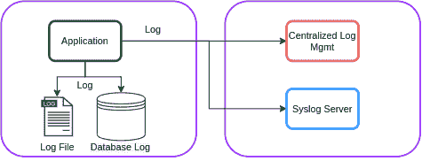

# 使用 Log4j2 将日志数据写入系统日志

> 原文：<https://web.archive.org/web/20220930061024/https://www.baeldung.com/log4j-to-syslog>

## 1.概观

日志记录是每个应用程序的重要组成部分。当我们在应用程序中使用日志机制时，我们可以将日志存储在文件或数据库中。此外，我们可以将日志数据发送到集中的日志管理应用程序，如 [Graylog](/web/20221007193344/https://www.baeldung.com/graylog-with-spring-boot) 或 [Syslog](https://web.archive.org/web/20221007193344/https://en.wikipedia.org/wiki/Syslog) :

[](/web/20221007193344/https://www.baeldung.com/wp-content/uploads/2021/07/Figures-Page-5.png)

在本教程中，我们将描述如何在 [Spring Boot](/web/20221007193344/https://www.baeldung.com/spring-boot-start) 应用程序中使用 [Log4j2](/web/20221007193344/https://www.baeldung.com/java-logging-intro) 向 Syslog 服务器发送日志信息。

## 2.Log4j2

Log4j2 是 Log4j 的最新版本。这是高性能日志记录的常见选择，并在许多生产应用程序中使用。

### 2.1.Maven 依赖性

让我们从将 [`spring-boot-starter-log4j2`](https://web.archive.org/web/20221007193344/https://search.maven.org/search?q=a:spring-boot-starter-log4j2) 依赖项添加到我们的`pom.xml`开始:

```
<dependency>
    <groupId>org.springframework.boot</groupId>
    <artifactId>spring-boot-starter-log4j2</artifactId>
    <version>2.5.2</version>
</dependency>
```

为了在 Spring Boot 应用程序中配置 Log4j2，我们需要从`pom.xml`中的任何启动器库中排除默认的`Logback`日志框架。在我们的项目中，只有`spring-boot-starter-web`启动器依赖项。让我们将默认日志排除在外:

```
<dependency>
    <groupId>org.springframework.boot</groupId>
    <artifactId>spring-boot-starter-web</artifactId>
    <exclusions>
        <exclusion>
            <groupId>org.springframework.boot</groupId>
            <artifactId>spring-boot-starter-logging</artifactId>
        </exclusion>
    </exclusions>
</dependency>
```

### 2.2.Log4j2 配置

现在，我们将创建 Log4j2 配置文件。Spring Boot 项目在类路径中搜索`log4j2-spring.xml`或`log4j2.xml` 文件。让我们在`resource`目录中配置一个简单的`log4j2-spring.xml`:

```
<?xml version="1.0" encoding="UTF-8"?>
<Configuration>
    <Appenders>
        <Console name="ConsoleAppender" target="SYSTEM_OUT">
            <PatternLayout
                pattern="%style{%date{DEFAULT}}{yellow} %highlight{%-5level}{FATAL=bg_red, ERROR=red, WARN=yellow, INFO=green} %message"/>
        </Console>
    </Appenders>
    <Loggers>
        <Root level="info">
            <AppenderRef ref="ConsoleAppender"/>
        </Root>
    </Loggers>
</Configuration>
```

该配置有一个`Console`附加器，用于向控制台显示记录数据。

### 2.3.系统日志附加器

Appenders 是日志框架中的主要组件，它将日志数据传递到目的地。Log4j2 支持许多附加器，比如 Syslog 附加器。让我们更新我们的`log4j2-spring.xml`文件，添加 Syslog appender，用于将日志记录数据发送到 Syslog 服务器:

```
<Syslog name="Syslog" format="RFC5424" host="localhost" port="514"
    protocol="UDP" appName="baeldung" facility="LOCAL0" />
```

Syslog appender 有许多属性:

*   `name`:追加人的名字
*   `format`:可以设置为 BSD，也可以设置为 RFC5424
*   `host`:Syslog 服务器的地址
*   `port`:Syslog 服务器的端口
*   `protocol`:是使用 TCP 还是 UPD
*   `appName`:正在记录的应用程序的名称
*   `facility`:消息的类别

## 3.系统日志服务器

现在，让我们设置 Syslog 服务器。在许多 Linux 发行版中， [`rsyslog`](https://web.archive.org/web/20221007193344/https://www.rsyslog.com/) 是主要的日志记录机制。它包含在大多数 Linux 发行版中，比如 Ubuntu 和 CentOS。

### 3.1.系统日志配置

**我们的`rsyslog`配置应该匹配 Log4j2 设置。**`rsyslog`配置在`/etc/rsyslog.conf`文件中定义。在 Log4j2 配置中，我们分别为`protocol`和`port`使用 UDP 和端口 514。因此，我们将在`rsyslog.conf`文件中添加或取消注释以下行:

```
# provides UDP syslog reception
module(load="imudp")
input(type="imudp" port="514") 
```

在这种情况下，我们设置`module(load=”imudp”)`来加载`imudp`模块，以便通过 UDP 接收 Syslog 消息。然后，我们使用 `input`配置将`port`设置为 514。`input`将端口分配给模块。之后，我们应该重启`rsyslog`服务器:

```
sudo service rsyslog restart
```

现在配置已经准备好了。

### 3.2.测试

让我们创建一个简单的记录几条消息的 Spring Boot 应用程序:

```
@SpringBootApplication
public class SpringBootSyslogApplication {

    private static final Logger logger = LogManager.getLogger(SpringBootSyslogApplication.class);

    public static void main(String[] args) {
        SpringApplication.run(SpringBootSyslogApplication.class, args);

        logger.debug("Debug log message");
        logger.info("Info log message");
        logger.error("Error log message");
        logger.warn("Warn log message");
        logger.fatal("Fatal log message");
        logger.trace("Trace log message");
    }
}
```

记录信息存储在`/var/log/`目录中。让我们检查一下`syslog`文件:

```
tail -f /var/log/syslog
```

当我们运行我们的 Spring Boot 应用程序时，我们将看到我们的日志消息:

```
Jun 30 19:49:35 baeldung[16841] Info log message
Jun 30 19:49:35 baeldung[16841] Error log message
Jun 30 19:49:35 baeldung[16841] Warn log message
Jun 30 19:49:35 baeldung[16841] Fatal log message 
```

## 4.结论

在本教程中，我们描述了 Spring Boot 应用程序中 Log4j2 的系统日志配置。此外，我们将`rsyslog`服务器配置为 Syslog 服务器。像往常一样，完整的源代码可以在 GitHub 上找到。