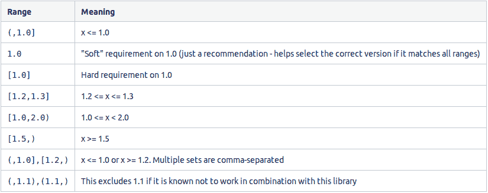
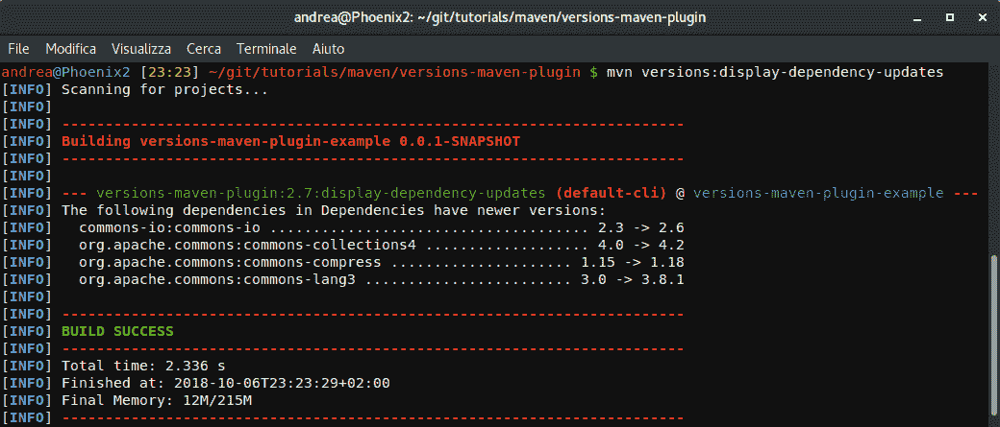
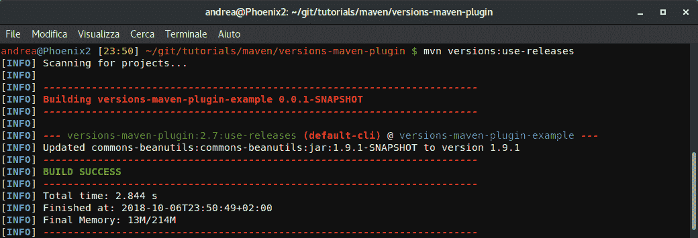
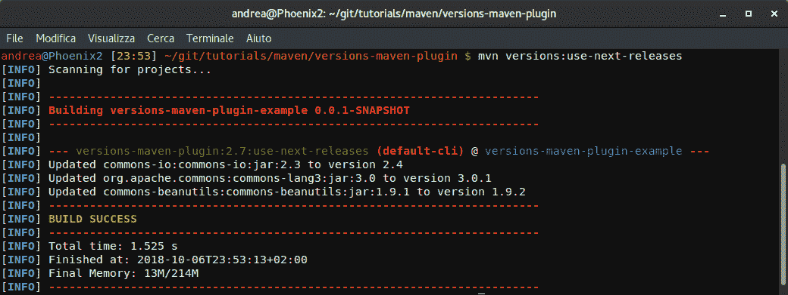
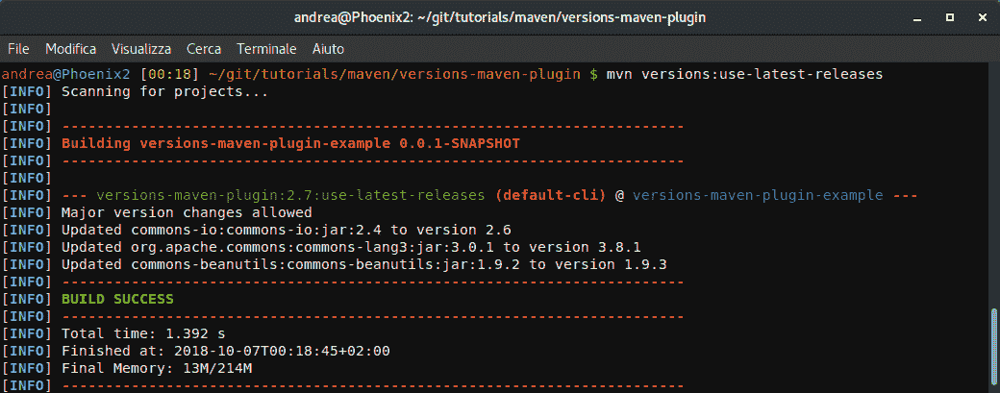

# 在 Maven 中使用最新版本的依赖项

> 原文：<https://web.archive.org/web/20220930061024/https://www.baeldung.com/maven-dependency-latest-version>

## 1。概述

手动升级 Maven 依赖项一直是一项繁琐的工作，尤其是在有大量库频繁发布的项目中。

在本教程中，我们将学习**如何利用版本 Maven 插件来保持我们的依赖关系最新**。

最重要的是，这在实现持续集成管道时非常有用，这些管道可以自动升级依赖项，测试一切是否仍然正常工作，以及提交或回滚结果，无论哪种情况都是适当的。

## 2。Maven 版本范围语法

回到 Maven2 时代，开发人员可以指定版本范围，在此范围内工件将被升级，而不需要人工干预。

这种语法仍然有效，在一些项目中使用，因此值得了解:

[](https://web.archive.org/web/20220627184603/https://baeldung.com/wp-content/uploads/2018/10/syntax.png)

尽管如此，在可能的情况下，我们应该避免使用 Versions Maven 插件，因为从外部推进具体的版本无疑比让 Maven 自己处理整个操作给了我们更多的控制。

### 2.1。不推荐使用的语法

Maven2 还提供了两个特殊的元版本值来实现这个结果:`LATEST`和`RELEASE`。

*最新*寻找最新的可能版本，而*发布*瞄准最新的非快照版本。

实际上，它们对于常规依赖关系解析仍然绝对**有效。**

但是，这种传统的升级方法导致了不可预测性，而 CI 需要再现性。因此，[插件依赖](https://web.archive.org/web/20220627184603/https://cwiki.apache.org/confluence/display/MAVEN/Maven+3.x+Compatibility+Notes#Maven3.xCompatibilityNotes-PluginMetaversionResolution)解决方案不赞成使用它们。

## 3。版本 Maven 插件

版本 Maven 插件是当今处理版本管理的事实上的标准方式。

从远程存储库之间的高级比较到快照版本的低级时间戳锁定，其庞大的目标列表允许我们关注项目中涉及依赖关系的每个方面。

虽然其中许多超出了本教程的范围，但是让我们更仔细地看看在升级过程中对我们有帮助的那些。

### 3.1。测试用例

在开始之前，让我们定义我们的测试用例:

*   带有硬编码版本的三个版本
*   一个带有属性版本的版本，以及
*   一张快照

```java
<dependencies>
    <dependency>
        <groupId>commons-io</groupId>
        <artifactId>commons-io</artifactId>
        <version>2.3</version>
    </dependency>
    <dependency>
        <groupId>org.apache.commons</groupId>
        <artifactId>commons-collections4</artifactId>
        <version>4.0</version>
    </dependency>
    <dependency>
        <groupId>org.apache.commons</groupId>
        <artifactId>commons-lang3</artifactId>
        <version>3.0</version>
    </dependency>
    <dependency>
        <groupId>org.apache.commons</groupId>
        <artifactId>commons-compress</artifactId>
        <version>${commons-compress-version}</version>
    </dependency>
    <dependency>
        <groupId>commons-beanutils</groupId>
        <artifactId>commons-beanutils</artifactId>
        <version>1.9.1-SNAPSHOT</version>
    </dependency>
</dependencies>

<properties>        
    <commons-compress-version>1.15</commons-compress-version>
</properties> 
```

最后，让我们在定义插件时从过程中排除一个工件:

```java
<build>
    <plugins>
        <plugin>
            <groupId>org.codehaus.mojo</groupId>
            <artifactId>versions-maven-plugin</artifactId>
            <version>2.7</version>
            <configuration>
                <excludes>
                    <exclude>org.apache.commons:commons-collections4</exclude>
                </excludes>
            </configuration>
        </plugin>
    </plugins>
</build> 
```

## 4。显示可用更新

首先，**为了简单地知道我们是否以及如何更新我们的项目，适合这项工作的工具是 [`versions:display-dependency-updates`](https://web.archive.org/web/20220627184603/https://www.mojohaus.org/versions-maven-plugin/display-dependency-updates-mojo.html)** :

```java
mvn versions:display-dependency-updates
```

[](https://web.archive.org/web/20220627184603/https://baeldung.com/wp-content/uploads/2018/10/display-dependency-updates.png)

正如我们所看到的，**这个过程包括了每一个发布版本。它甚至包括`commons-collections4` ，因为配置中的排除是指更新过程，而不是发现过程。**

相比之下，它忽略了快照，原因是它是一个开发版本，自动更新通常不安全。

## 5。更新依赖关系

第一次运行更新时，插件会创建一个名为`pom.xml.versionsBackup`的`pom.xml`的备份。

虽然每次迭代都会改变`pom.xml`，但是备份文件会保存项目的原始状态，直到用户提交(通过`mvn` )或者恢复(通过`mvn` )整个过程。

### 5.1。将快照转换为版本

有时一个项目会包含一个快照(一个仍在大量开发中的版本)。

我们可以使用 [`versions:use-releases`](https://web.archive.org/web/20220627184603/https://www.mojohaus.org/versions-maven-plugin/use-releases-mojo.html) 来检查相应的新闻稿是否已经发布，甚至可以同时将我们的快照转换为该新闻稿:

```java
mvn versions:use-releases 
```

[](https://web.archive.org/web/20220627184603/https://baeldung.com/wp-content/uploads/2018/10/use-releases.png)

### 5.2。更新到下一版本

**我们可以用 [`versions:use-next-releases`](https://web.archive.org/web/20220627184603/https://www.mojohaus.org/versions-maven-plugin/use-next-releases-mojo.html) 将每个非快照依赖项移植到其最近的版本**:

```java
mvn versions:use-next-releases 
```

[](https://web.archive.org/web/20220627184603/https://baeldung.com/wp-content/uploads/2018/10/use-next-releases.png)

我们可以清楚地看到，插件将`commons-io`、`commons-lang3`，甚至不再是快照的`commons-beanutils`更新到了他们的下一个版本。

**最重要的是，它忽略了`c` `ommons-collections4`，它被排除在插件配置之外，还有`commons-compress`，它有一个通过属性动态指定的版本号。**

### 5.3。更新至最新版本

将每个非快照依赖项更新到其最新版本的工作方式相同，只需将目标更改为 [`versions:use-latest-releases`](https://web.archive.org/web/20220627184603/https://www.mojohaus.org/versions-maven-plugin/use-latest-releases-mojo.html) :

```java
mvn versions:use-latest-releases 
```

[](https://web.archive.org/web/20220627184603/https://baeldung.com/wp-content/uploads/2018/10/use-latest-releases.png)

## 6。过滤掉不想要的版本

**如果我们想忽略某些版本，[插件配置可以调整为](https://web.archive.org/web/20220627184603/https://www.mojohaus.org/versions-maven-plugin/version-rules.html#Ignoring_certain_versions)** 从外部文件动态加载规则:

```java
<plugin>
    <groupId>org.codehaus.mojo</groupId>
    <artifactId>versions-maven-plugin</artifactId>
    <version>2.7</version>
    <configuration>
        <rulesUri>http://www.mycompany.com/maven-version-rules.xml</rulesUri>
    </configuration>
</plugin> 
```

最值得注意的是，`<rulesUri>`还可以引用一个本地文件:

```java
<rulesUri>file:///home/andrea/maven-version-rules.xml</rulesUri> 
```

### 6.1。全局忽略版本

我们可以配置我们的规则文件，使**忽略匹配特定正则表达式**的版本:

```java
<ruleset comparisonMethod="maven"

  xmlns:xsi="http://www.w3.org/2001/XMLSchema-instance"
  xsi:schemaLocation="http://mojo.codehaus.org/versions-maven-plugin/rule/2.0.0 
  http://mojo.codehaus.org/versions-maven-plugin/xsd/rule-2.0.0.xsd">
    <ignoreVersions>
        <ignoreVersion type="regex">.*-beta</ignoreVersion>
    </ignoreVersions>
</ruleset> 
```

### 6.2。基于每个规则忽略版本

最后，如果我们的需求更具体，我们可以建立一套规则:

```java
<ruleset comparisonMethod="maven"

  xmlns:xsi="http://www.w3.org/2001/XMLSchema-instance"
  xsi:schemaLocation="http://mojo.codehaus.org/versions-maven-plugin/rule/2.0.0 
    http://mojo.codehaus.org/versions-maven-plugin/xsd/rule-2.0.0.xsd">
    <rules>
        <rule groupId="com.mycompany.maven" comparisonMethod="maven">
            <ignoreVersions>
                <ignoreVersion type="regex">.*-RELEASE</ignoreVersion>
                <ignoreVersion>2.1.0</ignoreVersion>
            </ignoreVersions>
        </rule>
    </rules>
</ruleset> 
```

## 7。结论

我们已经看到了如何以一种安全、自动且符合 Maven3 的方式检查和更新项目的依赖关系。

与往常一样，GitHub 上的[提供了源代码，还有一个脚本来帮助一步一步地展示一切，而且不复杂。](https://web.archive.org/web/20220627184603/https://github.com/eugenp/tutorials/tree/master/maven-modules/versions-maven-plugin)

要查看它的运行情况，只需下载项目并在终端中运行(如果使用 Windows，则在 Git Bash 中运行):

```java
./run-the-demo.sh
```