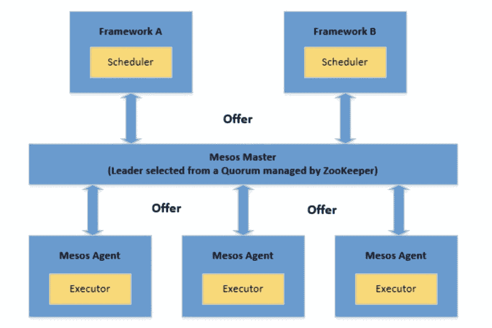
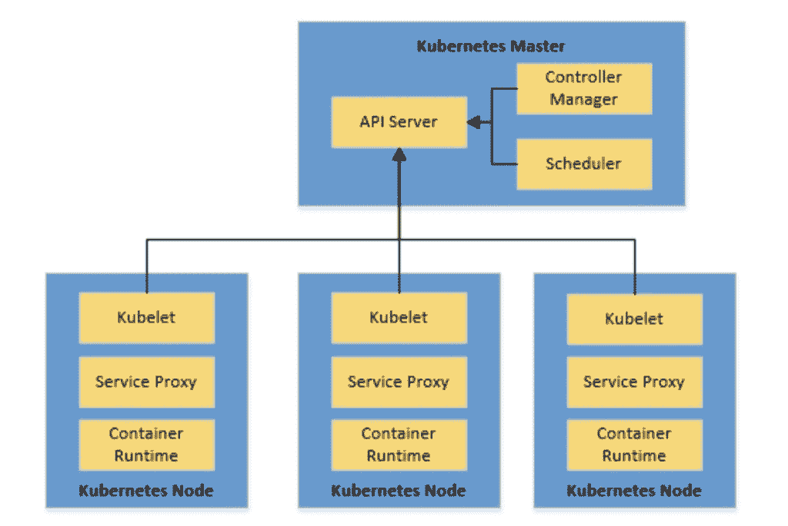

# Mesos vs. Kubernetes

> 原文：<https://web.archive.org/web/20220930061024/https://www.baeldung.com/ops/mesos-kubernetes-comparison>

## 1.概观

在本教程中，我们将了解容器编排系统的基本需求。

我们将评估这种系统的理想特性。在此基础上，我们将尝试比较目前使用的两个最流行的容器编排系统， [Apache Mesos](https://web.archive.org/web/20221006082414/https://mesos.apache.org/) 和 [Kubernetes](https://web.archive.org/web/20221006082414/https://kubernetes.io/) 。

## 2.容器编排

在我们开始比较 Mesos 和 Kubernetes 之前，让我们花一些时间来理解什么是容器，以及我们到底为什么需要容器编排。

### 2.1.容器

****容器是一个标准化的软件单元，它封装了代码及其所有必需的依赖关系**。**

 **因此，它提供了平台独立性和操作简单性。Docker 是使用中最流行的容器平台之一。

Docker 利用 Linux 内核的 T2 特性，比如 CGroups 和 namespaces，来提供不同进程的隔离。因此，多个容器可以独立安全地运行。

创建 docker 映像非常简单，我们只需要一个 docker 文件:

```
FROM openjdk:8-jdk-alpine
VOLUME /tmp
COPY target/hello-world-0.0.1-SNAPSHOT.jar app.jar
ENTRYPOINT ["java","-jar","/app.jar"]
EXPOSE 9001
```

因此，这几行代码足以使用 Docker CLI 创建 Spring Boot 应用程序的 Docker 映像:

```
docker build -t hello_world .
```

### 2.2.容器编排

因此，我们已经看到了容器如何使应用程序部署变得可靠和可重复。但是我们为什么需要容器编排呢？

现在，虽然我们有一些容器需要管理，但我们对 Docker CLI 很满意。我们也可以自动化一些简单的杂务。但是当我们必须管理数百个容器时会发生什么？

例如，考虑具有几个微服务的架构，所有微服务都有不同的可伸缩性和可用性需求。

因此，事情可能会很快失去控制，这就是容器编排系统的优势所在。****容器编排系统将具有多容器应用程序的机器集群视为单个部署实体**。它提供了从初始部署、计划、更新到监控、扩展和故障转移等其他功能的自动化。**

 **## 3.Mesos 概述

Apache Mesos 是最初由加州大学伯克利分校开发的开源集群管理器。它为应用程序提供跨集群的资源管理和调度 API。Mesos 为我们提供了以分布式方式运行容器化和非容器化工作负载的灵活性。

### 3.1.体系结构

Mesos 架构由 Mesos Master、Mesos Agent 和应用框架组成:

[](/web/20221006082414/https://www.baeldung.com/wp-content/uploads/2019/08/Screenshot-2019-08-27-at-08.25.01.png)

让我们在这里了解一下架构的组成部分:

*   `Frameworks`:这些是**需要分布式执行**任务或工作负载的实际应用。典型的例子是 Hadoop 或 [Storm](/web/20221006082414/https://www.baeldung.com/apache-storm) 。Mesos 中的框架包括两个主要组件:
    *   `Scheduler`:这是**，负责向主节点**注册，以便主节点可以开始提供资源
    *   `Executor`:这是**在代理节点**上启动的运行框架任务的进程
*   `Mesos Agents`:这些**负责实际运行任务**。每个代理向主代理发布其可用的资源，如 CPU 和内存。从主节点接收任务后，它们将所需的资源分配给框架的执行者。
*   `Mesos Master`:这是**，负责在一个可用的代理节点上调度从框架**接收的任务。Master 向框架提供资源。框架的调度程序可以选择在这些可用资源上运行任务。

### 3.2.马拉松赛跑

正如我们刚刚看到的，Mesos 非常灵活，[允许框架通过定义良好的 API 来调度和执行任务](/web/20221006082414/https://www.baeldung.com/apache-mesos)。然而，直接实现这些原语并不方便，尤其是当我们想要调度定制的应用程序时。例如，编排打包成容器的应用程序。

这就是像马拉松这样的框架可以帮助我们的地方。马拉松**是一个运行在 Mesos** 上的容器编排框架。在这方面，Marathon 充当了 Mesos 集群的框架。Marathon 提供了几个好处，这些好处是我们通常期望从编排平台获得的，比如服务发现、负载平衡、指标和容器管理 API。

Marathon **将长期运行的服务视为应用程序**，将应用程序实例视为任务。一个典型的场景可以有多个应用程序，它们之间的依赖关系形成了所谓的[应用程序组](https://web.archive.org/web/20221006082414/https://mesosphere.github.io/marathon/docs/application-groups.html)。

### 3.3.例子

因此，让我们看看如何使用 Marathon 来部署我们之前创建的简单 Docker 映像。注意，安装一个 Mesos 集群并不复杂，因此我们可以使用一个更简单的解决方案，比如 [Mesos Mini](https://web.archive.org/web/20221006082414/https://mesos.apache.org/blog/mesos-mini/) 。Mesos Mini 使我们能够在 Docker 环境中启动本地 Mesos 集群。它包括一个 Mesos 主，单 Mesos 代理，和马拉松。

一旦我们用 Marathon 启动并运行了 Mesos 集群，我们就可以将我们的容器部署为一个长期运行的应用程序服务。我们只需要一个小的 JSON 应用程序定义:

```
#hello-marathon.json
{
  "id": "marathon-demo-application",
  "cpus": 1,
  "mem": 128,
  "disk": 0,
  "instances": 1,
  "container": {
    "type": "DOCKER",
    "docker": {
      "image": "hello_world:latest",
      "portMappings": [
        { "containerPort": 9001, "hostPort": 0 }
      ]
    }
  },
  "networks": [
    {
      "mode": "host"
    }
  ]
}
```

让我们来理解这里到底发生了什么:

*   我们已经为我们的应用程序提供了一个 id
*   然后，我们定义了应用程序的资源需求
*   我们还定义了想要运行的实例数量
*   然后，我们提供了启动应用程序的容器细节
*   最后，我们已经定义了能够访问应用程序的网络模式

我们可以使用 Marathon 提供的 REST APIs 来启动这个应用程序:

```
curl -X POST \
  http://localhost:8080/v2/apps \
  -d @hello-marathon.json \
  -H "Content-type: application/json"
```

## 4.Kubernetes 简介

Kubernetes 是最初由 Google T3 开发的开源容器编排系统 T2。它现在是[云本地计算基金会](https://web.archive.org/web/20221006082414/https://www.cncf.io/) (CNCF)的一部分。它提供了一个平台，用于跨主机集群自动部署、扩展和操作应用程序容器。

### 4.1.体系结构

Kubernetes 架构由 Kubernetes 主节点和 Kubernetes 节点组成:

[](/web/20221006082414/https://www.baeldung.com/wp-content/uploads/2019/08/Screenshot-2019-08-27-at-08.25.09.png)

让我们来看看这个高级架构的主要部分:

*   `Kubernetes Master`:主**负责维护集群**的期望状态。它管理集群中的所有节点。正如我们所看到的，主进程是三个进程的集合:
    *   `kube-apiserver`:这是**服务，管理整个集群**，包括处理 REST 操作、验证和更新 Kubernetes 对象、执行认证和授权
    *   `kube-controller-manager`:这是**守护进程，嵌入了 Kubernetes 附带的核心控制循环**，进行必要的修改，使当前状态与集群的期望状态相匹配
    *   `kube-scheduler`:该服务**监视未调度的 pod，并根据请求的资源和其他约束将它们绑定到节点**
*   Kubernetes 集群中的节点是运行我们的容器的机器。每个节点都包含运行容器所需的服务:
    *   `kubelet`:这是**主节点代理**，它确保`kube-apiserver`提供的 PodSpecs 中描述的容器运行正常
    *   `kube-proxy`:这是**在每个节点**上运行的网络代理，执行简单的 TCP、UDP、SCTP 流转发或跨一组后端的循环转发
    *   `container runtime`:这是**运行时，容器内部的容器在这里运行**，Kubernetes 有几种可能的容器运行时，包括最广泛使用的 Docker 运行时

### 4.2.Kubernetes 对象

在上一节中，我们看到了几个 Kubernetes 对象，它们是 Kubernetes 系统中的持久实体。它们反映了集群在任一时间点的状态。

让我们讨论一些常用的 Kubernetes 对象:

*   Pod:Pod 是 Kubernetes 中的基本执行单元，可以由一个或多个容器组成，Pod 中的容器部署在同一个主机上
*   部署:部署是在 Kubernetes 中部署 pod 的推荐方式，它提供了一些特性，比如不断地将 pod 的当前状态与期望状态相协调
*   服务:Kubernetes **中的服务提供了一种抽象的方式来公开一组 pod**，其中分组是基于针对 pod 标签的选择器

还有其他几个 Kubernetes 对象可以有效地以分布式方式运行容器。

### 4.3.例子

因此，现在我们可以尝试将 Docker 容器放入 Kubernetes 集群。Kubernetes 提供了 [Minikube](https://web.archive.org/web/20221006082414/https://kubernetes.io/docs/tasks/tools/install-minikube/) ，这是一个在虚拟机上运行单节点 Kubernetes 集群的工具。我们还需要 [kubectl](https://web.archive.org/web/20221006082414/https://kubernetes.io/docs/tasks/tools/install-kubectl/#install-kubectl-on-linux) ，Kubernetes 命令行界面来与 Kubernetes 集群协同工作。

在我们安装了 kubectl 和 Minikube 之后，我们可以在 Minikube 内的单节点 Kubernetes 集群上部署我们的容器。我们需要在 YAML 文件中定义基本的 Kubernetes 对象:

```
# hello-kubernetes.yaml
apiVersion: apps/v1
kind: Deployment
metadata:
  name: hello-world
spec:
  replicas: 1
  template:
    metadata:
      labels:
        app: hello-world
    spec:
      containers:
      - name: hello-world
        image: hello-world:latest
        ports:
        - containerPort: 9001
---
apiVersion: v1
kind: Service
metadata:
  name: hello-world-service
spec:
  selector:
    app: hello-world
  type: LoadBalancer
  ports:
  - port: 9001
    targetPort: 9001
```

这里不可能对这个定义文件进行详细的分析，但是让我们来看一下要点:

*   我们在选择器中定义了一个带有标签的`Deployment`
*   我们定义了本次部署所需的副本数量
*   此外，我们还提供了容器映像细节作为部署的模板
*   我们还用适当的选择器定义了一个`Service`
*   我们将服务的性质定义为`LoadBalancer`

最后，我们可以部署容器并通过 kubectl 创建所有已定义的 Kubernetes 对象:

```
kubectl apply -f yaml/hello-kubernetes.yaml
```

## 5\. Mesos vs. Kubernetes

现在，我们已经经历了足够多的上下文，并在 Marathon 和 Kubernetes 上执行了基本部署。我们可以试着去理解它们之间的比较。

只是提醒一下，直接将 Kubernetes 与 Mesos 进行比较是不完全公平的。我们寻求的大多数容器编排特性都是由 Marathon 这样的 Mesos 框架提供的。因此，为了保持正确的观点，**我们将尝试比较 Kubernetes 和 Marathon** 而不是直接比较 Mesos。

我们将基于这样一个系统的一些期望的属性来比较这些编排系统。

### 5.1.支持的工作负载

Mesos 旨在**处理不同类型的工作负载**，这些工作负载可以是集装箱化的，甚至是非集装箱化的。这取决于我们使用的框架。正如我们所看到的，使用马拉松这样的框架，在 Mesos 中支持容器化的工作负载是非常容易的。

另一方面，kubernetes**专门处理容器化的工作负载**。最广泛的情况是，我们将它与 Docker 容器一起使用，但是它也支持其他容器运行时，比如 Rkt。将来，Kubernetes 可能会支持更多类型的工作负载。

### 5.2.支持可伸缩性

**Marathon 支持通过应用程序定义或用户界面进行扩展**。马拉松也支持自动缩放。我们还可以扩展应用程序组，这将自动扩展所有依赖关系。

正如我们前面看到的，Pod 是 Kubernetes 中的基本执行单元。由部署管理时，单元可以扩展，这就是单元总是被定义为部署的原因。缩放可以是手动的或自动的。

### 5.3.处理高可用性

Marathon 中的应用程序实例**分布在提供高可用性的 Mesos 代理上**。通常，一个 Mesos 集群由多个代理组成。此外，ZooKeeper 通过法定人数和领导者选举为 Mesos 集群提供高可用性。

类似地，Kubernetes 中的 pods**在多个节点间复制，提供高可用性**。Kubernetes 集群通常由多个工作节点组成。此外，集群还可以有多个主设备。因此，Kubernetes 集群能够为容器提供高可用性。

### 5.4.服务发现和负载平衡

Mesos-DNS 可以为应用提供服务发现和基本的负载平衡。Mesos-DNS 为每个 Mesos 任务生成一个 SRV 记录，并将它们转换为运行该任务的机器的 IP 地址和端口。对于马拉松式应用程序，我们还可以使用 Marathon-lb，使用 HAProxy 提供基于端口的发现。

Kubernetes 中的部署动态地创建和销毁 pod。因此，我们通常通过**服务在 Kubernetes 中公开 pod，该服务提供服务发现**。Kubernetes 中的服务充当 pod 的调度程序，因此也提供负载平衡。

### 5.5。执行升级和回滚

Marathon 中对应用程序定义的更改被视为部署。部署**支持应用**的启动、停止、升级或扩展。马拉松**还支持滚动启动**来部署应用程序的新版本。然而，回滚是直接的，通常需要部署更新的定义。

在 **Kubernetes 中的部署支持升级和回滚**。我们可以提供在用新 pod 替换旧 pod 时要采取的部署策略。典型的**策略是重新创建或滚动更新**。在 Kubernetes 中，默认情况下维护部署的部署历史，这使得回滚到以前的修订版变得很简单。

### 5.6.记录和监控

Mesos 有一个**诊断实用程序，它扫描所有集群组件**，并提供与健康和其他指标相关的数据。可以通过可用的 API 查询和聚合数据。我们可以使用像普罗米修斯这样的外部工具来收集这些数据。

Kubernetes **将与不同对象**相关的详细信息发布为资源指标或完整指标管道。典型的做法是在 Kubernetes 集群上部署一个外部工具，如 ELK 或 Prometheus+Grafana。这种工具可以接收集群指标，并以更加用户友好的方式呈现出来。

### 5.7.储存；储备

Mesos 拥有用于有状态应用程序的持久本地卷。我们只能从保留的资源中创建永久卷。它还可以支持外部存储，但有一些限制。Mesos 为[容器存储接口](https://web.archive.org/web/20221006082414/https://github.com/container-storage-interface/spec) (CSI)提供了实验性支持，CSI 是存储供应商和容器编排平台之间的一组通用 API。

Kubernetes 为有状态容器提供了多种类型的持久卷。这包括像 This 这样的仓库。此外，它还支持 AWS、GCP 等外部存储。Kubernetes 中的 Volume 对象支持这一概念，有多种类型，包括 CSI。

### 5.8.建立工作关系网

Mesos 中的容器运行时提供了**两种类型的网络支持，每容器 IP 和网络端口映射**。Mesos 定义了一个公共接口来指定和检索容器的网络信息。马拉松式应用程序可以以主机模式或网桥模式定义网络。

Kubernetes **中的网络为每个 pod 分配一个唯一的 IP。**这消除了将容器端口映射到主机端口的需要。它进一步定义了这些 pod 如何跨节点相互通信。这是在 Kubernetes 中通过 Cilium、Contiv 等网络插件实现的。

## 6.什么时候用什么？

最后，相比较而言，我们通常期待一个明确的判决！然而，不管怎样，宣称一种技术比另一种技术好并不完全公平。正如我们已经看到的，【Kubernetes 和 Mesos 都是强大的系统并且提供了相当有竞争力的特性。

然而，性能是一个非常重要的方面。Kubernetes 集群可以扩展到 5000 个节点，而 Mesos 集群上的 Marathon 可以支持多达 10，000 个代理。在大多数实际情况下，我们不会处理如此大的集群。

最后，这归结于我们所拥有的灵活性和工作负载类型。如果我们重新开始并且**我们只计划使用容器化的工作负载，Kubernetes 可以提供更快的解决方案**。但是，如果我们有现有的工作负载，包括容器和非容器，那么 Mesos with Marathon 可能是更好的选择。

## 7.其他选择

Kubernetes 和 Apache Mesos 相当强大，但它们并不是这个领域的唯一系统。我们有好几个有希望的选择。虽然我们不会深入讨论它们的细节，但是让我们快速列出其中的几个:

*   [Docker Swarm](https://web.archive.org/web/20221006082414/https://docs.docker.com/engine/swarm/):Docker Swarm**是 Docker 容器**的开源集群和调度工具。它附带了一个命令行实用程序来管理 Docker 主机集群。它仅限于 Docker 容器，不像 Kubernetes 和 Mesos。
*   [Nomad](https://web.archive.org/web/20221006082414/https://www.nomadproject.io/) : Nomad 是**hashi corp**的一款灵活的工作负载协调器，可以管理任何容器化或非容器化的应用程序。Nomad 支持声明式基础设施即代码，用于部署 Docker container 等应用程序。
*   [OpenShift](https://web.archive.org/web/20221006082414/https://www.openshift.com/) : OpenShift 是**一个来自红帽**的容器平台，由底下的 Kubernetes 编排和管理。OpenShift 在 Kubernetes 的基础上提供了许多特性，比如集成的图像注册、从源到图像的构建、本地网络解决方案等等。

## 8.结论

总而言之，在本教程中，我们讨论了容器和容器编排系统。我们简要介绍了两个使用最广泛的容器编排系统，Kubernetes 和 Apache Mesos。我们还基于几个特征对这些系统进行了比较。最后，我们看到了这一领域的一些其他选择。

在结束之前，我们必须明白，这种比较的目的是提供数据和事实。这并不是说一个比另一个更好，这通常取决于用例。因此，我们必须根据问题的背景来决定最佳的解决方案。****