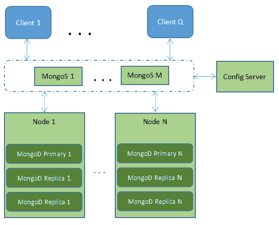
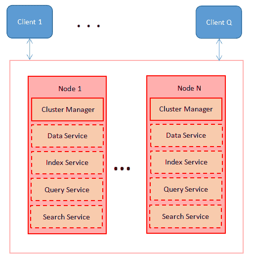

# MongoDB 诉 couchbase 案

> 原文：<https://web.archive.org/web/20220930061024/https://www.baeldung.com/mongodb-vs-couchbase>

## 1.概观

在本教程中，我们将比较两个最流行的 NoSQL 数据库——MongoDB 和 Couchbase。我们将研究架构、特性列表、数据模型、查询，以及它们如何处理分区。

## 2.NoSQL 数据库介绍

SQL 数据库自 1970 年就已经出现，并且在相当长的一段时间里一直是事实上的数据库。他们的目的之一是减少数据重复，因为当时存储并不便宜。水平扩展意味着 SQL 数据库的大量维护工作，但是可以通过购买更强大的服务器进行垂直扩展。

NoSQL(不仅仅是 SQL)数据库出现在 2000 年代后期，允许更容易的水平扩展。随着计算能力变得越来越便宜，我们现在可以在许多不那么强大的机器上分发我们的数据。这里的数据不是存储在表中，而是存储在文档中(通常是 JSON 格式)，模式也不像 SQL 数据库那样严格。

第一批 NoSQL 数据库之一是 MongoDB。它简单的设置和易用性使它在相当长的一段时间内一直处于领先地位。然而，也有像 Couchbase 这样的新竞争者，它具有易于扩展和高性能的特点。

## 3.体系结构

让我们来看看 MongoDB 部署的架构:



这里，每个节点都包含一个副本集，其中有一个主副本和两个辅助副本。

每个副本都有自己的 **MongoD 服务，管理数据、索引和查询**。**MongoS 组件充当分布式查询路由器和处理器。**

现在让我们来看看 Couchbase 部署架构:



Couchbase 部署中的每个节点都有一个强制的集群管理器。其他服务组件，即数据、索引、查询和搜索，可以存在也可以不存在。

**对于 Couchbase，数据存储在存储桶中，存储桶使用自动哈希在节点之间进行分区**。

不需要配置服务器，因为元数据管理是通过设计内置到数据库中的。横向扩展只是添加更多节点的问题。

## 4.特征比较

让我们来看一下两个 NoSQL 数据库的主要特性比较:

| 特征 | MongoDB | 沙发底座 |
| 储存；储备 | 将文档存储为二进制 JSON (BSON) | 将文档存储为 JSON |
| 询问 | 专有查询语言 | N1QL–支持 SQL 查询 |
| 分割 | 通过分片手动处理分区 | 使用散列机制的自动分区 |
| 处理 | 从 4.2 版起，支持分布式事务 | 从版本 6.6 起，支持分布式事务 |
| 搜索 | 从 4.0 版本开始支持文本搜索 | 从版本 6.0 以上支持全文搜索 |

## 5.数据模型

与 SQL 数据库不同，在 NoSQL 的情况下，数据模型不是强制的。文档不需要有相同的模式。我们有自由以我们认为合适的方式来模拟每一种关系。

让我们来看看实体之间关系的建模:

*   一对一(1-1):NoSQL 数据库处理这个问题的默认方式是将一个实体嵌入到另一个实体中。这也是 MongoDB 和 Couchbase 的行为。我们还可以嵌入另一个实体的实体 id。两个数据库都支持这一点。
*   一对多(1-N):我们通过在第一个实体中嵌入 N 个实体的数组或者 N 个实体 id 的数组来解决这个问题。MongoDB 和 Couchbase 支持这一点。
*   多对多(M-N):我们通过在 M 个实体的每一个中嵌入 N 个实体的数组或者在 M 个实体的每一个中嵌入 N 个实体 id 的数组来解决这个问题。MongoDB 和 Couchbase 也支持这一点。

决定哪个实体应该嵌入到另一个实体中，以及选择嵌入实体还是 id 是一个关键的设计决策。我们在仔细考虑应用程序将如何使用我们的数据库后做出了这个决定。

## 6.数据查询

对于查询，MongoDB 有其专有的查询语言，而 Couchbase 使用 N1QL，一种类似 SQL 的语言。让我们以一个`STUDENT`集合为例，看看每个数据库如何处理常见的命令查询操作。

### 6.1.`SELECT`

下面是 SQL 语言、MongoDB 查询语言和 Couchbase N1QL 中的`SELECT`操作:

```java
-- SQL
SELECT * FROM STUDENT WHERE name = 'Ryan';

-- MongoDB query language
db.STUDENT.find({name:"Ryan"})

-- Couchbase N1QL
SELECT * FROM STUDENT WHERE name = 'Ryan'; 
```

### 6.2.`INSERT`

现在，让我们看看`INSERT`操作在 SQL、MongoDB 查询语言和 Couchbase N1QL 中是怎样的:

```java
-- SQL
INSERT INTO STUDENT(id, name) VALUES (123, 'Ryan');

-- MongoDB query language
db.STUDENT.save({_id: "123", {"id": "123", "name": "Ryan"})

-- Couchbase N1QL
INSERT INTO STUDENT(KEY, VALUE) VALUES ('123', {"id": "123", "name": "Ryan"}) 
```

### 6.3.`UPDATE`

接下来是 SQL、MongoDB 查询语言和 Couchbase N1QL 中的`UPDATE`操作:

```java
-- SQL
UPDATE STUDENT SET name='John' WHERE id = 123;

-- MongoDB query language
db.STUDENT.update({_id: "123"}, {"name": "John"})

-- Couchbase N1QL
UPDATE STUDENT SET name = "John" WHERE id = "123" 
```

### 6.4.`DELETE`

这里是最后一个基本操作。让我们用 SQL、MongoDB 查询语言和 Couchbase N1QL 来看看:

```java
-- SQL
DELETE FROM STUDENT WHERE id = 123;

-- MongoDB query language
db.STUDENT.remove({_id: "123"})

-- Couchbase N1QL
DELETE FROM CUSTOMER WHERE id = "123"; 
```

在我们的 [Spring Data MongoDB](/web/20221129115650/https://www.baeldung.com/queries-in-spring-data-mongodb "Spring Data MongoDB") 教程中，我们可以深入了解使用 Spring 数据的 MongoDB 查询。

此外，我们可以在我们的 [Spring Data Couchbase](/web/20221129115650/https://www.baeldung.com/spring-data-couchbase "Spring Data Couchbase") 教程中学习如何用 Spring 数据持久化 Couchbase 文档。

## 7.分割

分区是任何 NoSQL 数据库的关键特性，这两个也不例外。

默认情况下，MongoDB 不会对其数据进行分区。相反，它将所有数据保存在单个节点上。 **MongoDB 通过将数据分成子集(碎片)进行水平扩展，**我们可以将每个子集分布在不同的节点上。**配置服务器管理部署集群的配置。**

Couchbase 中没有配置服务器。相反，每个节点都有自己的集群管理器服务，可以运行任何数据、索引、查询和搜索服务。这样，我们可以通过将计算能力分配到需要的地方来实现极大的灵活性。

## 8.结论

在本文中，我们探讨了 MongoDB 和 Couchbase 之间的异同。

综上所述， **MongoDB 是开启我们 NoSQL 世界之旅的绝佳方式**。它周围有一个很棒的社区，MongoDB 大学为开发人员提供了很多培训。

另一方面， **Couchbase 支持 SQL 查询，并承诺提供出色的性能和易伸缩性**。