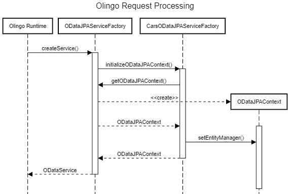

# Olingo 介绍 OData

> 原文：<https://web.archive.org/web/20220930061024/https://www.baeldung.com/olingo>

## 1.介绍

本教程是我们的 [OData 协议指南](/web/20221129012431/https://www.baeldung.com/odata)的后续，在那里我们已经探索了 [OData](https://web.archive.org/web/20221129012431/https://www.odata.org/) 协议的基础。

现在，我们将看看如何使用 [Apache Olingo](https://web.archive.org/web/20221129012431/https://olingo.apache.org/) 库实现一个简单的 OData 服务。

这个库提供了一个使用 OData 协议公开数据的框架，从而允许对信息进行简单的、基于标准的访问，否则这些信息将被锁在内部数据库中。

## 2.奥林戈是什么？

Olingo 是 Java 环境中可用的“特色”OData 实现之一，另一个是 [SDL OData 框架](https://web.archive.org/web/20221129012431/https://github.com/sdl/odata)。它由 Apache 基金会维护，由三个主要模块组成:

*   `Java V2`–支持 OData V2 的客户端和服务器库
*   `Java V4`–支持 OData V4 的服务器库
*   `Javascript V4`–Javascript，支持 OData V4 的客户端专用库

在本文中，我们将只讨论服务器端的 V2 Java 库，它支持与 JPA 的直接集成。最终的服务支持 CRUD 操作和其他 OData 协议特性，包括排序、分页和过滤。

另一方面，Olingo V4 只处理协议的底层方面，比如内容类型协商和 URL 解析。这意味着这将取决于我们，开发人员，来编写关于元数据生成、基于 URL 参数生成后端查询等事情的所有细节。

至于 JavaScript 客户端库，我们暂时不考虑它，因为 OData 是基于 HTTP 的协议，我们可以使用任何 REST 库来访问它。

## 3.一个 Olingo Java V2 服务

让我们创建一个简单的 OData 服务，它带有我们在[协议](/web/20221129012431/https://www.baeldung.com/odata)简介中使用过的两个`EntitySet`。在其核心，奥林戈 V2 只是一套 JAX 遥感资源，因此，我们需要提供必要的基础设施，以便使用它。也就是说，我们需要一个 JAX-RS 实现和一个兼容的 servlet 容器。

对于这个例子，**，我们选择了使用 Spring Boot** ，因为它提供了一个快速的方法来创建一个合适的环境来托管我们的服务。我们还将使用 Olingo 的 JPA 适配器，它直接与用户提供的`EntityManager `进行“对话”,以便收集创建 OData 的`EntityDataModel.`所需的所有数据

虽然不是严格的要求，但是包含 JPA 适配器大大简化了创建服务的任务。

除了标准的 Spring Boot 依赖项，我们还需要添加几个 Olingo 的 jar:

```
<dependency>
    <groupId>org.apache.olingo</groupId>
    <artifactId>olingo-odata2-core</artifactId>
    <version>2.0.11</version>
    <exclusions>
        <exclusion>
            <groupId>javax.ws.rs</groupId>
            <artifactId>javax.ws.rs-api</artifactId>
         </exclusion>
    </exclusions>
</dependency>
<dependency>
    <groupId>org.apache.olingo</groupId>
    <artifactId>olingo-odata2-jpa-processor-core</artifactId>
    <version>2.0.11</version>
</dependency>
<dependency>
    <groupId>org.apache.olingo</groupId>
    <artifactId>olingo-odata2-jpa-processor-ref</artifactId>
    <version>2.0.11</version>
    <exclusions>
        <exclusion>
            <groupId>org.eclipse.persistence</groupId>
            <artifactId>eclipselink</artifactId>
        </exclusion>
    </exclusions>
</dependency>
```

这些库的最新版本可以在 Maven 的中央存储库中找到:

*   `[olingo-odata2-core](https://web.archive.org/web/20221129012431/https://search.maven.org/search?q=a:olingo-odata2-core)`
*   `[olingo-odata2-jpa-processor-core](https://web.archive.org/web/20221129012431/https://search.maven.org/search?q=a:olingo-odata2-jpa-processor-core)`
*   `[olingo-odata2-jpa-processor-ref](https://web.archive.org/web/20221129012431/https://search.maven.org/search?q=a:olingo-odata2-jpa-processor-ref)`

我们需要在这个列表中排除这些内容，因为 Olingo 依赖 EclipseLink 作为其 JPA 提供者，并且使用与 Spring Boot 不同的 JAX-RS 版本。

### 3.1.领域类别

用 Olingo 实现基于 JPA 的 OData 服务的第一步是创建我们的域实体。在这个简单的例子中，我们将只创建两个类—`CarMaker`和`CarModel`——具有一对多关系:

```
@Entity
@Table(name="car_maker")
public class CarMaker {    
    @Id @GeneratedValue(strategy=GenerationType.IDENTITY)    
    private Long id;
    @NotNull
    private String name;
    @OneToMany(mappedBy="maker",orphanRemoval = true,cascade=CascadeType.ALL)
    private List<CarModel> models;
    // ... getters, setters and hashcode omitted 
}

@Entity
@Table(name="car_model")
public class CarModel {
    @Id @GeneratedValue(strategy=GenerationType.AUTO)
    private Long id;

    @NotNull
    private String name;

    @NotNull
    private Integer year;

    @NotNull
    private String sku;

    @ManyToOne(optional=false,fetch=FetchType.LAZY) @JoinColumn(name="maker_fk")
    private CarMaker maker;

    // ... getters, setters and hashcode omitted
}
```

### 3.2.`ODataJPAServiceFactory`实施

**为了提供来自 JPA 域的数据，我们需要提供给 Olingo 的关键组件是一个名为`ODataJPAServiceFactory.`** 的抽象类的具体实现。这个类应该扩展`ODataServiceFactory`并作为 JPA 和 OData 之间的适配器。我们将这家工厂命名为`CarsODataJPAServiceFactory`，以我们领域的主题命名:

```
@Component
public class CarsODataJPAServiceFactory extends ODataJPAServiceFactory {
    // other methods omitted...

    @Override
    public ODataJPAContext initializeODataJPAContext() throws ODataJPARuntimeException {
        ODataJPAContext ctx = getODataJPAContext();
        ODataContext octx = ctx.getODataContext();
        HttpServletRequest request = (HttpServletRequest) octx.getParameter(
          ODataContext.HTTP_SERVLET_REQUEST_OBJECT);
        EntityManager em = (EntityManager) request
          .getAttribute(EntityManagerFilter.EM_REQUEST_ATTRIBUTE);

        ctx.setEntityManager(em);
        ctx.setPersistenceUnitName("default");
        ctx.setContainerManaged(true);                
        return ctx;
    }
} 
```

如果这个类要获得一个新的用于处理每个 OData 请求的【Olingo 调用`initializeJPAContext()`方法。这里，我们使用基类的`getODataJPAContext()`方法来获得一个“简单”的实例，然后我们对其进行一些定制。

这个过程有些复杂，所以让我们画一个 UML 序列来形象化这一切是如何发生的:

[](/web/20221129012431/https://www.baeldung.com/wp-content/uploads/2019/05/Olingo-Request-Processing.png)

注意，我们有意使用`setEntityManager()` 而不是`setEntityManagerFactory().` 我们可以从 Spring 获得一个，但是，如果我们将它传递给 Olingo，它将与 Spring Boot 处理其生命周期的方式相冲突——尤其是在处理事务时。

出于这个原因，我们将求助于传递一个已经存在的`EntityManager`实例，并通知它它的生命周期是外部管理的。注入的`EntityManager`实例来自当前请求可用的属性。我们将在后面看到如何设置这个属性。

### 3.3.泽西岛资源注册

下一步是向 Olingo 的运行时注册我们的`ServiceFactory`,向 JAX-RS 运行时注册 Olingo 的入口点。我们将在一个`ResourceConfig`派生类中完成，在这里我们还将服务的 OData 路径定义为`/odata`:

```
@Component
@ApplicationPath("/odata")
public class JerseyConfig extends ResourceConfig {
    public JerseyConfig(CarsODataJPAServiceFactory serviceFactory, EntityManagerFactory emf) {        
        ODataApplication app = new ODataApplication();        
        app
          .getClasses()
          .forEach( c -> {
              if ( !ODataRootLocator.class.isAssignableFrom(c)) {
                  register(c);
              }
          });

        register(new CarsRootLocator(serviceFactory)); 
        register(new EntityManagerFilter(emf));
    }

    // ... other methods omitted
}
```

**Olingo 提供的`ODataApplication`是一个常规的 JAX-RS `Application`类，它使用标准回调** `**getClasses()**. `注册了一些提供者

除了`ODataRootLocator`类之外，我们可以照原样使用所有的类。这个特别的人负责使用 Java 的`newInstance()` 方法实例化我们的`ODataJPAServiceFactory `实现。但是，因为我们希望 Spring 为我们管理它，所以我们需要用一个定制的定位器来代替它。

这个定位器是一个非常简单的 JAX-RS 资源，它扩展了 Olingo 的库存`ODataRootLocator`，并在需要时返回我们的 Spring 管理的`ServiceFactory `:

```
@Path("/")
public class CarsRootLocator extends ODataRootLocator {
    private CarsODataJPAServiceFactory serviceFactory;
    public CarsRootLocator(CarsODataJPAServiceFactory serviceFactory) {
        this.serviceFactory = serviceFactory;
    }

    @Override
    public ODataServiceFactory getServiceFactory() {
       return this.serviceFactory;
    } 
} 
```

### 3.4.`EntityManager`过滤器

我们的 OData 服务的最后一部分`EntityManagerFilter` **`.` 这个过滤器在当前请求中注入了一个`EntityManager`，因此它对`ServiceFactory`** 可用。这是一个简单的 JAX-RS `@Provider`类，实现了`ContainerRequestFilter `和`ContainerResponseFilter`接口，因此它可以正确地处理事务:

```
@Provider
public static class EntityManagerFilter implements ContainerRequestFilter, 
  ContainerResponseFilter {

    public static final String EM_REQUEST_ATTRIBUTE = 
      EntityManagerFilter.class.getName() + "_ENTITY_MANAGER";
    private final EntityManagerFactory emf;

    @Context
    private HttpServletRequest httpRequest;

    public EntityManagerFilter(EntityManagerFactory emf) {
        this.emf = emf;
    }

    @Override
    public void filter(ContainerRequestContext ctx) throws IOException {
        EntityManager em = this.emf.createEntityManager();
        httpRequest.setAttribute(EM_REQUEST_ATTRIBUTE, em);
        if (!"GET".equalsIgnoreCase(ctx.getMethod())) {
            em.getTransaction().begin();
        }
    }

    @Override
    public void filter(ContainerRequestContext requestContext, 
      ContainerResponseContext responseContext) throws IOException {
        EntityManager em = (EntityManager) httpRequest.getAttribute(EM_REQUEST_ATTRIBUTE);
        if (!"GET".equalsIgnoreCase(requestContext.getMethod())) {
            EntityTransaction t = em.getTransaction();
            if (t.isActive() && !t.getRollbackOnly()) {
                t.commit();
            }
        }

        em.close();
    }
} 
```

第一个`filter()`方法，在资源请求开始时调用，使用提供的`EntityManagerFactory`创建一个新的`EntityManager`实例，然后将它放在一个属性下，以便稍后可以由`ServiceFactory`恢复。我们还跳过 GET 请求，因为它不会有任何副作用，所以我们不需要事务。

第二个`filter() `方法在 Olingo 处理完请求后被调用。这里我们也检查请求方法，并在需要时提交事务。

### 3.5.测试

让我们使用简单的`curl`命令来测试我们的实现。我们可以做的第一件事是获取服务`$metadata` 文档:

```
curl http://localhost:8080/odata/$metadata
```

正如所料，该文档包含两种类型——`CarMaker`和`CarModel`——以及一个关联`.`。现在，让我们对我们的服务做更多的尝试，检索顶级集合和实体:

```
curl http://localhost:8080/odata/CarMakers
curl http://localhost:8080/odata/CarModels
curl http://localhost:8080/odata/CarMakers(1)
curl http://localhost:8080/odata/CarModels(1)
curl http://localhost:8080/odata/CarModels(1)/CarMakerDetails 
```

现在，让我们测试一个简单的查询，返回所有名称以“B”开头的`CarMakers`:

```
curl http://localhost:8080/odata/CarMakers?$filter=startswith(Name,'B') 
```

在我们的 [OData 协议指南文章](/web/20221129012431/https://www.baeldung.com/odata)中可以找到更完整的示例 URL 列表。

## 5.结论

在本文中，我们看到了如何使用 Olingo V2 创建一个由 JPA 域支持的简单 OData 服务。

在撰写本文时，Olingo 的 JIRA 正在跟踪 V4 的 JPA 模块上的工作，但最后一次评论可以追溯到 2016 年。还有一个第三方开源 JPA 适配器[托管在 SAP 的 GitHub 仓库](https://web.archive.org/web/20221129012431/https://github.com/SAP/olingo-jpa-processor-v4)中，虽然尚未发布，但在这一点上似乎比 Olingo 的功能更完整。

像往常一样，这篇文章的所有代码都可以在 GitHub 上的[处获得。](https://web.archive.org/web/20221129012431/https://github.com/eugenp/tutorials/tree/master/apache-olingo)