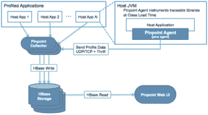
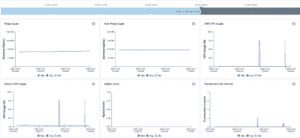
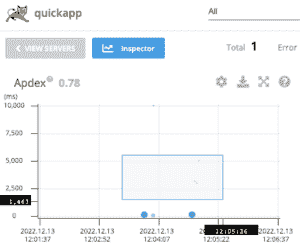
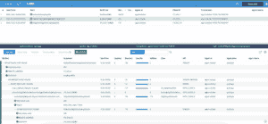

# Pinpoint 简介

> 原文：<https://web.archive.org/web/20220930061024/https://www.baeldung.com/ops/pinpoint-intro>

## 1.介绍

在本教程中，我们将探索 [Pinpoint](https://web.archive.org/web/20221220053246/https://github.com/pinpoint-apm/pinpoint) ，这是一款开源的 APM(应用性能管理)软件，具有出色的功能。

首先，我们将看到它的基本架构和工作部件的基本原理。然后，我们来看一个实时性能监控的工作示例。

## 2.Pinpoint 架构

我们来看看 Pinpoint 的[架构:](https://web.archive.org/web/20221220053246/https://pinpoint-apm.gitbook.io/pinpoint/want-a-quick-tour/overview#architecture)

[](/web/20221220053246/https://www.baeldung.com/wp-content/uploads/2022/12/pinpoint-architecture.png)

从该图中，我们可以确定四个主要组件:

*   Pinpoint Collector:收集已配置应用程序数据的 web 应用程序
*   HBase 存储:Pinpoint 存储数据的非关系型开源数据库
*   精确定位 Web UI:软件的前端
*   Pinpoint 代理:将应用程序的概要数据发送到 Pinpoint 收集器的 JVM 代理

**针尖采集器是软件**跳动的心脏。它可以通过两种不同的方式收集数据。第一种是通过显式收集数据——在这种情况下，应用程序直接调用 Pinpoint APIs。第二种是自动的，依赖于字节码检测，这意味着 Pinpoint 在类加载时修改应用程序代码，向收集器添加 TCP/UDP 网络调用。

## 3.运行示例

现在让我们运行一个快速入门示例，使用一个已经组合好的 Pinpoint 应用程序环境，使用`[docker-compose](/web/20221220053246/https://www.baeldung.com/ops/docker-compose)`:

```java
$ git clone https://github.com/pinpoint-apm/pinpoint-docker.git
$ cd pinpoint-docker
$ docker-compose pull && docker-compose up -d 
```

最后一个命令可能需要一些时间来执行，因为它会下载并显示所有连接到 Pinpoint quickstart showcase 的环境。

在运行结束时查看已启动的容器，我们会看到基础架构中的一些附加组件:

*   Pinpoint-QuickStart:我们正在监控的基于 Tomcat 的示例应用程序
*   Pinpoint-Flink:启用应用程序检查器，用于检查应用程序的资源
*   Pinpoint-Zookeeper:这只是一个使用 Pinpoint 的 [Zookeeper](/web/20221220053246/https://www.baeldung.com/java-zookeeper) 图像的例子
*   Pinpoint-Mysql 和 Pinpoint-Batch:用于设置警报

现在让我们来看看示例应用程序的一些端点，这样 APM 就有一些指标可以跟踪了。在地址`[http://localhost:8085](https://web.archive.org/web/20221220053246/http://localhost:8085/)`处，系统会提示我们可以呼叫的端点列表。对于本演示，让我们通过单击这些相对链接来发出三个 HTTP 请求:

*   `callSelf/getCurrentTimestamp`
*   `callSelf/httpclient4/getGeoCode`
*   `consumeCpu`

### 3.1.Web 客户端

现在让我们访问位于地址`[http://localhost:8080](https://web.archive.org/web/20221220053246/http://localhost:8080/)`的 web 客户端。在这里，当我们从应用程序列表中选择“quickapp”应用程序时，我们会看到以下网页:

[](/web/20221220053246/https://www.baeldung.com/wp-content/uploads/2022/12/pinpoint-welcome-1.png)

我们可以清楚地看到，我们发出了三个 web 请求，两个由应用程序自己解决，一个在 `maps.googleapis.com.` 发送给外部服务

此外，我们可以从应用程序周围圆圈的颜色看出，其中一个请求被认为是“慢”的，因为它花费了超过五秒钟来完成。

如果我们现在点击`Inspector`，我们可以看到很多关于 Java 应用程序状态的详细信息，包括`memory`、`CPU`和`response time:`

[](/web/20221220053246/https://www.baeldung.com/wp-content/uploads/2022/12/pinpoint-inspector-1024x471-1.png)

### 3.2.精确定位 JVM 代理

我们可以访问 Pinpoint APM 注册的每个请求的详细信息。通过在主页上的`Apdex Graph` 上点击并拖动鼠标，可以选择一些被跟踪的请求:

[](/web/20221220053246/https://www.baeldung.com/wp-content/uploads/2022/12/Screenshot-2022-12-13-at-12.06.38.png)

然后，我们会在一个新的选项卡中看到一个列表，其中列出了在` Call Tree`中注册的所有各种呼叫的详细信息:

[](/web/20221220053246/https://www.baeldung.com/wp-content/uploads/2022/12/pinpoint-trace-1024x475-1.png)

使用这个图，我们可以分析每个请求的完整调用栈。这有助于了解瓶颈或速度减慢的情况。检查外部第三方应用程序的意外行为也很棒。

正是 Pinpoint JVM 代理向用户提供了详细的堆栈跟踪。让我们看看如何启动受监控的 Java 应用程序:

```java
pinpoint-quickstart:
   //...
   environment:
      JAVA_OPTS: -javaagent:/pinpoint-agent/pinpoint-bootstrap-${PINPOINT_VERSION}.jar ...
```

在`docker-compose.yaml`中添加了`JAVA_OPS`环境变量，将 JVM 监控的应用程序配置为使用 Pinpoint [Java 代理启动。](/web/20221220053246/https://www.baeldung.com/java-instrumentation)然后，软件自动地、透明地检测字节码，以跟踪每次上下文切换期间的每次调用。

## 4.结论

在本文中，我们研究了 Pinpoint APM，这是一个开源工具，可以帮助我们一目了然地理解我们的应用程序拓扑结构。我们看到了如何通过 JVM 代理和外部 web 收集器，以非入侵的方式实时监控每个事务。