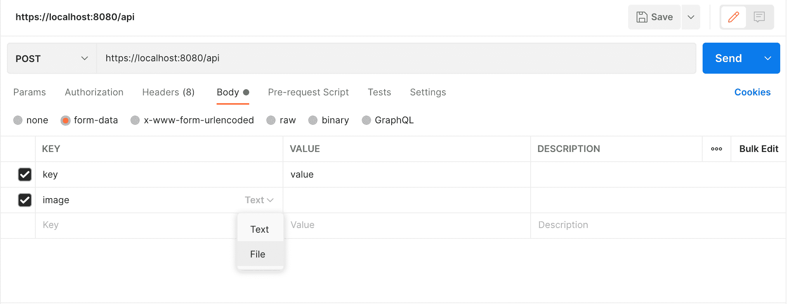
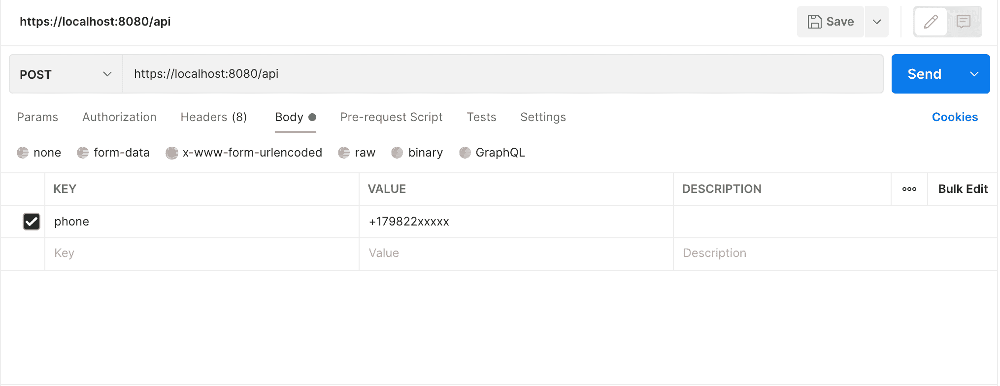

# Postman 中 form-data、x-www-form-urlencoded 和 raw 之间的区别

> 原文：<https://web.archive.org/web/20220930061024/https://www.baeldung.com/postman-form-data-raw-x-www-form-urlencoded>

## 1.概观

**Postman 通过不同类型的主体参数**提供了与 API 或服务器请求交互的多种方式。这些代表了通过 HTTP 请求向 API 发送数据的不同方式。

在本教程中，我们将探索在请求体中使用`form-data`、`x-www-form-urlencoded`和`raw`的区别。

## 2.`form-data`

**`Form-data`代表作为`multipart/form-data`的一部分从网站表单发送到 API 的数据。**Postman 中的`form-data`选项模拟在网站上填写表格并提交。我们可以编辑表单数据，让他通过转换数据中的键-值编辑器来设置不同的键/值对。

这也可以用于将文件附加到密钥上。但是，应该注意，使用 HTML5 会限制文件不在任何历史或集合中。因此，我们必须在发送请求正文时再次选择文件。此外，Postman 不支持上传多个文件及其内容类型。

请注意，Postman 将在后续使用中保存文件路径，例如，当我们重复进行 API 调用，将相同的文件发送到服务器时。这有助于运行具有文件上传的多个请求的集合。

让我们看看在 Postman 中使用`form-data`是什么样子的:

## 3.`x-www-form-urlencoded`

**URL 编码数据将编码数据发送到服务器，并使用与 URL 参数相同的编码。**要使用它，我们需要选择他们请求正文中的`x-www-form-urlencoded`选项卡。我们需要输入将请求体发送到服务器的键-值对，Postman 将在发送之前对所需的数据进行编码。Postman 对键和值都进行编码。

注意，它不能用于编码文件，所以我们需要自己手动完成。但是，它只能对请求主体数据或 URL 参数进行编码。

**这也称为默认内容类型。**使用此内容类型提交的所有表单都遵循以下编码模式:

*   控制名称和值被转义——所有空格字符将被替换为“+”符号，保留字符遵循 RFC 17.38 符号。
*   等号，即“=”用于分隔键和值，键/值对使用“&”彼此分隔。

让我们来看看《邮差》中的`x-www-form-urlencoded`标签:

## 4.`raw`

顾名思义，`raw`数据可以由任何东西组成。**邮递员不碰`raw`线，也不对它做任何类型的改动。**除了替换已定义的环境变量，添加到`raw`编辑器中的字符串不做任何修改。**这个编辑器让我们设置邮递员支持的不同格式样式，以及需要与`raw`正文一起发送的正确标题。**支持以下类型:

*   文本
*   java 描述语言
*   JSON
*   超文本标记语言
*   可扩展标记语言

我们还可以将这些内容类型手动设置到请求正文中:

## 5.`form-data`、`x-www-form-urlencoded`和`raw`的区别

我们可以使用由 T4 W3C 委员会定义的不同形式的数据内容类型。他们定义了多种通过网络层发送数据的格式。这些数据包括`form-data`、x-www-form- `urlencoded`和`raw`数据。**默认情况下，我们可以使用`x-www-form-urlencoded`格式发送简单文本/ASCII 格式的数据。**

但是，使用`x-www-form-urlencoded`数据类型有数据限制。因此，**我们可以使用`form-data`向服务器发送大型二进制或非 ASCII 文本。**

顾名思义，`raw`数据类型向服务器发送任何纯文本或 JSON。它支持多种内容类型，与其他数据类型相比，Postman 将发送未经任何修改的原始数据。

我们可以使用`raw`数据类型在请求体中发送任何类型的数据。这还包括发送可以在服务器端执行的 Javascript 函数。我们可以在 Javascript 选项下发送脚本。`raw`数据类型也支持 HTML 和 XML 等标记语言。当前端没有逻辑，我们需要使用整个 HTML/XML 页面时，这很有帮助。

## 6.结论

在本文中，我们已经看到了 Postman 支持的一些请求体数据类型。

我们还概述了《邮差》中`form-data`、`x-www-form-urlencoded`和`raw`的区别。然而，我们只了解了请求的基本内容。你可以通过浏览[邮差在线文档](https://web.archive.org/web/20220812000319/https://learning.postman.com/docs/sending-requests/requests/)来更深入地理解这些要求体型。