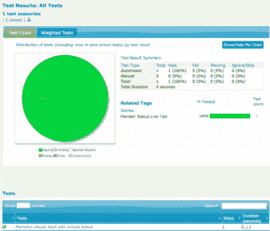
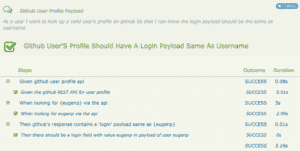

# Serenity BDD 简介

> 原文：<https://web.archive.org/web/20220930061024/https://www.baeldung.com/serenity-bdd>

## 1。简介

在本教程中，我们将介绍[Serenity BDD](https://web.archive.org/web/20221128122857/http://www.thucydides.info/)——一个应用[行为驱动开发(BDD)](/web/20221128122857/https://www.baeldung.com/cs/bdd-guide) 的伟大工具。这是一个自动化验收测试的解决方案，可以生成清晰的测试报告。

## 2。核心概念

Serenity 背后的概念遵循 BDD 背后的概念。如果你想了解更多，可以看看我们关于黄瓜和 T2 的文章。

### 2.1。要求

在 Serenity 中，需求分为三个级别:

1.  能力
2.  特征
3.  故事

通常，项目实现高级功能，例如电子商务项目中的订单管理和成员管理功能。每一项功能都由许多特性组成，而特性是由用户故事详细解释的。

### 2.2。步骤和测试

步骤包含一组资源操作操作。它可以是动作、验证或上下文相关的操作。经典的`Given_When_Then`格式可以体现在步骤上。

并且测试与`Steps.` **齐头并进，每个测试讲述一个简单的用户故事，这是使用一定的** `**Step**.`进行的

### 2.3。报告

Serenity 不仅报告测试结果，还使用它们来生成描述需求和应用程序行为的活文档。

## 3。使用 SerenityBDD 进行测试

为了用 JUnit 运行 Serenity 测试，我们需要`@RunWith` 测试运行程序 `SerenityRunner`。`SerenityRunner`装备 step 库并确保 Serenity reporters 记录和报告测试结果。

### 3.1。Maven 依赖关系

为了利用 JUnit 的宁静，我们应该在`pom.xml:`中包含 [`serenity-core`](https://web.archive.org/web/20221128122857/https://search.maven.org/classic/#artifactdetails%7Cnet.serenity-bdd%7Cserenity-core%7C1.2.5-rc.11%7Cjar) 和 [`serenity-junit`](https://web.archive.org/web/20221128122857/https://search.maven.org/classic/#artifactdetails%7Cnet.serenity-bdd%7Cserenity-junit%7C1.2.5-rc.11%7Cjar)

```java
<dependency>
    <groupId>net.serenity-bdd</groupId>
    <artifactId>serenity-core</artifactId>
    <version>1.2.5-rc.11</version>
</dependency>
<dependency>
    <groupId>net.serenity-bdd</groupId>
    <artifactId>serenity-junit</artifactId>
    <version>1.2.5-rc.11</version>
</dependency>
```

我们还需要 [`serenity-maven-plugin`](https://web.archive.org/web/20221128122857/https://search.maven.org/classic/#artifactdetails%7Cnet.serenity-bdd.maven.plugins%7Cserenity-maven-plugin%7C1.2.5-rc.6%7Cjar) 从测试结果中汇总报告:

```java
<plugin>
    <groupId>net.serenity-bdd.maven.plugins</groupId>
    <artifactId>serenity-maven-plugin</artifactId>
    <version>1.2.5-rc.6</version>
    <executions>
        <execution>
            <id>serenity-reports</id>
            <phase>post-integration-test</phase>
            <goals>
                <goal>aggregate</goal>
            </goals>
        </execution>
    </executions>
</plugin>
```

如果我们希望 Serenity 即使在测试失败时也能生成报告，那么在`pom.xml:`中添加以下内容

```java
<plugin>
    <groupId>org.apache.maven.plugins</groupId>
    <artifactId>maven-surefire-plugin</artifactId>
    <version>2.20</version>
    <configuration>
        <testFailureIgnore>true</testFailureIgnore>
    </configuration>
</plugin>
```

### 3.2。一个会员积分的例子

最初，我们的测试基于电子商务应用程序中典型的会员积分特性。客户可以加入会员计划。随着客户在平台上购买商品，会员积分会增加，客户的会员等级也会相应提高。

现在让我们针对上述场景编写几个测试，看看 Serenity 是如何工作的。

首先，让我们编写成员初始化测试，看看我们需要哪些步骤:

```java
@RunWith(SerenityRunner.class)
public class MemberStatusIntegrationTest {

    @Steps 
    private MemberStatusSteps memberSteps;

    @Test
    public void membersShouldStartWithBronzeStatus() {
        memberSteps.aClientJoinsTheMemberProgram();
        memberSteps.theMemberShouldHaveAStatusOf(Bronze);
    }
}
```

然后，我们实施以下两个步骤:

```java
public class MemberStatusSteps {

    private Member member;

    @Step("Given a member has {0} points")
    public void aMemberHasPointsOf(int points) {
        member = Member.withInitialPoints(points);
    }

    @Step("Then the member grade should be {0}")
    public void theMemberShouldHaveAStatusOf(MemberGrade grade) {
        assertThat(member.getGrade(), equalTo(grade));
    }
}
```

现在我们已经准备好运行与`mvn clean verify`的集成测试。这些报告将位于`target/site/serenity/index.html`:

[](/web/20221128122857/https://www.baeldung.com/wp-content/uploads/2017/04/serenity-report-member.png)

从报告中，我们可以看到，我们只有一项验收测试‘会员应该以铜牌身份开始，有能力’并且正在通过。通过点击测试，步骤如下图所示:

[](/web/20221128122857/https://www.baeldung.com/wp-content/uploads/2017/04/serenity-report-member-steps.png)

正如我们所看到的，Serenity 的报告让我们彻底了解了我们的应用程序正在做什么，以及它是否符合我们的要求。如果我们有一些步骤要实现，我们可以将它们标记为`@Pending`:

```java
@Pending
@Step("When the member exchange {}")
public void aMemberExchangeA(Commodity commodity){
    //TODO
}
```

这份报告会提醒我们下一步需要做什么。如果有任何测试失败，也可以在报告中看到:

[](/web/20221128122857/https://www.baeldung.com/wp-content/uploads/2017/04/serenity-report-member-steps-fails-pending.png)

将分别列出每个失败、忽略或跳过的步骤:

[](/web/20221128122857/https://www.baeldung.com/wp-content/uploads/2017/04/serenity-report-member-fails-pending-tests.png)

## 4。与 JBehave 的集成

Serenity 还可以集成现有的 BDD 框架，比如 JBehave。

### 4.1。Maven 依赖关系

为了与 JBehave 集成，POM 中还需要一个依赖项 [`serenity-jbehave`](https://web.archive.org/web/20221128122857/https://search.maven.org/classic/#artifactdetails%7Cnet.serenity-bdd%7Cserenity-jbehave%7C1.24.0%7Cjar) :

```java
<dependency>
    <groupId>net.serenity-bdd</groupId>
    <artifactId>serenity-jbehave</artifactId>
    <version>1.24.0</version>
</dependency>
```

### 4.2。JBehave Github REST API 测试继续

由于我们已经介绍了如何用 JBehave 进行 REST API 测试，我们可以继续我们的 JBehave REST API 测试，看看它如何适应 Serenity。

我们的故事是:

```java
Scenario: Github user's profile should have a login payload same as username

Given github user profile api
When I look for eugenp via the api
Then github's response contains a 'login' payload same as eugenp
```

`Given_When_Then`步骤可以迁移到`@Steps`而不做任何改变:

```java
public class GithubRestUserAPISteps {

    private String api;
    private GitHubUser resource;

    @Step("Given the github REST API for user profile")
    public void withUserProfileAPIEndpoint() {
        api = "https://api.github.com/users/%s";
    }

    @Step("When looking for {0} via the api")
    public void getProfileOfUser(String username) throws IOException {
        HttpResponse httpResponse = getGithubUserProfile(api, username);
        resource = retrieveResourceFromResponse(httpResponse, GitHubUser.class);
    }

    @Step("Then there should be a login field with value {0} in payload of user {0}")
    public void profilePayloadShouldContainLoginValue(String username) {
        assertThat(username, Matchers.is(resource.getLogin()));
    }

}
```

为了让 JBehave 的故事到代码的映射像预期的那样工作，我们需要使用`@Steps`实现 JBehave 的步骤定义:

```java
public class GithubUserProfilePayloadStepDefinitions {

    @Steps
    GithubRestUserAPISteps userAPISteps;

    @Given("github user profile api")
    public void givenGithubUserProfileApi() {
        userAPISteps.withUserProfileAPIEndpoint();
    }

    @When("looking for $user via the api")
    public void whenLookingForProfileOf(String user) throws IOException {
        userAPISteps.getProfileOfUser(user);
    }

    @Then("github's response contains a 'login' payload same as $user")
    public void thenGithubsResponseContainsAloginPayloadSameAs(String user) {
        userAPISteps.profilePayloadShouldContainLoginValue(user);
    }
}
```

使用`SerenityStories`，我们可以在 IDE 内部和构建过程中运行 JBehave 测试:

```java
import net.serenitybdd.jbehave.SerenityStory;

public class GithubUserProfilePayload extends SerenityStory {}
```

在`verify`构建完成后，我们可以看到我们的测试报告:

[](/web/20221128122857/https://www.baeldung.com/wp-content/uploads/2017/04/serenity-report-jbehave-api.png)

与 JBehave 的纯文本报告相比，Serenity 的丰富报告为我们提供了一个更加赏心悦目和生动的关于我们的故事和测试结果的概述。

## 5。放心集成

值得注意的是，Serenity 支持与[放心](https://web.archive.org/web/20221128122857/http://rest-assured.io/)的集成。要有一个放心的回顾，看看[放心指南](/web/20221128122857/https://www.baeldung.com/rest-assured-tutorial) `.`

### 5.1。Maven 依赖关系

为了使用放心与宁静，应该包括 [`serenity-rest-assured`](https://web.archive.org/web/20221128122857/https://search.maven.org/classic/#artifactdetails%7Cnet.serenity-bdd%7Cserenity-rest-assured%7C1.2.5-rc.11%7Cjar) 依赖:

```java
<dependency>
    <groupId>net.serenity-bdd</groupId>
    <artifactId>serenity-rest-assured</artifactId>
    <version>1.2.5-rc.11</version>
</dependency>
```

### 5.2。在 Github REST API 测试中使用放心

现在，我们可以用放心的实用程序替换我们的 web 客户端:

```java
import static net.serenitybdd.rest.SerenityRest.rest;
import static net.serenitybdd.rest.SerenityRest.then;

public class GithubRestAssuredUserAPISteps {

    private String api;

    @Step("Given the github REST API for user profile")
    public void withUserProfileAPIEndpoint() {
        api = "https://api.github.com/users/{username}";
    }

    @Step("When looking for {0} via the api")
    public void getProfileOfUser(String username) throws IOException {
        rest().get(api, username);
    }

    @Step("Then there should be a login field with value {0} in payload of user {0}")
    public void profilePayloadShouldContainLoginValue(String username) {
        then().body("login", Matchers.equalTo(username));
    }

}
```

在替换了`StepDefition`中`userAPISteps`的实现后，我们可以重新运行`verify`构建:

```java
public class GithubUserProfilePayloadStepDefinitions {

    @Steps
    GithubRestAssuredUserAPISteps userAPISteps;

    //...

}
```

在报告中，我们可以看到在测试过程中调用的实际 API，通过单击`REST Query`按钮，将显示请求和响应的详细信息:

[](/web/20221128122857/https://www.baeldung.com/wp-content/uploads/2017/04/serenity-report-jbehave-api-rest-assured.png)

## 6。与 JIRA 的整合

到目前为止，我们已经有了一份很好的测试报告，描述了我们对 Serenity 框架的需求的细节和状态。但是对于一个敏捷团队来说，像 JIRA 这样的问题跟踪系统经常被用来跟踪需求。如果能无缝使用就更好了。

幸运的是，Serenity 已经支持与 JIRA 的整合。

### 6.1。Maven 依赖关系

为了与 JIRA 整合，我们需要另一个依赖:`[serenity-jira-requirements-provider](https://web.archive.org/web/20221128122857/https://search.maven.org/classic/#artifactdetails%7Cnet.serenity-bdd%7Cserenity-jira-requirements-provider%7C1.1.3-rc.5%7Cjar).`

```java
<dependency>
    <groupId>net.serenity-bdd</groupId>
    <artifactId>serenity-jira-requirements-provider</artifactId>
    <version>1.1.3-rc.5</version>
</dependency>
```

### 6.2。单向集成

要在故事中添加 JIRA 链接，我们可以使用 story 的 meta 标签添加 JIRA 问题:

```java
Meta:
@issue #BDDTEST-1
```

此外，应该在项目根目录下的 serenity.properties 文件中指定 JIRA 帐户和链接:

```java
jira.url=<jira-url>
jira.project=<jira-project>
jira.username=<jira-username>
jira.password=<jira-password>
```

然后，在报告中会附加一个 JIRA 链接:

[](/web/20221128122857/https://www.baeldung.com/wp-content/uploads/2017/04/serenity-report-jira.png)

Serenity 还支持与 JIRA 的双向集成，我们可以参考[官方文档](https://web.archive.org/web/20221128122857/http://www.thucydides.info/docs/serenity/#_two_way_integration_with_jira)了解更多细节。

## 7。总结

在本文中，我们介绍了 Serenity BDD 以及与其他测试框架和需求管理系统的多种集成。

虽然我们已经介绍了 Serenity 可以做的大部分事情，但是它肯定可以做得更多。在我们的下一篇文章中，我们将介绍 Serenity 的 WebDriver 支持如何使我们能够使用 screenplay 自动化 web 应用程序页面。

和往常一样，完整的实现代码可以在 GitHub 项目的[中找到。](https://web.archive.org/web/20221128122857/https://github.com/eugenp/tutorials/tree/master/libraries-testing)