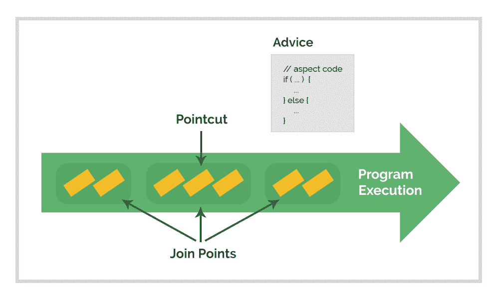

# Spring AOP 简介

> 原文：<https://web.archive.org/web/20220930061024/https://www.baeldung.com/spring-aop>

## 1。简介

在本教程中，我们将介绍 Spring 的 AOP(面向方面编程),并学习如何在实际场景中使用这个强大的工具。

在使用 Spring AOP 进行开发时，也可以利用 [AspectJ 的注释](/web/20220902075953/https://www.baeldung.com/aspectj),但是在本文中，我们将关注 Spring AOP 基于 XML 的核心配置。

## 2。概述

AOP 是一种编程范例，旨在通过允许分离横切关注点来增加模块化。它通过向现有代码添加额外的行为来实现这一点，而不修改代码本身。

相反，我们可以分别声明新代码和新行为。

Spring 的 [AOP 框架](https://web.archive.org/web/20220902075953/https://docs.spring.io/spring/docs/current/spring-framework-reference/core.html#aop)帮助我们实现这些横切关注点。

## 3。Maven 依赖关系

让我们从在`pom.xml`中添加 Spring 的 AOP 库依赖开始:

```java
<parent>
    <groupId>org.springframework.boot</groupId>
    <artifactId>spring-boot-starter-parent</artifactId>
    <version>2.6.1</version>
</parent>

<dependencies>
    <dependency>
        <groupId>org.springframework.boot</groupId>
        <artifactId>spring-boot-starter-aop</artifactId>
    </dependency>
</dependencies>
```

依赖关系的最新版本可以在[这里](https://web.archive.org/web/20220902075953/https://search.maven.org/classic/#search%7Cga%7C1%7C%20(g%3A%22org.springframework.boot%22%20AND%20a%3A%22spring-boot-starter-parent%22)%20OR%20%20(g%3A%22org.springframework.boot%22%20AND%20a%3A%22spring-boot-starter%22)%20OR%20%20(g%3A%22org.springframework.boot%22%20AND%20a%3A%22spring-boot-starter-aop%22))查看。

## 4。AOP 概念和术语

让我们简单回顾一下 AOP 特有的概念和术语:

[](/web/20220902075953/https://www.baeldung.com/wp-content/uploads/2017/11/Program_Execution.jpg)

### 4.1。业务对象

业务对象是一个具有普通业务逻辑的普通类。让我们来看一个简单的业务对象示例，其中我们只添加了两个数字:

```java
public class SampleAdder {
    public int add(int a, int b) {
        return a + b;
    }
} 
```

注意，这个类是一个带有业务逻辑的普通类，没有任何与 Spring 相关的注释。

### 4.2。外观

一个方面是跨越多个类的关注点的模块化。统一日志可以是这种跨领域关注的一个例子。

让我们看看如何定义一个简单的方面:

```java
public class AdderAfterReturnAspect {
    private Logger logger = LoggerFactory.getLogger(this.getClass());
    public void afterReturn(Object returnValue) throws Throwable {
        logger.info("value return was {}",  returnValue);
    }
} 
```

在上面的例子中，我们定义了一个简单的 Java 类，它有一个名为`afterReturn,`的方法，该方法接受一个类型为`Object`的参数并记录该值。注意，甚至我们的`AdderAfterReturnAspect`也是一个标准类，没有任何 Spring 注释。

在接下来的部分中，我们将看到如何将这个方面连接到我们的业务对象。

### 4.3。`Joinpoint`

**A `Joinpoint`是程序执行过程中的一个点，比如一个方法的执行或者一个异常的处理。**

在 Spring AOP 中，一个`JoinPoint`总是代表一个方法的执行。

### 4.4。`Pointcut`

一个`Pointcut`是一个谓词，它帮助匹配一个`Advice`，该 T1 将由一个`Aspect`在一个特定的`JoinPoint`应用。

我们经常把`Advice`和一个`Pointcut`表达式联系在一起，它运行在由`Pointcut`匹配的任意一个`Joinpoint`上。

### 4.5。`Advice`

一个`Advice`是一个方面在特定的`Joinpoint`采取的动作。不同类型的建议包括`“around,” “before,”`和`“after.”`

在 Spring 中，`Advice`被建模为拦截器，在`Joinpoint`周围维护一系列拦截器。

### 4.6。布线业务对象和方面

现在让我们看看如何将一个业务对象连接到一个具有事后返回建议的方面。

下面是我们放在标准 Spring 配置的`“<beans>”`标签中的配置摘录:

```java
<bean id="sampleAdder" class="org.baeldung.logger.SampleAdder" />
<bean id="doAfterReturningAspect" 
  class="org.baeldung.logger.AdderAfterReturnAspect" />
<aop:config>
    <aop:aspect id="aspects" ref="doAfterReturningAspect">
       <aop:pointcut id="pointCutAfterReturning" expression=
         "execution(* org.baeldung.logger.SampleAdder+.*(..))"/>
       <aop:after-returning method="afterReturn"
         returning="returnValue" pointcut-ref="pointCutAfterReturning"/>
    </aop:aspect>
</aop:config> 
```

正如我们所看到的，我们定义了一个简单的 bean】，它代表了一个业务对象的实例。此外，我们创建了一个名为`AdderAfterReturnAspect`的方面实例。

当然，XML 不是我们这里唯一的选择；如前所述， [AspectJ](/web/20220902075953/https://www.baeldung.com/aspectj) 注释也完全受支持。

### 4.7。配置一览

我们可以使用标签`aop:config`来定义 AOP 相关的配置。**在`config`标签中，我们定义了表示一个方面的类。**然后我们给它一个我们创建的`“doAfterReturningAspect,”`方面 bean 的引用。

接下来，我们使用`pointcut`标签定义一个切入点。上例中使用的切入点是`execution(* org.baeldung.logger.SampleAdder+.*(..)),`，这意味着在`SampleAdder`类中接受任意数量的参数并返回任意值类型的任何方法上应用一个通知。

然后我们定义我们想要应用的建议。在上面的例子中，我们应用了退货后建议。我们通过执行使用属性方法定义的`afterReturn`方法，在我们的方面`AdderAfterReturnAspect`中定义了这一点。

Aspect 中的这个通知接受一个类型为`Object.`的参数，这个参数给我们一个机会在目标方法调用之前和/或之后采取行动。在这种情况下，我们只记录方法的返回值。

Spring AOP 使用基于注释的配置支持多种类型的通知。这个和更多的例子可以在[这里](/web/20220902075953/https://www.baeldung.com/spring-aop-advice-tutorial)和[这里](/web/20220902075953/https://www.baeldung.com/spring-aop-pointcut-tutorial)找到。

## 5。结论

在本文中，我们举例说明了 AOP 中使用的概念。我们还看了使用 Spring 的 AOP 模块的例子。如果我们想了解更多关于 AOP 的知识，我们可以看看下面的资源:

*   [AspectJ 简介](/web/20220902075953/https://www.baeldung.com/aspectj)
*   [实现定制的 Spring AOP 注释](/web/20220902075953/https://www.baeldung.com/spring-aop-annotation)
*   [Spring 切入点表达式介绍](/web/20220902075953/https://www.baeldung.com/spring-aop-pointcut-tutorial)
*   [比较 Spring AOP 和 AspectJ](/web/20220902075953/https://www.baeldung.com/spring-aop-vs-aspectj)
*   [春季建议类型介绍](/web/20220902075953/https://www.baeldung.com/spring-aop-advice-tutorial)

这些例子的实现可以在 GitHub 的[中找到。](https://web.archive.org/web/20220902075953/https://github.com/eugenp/tutorials/tree/master/spring-aop "Spring AOP")