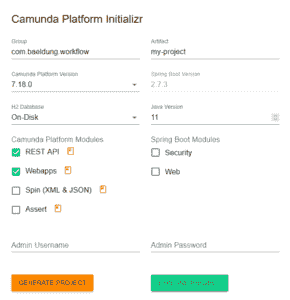
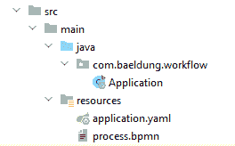
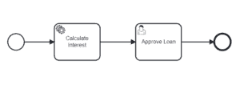
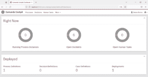
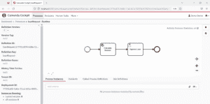
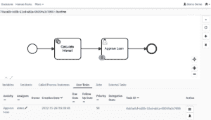

# 使用嵌入式 Camunda 引擎运行 Spring Boot 应用程序

> 原文：<https://web.archive.org/web/20220930061024/https://www.baeldung.com/spring-boot-embedded-camunda>

## 1。概述

工作流引擎在业务流程自动化中起着重要的作用。 **[Camunda](https://web.archive.org/web/20221207215846/https://camunda.com/) 平台是一个开源的工作流和业务流程管理系统(BPMS)，为业务流程建模提供流程引擎**。Spring Boot 与卡蒙达平台有很好的融合。在本教程中，我们将看看如何**将嵌入式 Camunda 引擎运用到 Spring Boot 应用**中。

## 2。Camunda 工作流引擎

Camunda 工作流引擎是 [Activiti](/web/20221207215846/https://www.baeldung.com/java-activiti) 的一个分支，提供了一个基于[业务流程建模符号 2.0 (BPMN 2.0)](https://web.archive.org/web/20221207215846/https://www.bpmn.org/) 标准的工作流和模拟引擎。此外，它由用于建模、执行和监控的工具和 API 组成。首先，**我们可以使用[建模器](https://web.archive.org/web/20221207215846/https://camunda.com/download/modeler/)** 为我们的端到端业务流程建模。Camunda 提供了设计 BPMN 工作流的建模器。建模器作为桌面应用程序在本地运行。然后，我们将业务流程模型部署到工作流引擎并执行它。我们可以使用 REST APIs 和提供的 Web 应用程序(Cockpit、Tasklist 和 Admin)以不同的方式执行业务流程。Camunda 引擎可以以不同的方式使用:SaaS、自我管理和可嵌入库。**在本教程中，我们将重点介绍 Spring Boot 应用中的 Camunda 嵌入式引擎**。

## 3。使用嵌入式 Camunda 引擎创建 Spring Boot 应用程序

在本节中，我们将使用[Camunda Platform Initializr](https://web.archive.org/web/20221207215846/https://start.camunda.com/)创建和配置带有嵌入式 cam unda 引擎的 Spring Boot 应用程序。

### 3.1.Camunda 平台初始化

**我们可以使用 Camunda Platform Initializr** 创建一个与 Camunda 引擎集成的 Spring Boot 应用程序。这是一个由 Camunda 提供的网络应用工具，类似于 [Spring Initializr](https://web.archive.org/web/20221207215846/https://start.spring.io/) 。让我们在 Camunda 平台初始化中使用以下信息创建应用程序: [](/web/20221207215846/https://www.baeldung.com/wp-content/uploads/2022/12/init.png) 该工具允许我们添加项目元数据，包括`Group`、`Artifact`、 `Camunda BPM Version`、 `H2 Database`和`Java Version`。此外，我们可以在我们的 Spring Boot 应用程序中添加`Camunda BPM Modules` 来支持 Camunda REST APIs 或 Camunda Webapps。此外，我们可以添加 Spring Boot 网络和安全模块。我们的另一个选项是设置管理员用户名和密码，这是在 Camunda Webapps(如 Cockpit 应用程序登录)中使用所必需的。现在，我们单击 Generate Project 以. zip 文件的形式下载项目模板。最后，我们提取文件并在 IDE 中打开`pom.xml`。

### 3.2.卡蒙达构型

生成的项目是一个**常规的 Spring Boot 应用程序，带有额外的 Camunda 依赖项和配置**。目录结构如下图所示:[](/web/20221207215846/https://www.baeldung.com/wp-content/uploads/2022/12/camunda_proyect.png)`resources`目录下有一个简单的工作流程图`process.bpmn`。它使用 start 节点开始执行流程。之后，它将继续执行`Say hello to demo`任务。该任务完成后，执行会在遇到最后一个节点时停止。Camunda 属性存在于`application.yaml`中。让我们来看看`application.yaml`中生成的默认 Camunda 属性:

```java
camunda.bpm.admin-user:
  id: demo
  password: demo
```

我们可以使用`camunda.bpm.admin-user`属性更改管理员用户名和密码。

## 4.用 Spring Boot 创建应用程序

另一种使用嵌入式 Camunda 引擎创建 Spring Boot 应用程序的方法是从头开始使用 Spring Boot，并向其中添加 Camunda 库。

### 4.1.Maven 依赖性

让我们首先在我们的`pom.xml`中声明 [`camunda-bpm-spring-boot-starter-webapp`](https://web.archive.org/web/20221207215846/https://search.maven.org/search?q=g:org.camunda.bpm.springboot%20AND%20a:camunda-bpm-spring-boot-starter-webapp) 依赖项:

```java
<dependency>
    <groupId>org.camunda.bpm.springboot</groupId>
    <artifactId>camunda-bpm-spring-boot-starter-webapp</artifactId>
    <version>7.18.0</version>
</dependency>
```

我们需要一个数据库来存储过程定义、过程实例、历史信息等。在本教程中，我们使用基于文件的`H2`数据库。因此，我们需要添加 [`h2`](https://web.archive.org/web/20221207215846/https://search.maven.org/search?q=g:com.h2database%20a:h2) 和 [`spring-boot-starter-jdbc`](https://web.archive.org/web/20221207215846/https://search.maven.org/search?q=a:spring-boot-starter-jdbc%20g:org.springframework.boot) 的依赖关系:

```java
<dependency>
    <groupId>com.h2database</groupId>
    <artifactId>h2</artifactId>
</dependency>
<dependency>
    <groupId>org.springframework.boot</groupId>
    <artifactId>spring-boot-starter-jdbc</artifactId>
</dependency>
```

### 4.2.样本流程模型

我们使用 Camunda Modeler 来定义一个简单的贷款请求工作流程图`loanProcess.bpmn`。下面是`loanProcess` `.bpmn`模型执行顺序的图形化流程图，以帮助我们理解: [](/web/20221207215846/https://www.baeldung.com/wp-content/uploads/2022/12/loanProcess.png) 我们使用开始节点开始执行流程。之后，执行`Calculate Interest`任务。接下来，我们将继续进行`Approve Loan`任务。该任务完成后，执行会在遇到最后一个节点时停止。`Calculate Interest`任务是一个服务任务，调用`CalculateInterestService` bean:

```java
@Component
public class CalculateInterestService implements JavaDelegate {

    private static final Logger LOGGER = LoggerFactory.getLogger(CalculateInterestService.class);

    @Override
    public void execute(DelegateExecution execution) {
        LOGGER.info("calculating interest of the loan");
    }

}
```

**我们需要实现`JavaDelegate`接口**。该类可用于服务任务和事件侦听器。**它提供了在流程执行**期间要调用的`execute()`方法中所需的逻辑。现在，应用程序准备启动了。

## 5.示范

现在让我们运行 Spring Boot 应用程序。我们打开浏览器，输入网址 http://localhost:8080/:

[](/web/20221207215846/https://www.baeldung.com/wp-content/uploads/2022/12/camunda_login.png)

让我们输入用户凭证并访问 Camunda web 应用程序驾驶舱、任务列表和管理员: [](/web/20221207215846/https://www.baeldung.com/wp-content/uploads/2022/12/camunda_welcome.png)

### 5.1.驾驶舱应用

**cam unda 驾驶舱网络应用程序为用户提供了监控实施过程及其操作的实时视图的设施。**我们可以看到 Spring Boot 应用启动时自动部署的进程数量: [](/web/20221207215846/https://www.baeldung.com/wp-content/uploads/2022/12/camunda_cockpit.png) 我们可以看到，有一个部署的进程(`loanProcess` `.bpmn`)。我们可以通过点击 [](/web/20221207215846/https://www.baeldung.com/wp-content/uploads/2022/12/loanProcess-deploy-2.png) 来查看已部署的流程图，现在流程还没有启动。我们可以使用 Tasklist 应用程序启动它。

### 5.2.任务列表应用程序

**cam unda task list 应用程序用于管理用户与其任务的交互**。我们可以通过单击 Start process 菜单项来启动我们的示例流程: [](/web/20221207215846/https://www.baeldung.com/wp-content/uploads/2022/12/camunda_tasklist.png) 启动流程后，执行`Calculate Interest`任务。它会登录到控制台:

```java
2022-11-27 09:34:05.848  INFO 2748 --- [nio-8080-exec-3] c.e.c.task.CalculateInterestService      : calculating interest of the loan
```

现在，我们可以在驾驶舱应用程序中看到正在运行的流程实例: [](/web/20221207215846/https://www.baeldung.com/wp-content/uploads/2022/12/loanProcess-assign-1.png) 注意，该流程正在等待`Approve Loan`用户任务。在这一步中，我们将任务分配给`demo`用户。因此，`demo`用户可以在任务列表应用程序中看到任务: [](/web/20221207215846/https://www.baeldung.com/wp-content/uploads/2022/12/loanProcess-tasklist-1.png) 我们可以通过单击完成按钮来完成任务。最后，我们可以看到运行过程是在驾驶舱应用程序中完成的。

### 5.3.管理应用程序

**cam unda 管理应用程序用于管理用户及其对系统的访问**。同样，我们可以管理租户和群组: [](/web/20221207215846/https://www.baeldung.com/wp-content/uploads/2022/12/admin-1.png)

## 6.结论

在本文中，我们讨论了使用嵌入式 Camunda 引擎设置 Spring Boot 应用程序的基础。我们使用 Camunda Platform Initializr 工具和 Spring Boot 从头开始创建应用程序。此外，我们使用 Camunda Modeler 定义了一个简单的贷款请求流程模型。此外，我们使用 Camunda web 应用程序开始并探索这一流程模型。GitHub 上的[提供了本文所示代码的工作版本。](https://web.archive.org/web/20221207215846/https://github.com/eugenp/tutorials/tree/master/spring-boot-modules/spring-boot-process-automation)