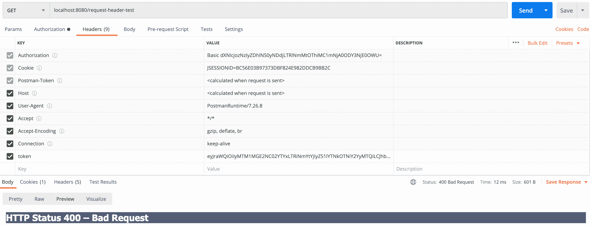
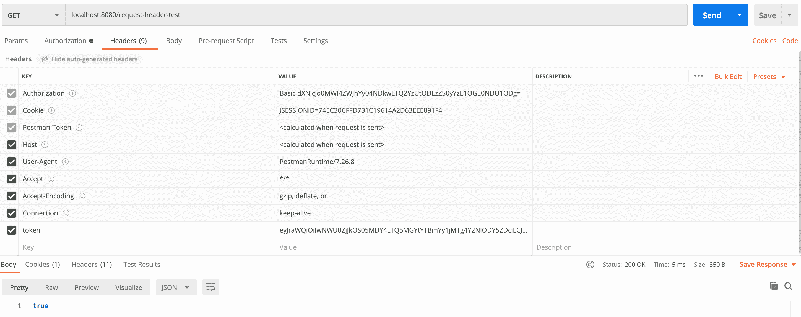

# Spring Boot 2 中的最大 HTTP 头大小

> 原文：<https://web.archive.org/web/20220930061024/https://www.baeldung.com/spring-boot-max-http-header-size>

## 1.概观

[Spring Boot](/web/20220628055021/https://www.baeldung.com/spring-boot) 默认情况下，网络应用包括一个预先配置的嵌入式网络服务器。然而，在某些情况下，**我们想要修改默认配置**来满足定制需求。

在本教程中，我们将了解如何在 Spring Boot 2.x 应用程序的`application.properties`文件中为请求头设置和使用`max-http-header-size` 属性。

## 2.Max-HTTP-Header-Size

Spring Boot 支持 [Tomcat](/web/20220628055021/https://www.baeldung.com/tomcat) 、[under flow](/web/20220628055021/https://www.baeldung.com/jboss-undertow)和 [Jetty](/web/20220628055021/https://www.baeldung.com/jetty-embedded) 作为嵌入式服务器。一般来说，我们在 Spring Boot 应用程序的`application.properties`文件或`application.yaml`文件中编写服务器配置。

大多数 web 服务器都有自己的 HTTP 请求头大小限制。HTTP 头值受服务器实现的限制。在 Spring Boot 应用程序中，最大 HTTP 报头大小是使用`server.max-http-header-size`配置的。

**Tomcat 和 Jetty 的实际默认值是 8kB，Undertow 的默认值是 1MB。**

为了修改最大 HTTP 头大小，我们将属性添加到我们的`application.properties`文件中:

```java
server.max-http-header-size=20000
```

同样，对于`application.yaml`格式:

```java
server:
    max-http-header-size: 20000
```

在 Spring Boot 2.1 中，我们现在将使用一个 *DataSize* 可解析值:

```java
server.max-http-header-size=10KB
```

## 3.请求标题太大

假设发送了一个请求，其中 HTTP 头的总大小大于`max-http-header-size`值。**服务器以“400 错误请求”错误拒绝请求**。在下一个例子中，我们将在日志文件中看到这个错误。

让我们创建一个控制器，它有一个名为 token 的头属性:

```java
@RestController
@RequestMapping(value = "/request-header-test")
public class MaxHttpHeaderSizeController {
    @GetMapping
    public boolean testMaxHTTPHeaderSize(@RequestHeader(value = "token") String token) {
	return true;
    }
}
```

接下来，让我们给我们的 `application.properties`文件添加一些属性:

```java
## Server connections configuration
server.tomcat.threads.max=200
server.connection-timeout=5s
server.max-http-header-size=8KB
server.tomcat.max-swallow-size=2MB
server.tomcat.max-http-post-size=2MB
```

当我们在令牌中传递一个大小大于 8kb 的`String`值时，我们将得到如下所示的 400 错误:

[](/web/20220628055021/https://www.baeldung.com/wp-content/uploads/2021/06/max-http-header-size.png)

在日志中，我们看到以下错误:

```java
19:41:50.757 [http-nio-8080-exec-7] INFO  o.a.coyote.http11.Http11Processor - Error parsing HTTP request header
 Note: further occurrences of HTTP request parsing errors will be logged at DEBUG level.
java.lang.IllegalArgumentException: Request header is too large
...
```

## 4.解决办法

我们可以根据自己的需要增加`application.properties`文件中`max-http-header-size`属性的值。

在上面的程序中，我们可以将其值从默认的 8kb 升级到 40KB，这将解决问题。

`server.max-http-header-size=40KB`

现在，服务器将处理请求并发回 200 响应，如下所示:

[](/web/20220628055021/https://www.baeldung.com/wp-content/uploads/2021/06/request-header-test-200-response-1.png)

因此，每当头大小超过服务器列出的默认值时，我们将看到服务器返回一个 400-Bad 请求，并带有错误“请求头太大”。我们必须覆盖应用程序配置文件中的`max-http-header-size` 值，以匹配请求头的长度，正如我们在上面的例子中看到的。

一般来说，当使用的令牌由于加密而非常长时，请求报头可能会变得太大。

## 5.结论

在本教程中，我们学习了如何在 Spring Boot 应用程序的应用程序配置文件中使用`max-http-header-size`属性。

然后，我们看到了当我们传递超过这个大小的请求头时会发生什么，以及如何增加我们的`application.properties`中的`max-http-header-size`的大小。

和往常一样，这些例子的源代码可以在 GitHub 上的[处获得。](https://web.archive.org/web/20220628055021/https://github.com/eugenp/tutorials/tree/master/spring-boot-modules/spring-boot-runtime-2)