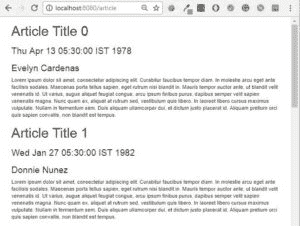

# Spring Boot 小胡子指南

> 原文：<https://web.archive.org/web/20220930061024/https://www.baeldung.com/spring-boot-mustache>

## 1。概述

在本文中，我们将重点介绍如何使用 Mustache 模板在 Spring Boot 应用程序中生成 HTML 内容。

这是一个用于创建动态内容的**无逻辑模板引擎，由于其简单性而广受欢迎。**

如果你想发现基本原理，查看我们的[小胡子介绍](/web/20221206062259/http://www.baeldung.com/mustache)文章。

## 2。Maven 依赖关系

为了能和 Spring Boot 一起使用小胡子，我们需要在我们的`pom.xml:`中添加[专用的 Spring Boot 首发](https://web.archive.org/web/20221206062259/https://search.maven.org/classic/#search%7Cga%7C1%7Cg%3A%22org.springframework.boot%22%20AND%20a%3A%22spring-boot-starter-mustache%22)

```
<dependency>			
    <groupId>org.springframework.boot</groupId>
    <artifactId>spring-boot-starter-mustache</artifactId>
</dependency>
<dependency> 
    <groupId>org.springframework.boot</groupId> 
    <artifactId>spring-boot-starter-web</artifactId> 
</dependency>
```

此外，我们需要 [spring-boot-starter-web](https://web.archive.org/web/20221206062259/https://search.maven.org/search?q=a:spring-boot-starter-web) 依赖关系。

## 3。创建模板

让我们展示一个例子，并使用 Spring-Boot 创建一个简单的 MVC 应用程序，它将在网页上提供文章。

让我们为文章内容编写第一个模板:

```
<div class="starter-template">
    {{#articles}}
    <h1>{{title}}</h1>
    <h3>{{publishDate}}</h3>
    <h3>{{author}}</h3>
    <p>{{body}}</p>
    {{/articles}}
</div>
```

我们将保存这个 HTML 文件，比如说`article.html, a`并在我们的`index.html:`中引用它

```
<div class="container">
    {{>layout/article}}
</div>
```

这里，`layout` 是子目录， `article` 是模板文件的文件名。

注意，默认的 mustache 模板文件扩展名现在是。`mustache`。我们可以用一个属性覆盖这个配置:

```
spring.mustache.suffix:.html
```

## 4。控制器

现在让我们编写服务商品的控制器:

```
@GetMapping("/article")
public ModelAndView displayArticle(Map<String, Object> model) {

    List<Article> articles = IntStream.range(0, 10)
      .mapToObj(i -> generateArticle("Article Title " + i))
      .collect(Collectors.toList());

    model.put("articles", articles);

    return new ModelAndView("index", model);
}
```

控制器返回要在页面上呈现的文章列表。在文章模板中，以#开始并以/结束的标签`articles` 负责列表。

这将迭代传递的模型，并分别呈现每个元素，就像在 HTML 表中一样:

```
 {{#articles}}...{{/articles}} 
```

`generateArticle()` 方法用一些随机数据创建一个`Article` 实例。

请注意，控制器返回的文章模型中的键应该与`article` 模板标签中的键相同。

现在，让我们测试我们的应用程序:

```
@Test
public void givenIndexPage_whenContainsArticle_thenTrue() {

    ResponseEntity<String> entity 
      = this.restTemplate.getForEntity("/article", String.class);

    assertTrue(entity.getStatusCode()
      .equals(HttpStatus.OK));
    assertTrue(entity.getBody()
      .contains("Article Title 0"));
}
```

我们还可以通过部署以下组件来测试应用程序:

```
mvn spring-boot:run
```

部署完成后，我们可以点击`localhost:8080/article,` ，然后我们会列出我们的文章:

[](/web/20221206062259/http://www.baeldung.com/wp-content/uploads/2017/09/article-1.jpeg)

## 5。处理默认值

在 Mustache 环境中，如果我们没有为占位符提供值，那么`MustacheException`将会抛出一条消息`“No method or field with name ”variable-name …”.`

为了避免这种错误，最好为所有占位符提供一个默认的全局值:

```
@Bean
public Mustache.Compiler mustacheCompiler(
  Mustache.TemplateLoader templateLoader, 
  Environment environment) {

    MustacheEnvironmentCollector collector
      = new MustacheEnvironmentCollector();
    collector.setEnvironment(environment);

    return Mustache.compiler()
      .defaultValue("Some Default Value")
      .withLoader(templateLoader)
      .withCollector(collector);
}
```

## 6。带弹簧 MVC 的小胡子

现在，让我们讨论如果我们决定不使用 Spring Boot，如何与 Spring MVC 集成。首先，让我们添加依赖关系:

```
<dependency>
    <groupId>com.github.sps.mustache</groupId>
    <artifactId>mustache-spring-view</artifactId>
    <version>1.4</version>
</dependency>
```

最新的可以在这里找到[。](https://web.archive.org/web/20221206062259/https://search.maven.org/classic/#search%7Cga%7C1%7Cg%3A%22com.github.sps.mustache%22%20AND%20a%3A%22mustache-spring-view%22)

接下来，我们需要配置`MustacheViewResolver` 而不是 Spring 的`InternalResourceViewResolver`:

```
@Bean
public ViewResolver getViewResolver(ResourceLoader resourceLoader) {
    MustacheViewResolver mustacheViewResolver
      = new MustacheViewResolver();
    mustacheViewResolver.setPrefix("/WEB-INF/views/");
    mustacheViewResolver.setSuffix("..mustache");
    mustacheViewResolver.setCache(false);
    MustacheTemplateLoader mustacheTemplateLoader 
      = new MustacheTemplateLoader();
    mustacheTemplateLoader.setResourceLoader(resourceLoader);
    mustacheViewResolver.setTemplateLoader(mustacheTemplateLoader);
    return mustacheViewResolver;
} 
```

我们只需要配置存储模板的`suffix,` 、模板的扩展`prefix`和负责加载模板的`templateLoader,` 。

## 7。结论

在这个快速教程中，我们研究了如何将 Mustache 模板与 Spring Boot 一起使用，在 UI 中呈现一组元素，并为变量提供默认值以避免错误。

最后，我们讨论了如何使用`MustacheViewResolver.`将其与 Spring 集成

和往常一样，源代码可以在 GitHub 上找到[。](https://web.archive.org/web/20221206062259/https://github.com/eugenp/tutorials/tree/master/mustache)