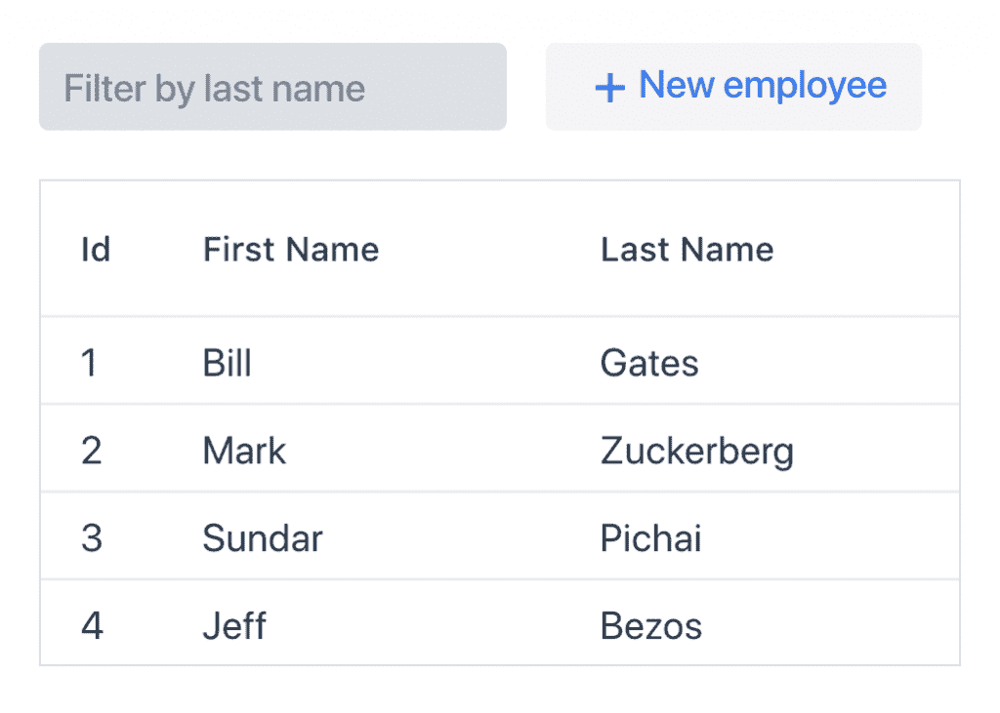
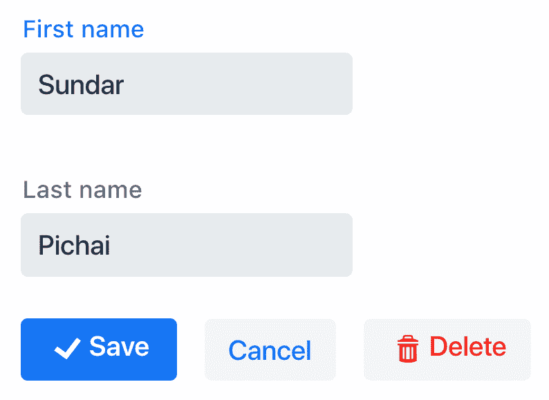

# Spring Boot 和瓦丁的应用示例

> 原文：<https://web.archive.org/web/20220930061024/https://www.baeldung.com/spring-boot-vaadin>

## 1。概述

[Vaadin](https://web.archive.org/web/20220626203823/https://vaadin.com/) 是一个**服务器端 Java 框架，用于创建 web 用户界面**。

在本教程中，我们将探索如何在基于 Spring Boot 的后端上使用基于 **Vaadin 的 UI。关于瓦丁的介绍，请参考[这篇](/web/20220626203823/https://www.baeldung.com/vaadin)教程。**

## 2。设置

让我们从向标准 Spring Boot 应用程序添加 Maven 依赖项开始:

```java
<dependency>
    <groupId>com.vaadin</groupId>
    <artifactId>vaadin-spring-boot-starter</artifactId>
</dependency>
```

Vaadin 也是被 [Spring 初始化器](https://web.archive.org/web/20220626203823/https://start.spring.io/)认可的依赖项。

本教程使用比 starter 模块中的默认版本更新的 Vaadin 版本。要使用较新的版本，只需像这样定义 Vaadin 物料清单(BOM ):

```java
<dependencyManagement>
    <dependencies>
        <dependency>
            <groupId>com.vaadin</groupId>
            <artifactId>vaadin-bom</artifactId>
            <version>10.0.11</version>
            <type>pom</type>
            <scope>import</scope>
        </dependency>
    </dependencies>
</dependencyManagement>
```

## 3。后端服务

我们将使用具有`firstName`和`lastName`属性的`Employee`实体对其执行 CRUD 操作:

```java
@Entity
public class Employee {

    @Id
    @GeneratedValue
    private Long id;

    private String firstName;
    private String lastName;
}
```

下面是简单的相应的 Spring 数据存储库——用于管理 CRUD 操作:

```java
public interface EmployeeRepository extends JpaRepository<Employee, Long> {
    List<Employee> findByLastNameStartsWithIgnoreCase(String lastName);
}
```

我们在`EmployeeRepository`接口上声明查询方法`findByLastNameStartsWithIgnoreCase`。它将返回与`lastName`匹配的`Employee`列表。

让我们也用几个示例`Employee`预先填充数据库:

```java
@Bean
public CommandLineRunner loadData(EmployeeRepository repository) {
    return (args) -> {
        repository.save(new Employee("Bill", "Gates"));
        repository.save(new Employee("Mark", "Zuckerberg"));
        repository.save(new Employee("Sundar", "Pichai"));
        repository.save(new Employee("Jeff", "Bezos"));
    };
}
```

## 4。我要求游泳

### 4.1.`MainView`阶级

`MainView`类是 Vaadin 的 UI 逻辑的入口点。**注释`@Route`告诉 Spring Boot 自动选取它并显示在 web 应用程序的根目录:**

```java
@Route
public class MainView extends VerticalLayout {
    private EmployeeRepository employeeRepository;
    private EmployeeEditor editor;
    Grid<Employee> grid;
    TextField filter;
    private Button addNewBtn;
}
```

我们可以通过给`@Route`注释一个参数来定制显示视图的 URL:

```java
@Route(value="myhome")
```

该类使用以下要在页面上显示的 UI 组件:

`EmployeeEditor editor`–显示用于提供员工信息以进行创建和编辑的`Employee`表单。

`Grid<Employee> grid`–网格显示`Employees`的列表

`TextField filter`–文本字段，输入过滤网格所依据的姓氏

`Button addNewBtn`–添加新`Employee`的按钮。显示`EmployeeEditor`编辑器。

它在内部使用`employeeRepository`来执行 CRUD 操作。

### 4.2.将组件连接在一起

`MainView`延伸`VerticalLayout`。 **`VerticalLayout`是一个组件容器，它按照添加**(垂直)的顺序显示子组件。

接下来，我们初始化并添加组件。

我们为带有+图标的按钮提供一个标签。

```java
this.grid = new Grid<>(Employee.class);
this.filter = new TextField();
this.addNewBtn = new Button("New employee", VaadinIcon.PLUS.create());
```

我们使用`HorizontalLayout`来水平排列过滤文本字段和按钮。然后将此布局、网格和编辑器添加到父垂直布局中:

```java
HorizontalLayout actions = new HorizontalLayout(filter, addNewBtn);
add(actions, grid, editor);
```

提供网格高度和列名。我们还在文本字段中添加帮助文本:

```java
grid.setHeight("200px");
grid.setColumns("id", "firstName", "lastName");
grid.getColumnByKey("id").setWidth("50px").setFlexGrow(0);

filter.setPlaceholder("Filter by last name");
```

在应用程序启动时，用户界面应该是这样的:

[](/web/20220626203823/https://www.baeldung.com/wp-content/uploads/2018/08/vaadin1.png)

### 4.3.向组件添加逻辑

我们将把 **`ValueChangeMode.EAGER`** 设置为`filter`文本字段。**每次客户端的值发生变化时，它都会同步到服务器。**

我们还为值更改事件设置了一个监听器，它根据`filter:`中提供的文本返回经过过滤的雇员列表

```java
filter.setValueChangeMode(ValueChangeMode.EAGER);
filter.addValueChangeListener(e -> listEmployees(e.getValue()));
```

在网格中选择一行时，我们将显示`Employee`表单，允许用户编辑名字和姓氏:

```java
grid.asSingleSelect().addValueChangeListener(e -> {
    editor.editEmployee(e.getValue());
});
```

单击 add new employee 按钮，我们将显示空白的`Employee`表单:

```java
addNewBtn.addClickListener(e -> editor.editEmployee(new Employee("", "")));
```

最后，我们听取编辑器所做的更改，并用来自后端的数据刷新网格:

```java
editor.setChangeHandler(() -> {
    editor.setVisible(false);
    listEmployees(filter.getValue());
});
```

`listEmployees`函数获取过滤后的`Employee`列表并更新网格:

```java
void listEmployees(String filterText) {
    if (StringUtils.isEmpty(filterText)) {
        grid.setItems(employeeRepository.findAll());
    } else {
        grid.setItems(employeeRepository.findByLastNameStartsWithIgnoreCase(filterText));
    }
}
```

### 4.4.构建表单

我们将使用一个简单的表单供用户添加/编辑员工:

```java
@SpringComponent
@UIScope
public class EmployeeEditor extends VerticalLayout implements KeyNotifier {

    private EmployeeRepository repository;
    private Employee employee;

    TextField firstName = new TextField("First name");
    TextField lastName = new TextField("Last name");

    Button save = new Button("Save", VaadinIcon.CHECK.create());
    Button cancel = new Button("Cancel");
    Button delete = new Button("Delete", VaadinIcon.TRASH.create());

    HorizontalLayout actions = new HorizontalLayout(save, cancel, delete);
    Binder<Employee> binder = new Binder<>(Employee.class);
    private ChangeHandler changeHandler;
}
```

**`@SpringComponent`只是 Springs `@Component`注解**的别名，以避免与 Vaadins `Component`类冲突。

`@UIScope`将 bean 绑定到当前的 Vaadin UI。

目前，编辑过的`Employee`存储在`employee`成员变量中。我们通过`firstName`和`lastName`文本字段获取`Employee`属性。

该表单有三个按钮——`save`、`cancel`和`delete`。

一旦所有组件都连接在一起，对于行选择，表单将如下所示:

[](/web/20220626203823/https://www.baeldung.com/wp-content/uploads/2018/08/vaadin2.png)

我们使用一个 **`Binder`，它使用命名约定** : 将表单字段与`Employee`属性绑定在一起

```java
binder.bindInstanceFields(this);
```

我们根据用户操作调用适当的 EmployeeRepositor 方法:

```java
void delete() {
    repository.delete(employee);
    changeHandler.onChange();
}

void save() {
    repository.save(employee);
    changeHandler.onChange();
}
```

## 5。结论

在本文中，我们使用 Spring Boot 和 Spring Data JPA 为持久性编写了一个全功能的 CRUD UI 应用程序。

像往常一样，代码可以在 GitHub 上的[处获得。](https://web.archive.org/web/20220626203823/https://github.com/eugenp/tutorials/tree/master/vaadin)