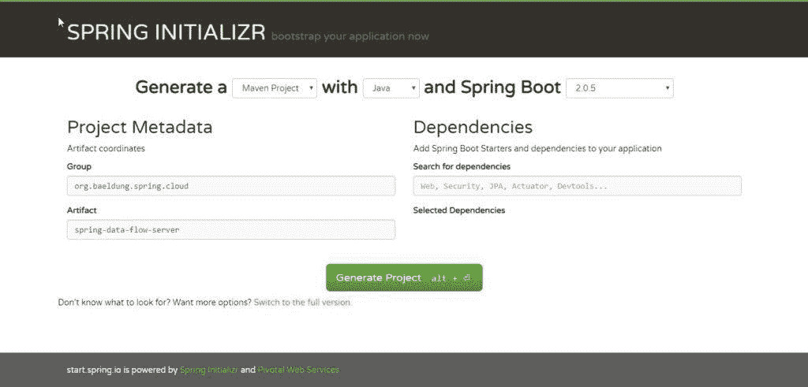

# Spring Cloud 数据流流处理入门

> 原文：<https://web.archive.org/web/20220930061024/https://www.baeldung.com/spring-cloud-data-flow-stream-processing>

## 1。简介

`Spring Cloud Data Flow`是一个面向可组合数据微服务的云原生编程和运营模型。

借助 [`Spring Cloud Data Flow`](https://web.archive.org/web/20221012201802/https://cloud.spring.io/spring-cloud-dataflow/) ，开发人员可以为常见用例创建和编排数据管道，如数据接收、实时分析和数据导入/导出。

这种数据管道有两种类型，流式和批处理数据管道。

在第一种情况下，通过消息中间件消费或产生无限量的数据。而在第二种情况下，短期任务处理有限的一组数据，然后终止。

本文将关注流处理。

## 2。架构概述

这些类型的架构的关键组件是`Applications`、`Data Flow Server`和目标运行时。

此外，除了这些关键组件之外，我们通常在架构中还有一个`Data Flow Shell`和一个`message broker`。

让我们更详细地看看所有这些组件。

### 2.1。应用程序

通常，流数据管道包括从外部系统消费事件、数据处理和多语言持久性。在`Spring Cloud`术语中，这些阶段通常被称为`Source`、`Processor`和`Sink`:

*   **来源:** 是消耗事件 的应用
*   **处理器:**消耗来自`Source`的数据，对其进行一些处理，并将处理后的数据发送给管道中的下一个应用程序
*   **接收器:**从`Source`或`Processor`中消费数据，并将数据写入所需的持久层

这些应用程序可以用两种方式打包:

*   Spring Boot uber-jar 托管在 maven 存储库、文件、http 或任何其他 Spring 资源实现中(本文将使用该方法)
*   码头工人

许多常见用例的源、处理器和接收器应用程序(例如 jdbc、hdfs、http、路由器)已经被提供并准备好供`Spring Cloud Data Flow`团队使用。

### 2.2。运行时间

此外，这些应用程序需要运行时来执行。支持的运行时有:

*   云铸造厂
*   阿帕奇纱线
*   库伯内特斯
*   Apache Mesos
*   用于开发的本地服务器(将在本文中使用)

### 2.3。数据流服务器

负责将应用程序部署到运行时的组件是`Data Flow Server`。为每个目标运行时提供了一个`Data Flow Server`可执行 jar。

`Data Flow Server`负责解释:

*   描述通过多个应用程序的逻辑数据流的流 DSL。
*   描述应用程序到运行时的映射的部署清单。

### 2.4。数据流外壳

数据流外壳是数据流服务器的客户端。shell 允许我们执行与服务器交互所需的 DSL 命令。

例如，描述从 http 源到 jdbc 接收器的数据流的 DSL 可以写成“http | jdbc”。DSL 中的这些名称在`Data Flow Server`中注册，并映射到可以托管在 Maven 或 Docker 存储库中的应用程序构件上。

Spring 还提供了一个名为`Flo`的图形界面，用于创建和监控流数据管道。然而，它的使用超出了本文的讨论范围。

### 2.5。消息代理

正如我们在前面部分的示例中看到的 ，我们在数据流的定义中使用了管道符号。管道符号表示两个应用程序之间通过消息中间件进行的通信。

这意味着我们需要一个消息代理在目标环境中运行。

支持的两个消息中间件代理是:

*   阿帕奇卡夫卡
*   兔子 q

现在，我们已经对架构组件有了一个大致的了解—**是时候构建我们的第一个流处理管道了。**

## 3。安装消息代理

正如我们所看到的，管道中的应用程序需要一个消息中间件来进行通信。出于本文的目的，我们将使用`RabbitMQ`。

关于安装的全部细节，您可以遵循[官方网站](https://web.archive.org/web/20221012201802/https://www.rabbitmq.com/download.html)上的说明。

## 4。本地数据流服务器

为了加快生成应用程序的过程，我们将使用[Spring Initializr](https://web.archive.org/web/20221012201802/https://start.spring.io/)；在它的帮助下，我们可以在几分钟内获得我们的`Spring Boot`申请。

到达网站后，只需选择一个`Group`和一个`Artifact`名称。

一旦完成，点击按钮`Generate Project`开始下载 Maven 神器。

[](/web/20221012201802/https://www.baeldung.com/wp-content/uploads/2016/09/init.jpg)

下载完成后，解压缩该项目，并将其作为 Maven 项目导入到您选择的 IDE 中。

让我们向项目添加一个 Maven 依赖项。由于我们将需要`Dataflow Local Server`库，让我们添加[spring-cloud-starter-data flow-server-local](https://web.archive.org/web/20221012201802/https://search.maven.org/search?q=spring-cloud-starter-dataflow-server-local)依赖关系:

```java
<dependency>
    <groupId>org.springframework.cloud</groupId>
    <artifactId>spring-cloud-starter-dataflow-server-local</artifactId>
</dependency>
```

现在我们需要用`@EnableDataFlowServer`注释来注释`Spring Boot`主类:

```java
@EnableDataFlowServer
@SpringBootApplication
public class SpringDataFlowServerApplication {

    public static void main(String[] args) {
        SpringApplication.run(
          SpringDataFlowServerApplication.class, args);
    }
} 
```

仅此而已。我们的`Local Data Flow Server`准备执行:

```java
mvn spring-boot:run
```

应用程序将在端口 9393 上启动。

## 5。数据流外壳

再次，转到 Spring Initializr 并选择一个`Group`和`Artifact`名称。

一旦我们下载并导入了项目，让我们添加一个[spring-cloud-data flow-shell](https://web.archive.org/web/20221012201802/https://search.maven.org/search?q=a:spring-cloud-dataflow-shell)依赖项:

```java
<dependency>
    <groupId>org.springframework.cloud</groupId>
    <artifactId>spring-cloud-dataflow-shell</artifactId>
</dependency>
```

现在我们需要将`@EnableDataFlowShell`注释添加到`Spring Boot`主类中:

```java
@EnableDataFlowShell
@SpringBootApplication
public class SpringDataFlowShellApplication {

    public static void main(String[] args) {
        SpringApplication.run(SpringDataFlowShellApplication.class, args);
    }
} 
```

我们现在可以运行 shell 了:

```java
mvn spring-boot:run
```

在 shell 运行之后，我们可以在提示符下键入`help`命令来查看我们可以执行的命令的完整列表。

## 6。源应用程序

类似地，在 Initializr 上，我们现在将创建一个简单的应用程序，并添加一个名为[spring-cloud-starter-stream-rabbit:](https://web.archive.org/web/20221012201802/https://search.maven.org/search?q=a:spring-cloud-starter-stream-rabbit)的`Stream Rabbit`依赖项

```java
<dependency>
    <groupId>org.springframework.cloud</groupId>
    <artifactId>spring-cloud-starter-stream-rabbit</artifactId>
</dependency>
```

然后我们将把`@EnableBinding(Source.class)`注释添加到`Spring Boot`主类中:

```java
@EnableBinding(Source.class)
@SpringBootApplication
public class SpringDataFlowTimeSourceApplication {

    public static void main(String[] args) {
        SpringApplication.run(
          SpringDataFlowTimeSourceApplication.class, args);
    }
}
```

现在我们需要定义必须处理的数据源。该来源可以是任何潜在的无休止的工作负载(物联网传感器数据、24/7 事件处理、在线交易数据接收)。

**在我们的示例应用程序中，我们每 10 秒钟用一个`Poller`产生一个事件(为了简单起见，一个新的时间戳)。**

`@InboundChannelAdapter`注释将消息发送到源的输出通道，使用返回值作为消息的有效负载:

```java
@Bean
@InboundChannelAdapter(
  value = Source.OUTPUT, 
  poller = @Poller(fixedDelay = "10000", maxMessagesPerPoll = "1")
)
public MessageSource<Long> timeMessageSource() {
    return () -> MessageBuilder.withPayload(new Date().getTime()).build();
} 
```

我们的数据源准备好了。

## 7。处理器应用

接下来，我们将创建一个应用程序并添加一个`Stream Rabbit`依赖项。

然后我们将把`@EnableBinding(Processor.class)`注释添加到`Spring Boot`主类中:

```java
@EnableBinding(Processor.class)
@SpringBootApplication
public class SpringDataFlowTimeProcessorApplication {

    public static void main(String[] args) {
        SpringApplication.run(
          SpringDataFlowTimeProcessorApplication.class, args);
    }
}
```

接下来，我们需要定义一个方法来处理来自源应用程序的数据。

为了定义一个转换器，我们需要用`@Transformer`注释来注释这个方法:

```java
@Transformer(inputChannel = Processor.INPUT, 
  outputChannel = Processor.OUTPUT)
public Object transform(Long timestamp) {

    DateFormat dateFormat = new SimpleDateFormat("yyyy/MM/dd hh:mm:yy");
    String date = dateFormat.format(timestamp);
    return date;
}
```

它将来自“输入”通道的时间戳转换为格式化的日期，该日期将被发送到“输出”通道。

## 8。接收器应用程序

最后创建的应用程序是接收应用程序。

再次，转到 Spring Initializr 并选择一个`Group`和一个`Artifact`名称。下载完项目后，让我们添加一个`Stream Rabbit`依赖项。

然后将 `@EnableBinding(Sink.class)`注释添加到`Spring Boot`主类中:

```java
@EnableBinding(Sink.class)
@SpringBootApplication
public class SpringDataFlowLoggingSinkApplication {

    public static void main(String[] args) {
	SpringApplication.run(
          SpringDataFlowLoggingSinkApplication.class, args);
    }
}
```

现在我们需要一种方法来拦截来自处理器应用程序的消息。

为此，我们需要向我们的方法添加`@StreamListener(Sink.INPUT)`注释:

```java
@StreamListener(Sink.INPUT)
public void loggerSink(String date) {
    logger.info("Received: " + date);
}
```

该方法只是将转换成格式化日期的时间戳打印到日志文件中。

## 9。注册一个流应用

Spring Cloud 数据流 Shell 允许我们使用`app register`命令向应用注册表注册一个流应用。

我们必须提供唯一的名称、应用程序类型和可以解析到应用程序工件的 URI。对于类型，指定“`source`”、“`processor`”或“`sink`”。

使用 maven 方案提供 URI 时，格式应符合以下要求:

```java
maven://<groupId>:<artifactId>[:<extension>[:<classifier>]]:<version>
```

要注册之前创建的 的`Source`、`Processor`和`Sink`应用 ，请转到`Spring Cloud Data Flow Shell`并在提示符下发出以下命令:

```java
app register --name time-source --type source 
  --uri maven://com.baeldung.spring.cloud:spring-data-flow-time-source:jar:0.0.1-SNAPSHOT

app register --name time-processor --type processor 
  --uri maven://com.baeldung.spring.cloud:spring-data-flow-time-processor:jar:0.0.1-SNAPSHOT

app register --name logging-sink --type sink 
  --uri maven://com.baeldung.spring.cloud:spring-data-flow-logging-sink:jar:0.0.1-SNAPSHOT 
```

## 10。创建并部署流

要创建新的流定义，请转到`Spring Cloud Data Flow Shell`并执行以下 shell 命令:

```java
stream create --name time-to-log 
  --definition 'time-source | time-processor | logging-sink'
```

这基于 DSL 表达式`‘time-source | time-processor | logging-sink'`定义了一个名为`time-to-log`的流。

然后，要部署流，请执行以下 shell 命令:

```java
stream deploy --name time-to-log
```

`Data Flow Server`将`time-source`、`time-processor`和`logging-sink`解析为 maven 坐标，并使用它们来启动流的`time-source`、`time-processor`和`logging-sink`应用。

如果流 是正确部署的，您将在 `Data Flow Server`日志中看到模块已经启动并绑定在一起:

```java
2016-08-24 12:29:10.516  INFO 8096 --- [io-9393-exec-10] o.s.c.d.spi.local.LocalAppDeployer: deploying app time-to-log.logging-sink instance 0
   Logs will be in PATH_TO_LOG/spring-cloud-dataflow-1276836171391672089/time-to-log-1472034549734/time-to-log.logging-sink
2016-08-24 12:29:17.600  INFO 8096 --- [io-9393-exec-10] o.s.c.d.spi.local.LocalAppDeployer       : deploying app time-to-log.time-processor instance 0
   Logs will be in PATH_TO_LOG/spring-cloud-dataflow-1276836171391672089/time-to-log-1472034556862/time-to-log.time-processor
2016-08-24 12:29:23.280  INFO 8096 --- [io-9393-exec-10] o.s.c.d.spi.local.LocalAppDeployer       : deploying app time-to-log.time-source instance 0
   Logs will be in PATH_TO_LOG/spring-cloud-dataflow-1276836171391672089/time-to-log-1472034562861/time-to-log.time-source
```

## 11。查看结果

在这个例子中，源只是每秒发送一条消息作为当前时间戳，处理器对其进行格式化，日志接收器使用日志框架输出格式化的时间戳。

日志文件位于显示在`Data Flow Server`日志输出中的目录中，如上所示。要查看结果，我们可以跟踪日志:

```java
tail -f PATH_TO_LOG/spring-cloud-dataflow-1276836171391672089/time-to-log-1472034549734/time-to-log.logging-sink/stdout_0.log
2016-08-24 12:40:42.029  INFO 9488 --- [r.time-to-log-1] s.c.SpringDataFlowLoggingSinkApplication : Received: 2016/08/24 11:40:01
2016-08-24 12:40:52.035  INFO 9488 --- [r.time-to-log-1] s.c.SpringDataFlowLoggingSinkApplication : Received: 2016/08/24 11:40:11
2016-08-24 12:41:02.030  INFO 9488 --- [r.time-to-log-1] s.c.SpringDataFlowLoggingSinkApplication : Received: 2016/08/24 11:40:21
```

## 12。结论

在本文中，我们已经看到了如何通过使用`Spring Cloud Data Flow`为流处理构建数据管道。

此外，我们还看到了`Source`、`Processor`和`Sink`应用程序在流中的作用，以及如何通过使用`Data Flow Shell`将这个模块插入并绑定到`Data Flow Server`中。

示例代码可以在 [GitHub 项目](https://web.archive.org/web/20221012201802/https://github.com/eugenp/tutorials/tree/master/spring-cloud-modules/spring-cloud-data-flow/spring-cloud-data-flow-stream-processing)中找到。