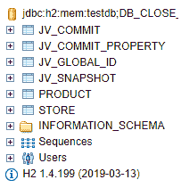

# 在 Spring 数据中使用 JaVers 进行数据模型审计

> 原文：<https://web.archive.org/web/20220930061024/https://www.baeldung.com/spring-data-javers-audit>

## 1.概观

在本教程中，我们将看到如何在一个简单的 [Spring Boot](/web/20220628063434/https://www.baeldung.com/spring-boot) 应用程序中设置和使用 JaVers 来跟踪实体的变化。

## 2.贾维斯

当处理可变数据时，我们通常只有存储在数据库中的实体的最后状态。作为开发人员，我们花费大量时间调试应用程序，在日志文件中搜索改变状态的事件。当大量不同的用户使用该系统时，这在生产环境中变得更加棘手。

幸运的是，我们有很棒的工具，比如 JaVers。JaVers 是一个审计日志框架，有助于跟踪应用程序中实体的变化。

该工具的使用不仅限于调试和审计。它还可以成功地用于执行分析、强制实施安全策略和维护事件日志。

## 3.**项目设置**

首先，要开始使用 JaVers，我们需要为实体的持久快照配置审计存储库。其次，我们需要调整 JaVers 的一些可配置属性。最后，我们还将介绍如何正确配置我们的领域模型。

但是，值得一提的是，JaVers 提供了默认的配置选项，所以我们几乎不用配置就可以开始使用它。

### 3.1.属国

首先，我们需要将 JaVers Spring Boot 启动器依赖项添加到我们的项目中。根据持久存储的类型，我们有两种选择: [`org.javers:javers-spring-boot-starter-sql`](https://web.archive.org/web/20220628063434/https://search.maven.org/search?q=javers-spring-boot-starter-sql) 和 [`org.javers:javers-spring-boot-starter-mongo`](https://web.archive.org/web/20220628063434/https://search.maven.org/search?q=javers-spring-boot-starter-mongo) 。在本教程中，我们将使用 Spring Boot SQL 启动。

```java
<dependency>
    <groupId>org.javers</groupId>
    <artifactId>javers-spring-boot-starter-sql</artifactId>
    <version>6.5.3</version>
</dependency>
```

因为我们将使用 H2 数据库，所以让我们也包括这个依赖项:

```java
<dependency>
    <groupId>com.h2database</groupId>
    <artifactId>h2</artifactId>
</dependency>
```

### 3.2. **JaVers 存储库设置**

JaVers 使用存储库抽象来存储提交和序列化的实体。所有数据都以 [JSON 格式](/web/20220628063434/https://www.baeldung.com/java-org-json)存储。因此，使用 NoSQL 存储可能是一个不错的选择。然而，为了简单起见，我们将使用一个 [H2 内存实例](/web/20220628063434/https://www.baeldung.com/spring-boot-h2-database)。

默认情况下，JaVers 利用内存中的存储库实现，如果我们使用 Spring Boot，就不需要额外的配置。此外，**在使用 [Spring 数据](/web/20220628063434/https://www.baeldung.com/spring-data)启动器时，JaVers 为应用程序**重用数据库配置。

JaVers 为 SQL 和 Mongo 持久性堆栈提供了两个入门工具。它们与 Spring 数据兼容，默认情况下不需要额外的配置。但是，我们总是可以分别覆盖默认的配置 bean:[`JaversSqlAutoConfiguration.java`](https://web.archive.org/web/20220628063434/https://github.com/javers/javers/blob/master/javers-spring-boot-starter-sql/src/main/java/org/javers/spring/boot/sql/JaversSqlAutoConfiguration.java)和 [`JaversMongoAutoConfiguration.java`](https://web.archive.org/web/20220628063434/https://github.com/javers/javers/blob/master/javers-spring-boot-starter-mongo/src/main/java/org/javers/spring/boot/mongo/JaversMongoAutoConfiguration.java) 。

### 3.3.贾维斯地产

JaVers 允许配置几个选项，尽管[Spring Boot 默认值](https://web.archive.org/web/20220628063434/https://javers.org/documentation/spring-boot-integration/#javers-configuration-properties)在大多数用例中已经足够了。

让我们只覆盖一个对象`newObjectSnapshot`，这样我们就可以获得新创建对象的快照:

```java
javers.newObjectSnapshot=true 
```

### 3.4.JaVers 域配置

JaVers 内部定义了以下类型:实体、值对象、值、容器和原语。其中一些术语来自于 [DDD(领域驱动设计)](/web/20220628063434/https://www.baeldung.com/spring-data-ddd)术语。

**拥有几种类型的主要目的是根据类型**提供不同的 diff 算法。每种类型都有相应的差异策略。因此，如果应用程序类配置不正确，我们将会得到不可预知的结果。

要告诉 JaVers 一个类使用什么类型，我们有几种选择:

*   `Explicitly`——第一种选择是显式使用`JaversBuilder`类的`register*`方法——第二种方法是使用注释
*   JaVers 提供了基于类关系自动检测类型的算法
*   `Defaults`–默认情况下，JaVers 会将所有类视为`ValueObjects`

在本教程中，我们将使用 annotation 方法显式配置 JaVers。

最棒的是 **JaVers 与`javax.persistence`注解**兼容。因此，我们不需要在实体上使用特定于 JaVers 的注释。

## 4.示例项目

现在我们将创建一个简单的应用程序，它将包含我们将要审计的几个域实体。

### 4.1.领域模型

我们的领域将包括产品商店。

让我们定义一下`Store`实体:

```java
@Entity
public class Store {

    @Id
    @GeneratedValue
    private int id;
    private String name;

    @Embedded
    private Address address;

    @OneToMany(
      mappedBy = "store",
      cascade = CascadeType.ALL,
      orphanRemoval = true
    )
    private List<Product> products = new ArrayList<>();

    // constructors, getters, setters
}
```

请注意，我们使用的是默认的 JPA 注释。JaVers 以如下方式映射它们:

*   `@javax.persistence.Entity`映射到`@org.javers.core.metamodel.annotation.Entity`
*   `@javax.persistence.Embeddable`映射到`@org.javers.core.metamodel.annotation.ValueObject.`

可嵌入的类以通常的方式定义:

```java
@Embeddable
public class Address {
    private String address;
    private Integer zipCode;
}
```

### 4.2.数据仓库

为了审计 JPA 存储库，JaVers 提供了`@JaversSpringDataAuditable`注释。

让我们用那个注释来定义`StoreRepository`:

```java
@JaversSpringDataAuditable
public interface StoreRepository extends CrudRepository<Store, Integer> {
}
```

此外，我们将有`ProductRepository`，但没有注释:

```java
public interface ProductRepository extends CrudRepository<Product, Integer> {
}
```

现在考虑一个我们不使用 Spring 数据仓库的情况。JaVers 有另一个方法级注释用于此目的:`@JaversAuditable.`

例如，我们可以定义一个方法来持久化一个产品，如下所示:

```java
@JaversAuditable
public void saveProduct(Product product) {
    // save object
}
```

或者，我们甚至可以将此注释直接添加到存储库接口中的方法之上:

```java
public interface ProductRepository extends CrudRepository<Product, Integer> {
    @Override
    @JaversAuditable
    <S extends Product> S save(S s);
}
```

### 4.3.作者提供者

JaVers 中每一个提交的变化都应该有它的作者。而且，JaVers 支持 [Spring Security](/web/20220628063434/https://www.baeldung.com/security-spring) 开箱即用。

因此，每次提交都是由特定的经过身份验证的用户进行的。然而，在本教程中，我们将创建一个非常简单的`AuthorProvider`接口的定制实现:

```java
private static class SimpleAuthorProvider implements AuthorProvider {
    @Override
    public String provide() {
        return "Baeldung Author";
    }
}
```

最后一步，为了让 JaVers 使用我们的定制实现，我们需要覆盖默认的配置 bean:

```java
@Bean
public AuthorProvider provideJaversAuthor() {
    return new SimpleAuthorProvider();
}
```

## 5.贾维斯审计

最后，我们准备审计我们的应用程序。我们将使用一个简单的控制器将更改分派到我们的应用程序中，并检索 JaVers 提交日志。或者，我们也可以访问 H2 控制台来查看数据库的内部结构:

[](/web/20220628063434/https://www.baeldung.com/wp-content/uploads/2019/09/H2-Console-Google-Chrome-2019-08-26-05.36.33.png)

为了获得一些初始样本数据，让我们使用一个`EventListener`用一些产品填充我们的数据库:

```java
@EventListener
public void appReady(ApplicationReadyEvent event) {
    Store store = new Store("Baeldung store", new Address("Some street", 22222));
    for (int i = 1; i < 3; i++) {
        Product product = new Product("Product #" + i, 100 * i);
        store.addProduct(product);
    }
    storeRepository.save(store);
}
```

### 5.1.初始提交

当一个对象被创建时，JaVers **首先提交一个`INITIAL`类型的**。

让我们在应用程序启动后检查快照:

```java
@GetMapping("/stores/snapshots")
public String getStoresSnapshots() {
    QueryBuilder jqlQuery = QueryBuilder.byClass(Store.class);
    List<CdoSnapshot> snapshots = javers.findSnapshots(jqlQuery.build());
    return javers.getJsonConverter().toJson(snapshots);
}
```

在上面的代码中，我们向 JaVers 查询了`Store`类的快照。如果我们向这个端点发出请求，我们将得到如下所示的结果:

```java
[
  {
    "commitMetadata": {
      "author": "Baeldung Author",
      "properties": [],
      "commitDate": "2019-08-26T07:04:06.776",
      "commitDateInstant": "2019-08-26T04:04:06.776Z",
      "id": 1.00
    },
    "globalId": {
      "entity": "com.baeldung.springjavers.domain.Store",
      "cdoId": 1
    },
    "state": {
      "address": {
        "valueObject": "com.baeldung.springjavers.domain.Address",
        "ownerId": {
          "entity": "com.baeldung.springjavers.domain.Store",
          "cdoId": 1
        },
        "fragment": "address"
      },
      "name": "Baeldung store",
      "id": 1,
      "products": [
        {
          "entity": "com.baeldung.springjavers.domain.Product",
          "cdoId": 2
        },
        {
          "entity": "com.baeldung.springjavers.domain.Product",
          "cdoId": 3
        }
      ]
    },
    "changedProperties": [
      "address",
      "name",
      "id",
      "products"
    ],
    "type": "INITIAL",
    "version": 1
  }
]
```

请注意，**上方的快照包括添加到商店的所有产品，尽管缺少对`ProductRepository`界面**的注释。

默认情况下，JaVers 将审计聚合根的所有相关模型，如果它们与父模型一起持久化的话。

我们可以通过使用`DiffIgnore`注释告诉 JaVers 忽略特定的类。

例如，我们可以用`Store`实体中的注释来注释`products`字段:

```java
@DiffIgnore
private List<Product> products = new ArrayList<>();
```

因此，JaVers 不会跟踪源自`Store`实体的产品变更。

### 5.2.更新提交

下一种类型的提交是`UPDATE`提交。这是最有价值的提交类型，因为它表示对象状态的变化。

让我们定义一个方法来更新商店实体和商店中的所有产品:

```java
public void rebrandStore(int storeId, String updatedName) {
    Optional<Store> storeOpt = storeRepository.findById(storeId);
    storeOpt.ifPresent(store -> {
        store.setName(updatedName);
        store.getProducts().forEach(product -> {
            product.setNamePrefix(updatedName);
        });
        storeRepository.save(store);
    });
}
```

如果我们运行这个方法，我们将在调试输出中得到下面一行(在相同的产品和商店计数的情况下):

```java
11:29:35.439 [http-nio-8080-exec-2] INFO  org.javers.core.Javers - Commit(id:2.0, snapshots:3, author:Baeldung Author, changes - ValueChange:3), done in 48 millis (diff:43, persist:5)
```

既然 JaVers 已经成功地持久化了更改，那么让我们查询产品的快照:

```java
@GetMapping("/products/snapshots")
public String getProductSnapshots() {
    QueryBuilder jqlQuery = QueryBuilder.byClass(Product.class);
    List<CdoSnapshot> snapshots = javers.findSnapshots(jqlQuery.build());
    return javers.getJsonConverter().toJson(snapshots);
}
```

我们将获得以前的`INITIAL`次提交和新的`UPDATE`次提交:

```java
 {
    "commitMetadata": {
      "author": "Baeldung Author",
      "properties": [],
      "commitDate": "2019-08-26T12:55:20.197",
      "commitDateInstant": "2019-08-26T09:55:20.197Z",
      "id": 2.00
    },
    "globalId": {
      "entity": "com.baeldung.springjavers.domain.Product",
      "cdoId": 3
    },
    "state": {
      "price": 200.0,
      "name": "NewProduct #2",
      "id": 3,
      "store": {
        "entity": "com.baeldung.springjavers.domain.Store",
        "cdoId": 1
      }
    }
}
```

在这里，我们可以看到有关我们所做更改的所有信息。

值得注意的是 **JaVers 不会创建新的数据库连接。相反，它重用现有的连接**。JaVers 数据在同一个事务中与应用程序数据一起提交或回滚。

### 5.3.变化

JaVers 将变化记录为对象版本之间的原子差异。正如我们从 JaVers 方案中看到的，没有单独的表来存储变更，所以 **JaVers 动态地计算快照之间的差异**的变更。

让我们更新一个产品价格:

```java
public void updateProductPrice(Integer productId, Double price) {
    Optional<Product> productOpt = productRepository.findById(productId);
    productOpt.ifPresent(product -> {
        product.setPrice(price);
        productRepository.save(product);
    });
}
```

然后，让我们查询 JaVers 的更改:

```java
@GetMapping("/products/{productId}/changes")
public String getProductChanges(@PathVariable int productId) {
    Product product = storeService.findProductById(productId);
    QueryBuilder jqlQuery = QueryBuilder.byInstance(product);
    Changes changes = javers.findChanges(jqlQuery.build());
    return javers.getJsonConverter().toJson(changes);
}
```

输出包含更改后的属性及其前后的值:

```java
[
  {
    "changeType": "ValueChange",
    "globalId": {
      "entity": "com.baeldung.springjavers.domain.Product",
      "cdoId": 2
    },
    "commitMetadata": {
      "author": "Baeldung Author",
      "properties": [],
      "commitDate": "2019-08-26T16:22:33.339",
      "commitDateInstant": "2019-08-26T13:22:33.339Z",
      "id": 2.00
    },
    "property": "price",
    "propertyChangeType": "PROPERTY_VALUE_CHANGED",
    "left": 100.0,
    "right": 3333.0
  }
]
```

为了检测更改的类型，JaVers 比较对象更新的后续快照。在上面的例子中，我们已经改变了实体的属性，我们得到了`PROPERTY_VALUE_CHANGED`改变类型。

### 5.4.阴影

此外，JaVers 提供了被审计实体的另一个视图，称为`Shadow`。阴影表示从快照恢复的对象状态。这个概念与[事件采购](/web/20220628063434/https://www.baeldung.com/cqrs-event-sourced-architecture-resources)密切相关。

阴影有四种不同的范围:

*   `Shallow` —阴影是从 JQL 查询中选择的快照创建的
*   `Child-value-object` —阴影包含所选实体拥有的所有子值对象
*   `Commit-deep`-从与所选实体相关的所有快照中创建阴影
*   `Deep+` — JaVers 尝试恢复加载了(可能)所有对象的完整对象图。

让我们使用子值对象范围，并获得单个商店的阴影:

```java
@GetMapping("/stores/{storeId}/shadows")
public String getStoreShadows(@PathVariable int storeId) {
    Store store = storeService.findStoreById(storeId);
    JqlQuery jqlQuery = QueryBuilder.byInstance(store)
      .withChildValueObjects().build();
    List<Shadow<Store>> shadows = javers.findShadows(jqlQuery);
    return javers.getJsonConverter().toJson(shadows.get(0));
}
```

因此，我们将获得带有`Address`值对象的商店实体:

```java
{
  "commitMetadata": {
    "author": "Baeldung Author",
    "properties": [],
    "commitDate": "2019-08-26T16:09:20.674",
    "commitDateInstant": "2019-08-26T13:09:20.674Z",
    "id": 1.00
  },
  "it": {
    "id": 1,
    "name": "Baeldung store",
    "address": {
      "address": "Some street",
      "zipCode": 22222
    },
    "products": []
  }
}
```

为了在结果中得到乘积，我们可以应用深度提交范围。

## 6.结论

在本教程中，我们已经看到了 JaVers 如何轻松地与 Spring Boot 和 Spring 数据集成。总而言之，JaVers 几乎不需要任何配置就可以设置。

总之，JaVers 可以有不同的应用，从调试到复杂的分析。

GitHub 上的[提供了本文的完整项目。](https://web.archive.org/web/20220628063434/https://github.com/eugenp/tutorials/tree/master/spring-boot-modules/spring-boot-data-2)